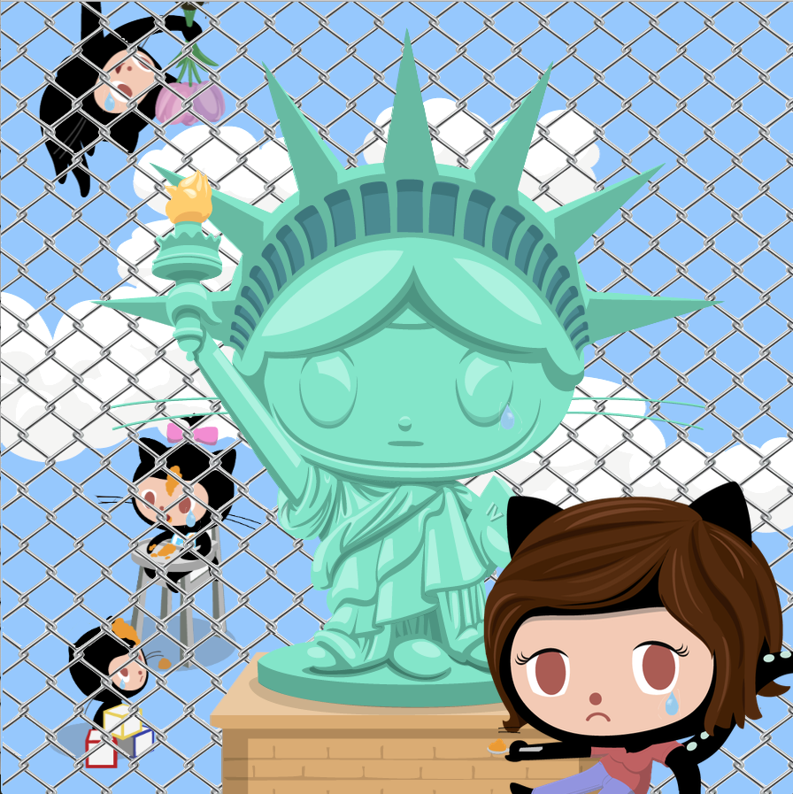
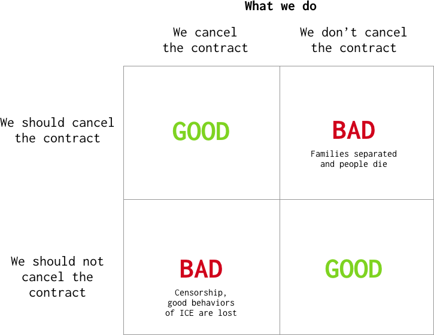
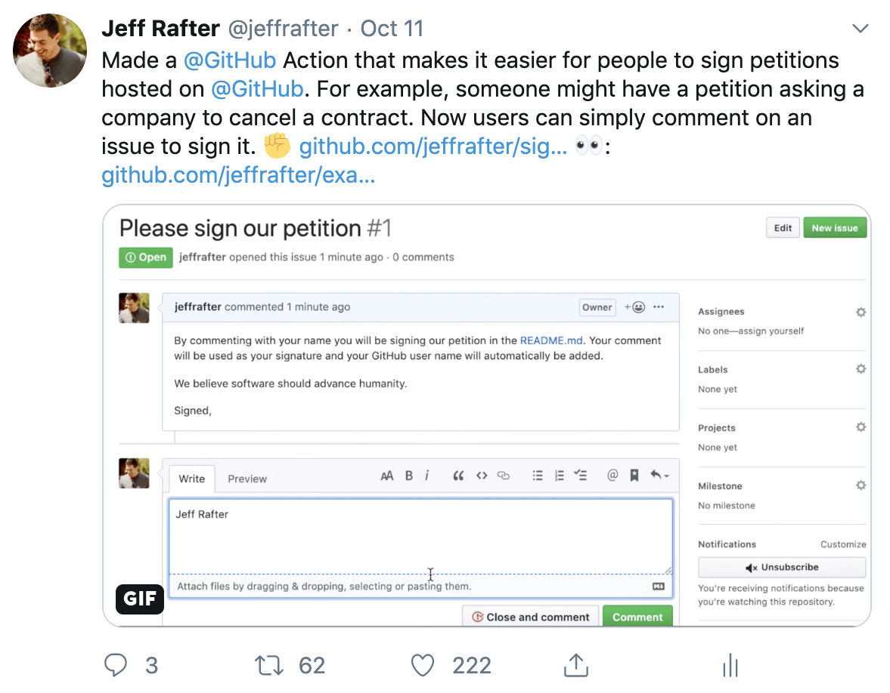

<figure class="fullwidth">

</figure>
<figcaption class="fullwidth">
Image credit: GitHub's <a href="https://octodex.github.com/momtocat/" rel="noopener noreferrer">Octodex</a>.
</figcaption>

Within GitHub, and more broadly the tech industry, there is an ongoing debate about the ethics of working with organizations which do things we find abhorrent. For GitHub, this debate is centered on it's contract with the [Immigrations and Customs Enforcement](https://www.ice.gov/) arm of the Department of Homeland Security (in the United States).

> Note: this is not a post which attempts to outline the abuses of ICE, nor is it meant as an apology in the form of outlining the positive things they do. Rather, this post is founded in my belief that there are human rights violations happening because of software we are collectively writing and we need a framework to prevent those abuses.

Before I get started I should note that I'm going to walk through my thinking. Please read to the end.

Like other companies, GitHub has seen [employee petitions](https://www.vox.com/recode/2019/10/9/20906605/github-ice-contract-immigration-ice-dan-friedman), protests and exits because of their contract with ICE. This is in spite of it's plan to donate \$500,000 (more than two-hundred fifty percent of the value of the contract) to organizations setup to help immigrants affected by the policies of enforcment. GitHub's position is that this contract will not be cancelled - they find themselves arguing for oppenness and justification.

When this was said during an all-hands I found it incomprehensible. Why would we make such a decision. Is GitHub not cool? I drew a [punnett square](https://en.wikipedia.org/wiki/Punnett_square) trying to figure out what should happen.



It seemed obvious: in either decision there was a possible good and possible bad outcome. However, the bad outcome of not cancelling the contract was horrific and should be avoided at all costs. It felt easy, albeit simplistic. Unfortunately the decision here is not so simple and reducing the problem set to some logical decision algorithm is where so much of our problem lies. In reality, there is suffering and people will die in all of the outcomes. It is a set of trade-offs with deep nuance. I decided to abandon this reductive approach.

## Petitons

Within GitHub a petition was started. [A large percentage of employees signed the petition](https://www.vox.com/recode/2019/10/9/20906605/github-ice-contract-immigration-ice-dan-friedman). I was looking for some positive contribution and decided I would make a GitHub Action which made it easier to [sign petitions](https://twitter.com/jeffrafter/status/1182688432683798529):



Ii felt poetic using a GitHub tool to subvert the contract. I released it under the [Hippocratic License](https://firstdonoharm.dev/). Not much changed. [GitHub was not going to change positions](https://www.theverge.com/2019/10/9/20906213/github-ice-microsoft-software-email-contract-immigration-nonprofit-donation) and the tenor of conversations between the leadership team and employees, though cordial, felt like it was deteriorating. It became clear that the company culture might be irreparably damaged.

One thing that kept nagging at me was the way in which Nat told employees that the decision was not going to change. It felt personal, it didn't feel like a business decision. It felt like something he beleived in his core and I couldn't comprehend how he could rationalize his position while being open about his belief that the abuses of ICE were abhorrent.

I needed to start over.

I began to realize that the problem itself is singular in its construction. Immigrations and Customs Enforcement is (reductively) an organization dedidated to controlling and enforcing a set of rules founded (rightly, in some cases) on intolerance. It is about closedness (of borders, of imports, of ideologies). GitHub on the other hand is a corporation founded on openness and had adopted a position of openness and [the paradox of intolerance](https://en.wikipedia.org/wiki/Paradox_of_tolerance) - it wanted to create an environment where anyone can use GitHub. The community and employees - signing petitions and protesting - were ostensibly the most open yet found themselves arguing for the contract's cancellation. In an alternate set of circumstances (for example if the roles were reversed) the community might praise GitHub's position of openness.

## Bad idea

I found myself arguing for the wrong outcome for the right reasons. I found myself in a position where I was arguing that the ends justified the means. I needed a new way forward. We could [remove our code from GitHub](https://www.wired.com/story/developer-deletes-code-protest-ice/) but open source means that such an action would be temporary at best. How could I use the openness of GitHub to disrupt ICE?

> Note: this is a bad idea.

What if ICE used GitHub Actions? I could write the following code and add it to all of my open-source work:

```
const nwo = process.env.GITHUB_REPOSITORY || '';
if (nwo.startsWith('dhs/')) {
  console.log("::set-failed::true")
  return
}
```

The code would automatically detect the built-in environment variables and hard-fail any DHS build automatically. This could be inserted in a dependency of a dependency, hidden latent deep within the `node_modules` of some codebase. Of course, this was a terrible idea for lots of reasons but had the germ of something new. I have no knowledge of ICE using actions, or what org would be running them if they were. But as I thought about the possible responses to such an action I realized they could easily just remove the line. Unless of course the open source license said they couldn't.

## Licenses

I thought back to the Hippocratic License. In general, the license isn't perfect and might be difficult to implement in large scale projects as it is all or nothing in form. It is compatible with MIT but not GPL for instance. Regardless, it felt like an amazing starting point and exemplar and the more I thought about it the more I realized my silly code was less important than the license itself.

I reached out to some talented friends looking for their help. Ideally the license would do the following:

- Be compatible with existing open source licenses and precedents of all kinds, maybe operating as an addendum similar to the library exception in GPLv3
- Limit end-user use of open-source work products similar to Creative Commons non-commericial license
- Empower open-source contributors and authors to define what kinds of organizations can use their software (and derivatives) for example, non-governmental, organizations not in violation of established U.N. policies on human rights
- Be enforceable from the time the license was applied

## Adoption

Ideally, GitHub would support the creation of such a license, possibly including the U.N., the ACLU and other legal entities like What's beautiful is that GitHub's position of openness shifts to a benefit rather than a liability. GitHub has maintained that it is not aware of how its tools are used internally at ICE and a end-user use-license is very compatible given such an optimistic presumption.

If such a license existed it could be applied not to GitHub but the dependencies of GitHub. It could be applied to Primer, to React, to Rails, to Kubernetes, to Linux itself. Why are we not protesting these projects as well?

For me this realization underscores GitHub's small part in a much larger endeavor. This should not be about a single organization cancelling a single contract. I do not want to delegate my ethics and morals to a corporation and it's policies and algorithms, nor do I want to give up my agency for things I am writing or project my beliefs onto the things someone else has written. I want to empower those of us creating the software. I want to maintain our humanity and our choice. This is the turing test of all that we will create.

Broad adition of an ethical license patch into all of open source would allow ICE to continue to use open source for positive outcomes but would prevent them from using it to abuse people and separate familes. Not only would such a license apply to ICE but it would be applicable to defense contracts, dictatorships, and corporations operating legally in countries which allow for inhumane treatment of workers.
