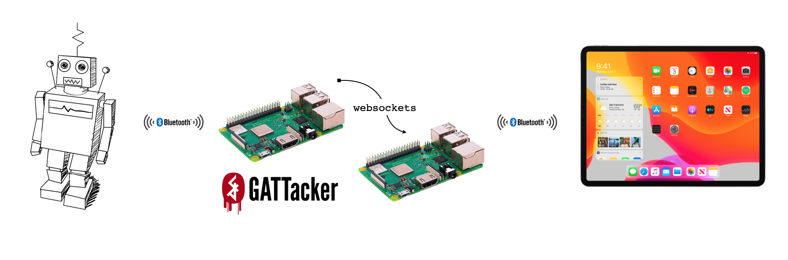

Last week at GitHub we held a day of learning. It was a fantastic opportunity to dig into things I've been wanting to learn. I decided to focus on Bluetooth security. Gavin has been working on a new coding based platform that connects his iPad to a small robot using Bluetooth. He wants a better editor (it uses a MakeCode based block editor but has some usability issues); he generally uses Visual Studio Code. I wondered if it would be possible to write our own client and connect to the robot.

## Some background

Our interest in Bluetooth hacking began a couple of years ago... with a Furby.

Hasbro released the Furby Connect in 2012. The Furby Connect is a dancing, singing robotic toy much like its predecessor. Mad hordes of shoppers weren't tackling one another in the aisles to purchase the Furby Connect as they had done when the original Furby was released. If they had understood its true potential, however, they might have.

Furby is probably the most advanced, well designed, impossibly elegant child's toy that exists. It might be the key to unlocking the emotion of pair-programming. It might seem like the stuff of nightmares: these small talking robots dancing and singing and clamoring for your attention, but as a developer or user experience designer it is an almost perfect medium.

About two years ago a few of us built a pair-coding Furby for a GitHub hack week. The Furby watched as you worked in Atom and offered reactions and ideas. We made a short promotional (and unscripted) video:

[](https://githubber.tv/github/pair-coding-furby)

During that project we focused more on designing an empathetic robot partner and utilized existing bluetooth libraries for controlling a Furby. It worked out great, but involved relatively little _hacking_ as someone else had already reverse-engineered the protocol and connection.

I wanted to learn how to do that.

## Bluetooth Smart

For our purposes, we decided to focus on [Bluetooth Low Energy](https://en.wikipedia.org/wiki/Bluetooth_Low_Energy) (or Bluetooth Smart), a subset of the Bluetooth 4.0 specification. Because it generally uses lower power, it is commonly used for peripherals (especially battery powered devices). Though you can read the full [specification](https://www.bluetooth.com/specifications/bluetooth-core-specification/) there is a much simpler introduction by [Adafruit](https://learn.adafruit.com/introduction-to-bluetooth-low-energy/introduction).

Quick glossary:

**Peripheral devices** - things like bluetooth headphones, keyboards, speakers, or in our case a robot - advertise a Generic Access Profile or [GAP](https://learn.adafruit.com/introduction-to-bluetooth-low-energy/gap).

**Central devices** - like your phone or iPad, a computer, or some other controller - scan for peripheral devices. Once a central device finds a peripheral it can connect and read its Generic Attribute Profile or [GATT](https://learn.adafruit.com/introduction-to-bluetooth-low-energy/gatt) which contains a list of the peripheral's available services and the characteristics of those services.

Subscribing to the services and reading from or writing to the characteristics requires an established connection. Often, the peripheral requires a button to be pressed or a pairing code. Sometimes, like in the case of our robot, you can connect to the peripheral without any user intervention. It is important to note that a peripheral can only be connected to **one** central device at a time. For example, your bluetooth headphones can only be connected to one phone at a time.

## Bluetooth security

Bluetooth security has, historically, been challenging. Though the specification has introduced more advanced security with each version, the peripheral makers have often implemented them incorrectly, or have avoided implementing them at all. Moreover, given the variety of peripherals (some with no input or display function), the specification must offer corresponding pairing mechanisms often at the expense of strong security.

If you want to learn more about Bluetooth Security, NIST has published an excellent [Guide to Bluetooth Security](https://nvlpubs.nist.gov/nistpubs/SpecialPublications/NIST.SP.800-121r2.pdf) (PDF, 67 pages).

Bluetooth communications rely upon proximity and frequency hopping, making it difficult to eavesdrop on the electromagnetic signal or even jam the signal for a denial of service. Because of this, most attacks involve connecting to the peripheral to establish a man-in-the-middle (MITM).

Since Bluetooth 4.1, peripherals can implement Secure Simple Pairing which can be broken down into four models:

- Numeric Comparison
- Passkey Entry
- Just Works
- Out of Band

In the case of Numeric Comparison and Passkey Entry user input and interaction is required to pair a device and peripheral. These are generally more difficult to attack (though some strategies still exist). In the case of Just Works it... Just Works. The peripheral, like our robot, can be connected automatically without any user interaction.

Although it is possible to establish a connection with no user interaction, the data sent over the connection can be encrypted. The specification offers multiple encryption algorithms based on AES (which is usually built into the hardware of the peripheral). Often, peripherals don't implement full encryption and rely instead upon the simpler challenge/response interaction to establish a secure session. After the session is established subsequent connections are sent in plain text. Sometimes, like in the case of the Furby, they don't use any encryption at all.

Even if the connection is fully encrypted it is possible that the key itself may be discovered based on the [Key Negotiation of Bluetooth](https://www.bluetooth.com/security/statement-key-negotiation-of-bluetooth/) vulnerability. In the case of challenge/response based implementations it is often possible to discover predict or maniplulate the challenge as many peripherals have a weak (or non-existent) psuedorandom number generator (PRNG).

## Let's get hacking

Because we want to connect to our robot, we'll limit our scope to simple Bluetooth Low Energy devices that connect automatically (Just Works). Our goal is to be able to send commands to our robot without using the associated iPad application. We know our robot doesn't require a number or passkey to connect; so we should be able to establish a connection. To start, we'll need to figure out what we're dealing with:

- Can we scan for the device's GATT?
- If we connect to the device is there a challenge/response interaction?
- Are the communications encrypted?

To find the answers to these questions we'll use [GATTacker](https://gattack.io/), a Bluetooth discovery tool written in JavaScript and [available on GitHub](https://github.com/securing/gattacker) written by [Slawomir Jasek](https://twitter.com/slawekja). At the 2016 Blackhat conference, Slawomir gave an introductory talk:

<iframe width="560" height="315" src="https://www.youtube.com/embed/uKqdb4lF0XU" frameborder="0" allow="accelerometer; autoplay; encrypted-media; gyroscope; picture-in-picture" allowfullscreen></iframe>

Many things have changed since 2016 when the tool was written (especially for tools written in JavaScript) and this proved to be one of our biggest challenges. Because of this, it is probably best to rely on our [fork](https://github.com/jeffrafter/gattacker).

We are using an Apple MacBook Pro and it turns out to be fairly difficult to manipulate the system's internal Bluetooth - especially in recent versions of MacOS. Though it is possible to connect to Bluetooth peripherals we decided to follow the path of least resistance and attempt to connect via Linux using a Raspberry PI.

By default a normal connection might look this:

<figure class="fullwidth">

</figure>
<figcaption class="fullwidth">
Robot connected to an iPad using bluetooth.
</figcaption>

The peripheral occasionally advertises its Generic Access Profile (GAP). A central device (in this case an iPad) scans for advertisements, finds the peripheral and establishes a connection.

To construct our man-in-the-middle attack we'll need to have a device (or devices) in between the peripheral and central device:

<figure class="fullwidth">

</figure>
<figcaption class="fullwidth">
Robot connected to an iPad using bluetooth with two Raspberry PIs in the middle.
</figcaption>

In this case we have two devices (two Raspberry Pis). We need to use two devices because we need to simulate both sides of the connection. The first Raspberry Pi attaches to the robot, behaving like a central device. It forwards all of the messages it receives from the robot to the second Raspberry Pi (over a websocket) which behaves like a peripheral (pretending to be the robot). When the iPad scans for robot it finds the Raspberry Pi imposter and connects to it instead. Once connected, the messages from the iPad are sent back to the first Raspberry Pi and on to the robot.[^multiple]

[^multiple]: You might be wondering why we can't do this all on one device. Because we are maintaining two connections (one to the robot and one to the iPad) we need two Bluetooth antennae. Each Raspberry Pi only has one built in. You could have multiple Bluetooth adapters (maybe via USB), but it makes things more complex and error prone.

### Setting up the Raspberry Pis

When setting up the devices you'll need to make sure that they have Bluetooth. Raspberry Pi Zero and Raspberry Pi 3 Model B and above all have built-in Bluetooth (and Wifi) making them ideal. If you have an older model it will still work, but will require a Bluetooth adapter and more setup.

For my devices I'm using [Raspbian](https://www.raspberrypi.org/downloads/). Once you've setup the image and connected your Raspberry Pi to your network you can perform the remaining setup over SSH[^ssh]:

[^ssh]: How do you find the SSH address of your Raspberry Pi? I used `arp -a` and was able to quickly find the new device on my network. The default username is `pi` and the default password is `raspberry`.

```sh
ssh pi@192.168.1.x
```

We'll need to setup some requirements. First update:

```sh
sudo apt-get update
```

GATTacker is written in JavaScript and requires Node. Let's install that next:

```sh
sudo apt-get install -y nodejs
```

We'll need a number of dependencies:

```sh
sudo apt-get install libudev-dev gcc g++ make
```

### GATTacker

We'll use [GATTacker](https://github.com/securing/gattacker) on both of our Raspberry Pis to setup our man-in-the-middle. In addition to the [README](https://github.com/securing/gattacker), there is some helpful documentation in the Wiki:

- [Dump and replay](https://github.com/securing/gattacker/wiki/Dump-and-replay)
- [FAQ](https://github.com/securing/gattacker/wiki/FAQ)

Additionally, there is a very good [whitepaper](http://gattack.io/whitepaper.pdf) (PDF).

As mentioned before, we'll use a [fork](https://github.com/jeffrafter/gattacker) which has some upgraded dependencies and fixes. Clone the repository:

```sh
git clone https://github.com/jeffrafter/gattacker.git
```

You should see something like:

```sh
Cloning into 'gattacker'...
remote: Enumerating objects: 250, done.
remote: Total 250 (delta 0), reused 0 (delta 0), pack-reused 250
Receiving objects: 100% (250/250), 313.58 KiB | 1.81 MiB/s, done.
Resolving deltas: 100% (87/87), done.
```

Change to the newly created `gattacker` directory:

```sh
cd gattacker
```

Install the dependencies:

```
npm install
```

We'll need to change the configuration open `config.env`:

```sh
nano config.env
```

Uncomment `NOBLE_HCI_DEVICE_ID`:

```
NOBLE_HCI_DEVICE_ID=0
```

By default your Bluetooth adapter will be `hci0`. So the value should be `0` as specified. Save the file and exit (`Ctrl+X`, `Y` for yes, `Enter`).

If you are using a Bluetooth Adapter it might be different. If you aren't sure, you can check:

```sh
rfkill
```

You should see:

```
ID TYPE      DEVICE      SOFT      HARD
 0 wlan      phy0   unblocked unblocked
 1 bluetooth hci0   unblocked unblocked
```

We can see that the `bluetooth` device is `hci0` so we're ready.

### Warning

Before we get begin scanning and connecting to devices it is important to call out a few (hopefully obvious) things. Our plan is to use the devices exactly as they were designed: they broadcast and advertisement, connect and communicate. You should check that you are not working against terms of service or laws in your jurisdiction.

Additionally, when scanning you'll notice there are _a lot_ of peripherals close by (the lower the `RSSI` value the closer it is). You might be tempted to connect to your neighbor's Forerunner or their Cup-o-noodles (no really, there are Bluetooth Enabled Cup-o-noodles near me). But remember: when you connect to one of these devices their owner cannot connect to them (peripherals can only maintain one connection). This opens up a variety of interesting denial of service (DOS) attack scenarios; many of which are not legal.

To be safe: stick to your own devices and services.

### Scanning

We want to begin scanning for advertisements. Before we begin scanning we want to set up the WebSocket server. All GATTacker tools communicate over WebSockets so the server must be running.

From within the `gattacker` directory, run:

```sh
sudo npm run ws-server
```

You should see:

```
> gattacker@0.2.1-1 ws-server /home/pi/gattacker
> node ws-server.js

GATTacker ws-server
(node:2780) [DEP0005] DeprecationWarning: Buffer() is deprecated due to security and usability issues. Please use the Buffer.alloc(), Buffer.allocUnsafe(), or Buffer.from() methods instead.
```

With the server running, we want to start scanning. To do this, open a second window and a new shell[^background].

[^background]: Instead of opening a second shell, you could also move the `ws-server` process to the background (by pressing `ctrl+z`), or run it via `screen`. You could also make this the default by outputting the logs to a file and running the command detached using `&`.

Make sure your Bluetooth peripheral is powered off (and will not automatically connect to any devices nearby). Then, in the new shell (still on the first Raspberry Pi) run the scan command:

```sh
npm run scan
```

Turn on your device and you should see it appear in the log:

```sh
peripheral discovered (f8e5dd08c726 with address <f8:e5:dd:08:c7:26, random>, connectable true, RSSI -73:
	Name: Robot
	EIR: 0201061bff0303020401080008000000003701540030000000000000000000 (                 7 T 0         )
	Scan response: 1107c1d9850ecade491f86619d87787723af0409437565 (        I  a  xw#   Robot)

advertisement saved: devices/f8e5dd08c726_Robot.adv.json
```

Once you see your device (you should be able to recognize the name) you can stop the process. If the name of your device is not obvious (in our example above it is "Robot") then you need to do some more detective work. By powering on and off the device a few times you can usually spot it.

Keep track of the name of the device and the where the advertisement was saved - in this case `devices/f8e5dd08c726_Robot.adv.json`.

Looking at the file, you'll notice there doesn't seem to be a lot of information. In fact, the only useful piece of information is the service identifier: `af237778879d61861f49deca0e85d9c1`. This is the actual identifier that our robot wants devices to use when connecting.

With this information (and the `f8e5dd08c726` identifier for the device) we can discover more services and characteristics. Let's rescan, but this time we'll focus only on our robot:

```
npm run scan f8e5dd08c726
```

You should see:

```
npm run scan f8e5dd08c726

> gattacker@0.2.1-1 scan /home/pi/gattacker
> node scan.js "f8e5dd08c726"

ws-server address: 127.0.0.1
on open
poweredOn
Start exploring f8e5dd08c726
Start to explore f8e5dd08c726
explore state: f8e5dd08c726 : startScan
explore state: f8e5dd08c726 : discovered
explore state: f8e5dd08c726 : start
(node:1503) [DEP0005] DeprecationWarning: Buffer() is deprecated due to security and usability issues. Please use the Buffer.alloc(), Buffer.allocUnsafe(), or Buffer.from() methods instead.
already saved advertisement for f8e5dd08c726 (Robot)
explore state: f8e5dd08c726 : finished
Services file devices/f8e5dd08c726.srv.json saved!
```

Now we have the complete services and characteristics for our peripheral

#### Troubleshooting

You might run into a problem reconnecting to the peripheral. In the `ws-server` logs you might see the error:

```
ws -> send: {"type":"connect","peripheralId":"f8e5dd08c726"}
Explore: connect error: Error: Peripheral already connected - try hciconfig reset...
```

If this happens, you can simply stop both processes. Then run:

```
hciconfig reset
```

And start the processes again.


### Making this work on a Mac

https://github.com/abandonware/noble#sandboxed-terminal

On newer versions of OSX, allow bluetooth access on the terminal app: "System Preferences" —> "Security & Privacy" —> "Bluetooth" -> Add terminal app (see Sandboxed terminal)
