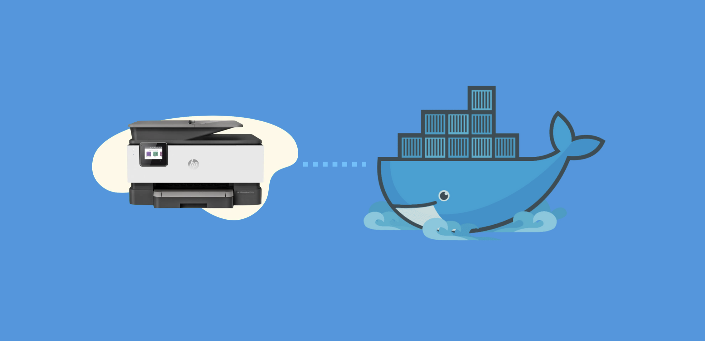
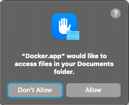

<figure class="fullwidth">

</figure>

Just use docker, they said. It will be easy, they said.

I've been trying to get my iPad to print to a PDF for a while now. I've used PDFWriter but I wasn't able to print from an iOS simulator on my localhost. Realized that I could use CUPS-PDF to print to a PDF and then use Avahi to broadcast it as an AirPrint printer and that this might help me workaround the DNS rebinding protection built into CUPS.

Spoiler: it didn't.

But this was a fun little project and I learned a lot about Docker, CUPS-PDF and Avahi.

# Getting started

[CUPS-PDF](https://www.cups-pdf.de) is a virtual printer that allows you to print to a PDF. It's a great way to create PDFs from any application that supports printing. You can use it to create PDFs from web pages, documents, images, etc. It runs in Linux and relies on the CUPS printing system.

In our previous article, [Printers, Fake Printers, and AirPrint](./printers-fake-printers-and-airprint) we used the Mac-specific RWTS-PDFWriter as a virtual printer. The setup was simple and it worked well. Unfortunately, RWTS-PDFWriter relies on the underlying system installation of CUPS. Because of this it no longer supports PostScript (as of MacOS Sonoma) and isn't using the latest version of CUPS based on the [OpenPrinting](https://openprinting.github.io/) project.

[Avahi](https://avahi.org) is a zeroconf implementation that allows you to broadcast services on a local network. It's a great way to discover services on your local network without having to configure DNS or DHCP. It's used by Apple's Bonjour protocol to broadcast services like AirPrint.

[Docker](https://www.docker.com) is a containerization platform that allows you to run applications in a consistent environment. It's a great way to run applications without having to worry about dependencies or conflicts with other applications. On macOS, Docker runs in a hypervisor environment and you can use it to run Linux applications (note, it is not an actual virtual machine).

In order to run Docker on macOS, you need to install Docker Desktop. This will install the Docker CLI, Docker Compose and the Docker Engine. You can then use the Docker CLI to run containers, build images and manage your Docker environment.

Go to https://www.docker.com/products/docker-desktop/ and download Docker Desktop for Mac.

## Setting up the Docker container

Docker containers rely on `Dockerfile` files. Create a new folder and add a `Dockerfile` with the following content:

```Dockerfile
# Use a base image with necessary dependencies (e.g., Debian)
FROM debian:latest

# Install required packages (CUPS, CUPS-PDF)
RUN apt-get update && \
    apt-get install -y \
        cups \
        printer-driver-cups-pdf \
        && \
    apt-get clean && \
    rm -rf /var/lib/apt/lists/*

# Expose the CUPS port
EXPOSE 631

# Copy printer configuration script
COPY configure-printer.sh /usr/local/bin/

# Make it executable
RUN chmod +x /usr/local/bin/configure-printer.sh

# Set entry point
ENTRYPOINT ["/usr/local/bin/configure-printer.sh"]
```

Notice we are expecting a `configure-printer.sh` script. Create a new file called `configure-printer.sh` in the same folder as your `Dockerfile` with the following content:

```sh
#!/bin/bash

# Stop any service that auto-started
service cups stop

# Start the CUPS daemon in the background
/usr/sbin/cupsd

# Wait for CUPS to start
until lpstat -H; do
  echo "Waiting for CUPS to start..."
  sleep 1
done
echo "CUPS started"

# Share everything
cupsctl --share-printers --remote-any --remote-admin --user-cancel-any "WebInterface=Yes"

# Configure CUPS-PDF
mkdir -p /var/spool/cups-pdf/CUPS-PDF
chmod 1777 /var/spool/cups-pdf/CUPS-PDF
lpadmin -p CUPS-PDF -E -v cups-pdf:/ -P /usr/share/ppd/cups-pdf/CUPS-PDF_opt.ppd -D "CUPS-PDF Printer" -L "PDF Printer"

# Keep container running
echo "Printer configured. Container will keep running."
tail -f /var/log/cups/error_log
```

This script stops any service that auto-started, starts the CUPS daemon in the background, waits for CUPS to start, shares everything, configures CUPS-PDF and then keeps the container running.

Now build the Docker image:

```sh
❯ docker build -t cups-pdf .
[+] Building 0.7s (9/9) FINISHED
 => [internal] load build definition from Dockerfile
 => => transferring dockerfile: 37B
 => [internal] load .dockerignore
 => => transferring context: 2B
 => [internal] load metadata for docker.io/library/debian:latest
 => [1/4] FROM docker.io/library/debian:latest@sha256:4482958b4461ff7d9fabc24b3a9ab1e9a2c85ece07b2db1840c7cbc01d053e90
 => [internal] load build context
 => => transferring context: 720B
 => CACHED [2/4] RUN apt-get update && apt-get install -y cups printer-driver-cups-pdf && apt-get clean && rm -rf /var/lib/apt/lists/*
 => [3/4] COPY configure-printer.sh /usr/local/bin/
 => [4/4] RUN chmod +x /usr/local/bin/configure-printer.sh
 => exporting to image
 => => exporting layers
 => => writing image sha256:100089de8e3c91417db1e27897dda8d21f5ab0499ff20f31bb111e5ae2a014af
 => => naming to docker.io/library/cups-pdf
```

The first time you run this command it will take a while to download the base image and install the required packages. Subsequent builds will be faster because Docker will cache the layers.

Now you can run the Docker container:

```sh
❯ docker run -it cups-pdf
Stopping Common Unix Printing System: cupsd.
/run/cups/cups.sock
CUPS started
lpadmin: Printer drivers are deprecated and will stop working in a future version of CUPS.
Printer configured. Container will keep running.
E [18/Feb/2024:15:14:53 +0000] Unable to open listen socket for address [v1.::1]:631 - Cannot assign requested address.
E [18/Feb/2024:15:14:53 +0000] Unable to communicate with avahi-daemon: Daemon not running
```

> Press `Ctrl+C` to stop the container.

This will start the CUPS-PDF container and configure the CUPS-PDF printer. Unfortunately there are a few errors. The first error is a warning about deprecated printer drivers. That error can be safely ignored for now. The second error is about not being able to open a listen socket for the address `v1.::1`. This is because the container is running in a hypervisor environment and the host networking is not available.

In order to fix this error, you need to run the container in host networking mode. This will allow the container to use the host networking stack and access the host network interfaces. You can do this by adding the `--network host` flag to the `docker run` command:

```sh
❯ docker run -it --network host cups-pdf
Stopping Common Unix Printing System: cupsd.
/run/cups/cups.sock
CUPS started
lpadmin: Printer drivers are deprecated and will stop working in a future version of CUPS.
Printer configured. Container will keep running.
E [18/Feb/2024:15:17:46 +0000] Unable to communicate with avahi-daemon: Daemon not running
```

The last error is a warning about Avahi not running. We'll fix these errors in the next section.

Unfortunately, we still can't use this printer because we are not able to access the Docker container's ports from the host. Although we are exposing port 631 we need to map the container's port to the host's port. We can do this by adding the `-p 631:631` flag to the `docker run` command:

```sh
❯ docker run -it --network host -p 631:631 cups-pdf
WARNING: Published ports are discarded when using host network mode
docker: Error response from daemon: Ports are not available: exposing port TCP 0.0.0.0:631 -> 0.0.0.0:0: listen tcp 0.0.0.0:631: bind: address already in use
```

We immediately get an error because the host is already using port 631 - our local machine is running the CUPS service. We can fix this by stopping the CUPS service on the host:

```sh
❯ sudo launchctl unload /System/Library/LaunchDaemons/org.cups.cupsd.plist
```

> You would think that you could just stop the CUPS service using `sudo launchctl stop org.cups.cupsd` but that doesn't work as it will automatically restart. You need to use `launchctl unload` to stop the service. To restart the service, use `sudo launchctl load /System/Library/LaunchDaemons/org.cups.cupsd.plist`.

Run the container again:

```sh
❯ docker run -it -p 631:631 cups-pdf
Stopping Common Unix Printing System: cupsd.
/run/cups/cups.sock
CUPS started
lpadmin: Printer drivers are deprecated and will stop working in a future version of CUPS.
Printer configured. Container will keep running.
E [18/Feb/2024:15:23:11 +0000] Unable to open listen socket for address [v1.::1]:631 - Cannot assign requested address.
E [18/Feb/2024:15:23:11 +0000] Unable to communicate with avahi-daemon: Daemon not running
```

At this point, we have access to the CUPS-PDF printer on the host, but it is not being advertised as an AirPrint printer. To do this (in a separate terminal, with the Docker container still running) run the following command:

```sh
dns-sd -R "CUPS-PDF @ AirPrint" _ipp._tcp,_universal . 631 \
        pdl=application/octet-stream,application/pdf,image/jpeg,image/png,image/pwg-raster,image/urf \
        adminurl= \
        rp=printers/cups-pdf \
        TLS=1.2 \
        Color=T \
        Copies=T
```

This will broadcast the CUPS-PDF printer as an AirPrint printer on the local network. You can now print to the CUPS-PDF printer from your iOS device.

But where do the PDFs go? The PDFs are saved in the `/var/spool/cups-pdf/ANONYMOUS` folder inside the container. You can access the PDFs by running the following command:

```sh
❯ docker exec -it <container-id> ls /var/spool/cups-pdf/ANONYMOUS
```

> Replace `<container-id>` with the ID of the running container. You can find this by running `docker ps`. You can automate finding the container ID by using `$(docker ps -a | grep -m 1 cups-pdf | awk '{print $1}')`.

If you want to save the PDFs to the host, you can copy them (see the `docker cp` command) or you can mount a volume to the container.

First create a folder on the host:

```sh
mkdir -p ~/Documents/CUPS-PDF
```

Then run the container with the volume mounted:

```sh
❯ docker run -it  -p 631:631 -v ~/Documents/CUPS-PDF:/var/spool/cups-pdf/ANONYMOUS cups-pdf
Stopping Common Unix Printing System: cupsd.
/run/cups/cups.sock
CUPS started
lpadmin: Printer drivers are deprecated and will stop working in a future version of CUPS.
Printer configured. Container will keep running.
E [18/Feb/2024:15:42:50 +0000] Unable to open listen socket for address [v1.::1]:631 - Cannot assign requested address.
E [18/Feb/2024:15:42:50 +0000] Unable to communicate with avahi-daemon: Daemon not running
```

When you run this (if you used the `~/Documents` folder like I did) you'll get a permissions dialog:



Choose `Allow`. Now when you print to the CUPS-PDF printer, the PDFs will be saved to the `~/Documents/CUPS-PDF` folder on the host.

# Avahi

If you are like me, you might be thinking: "This is great, but I don't want to have to run the `dns-sd` command every time I start the container, maybe I can use Avahi to broadcast the CUPS-PDF printer as an AirPrint printer automatically."

Spoiler: you can't.

On Mac, the container network is completely separate from the host network even when running in host networking mode. This means that the Avahi daemon running in the container is not able to communicate with the host. Because of this the Avahi daemon within the container cannot use multicast DNS to broadcast services on the local network.

For more information, see [Docker host networking](https://github.com/docker/for-mac/issues/3926#issuecomment-1760373163).

But it is still interesting to get Avahi to work in a container. If your host computer was Linux, or if you wanted to multicast broadcast between Docker containers (See Container Networks, `--network container:<name|id>`, in https://docs.docker.com/network/), this would allow broadcasting on those networks.

## Updating the `Dockerfile`

In order to run Avahi we'll need to update the `Dockerfile` to install Avahi and its dependencies. Change  the `Dockerfile`:

```Dockerfile
# Use a base image with necessary dependencies (e.g., Debian)
FROM debian:latest

# Install required packages (CUPS, CUPS-PDF)
RUN apt-get update && \
    apt-get install -y \
        cups \
        printer-driver-cups-pdf \
        avahi-daemon avahi-discover avahi-utils libnss-mdns mdns-scan \
        dbus \
        && \
    apt-get clean && \
    rm -rf /var/lib/apt/lists/*

# Expose the CUPS and Avahi ports
EXPOSE 631 5353/udp

# Copy printer configuration script
COPY configure-printer.sh /usr/local/bin/

# Make it executable
RUN chmod +x /usr/local/bin/configure-printer.sh

# Set entry point
ENTRYPOINT ["/usr/local/bin/configure-printer.sh"]
```

The `Dockerfile` is very similar to the previous one, but we've added the `avahi-daemon avahi-discover avahi-utils libnss-mdns mdns-scan` packages to the `apt-get install` command and we've exposed the Avahi port `5353/udp`. We've also added the `dbus` package which is required by Avahi.

`Dbus` is a message bus system that allows applications to communicate with each other. It is used by Avahi to communicate with the system bus. It works in most Linux and Unix systems, but it is not available by default on macOS. It is possible to install it on macOS using Homebrew, but it is not necessary for this project.[^dbus]

[^dbus]: In the event that your host _is_ Linux, you can connect the container's `dbus` to the host's when you run the container. To do this, you need to mount the host's `dbus` to the container's `dbus` using the `-v` flag and connecting the local `/var/run/dbus/system_bus_socket` (found in `/opt/homebrew` on a Mac) with `system_bus_socket` in the container. This will allow the container to communicate with the host's `dbus` and use Avahi to broadcast services on the local network. I attempted to do this on my Mac but couldn't find the magic incantation to get it to work.

## Updating the `configure-printer.sh` script

We also need to update the `configure-printer.sh` script to start the Avahi daemon.

We'll need to start the `dbus-daemon`, start the `avahi-daemon` and then broadcast the CUPS-PDF printer as an AirPrint printer. We'll also include some error checking to make sure they all start properly:

```sh
#!/bin/bash

# Stop any service that auto-started
service cups stop

# Start the dbus daemon
dbus-daemon --system --print-address

# Start Avahi daemon if it's not running
if ! pgrep -x "avahi-daemon" >/dev/null; then
    echo "Avahi daemon is not running. Starting it..."
    avahi-daemon --no-rlimits &
    echo "Waiting for Avahi daemon to start..."
    sleep 5
fi

# Check if it really started
if ! pgrep -x "avahi-daemon" >/dev/null; then
    echo "Avahi daemon failed to start"
    exit 1
fi

# Start the CUPS daemon in the background
/usr/sbin/cupsd

# Wait for CUPS to start
until lpstat -H; do
  echo "Waiting for CUPS to start..."
  sleep 1
done
echo "CUPS started"

# Share everything
cupsctl --share-printers --remote-any --remote-admin --user-cancel-any "WebInterface=Yes"

# Configure CUPS-PDF
mkdir -p /var/spool/cups-pdf/CUPS-PDF
chmod 1777 /var/spool/cups-pdf/CUPS-PDF
lpadmin -p CUPS-PDF -E -v cups-pdf:/ -P /usr/share/ppd/cups-pdf/CUPS-PDF_opt.ppd -D "CUPS-PDF Printer" -L "PDF Printer"

# Register the printer service
echo "Registering the printer service..."
avahi-publish-service "DOCKER-CUPS-PDF @ AirPrint" _ipp._tcp 631 \
  pdl=application/octet-stream,application/pdf,image/jpeg,image/png,image/pwg-raster,image/urf \
  adminurl= \
  rp=printers/CUPS-PDF \
  TLS=1.2 \
  Color=T \
  Copies=T &

# Keep container running
echo "Printer configured. Container will keep running."
tail -f /var/log/cups/error_log
```

## Rebuilding the Docker image and running the container

Rebuild the Docker image:

```sh
❯ docker build -t cups-pdf .
```

Then run the container:

```sh
❯ docker run -it -p 631:631 -v ~/Documents/CUPS-PDF:/var/spool/cups-pdf/ANONYMOUS cups-pdf
Stopping Common Unix Printing System: cupsd.
unix:path=/run/dbus/system_bus_socket,guid=0ef70bef46dd361330a2c60e65d24c5f
Avahi daemon is not running. Starting it...
Waiting for Avahi daemon to start...
Found user 'avahi' (UID 101) and group 'avahi' (GID 107).
Successfully dropped root privileges.
avahi-daemon 0.8 starting up.
Successfully called chroot().
Successfully dropped remaining capabilities.
No service file found in /etc/avahi/services.
Joining mDNS multicast group on interface eth0.IPv4 with address 172.17.0.2.
New relevant interface eth0.IPv4 for mDNS.
Joining mDNS multicast group on interface lo.IPv4 with address 127.0.0.1.
New relevant interface lo.IPv4 for mDNS.
Network interface enumeration completed.
Registering new address record for 172.17.0.2 on eth0.IPv4.
Registering new address record for 127.0.0.1 on lo.IPv4.
Server startup complete. Host name is c1b0a29d5536.local. Local service cookie is 719581554.
/run/cups/cups.sock
CUPS started
lpadmin: Printer drivers are deprecated and will stop working in a future version of CUPS.
Registering the printer service...
Printer configured. Container will keep running.
E [18/Feb/2024:18:28:52 +0000] Unable to open listen socket for address [v1.::1]:631 - Cannot assign requested address.
Established under name 'DOCKER-CUPS-PDF @ AirPrint'
```

It works, but again, this will not join your host network and will not broadcast the printer as an AirPrint printer.

# Cleaning up

If you've made it this far you may want to clean up. Stop any running the containers and `dns-sd` commands. Then remove the containers:

```sh
❯ docker ps -a
CONTAINER ID   IMAGE     COMMAND   CREATED   STATUS    PORTS     NAMES
c1b0a29d5536   cups-pdf  "/usr/local/bin/co…"   2 minutes ago   Up 2 minutes
❯ docker stop c1b0a29d5536
c1b0a29d5536
❯ docker rm c1b0a29d5536
c1b0a29d5536
```

You can also remove the Docker image:

```sh
❯ docker images
REPOSITORY   TAG       IMAGE ID       CREATED       SIZE
cups-pdf     latest    100089de8e3c   2 hours ago   1.03GB
❯ docker rmi 100089de8e3c
Untagged: cups-pdf:latest
Deleted: sha256:100089de8e3c91417db1e27897dda8d21f5ab0499ff20f31bb111e5ae2a014af
```

Also, if you stopped your local CUPS service, you can restart it:

```sh
❯ sudo launchctl load /System/Library/LaunchDaemons/org.cups.cupsd.plist
```

