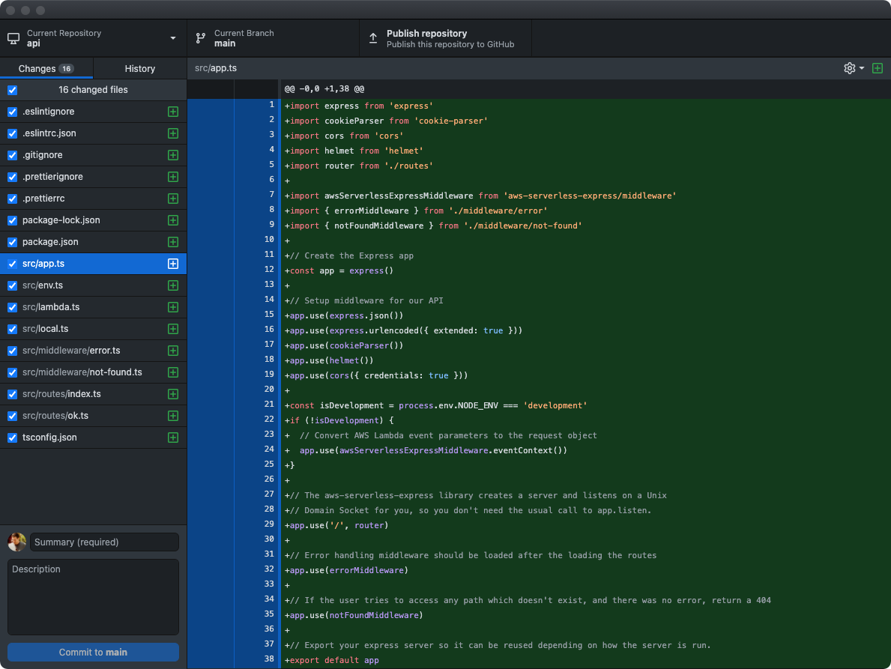

<figure class="fullwidth">

</figure>
<figcaption class="fullwidth">
</figcaption>

**🗺 Exploring - Work in progress**

Using Express to build out your API can be challenging; but integrating it with all of the products available from Amazon Web Services can feel impossible. This post focuses less on best practices for your API and more on reusable patterns to tie all of those products together. This is the second part in a series on building out a scalable website on AWS. In the [first part](/terraform-and-aws) we setup all of the infrastructure we'll need using Terraform.

## Choosing a framework

Before we even get started we need to decide what framework we'll use to write our AWS Lambda function - if any. Out of the box AWS gives you a `handler` pattern that you can use to receive an incoming web request, perform some actions and return a response. For a web server this is really all we need. In fact, using this simple pattern is actually the recommended best practice.

AWS Lambda is a FaaS (Function as a Service) or "serverless" platform designed to execute discrete "functions" or _handlers_. The expectation is that each route on our website will execute a separate specific function inside Lambda. Each of these routes would be setup individually inside AWS API Gateway and point to their respective AWS Lambda functions. We've setup our API Gateway to send all routes to a single function (`site_api`).

Why would we do this? What are the tradeoffs?

**All routes pointing to a single function**

- When developing your API you want to be able to test it locally
- When deploying you want shared dependencies to be updated simultaneously
- Adding a new route to API Gateway and pointing to a new Lambda function is cumbersome
- Changing API Gateway can be slow
- Our function will have fewer cold-starts

**Many routes pointing to separate functions**

- You might want to restrict deployments for specific parts of the site
- You can change parts of the site without changing everything
- A single mistake won't break the entire site
- Deploying new functions will only cause cold-starts on part of the site
- You want to use Lambda@Edge
- Smaller functions take less time to upload and deploy
- Smaller functions have a shorter cold-start time

In general, how you choose between these trade-offs is dictated by the site and team (and in some cases preferences). If you have a smaller site and smaller team then it is often better to favor simplicity. Choosing **All routes pointing to a single function** simplifies local development and deployment but increases risk by putting everything in one function. For example, if you are the only developer (or there are only a couple developers), then layering strict permissions about who can deploy specific parts of the site is overkill.

What's a cold-start? Even though AWS Lambda runs functions "on-demand" it still needs to load the code in order to execute it. If your code-base is large it will take a long time to load before your function can respond to requests. Because this can be slow, AWS tries to avoid doing it too often and keeps the code in a hot-cache for five minutes after it is loaded. If the function is used again, the timeout is restarted. You should try to avoid cold-starts as much as possible and you should try to minimize their impact as much as possible to keep your site snappy. Keeping all of your routes in a separate functions means that the code that needs to be loaded is smaller (and therefore faster to load). But pointing all of your routes to a single shared function means that the function will be used more frequently and will likely have fewer cold-starts.

As with most things, it depends.

For our API we'll use a single function. This is almost always the simplest and easiest choice especially when getting started. As our site grows we can slowly transition from this model to a hybrid model with multiple functions and ultimately to individual functions for every route if needed.

### Why Express?

Because we're using a single function we'll need to enable that function to handle routing for us (like a traditional web server). There are numerous frameworks that make it easy. [Express](https://expressjs.com/) is a "Fast, unopinionated, minimalist web framework for Node.js". That sounds like what we want. We could choose a smaller framework like Micro from Vercel (used as part of Next.js) - but it is not typically used in serverless environments. We could also choose [Sails.js](https://sailsjs.com/), a much richer MVC framework written in JavaScript. In many cases this is the right choice, but for our purposes we'll use Express as it is _closer to the metal_ which makes it easier to follow the logic.

Because we are building an API there are a few other options available to us.

# Getting started

In the previous post we created a very simple API function:

```js
exports.handler = async (event, context) => {
  console.log('Event: ' + JSON.stringify(event))
  console.log('Context: ' + JSON.stringify(context))

  return {
    statusCode: 200,
    body: JSON.stringify({
      event: event,
      context: context,
    }),
  }
}
```

In the handler we logged information about the event and context and echoed back the result as JSON. You would never want a function like this in a production application, but this allowed us to quickly setup our API Gateway deployment, test AWS Lambda and make sure our logging worked.

To make our API we'll need more code than this. Let's create a new folder called `api`. I usually make this a sibling folder to the `terraform` folder we created previously.

```sh
mkdir api
```

Change to that folder:

```sh
cd api
```

We'll use `npm` to install and manage the packages for our API. Let's set that up now:

```sh
npm init -y
```

This will generate a default `package.json`:

```json
{
  "name": "api",
  "version": "1.0.0",
  "description": "",
  "main": "index.js",
  "scripts": {
    "test": "echo \"Error: no test specified\" && exit 1"
  },
  "keywords": [],
  "author": "",
  "license": "ISC"
}
```

Next, we'll install express:

```sh
npm install --save express
```

We'll need a few more packages right away:

```sh
npm install --save cors helmet body-parser cookie-parser http-errors
```

We'll also need some AWS and serverless specific packages:

```sh
npm install --save aws-sdk @vendia/serverless-express
```

### TypeScript

I usually choose to use TypeScript for my projects. Though it isn't required it makes some things easier (and some things much harder). It can be a tough trade-off.

```sh
npm install --save-dev typescript
```

We only need TypeScript support while developing. We'll convert the application to JavaScript when deploying. Install the following TypeScript dependencies:

```sh
npm install --save-dev ts-node-dev ts-loader
```

We'll need to setup our TypeScript configuration; create a new file called `tsconfig.json`:

```json
{
  "compilerOptions": {
    "module": "commonjs",
    "target": "esnext",
    "lib": ["es2015", "es2017"],
    "strict": true,
    "esModuleInterop": true,
    "skipLibCheck": true,
    "noUnusedLocals": true,
    "noUnusedParameters": true,
    "noImplicitAny": true,
    "removeComments": false,
    "preserveConstEnums": true
  },
  "include": ["**/*.ts"],
  "exclude": ["node_modules"]
}
```

Next we'll want to download type definitions for our dependencies:

```sh
npm install --save-dev \
  @types/node \
  @types/cors \
  @types/cookie-parser \
  @types/http-errors \
```

We'll want to add a few `scripts` to `package.json` to utilize these dependencies. The only script we need at the moment is `build` which will convert our TypeScript to JavaScript. We can remove the placeholder `test` script for now. While we're developing our action we'll need access to all of our project's dependencies; but when we release our action we don't want to include the testing, linting and TypeScript dependencies. Because of this, the difference between `dependencies` and `devDependencies` is important (as well as `--save` versus `--save-dev`).

Add the following scripts to `package.json`

```json
{
  "scripts": {
    "build": "tsc --noEmit",
  },
}
```

## Keep it clean (optional)

> Note: this section is not required to complete this tutorial; if you want to skip it feel free.

Everyone has different preferences when they edit code. Some prefer tabs over spaces. Some want two spaces instead of four. Some prefer semicolons and some don't. It shouldn't matter right? But it does. If editors are auto-formatting code based on user preferences it is important to make sure everyone has chosen the same set of defaults for that auto-formatting. This makes it easy to tell what changed between versions – even when different developers (with different preferences) have made changes.

For this reason we'll setup a linter and code formatter for our code. Install [eslint](https://eslint.org/) and [prettier](https://prettier.io/):

```sh
npm install --save-dev \
  eslint \
  @typescript-eslint/eslint-plugin \
  @typescript-eslint/parser \
  eslint-config-prettier \
  eslint-plugin-prettier \
  prettier
```

Now that we have the packages we'll need to configure them in `.eslintrc.json`:

```json
{
  "parser": "@typescript-eslint/parser",
  "plugins": ["@typescript-eslint", "prettier"],
  "extends": [
    "eslint:recommended",
    "plugin:@typescript-eslint/recommended",
    "plugin:prettier/recommended"
  ],
  "rules": {
    "prettier/prettier": [
      "error",
      {
        "singleQuote": true,
        "trailingComma": "all",
        "bracketSpacing": true,
        "printWidth": 120,
        "tabWidth": 2,
        "semi": false
      }
    ]
  },
  "env": {
    "node": true,
    "es6": true
  },
  "parserOptions": {
    "ecmaVersion": 2018,
    "sourceType": "module"
  }
}
```

I won't go into too much detail here; there are [better explanations](https://www.robertcooper.me/using-eslint-and-prettier-in-a-typescript-project) to be found. This configuration does a few things:

- Relies on the TypeScript ESlint parser with the prettier plugin - I've found this works very well in VS Code.
- The expected environment should include `node` - this will help `eslint` ignore missing declarations for things like `process`, `module`, etc.

If you need to ignore specific files when linting you can add them to `.eslintignore`. Because our setup doesn't work well for JavaScript we'll ignore all JavaScript files in `.eslintignore`:

```
*.js
```

If you are using VS Code, you can install the [ESLint extension](https://marketplace.visualstudio.com/items?itemName=dbaeumer.vscode-eslint) so you can see lint warnings in your editor. Additionally, we can add a `lint` item to the `scripts` node in `package.json` so that we can check for lint warnings when building and deploying:

```json
  "scripts": {
    "build": "tsc --noEmit",
    "lint": "eslint . --ext .ts"
  },
```

With this in place we can run:

```sh
npm run lint
```

Wait, there's an error:

```
Oops! Something went wrong! :(

ESLint: 7.24.0

No files matching the pattern "." were found.
Please check for typing mistakes in the pattern.
```

We haven't written any TypeScript to lint yet.

### Prettier & `.prettierrc`

Prettier works to auto-format your code based on a shared configuration. If you are using VSCode you can install the [prettier extension](https://marketplace.visualstudio.com/items?itemName=esbenp.prettier-vscode) and it will auto-format your code every time you save. The configuration is setup in the `.prettierrc` file. I tend to use the following `.prettierrc` setup:

```json
{
  "endOfLine": "lf",
  "semi": false,
  "singleQuote": true,
  "tabWidth": 2,
  "trailingComma": "all",
  "bracketSpacing": false,
  "jsxBracketSameLine": true,
  "printWidth": 120
}
```

You might have different preferences in your project. That's fine, so long as all of the developers working on the code agree. For more information on the available options, view the [Prettier docs](https://prettier.io/docs/en/options.html).

There are some files in our project that we shouldn't (or don't want to) prettify. The reasons we might not want to run Prettier vary but include: different formatting preferences, external libraries, generated files, frequency of change, or speed. Luckily we can tell Prettier to ignore files. Add a `.prettierignore` file:

```
package.json
package-lock.json
node_modules
```

Time to stop configuring and start writing code.

## Building the Express API

Express applications can be very simple - all of the logic can be contained in a single file. As your project becomes more complex this can become very confusing. Because of this, we'll use files and folders that help us keep the project organized:

```
api/
  |- src/
  |  |- app.ts
  |  |- env.ts
  |  |- lambda.ts
  |  |- local.ts
  |  |- middleware/
  |  |  |- error.ts
  |  |  |- not-found.ts
  |  |- routes/
  |  |  |- index.ts
  |  |  |- ok.ts
```

### Main Application

Even though it is not required, it is common to put the main application logic in a file called `app.ts` (or `app.js` if you are not using TypeScript). That's the name the [Express application generator](https://expressjs.com/en/starter/generator.html) chooses (which we are not using). In our case we'll want to store all of the code for our application in a `src` folder to keep things organized. Create `src/app.ts` and copy the following:

```typescript
import express from 'express'
import cookieParser from 'cookie-parser'
import cors from 'cors'
import helmet from 'helmet'
import router from './routes'

import { errorMiddleware } from './middleware/error'
import { notFoundMiddleware } from './middleware/not-found'

// Create the Express app
const app = express()

// Setup middleware for our API
app.use(express.json())
app.use(express.urlencoded({ extended: true }))
app.use(cookieParser())
app.use(helmet())
app.use(cors({ credentials: true }))

// The aws-serverless-express library creates a server and listens on a Unix
// Domain Socket for you, so you don't need the usual call to app.listen.
app.use('/', router)

// If the user tries to access any path which doesn't exist, and there was no error, return a 404
app.use(notFoundMiddleware)

// Error handling middleware should be loaded after the loading the routes
app.use(errorMiddleware)

// Export your express server so it can be reused depending on how the server is run.
export default app
```

[^boilerplate]: Much of this `app.ts` matches boilerplate application that is generated by the [Express application generator](https://expressjs.com/en/starter/generator.html). We're not using that generator, but it is helpful to know the default project structure for an Express application.

After creating the default `express` application we begin using specific _middleware_. Express applications receive a request (containing `params` and other information) and return a response (in our case, containing JSON). The [middleware pattern](https://expressjs.com/en/guide/using-middleware.html) allows us to treat this request-response cycle as a pipeline using specific functions:

```js
const customMiddleware = (request: Request, response: Response, next: NextFunction) {
  console.log('Time:', Date.now())
  next()
})
```

The `customMiddleware` function receives the `request` and `response` objects and can modify them before allowing the middleware pipeline to move to the next middleware function.

When setting up our application we've specified that our application should `use` a common set of middleware:

- `express.json()`: allows our application to handle JSON requests
- `express.urlencoded({ extended: true })`: allows our application to handle URL encoded parameters
- `cookieParser()`: parses any cookie headers sent to our application
- `helmet()`: introduces a set of security-related middleware including default content security policies
- `cors({ credentials: true })`: allows our API to be called from other domains by returning correct Cross-Origin Resource Sharing responses

The routes - or paths - that your API handles can also be treated as middleware. We'll store those in a separate folder so that we can keep the logic separate. For now, we've included them in our application in the correct order. We want to process all of our routes _after_ our security middleware and serverless middleware and _before_ any of our error handling middleware.

Our error handling middleware comes last so that we can catch any errors that happen within our routes (or security middleware). We haven't written our `notFoundMiddleware` or `errorMiddleware` yet.

Finally, we export the application. This isn't strictly necessary; but it will simplify our tests later.

### Middleware

We haven't written any middleware yet - let's do that now. Create a new folder in the `src` directory called `middleware`. Then create a new file called `src/middleware/not-found.ts`:

```typescript
import { Request, Response, NextFunction } from 'express'
import createError from 'http-errors'

export const notFoundMiddleware = (_request: Request, _response: Response, next: NextFunction): void => {
  next(createError(404))
}
```

This is a very simple function that creates a `404` not found error if no response has been returned by a previous route middleware.[^underscores]

[^underscores]: Why do the `_request` and `_response` parameters start with an underscore (`_`)? One of our linter rules states that there can be `no-unused-vars`. Unfortunately we need to include them so that we can access the third parameter: `next`. By adding an `_` to the beginning of the parameter name it indicates that we won't use that parameter and the linter can safely ignore it.

Next, create a new file called `src/middleware/error.ts`:

```typescript
import { HttpError } from 'http-errors'
import { Request, Response, NextFunction } from 'express'

// Error handler (must have all four parameters)
export const errorMiddleware = (
  error: HttpError,
  _request: Request,
  response: Response,
  // eslint-disable-next-line @typescript-eslint/no-unused-vars
  _next: NextFunction,
): void => {
  const message = (error.expose ? error.message : undefined) || 'Internal Server Error'
  response.status(error.statusCode || 500)
  response.json({ error: message, statusCode: error.statusCode || 500 })
}
```

This middleware is slightly different - when creating an error middleware you must include all four parameters in the function signature for Express to use it. We have to include the fourth parameter even though we won't use it. Because of this we have to disable the `no-unused-vars` linter warning for the last parameter (even though it starts with an underscore).

In the handler we attempt to respond with information about the error that occurred. If there is an exception within one of our routes, Express will catch the exception and funnel it through the `errorMiddleware`.

### Routes

We haven't written any route-handling code for our Express application. Like our middleware, we'll organize our route logic in separate files within a `src/routes` folder. We'll create a default `src/routes/index.ts` to manage all of the routes. Create `src/routes/index.ts`:

```typescript
import { Router } from 'express'
import okRoutes from './ok'

const router = Router()

router.use('/ok', okRoutes)

export default router
```

To start, we create and export a basic express router. For now we've included a single route handler that responds to `/ok`. We'll be adding more routes soon.[^ping]

[^ping]: Why did we choose to make an API endpoint for `/ok` instead of the root route `/` to test things? Because we've setup our API Gateway as a proxy for `/{proxy+}`, the root route `/` won't ever be passed to our Express server (it must have an additional path part of the route). If you attempt to fetch the root route (for example, in a browser) you'll see `{'message':"Missing Authentication Token"}` regardless of how your Express server is setup. We might have also chosen `/ping` which is commonly used for health checks. Unfortunately this route is reserved by API Gateway and returns the health status of the gateway itself and will also never be passed to the Express server.

Next, we need to create the `ok` route handler. Create `src/routes/ok.ts`:

```typescript
import { Router } from 'express'
import { getCurrentInvoke } from '@vendia/serverless-express'

const router = Router()

router.get('/', (request, response) => {

  console.log('GET ok')

  const { event, context } = getCurrentInvoke()
  console.log('Serverless Event: ' + JSON.stringify(event))
  console.log('Serverless Context: ' + JSON.stringify(context))

  response.json({
    ok: 'ok',
  })
})

export default router
```

Our `ok` router handles a `GET` request and returns a simple JSON response. We also log some information about the request. In general, you wouldn't want to use this in a production application as you might accidentally log private information. For now, it will help us see how the server is working.

## Setting up the Lambda handler function

Notice that we aren't calling `app.listen` in `app.ts` as we normally would in an Express application. When our server is running within AWS lambda, we don't want to listen on a port to receive requests; instead we'll build a custom AWS handler function and pass the request to our Express server directly.

Create a new file called `lambda.ts`:

```typescript
import serverlessExpress from '@vendia/serverless-express'
import app from './app'

exports.handler = serverlessExpress({ app })
```

We'll configure our AWS Lambda function to call this handler which will then pass the request to our Express application. Even if we add more routes to our Express application, we won't need to change this simple handler.

## Setting up a local server for development

We've setup our Express app and added a Lambda handler wrapper for it for production, but it is still difficult for us to test our application locally. Create a file called `local.ts`:

```typescript
import './env'
import app from './app'

const port = process.env['PORT'] || 4000

app.listen(port)
console.log(`Listening on http://localhost:${port}`)
```

Like `lambda.ts`, this wrapper is very simple. It loads our configuration and sets the application to listen on a  port (by default, port `4000`). When running in development mode we'll need to manage our environment variables manually. Add the following dependency:

```sh
npm install --save-dev dotenv
```

Notice that we're saving this are development dependencies. We won't need these for our Lambda function and we want to keep it as small as possible. Next create a new file called `env.ts`:

```typescript
import dotenv from 'dotenv'

dotenv.config()

export default dotenv
```

This will automatically load a file called `.env` where we can keep local environment variables. For now, the only local environment variable we want to set is the `NODE_ENV`. Create a file called `.env`:

```
NODE_ENV=development
```

We'll add more variables to our environment later, but for now this is all we need.

To use `local.ts`, we'll change `package.json` so that the `start` script loads it when starting in development mode:

```json
{
  "scripts": {
    // ...
    "start": "ts-node-dev --respawn --pretty --transpile-only src/local.ts",
  },
}
```

Notice that we execute `local.ts` using `ts-node-dev`. This will watch our project folder for changes and reload and restart our server automatically while recompiling our TypeScript.

You can start the server by running:

```sh
npm start
```

You should see (your version numbers might be different):

```
[INFO] 07:53:57 ts-node-dev ver. 1.1.6 (using ts-node ver. 9.1.1, typescript ver. 4.2.4)
Listening on http://localhost:4000
```

If you open http://localhost:4000/ok you should see:

```json
{"ok": "ok"}
```

Not very exciting content, but this is our first JSON API response!

# Save our progress

We'll want to use version control to keep track of our changes. We'll use `git`:

```sh
git init
```

## Ignore some things

Let's make sure to ignore our environment variables (which may include sensitive secrets) and some of the files we've generated. Create a `.gitignore` file:

```gitignore
# Ignore built releases
dist/*

# =========================
# Node.js-Specific Ignores
# =========================

# Ignore any localstack configuration
.localstack*

# Logs
logs
*.log
npm-debug.log*
yarn-debug.log*
yarn-error.log*

# Runtime data
pids
*.pid
*.seed
*.pid.lock

# Directory for instrumented libs generated by jscoverage/JSCover
lib-cov

# Coverage directory used by tools like istanbul
coverage

# nyc test coverage
.nyc_output

# Ignore test runner output
__tests__/runner/*

# Grunt intermediate storage (http://gruntjs.com/creating-plugins#storing-task-files)
.grunt

# Bower dependency directory (https://bower.io/)
bower_components

# node-waf configuration
.lock-wscript

# Compiled binary addons (https://nodejs.org/api/addons.html)
build/Release

# Dependency directories
node_modules/
jspm_packages/

# Typescript v1 declaration files
typings/

# Optional npm cache directory
.npm

# Optional eslint cache
.eslintcache

# Optional REPL history
.node_repl_history

# Output of 'npm pack'
*.tgz

# Yarn Integrity file
.yarn-integrity

# dotenv environment variables file
.env

# =========================
# Operating System Files
# =========================

# OSX
# =========================

.DS_Store
.AppleDouble
.LSOverride

# Thumbnails
._*

# Files that might appear on external disk
.Spotlight-V100
.Trashes

# Directories potentially created on remote AFP share
.AppleDB
.AppleDesktop
Network Trash Folder
Temporary Items
.apdisk

# Windows
# =========================

# Windows image file caches
Thumbs.db
ehthumbs.db

# Folder config file
Desktop.ini

# Recycle Bin used on file shares
$RECYCLE.BIN/

# Windows Installer files
*.cab
*.msi
*.msm
*.msp

# Windows shortcuts
*.lnk
```

## Commit

To add all of the files and commit them to the repository we'll use [GitHub Desktop](https://desktop.github.com):



# Deploying

We'll use the `terrform` setup from the [previous post](./terraform-and-aws) to deploy our Express application to AWS Lambda. To do this we'll need to do the following:

- Install only the production dependencies
- Build and compress the release and copy them to the `terraform` folder
- Use terraform to deploy our changes

## Install only the production dependencies

While working locally, we've been using some development packages. These aren't needed for our production application so we'll want to remove them (to make our build smaller and startup time faster). If you're running your server locally, stop it (use `Ctrl+C`).

Next, let's prune the dependencies to only production packages:

```sh
npm prune --production
```

## Build and compress the release

We'll need to package all of the files into a release for deployment. There are a few ways to do this, each with tradeoffs. To start, we'll simply compress all of the source code and dependencies into a single zip file. This is far less efficient and will include many files our production application won't need - but it will make the process simpler and easier to debug.

Add the `zip` script to your `package.json`:

```json
  ...
  "scripts": {
    "zip": "zip -r ../terraform/api.zip *.js package* node_modules"
  },
  ...
```

This creates a file called `api.zip` in the terraform folder. If you've named your folders differently (or put them in different locations) you may need to change this.

Run the command:

```sh
npm run zip
```

The zip file is created but it is very large: `8.0M`. We'll want to make this smaller. Re-install your development dependencies:

```sh
npm install
```

Instead of including everything, we should build our release using a tool like [Webpack](https://webpack.js.org/). Webpack allows you to transpile and minify your source code into a single JavaScript file; bundling all of the dependencies in the most efficient way. It will also save the hassle of pruning and re-installing dependencies. Let's install it:

```sh
npm install --save-dev webpack webpack-cli
```

Next, we'll want to create a configuration for Webpack. For now, we'll focus only on the production build that we plan to upload to AWS. Create a file called `webpack.config.js`:

```js
const path = require('path')

module.exports = {
  entry: './src/lambda.ts',
  output: {
    library: 'api',
    libraryTarget: 'umd',
    umdNamedDefine: true,
    path: path.resolve(__dirname, 'dist'),
    filename: 'api.js'
  },
  resolve: {
    extensions: ['.ts', '.tsx', '.js'],
    modules: [
      'node_modules'
    ]
  },
  target: 'node',
  mode: 'production',
  module: {
    rules: [{
      // all files with a `.ts` or `.tsx` extension will be handled by `ts-loader`
      test: /\.tsx?$/,
      use: [{
        loader: 'ts-loader',
      }]
    }]
  }
}
```

This configuration tells Webpack to start with `./src/lambda.ts` and export a bundled release called `dist/api.js` which will be used as an API and has a _Universal Module Declaration_ (our exported `handler` function). We've set our target to `node` meaning we plan to run the generated file using Node (we don't plan to run it in a browser).

To run `webpack` we need to add another script to our `package.json`:

```json{6}
  ...
  "scripts": {
    "build": "tsc --noEmit && webpack"
  },
  ...
```

Run it:

```sh
npm run build
```

You should see:

```
asset api.js 587 KiB [compared for emit] [minimized] (name: main) 1 related asset
runtime modules 211 bytes 2 modules
modules by path ./node_modules/ 769 KiB
  javascript modules 510 KiB 85 modules
  json modules 258 KiB
    modules by path ./node_modules/iconv-lite/encodings/tables/*.json 86.7 KiB 8 modules
    3 modules
modules by path ./src/ 4.18 KiB
  modules by path ./src/*.ts 2.45 KiB 2 modules
  modules by path ./src/routes/*.ts 760 bytes
    ./src/routes/index.ts 395 bytes [built] [code generated]
    ./src/routes/ok.ts 365 bytes [built] [code generated]
  modules by path ./src/middleware/*.ts 1010 bytes
    ./src/middleware/error.ts 546 bytes [built] [code generated]
    ./src/middleware/not-found.ts 466 bytes [built] [code generated]
14 modules

WARNING in ./node_modules/express/lib/view.js 81:13-25
Critical dependency: the request of a dependency is an expression
 @ ./node_modules/express/lib/application.js 22:11-28
 @ ./node_modules/express/lib/express.js 18:12-36
 @ ./node_modules/express/index.js 11:0-41
 @ ./src/app.ts 6:34-52
 @ ./src/lambda.ts 8:30-46

1 warning has detailed information that is not shown.
Use 'stats.errorDetails: true' resp. '--stats-error-details' to show it.

webpack 5.34.0 compiled with 1 warning in 4393 ms
```

The compiled size is now `769 KiB`! That is much smaller than `8 MB`. Unfortunately, you may also see a `Critical Dependency` warning[^critical-dependency]. Why are we getting this warning? Express loads its view engines using a dynamic require:

```
var fn = require(mod).__express
```

[^critical-dependency]: More information about this error can be found [on GitHub](https://github.com/webpack/webpack/issues/1576#issuecomment-475118999).

Webpack isn't sure how to handle this; but luckily we don't really care because we're not using any view engines. Because of this we can just ignore the warning. If, like me, this bothers you then there are a few options:

1. Exclude all `nodeExternals` - this will prevent Webpack from bundling any of the `node_modules` in our build
2. Exclude `express` - this will prevent Webpack from bundling the `express` package in our build
3. Silence the warning

The first option makes the build incredibly small (less than `1 Kib`), but unfortunately doesn't work at all. Because we're running on AWS Lambda we need the node modules to be bundled. This also means option 2 won't work. Our only option is to silence the warning. Change `webpack.config.js`:

```js
const path = require('path')

module.exports = {
  entry: './src/lambda.ts',
  output: {
    library: 'api',
    libraryTarget: 'umd',
    umdNamedDefine: true,
    path: path.resolve(__dirname, 'dist'),
    filename: 'api.js'
  },
  resolve: {
    extensions: ['.ts', '.tsx', '.js'],
    modules: [
      'node_modules'
    ]
  },
  target: 'node',
  mode: 'production',
  ignoreWarnings: [/^(?!CriticalDependenciesWarning$)/],
  module: {
    rules: [{
      // all files with a `.ts` or `.tsx` extension will be handled by `ts-loader`
      test: /\.tsx?$/,
      use: [{
        loader: 'ts-loader',
      }]
    }]
  }
}
```

Let's change our `zip` script in `package.json` to use this new file. Also, we'll add a new `release` script that combines the `build` and `zip` scripts:

```json
  "scripts": {
    ...
    "zip": "cd dist; zip -r ../../terraform/api.zip api.js",
    "release": "npm run build && npm run zip"
    ...
  },
  ...
```

Run the `release`:

```sh
npm run release
```

Our compressed `api.zip` is only `235 KiB`.

### Remove the extracted comments

In newer versions of webpack the comments will be automatically extracted and placed in a `LICENSE.txt` file. If you want to avoid this you can turn off comment extraction in your `webpack.config.js`:

```js
const path = require('path')
const TerserPlugin = require("terser-webpack-plugin")

module.exports = {
  entry: './src/lambda.ts',
  output: {
    library: 'api',
    libraryTarget: 'umd',
    umdNamedDefine: true,
    path: path.resolve(__dirname, 'dist'),
    filename: 'api.js'
  },
  resolve: {
    extensions: ['.ts', '.tsx', '.js'],
    modules: [
      'node_modules'
    ]
  },
  target: 'node',
  mode: 'production',
  ignoreWarnings: [/^(?!CriticalDependenciesWarning$)/],
  module: {
    rules: [{
      // all files with a `.ts` or `.tsx` extension will be handled by `ts-loader`
      test: /\.tsx?$/,
      use: [{
        loader: 'ts-loader',
      }]
    }]
  },
  optimization: {
    minimize: true,
    minimizer: [
      new TerserPlugin({
        terserOptions: {
          format: {
            comments: false,
          },
        },
        extractComments: false,
      }),
    ],
  }
}
```

## Use terraform to deploy our changes

Now that we have prepared the release we should be able to apply our changes using `terraform`. Check the plan:

```sh
terraform plan
```

You should see the modified hash of the source code:

```sh
...
 ~ source_code_hash = "PM7qAOa3MhcDW7/4fxKHxkSe5c6c3DyElx5iTGb8bPY=" -> "APdymEzpkA8Gm1BqKtSRnr/4O5Xl0gZBJHknkbA4LYE="
...
```

Apply the changes:

```sh
terraform apply
```

And answer `yes`. Once complete, open your API in a browser: https://api.example.com/ok (replacing `example` with your domain name). You should see:

```json
{"ok": "ok"}
```

If you don't see "ok" you might instead see:

```json
{'message':"Missing Authentication Token"}
```

There are several reasons you might see this:

- You attempted to navigate to the root URL (which isn't configured)
- Your integration or options integration is configured incorrectly
- The Lambda function is failing (and errors are configured incorrectly)
- The integration is setup to require authorization and there is no authorized user.

In most cases the problem is required authorization. In fact, if you've followed the previous tutorial, you should see this error. Feel free to continue (we'll setup user authorization in the next post). If you want to remove the user authorization requirement, revisit the [`site_api_method`](https://jeffrafter.com/terraform-and-aws/#create-an-api-gateway-that-proxies-to-the-function) definition. Change `AWS_IAM` to `NONE` and apply the changes. After a few minutes you should be able to see `"ok"` response.

## Invoking the function directly

We could also invoke our function directly (without opening a browser and sending a request through the API Gateway). We can do this using `awscli`. Run the following (changing the `profile` name `example` to the name of your `awscli` profile)[^cli-binary-format]:

```
aws lambda invoke \
  --profile example \
  --cli-binary-format raw-in-base64-out \
  --function-name site_lambda_function \
  --payload '{
    "resource": "/{proxy+}",
    "path": "/ok",
    "httpMethod": "GET",
    "body": "{\"\"}",
    "headers": "{\"content-type\":\"application/json; charset=UTF-8\"}"
  }' /dev/stdout
```

You should see:

```
{"statusCode":200,"body":"{\"ok\":\"ok\"}","headers":{"x-powered-by":"Express","access-control-allow-origin":"*","access-control-allow-credentials":"true","content-type":"application/json; charset=utf-8","content-length":"11","etag":"W/\"b-2F/2BWc0KYbtLqL5U2Kv5B6uQUQ\"","date":"Thu, 08 Oct 2020 03:25:{4 GMT","connection":"close"},"isBase64Encoded":false}
    "StatusCode": 200,
    "ExecutedVersion": "$LATEST"
}
```

This is really helpful when debugging API Gateway configuration and request payload problems.

[^cli-binary-format]:

  It's easy to forget to add the `cli-binary-format` parameter. If you leave it off you'll see an error: "An error occurred (InvalidRequestContentException) when calling the Invoke operation: Could not parse request body into json: Unexpected character ('­' (code 173)): expected a valid value (number, String, array, object, 'true', 'false' or 'null')
  at [Source: (byte[])"��(������/�j��Hm���Dۡܡy�^��(�ק�ܩy �i�'�\*'�;(��Z�ǭQ1|"; line: 1, column: 2]". You can make this parameter the default in your `~/.aws/config`. For more information, see the [AWS documentation](https://docs.aws.amazon.com/cli/latest/userguide/cliv2-migration.html#cliv2-migration-binaryparam).

If you want to view the Lambda function on AWS itself, you should be able to log in and go to https://console.aws.amazon.com/lambda/home?region=us-east-1#/functions/site_lambda_function?tab=configuration. From here you can quickly get to the CloudWatch logs to see any information you've logged.

Save the change and create a new release:

```sh
npm run release
```

Next, we'll need to deploy the change using Terraform. Let's add a `deploy` script to our `package.json`:

```
  "scripts": {
    "build": "tsc --noEmit && webpack",
    "lint": "eslint . --ext .ts",
    "start": "ts-node-dev --respawn --pretty --transpile-only src/local.ts",
    "zip": "cd dist; zip -r ../../terraform/api.zip api.js",
    "release": "npm run build && npm run zip",
    "deploy": "cd ../terraform; terraform apply --auto-approve"
  },
```

Now run:

```sh
npm run deploy
```

You should see Terraform run. Go to your `ok` route in a browser again; wait a few seconds and then open the CloudWatch logs by clicking the `View logs in CloudWatch` button (or, if you've closely followed my setup: [here](https://console.aws.amazon.com/cloudwatch/home?region=us-east-1#logsV2:log-groups/log-group/$252Faws$252Flambda$252Fsite_lambda_function)).


# Testing

With all of our setup, deploying is fairly quick and easy. However, we'll move much faster if we can test all of our code before deploying. We can do this manually using our local development server but it is very good to also have automated tests. Let's setup [Jest](https://jestjs.io). As with all of the other choices we've had to make, there are lots of choices for our testing framework. I tend to use Jest because I've always used it and it is easy for me to understand.

Let's install the `jest` package:

```sh
npm install --save-dev jest
```

We'll also want to add the TypeScript support:


```sh
npm install --save-dev ts-jest @types/jest
```

Now that we have the packages we'll need to add `jest` to the `env` in `.eslintrc.json`:

```json
  ...
  "env": {
    "node": true,
    "jest": true,
    "es6": true,
  },
  ...
}
```

We'll also need to add a `test` script in our `package.json`:

```json
  "scripts": {
    "build": "tsc --noEmit && webpack",
    "lint": "eslint . --ext .ts",
    "start": "ts-node-dev --respawn --pretty --transpile-only src/local.ts",
    "zip": "cd dist; zip -r ../../terraform/api.zip api.js",
    "release": "npm run build && npm run zip",
    "deploy": "cd ../terraform; terraform apply --auto-approve",
    "test": "tsc --noEmit && jest"
  },
```

The `test` script will compile our TypeScript (which will check the types) and then run `jest` to run all of our tests. For this to work we'll have to add another configuration file to the root of our project. Create `jest.config.js`:

```js
module.exports = {
  clearMocks: true,
  moduleFileExtensions: ['js', 'ts'],
  testEnvironment: 'node',
  testMatch: ['**/*.test.ts'],
  transform: {
    '^.+\\.ts$': 'ts-jest',
  },
  verbose: true,
}
```

This configuration is pretty simple and will allow us to find any tests in our project and run them. Let's try it:

```sh
npm test
```

Whoops, we have an error! We haven't written any tests:

```
No tests found, exiting with code 1
```

Let's add a test. There are a few ways that you can organize your tests. I prefer to keep my tests alongside the code they are testing. Create a new file called `src/routes/ok.test.ts`:

```ts
import request from 'supertest'
import app from '../app'

describe('GET /ok', () => {
  it('returns ok as json', async () => {
    const response = await request(app).get('/ok')
    expect(response.statusCode).toBe(200)
    expect(response.headers['content-type']).toBe('application/json; charset=utf-8')
    expect(response.body.ok).toBe('ok')
  })
})
```

This is a very simple test: it uses `supertest` to generate a request (and uses `await` to wait for the `async` call) and sets expectations on the response. Let's run this:

```sh
npm test
```

You should see:

```jest
 PASS  src/routes/ok.test.ts
  GET /ok
    ✓ returns ok as json (43 ms)

  console.log
    GET ok

      at src/routes/ok.ts:7:11

  console.log
    Serverless Event: undefined

      at src/routes/ok.ts:10:11

  console.log
    Serverless Context: undefined

      at src/routes/ok.ts:11:11

Test Suites: 1 passed, 1 total
Tests:       1 passed, 1 total
Snapshots:   0 total
Time:        0.862 s, estimated 1 s
Ran all test suites.
```

The test passed! There are a couple of extraneous logs in the output. Also, there is no `event` or `context` available within our test environment so they are `undefined`. For now, that's fine we can mock those later.


# Working with authenticated requests

Looking closely at the logs you might have noticed the `requestContext` node in the `apiGateway` object that was logged:

```json
        ...
        "requestContext": {
            "resourceId": "9df9s7",
            "resourcePath": "/{proxy+}",
            "httpMethod": "GET",
            "extendedRequestId": "p9d45s2gIAMD9yg=",
            "requestTime": "11/Oct/2020:11:37:39 +0000",
            "path": "/ok",
            "accountId": "15635678299",
            "protocol": "HTTP/1.1",
            "stage": "production",
            "domainPrefix": "api",
            "requestTimeEpoch": 1602416259517,
            "requestId": "629ceff-03d3-4939-b008-a9920072979e",
            "identity": {
                "cognitoIdentityPoolId": null,
                "accountId": null,
                "cognitoIdentityId": null,
                "caller": null,
                "sourceIp": "111.222.333.444",
                "principalOrgId": null,
                "accessKey": null,
                "cognitoAuthenticationType": null,
                "cognitoAuthenticationProvider": null,
                "userArn": null,
                "userAgent": "Mozilla/5.0 (Macintosh; Intel Mac OS X 10_15_6) AppleWebKit/537.36 (KHTML, like Gecko) Chrome/85.0.4183.121 Safari/537.36",
                "user": null
            },
            "domainName": "api.example.com",
            "apiId": "9sa8ucem6g"
        },
        ...
```

The `requestContext` has a lot of useful information but most importantly it has an `identity` node representing the user's AWS Cognito identity. In this case everything is `null`. That's because we didn't include any information about our identity pool when making the request. We'll learn more about this when we begin building the front end.

# Storing and retrieving items from the database

As we've seen with the other parts of our server there are lots of choices available for storing and retrieving data. When [setting up our database using Terraform](/terraform-and-aws/#database) we chose DynamoDB mostly because of cost. Working with DynamoDB is very different from working in a traditional relational database like MySQL or Postgres. We've made some strong choices about how the data should be arranged in our DynamoDB instance - these choices will give us decent flexibility while allowing us to keep our costs (read unit capacity) very low. In many cases - if you aren't optimizing for cost and scale - there are simpler configurations. For me, I rely on this pattern regardless of scale to keep from having to make new decisions.

For context, the [Dynamo Paper](http://www.cs.cornell.edu/courses/cs5414/2017fa/papers/dynamo.pdf) from 2007 lays out the fundamental aspects of Amazon's highly available key-value store. You don't need to read the paper to use DynamoDB but if you are looking to better understand its origin and foundation the paper can be a good read. There are also two fantastic resources about the data access patterns I use:

* https://www.trek10.com/blog/dynamodb-single-table-relational-modeling/
* https://www.youtube.com/watch?v=HaEPXoXVf2k

Again, you don't need to read these but they offer deeper insight than I cover. For me, these took multiple tries to fully comprehend.

## Localstack

Although it is possible to setup a temporary DynamoDB on AWS for testing purposes, it is very cumbersome. Luckily, it is possible to run a local DynamoDB for development using [Localstack](https://localstack.cloud/). Localstack utilizes Docker to create watered-down versions of many AWS products. For our purposes, the Community Edition (free and Open Source) should work fine.

To install `localstack` you need use `pip` (the package installer for Python) and run:

```sh
pip install localstack
```

If you get a permission error you can try:

```sh
pip install --user localstack
```

If you don't have the `pip` command, try `pip3` (the Python 3 version) instead.

Normally you would start Localstack using `localstack start` to run the default stack. You can configure which services run and where the data is stored using environment variables. We'll use the following services:

* S3
* DynamoDB
* SES
* Lambda

We'll want to persist our data in between `localstack` restarts. To do this we actually need to point our data directory to the our computer's `/tmp` directory. Why? Localstack relies on docker which mounts a shared folder in the `/tmp` directory by default. We'll need to store our data within that mounted folder.

We'll also need to set directory for Localstack's temporary storage. We'll use a directory called `.localstack` in our project's root folder.

This can be a lot to remember; let's add another script to our `package.json`:

```json
  scripts: {
    ...
    "localstack": "SERVICES=s3,dynamodb,ses,lambda DEBUG=1 DATA_DIR=/tmp/localstack/data TMPDIR=.localstack localstack start"
    ...
  }
```

Notice that we also set `localstack` to run in debug mode for better output.

Before we can run the command we'll want setup which ports each of the services will use. To do this add the following your `.env` file:

```
LOCALSTACK_HOSTNAME=0.0.0.0
AWS_DYNAMODB_ENDPOINT=http://$LOCALSTACK_HOSTNAME:4566
AWS_ACCESS_KEY_ID=test
AWS_SECRET_ACCESS_KEY=test
AWS_REGION=us-east-1
```


With this in place you should be able to run:

```sh
npm run localstack
```


# Sending email

# Working locally

# Testing


# References

https://auth0.com/blog/node-js-and-typescript-tutorial-build-a-crud-api/


```
api/
  |
  |- .env
  |- .env.sample
  |- .eslintignore
  |- .eslintrc.json
  |- .gitignore
  |- .node-version
  |- .prettierrc
  |- package-lock.json
  |- package.json
  |- tsconfig.json
  |- webpack.config.json
  |- src/
  |  |- data/
  |  |- lib/
  |  |  |- http-exception.ts
  |  |- mailers/
  |  |- middleware/
  |  |  |- error.ts
  |  |  |- not-found.ts
  |  |- routes/
  |  |  |- index.ts
  |  |  |- ok.ts
  |  |- views/
  |  |  |- (empty)
```
