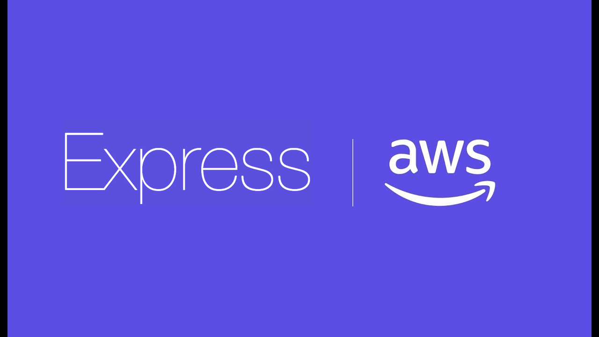
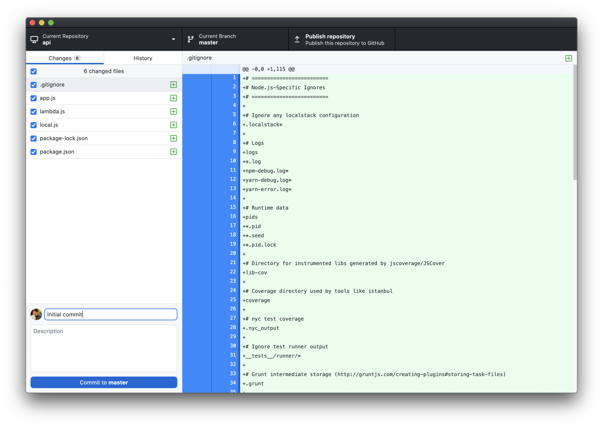
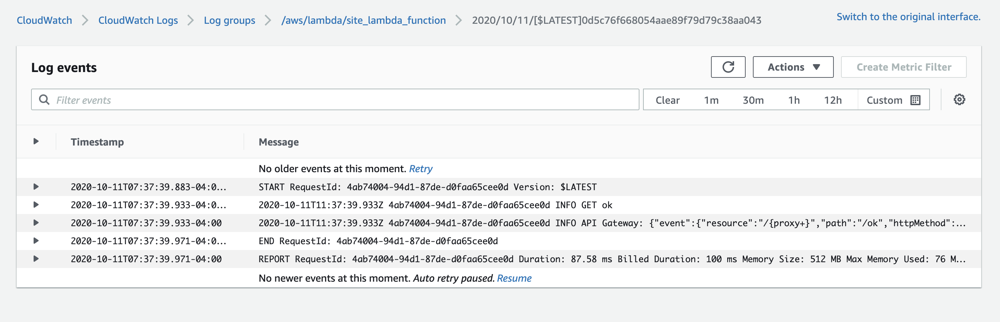

<figure class="fullwidth">

</figure>
<figcaption class="fullwidth">
</figcaption>

**🗺 Exploring - Work in progress**

Using Express to build out your API can be challenging; but integrating it with all of the products available from Amazon Web Services can feel impossible. This post focuses less on best practices for your API and more on reusable patterns to tie all of those products together. This is the second part in a series on building out a scalable website on AWS. In the [first part](/terraform-and-aws) we setup all of the infrastructure we'll need using Terraform.

Our API will be built in JavaScript and will run on AWS Lambda as a function. You might prefer TypeScript (as I do) but for the purposes of this post we'll keep things a little simpler.

## Choosing a framework

Before we even get started we need to decide what framework we'll use to write our AWS Lambda function - if any. Out of the box AWS gives you a `handler` pattern that you can use to receive an incoming web request, perform some actions and return a response. For a web server this is really all we need. In fact, using this simple pattern is actually the recommended best practice.

AWS Lambda is a FaaS (Function as a Service) or "serverless" platform designed to execute discrete "functions" or _handlers_. The expectation is that each route on our website will execute a separate specific function inside Lambda. Each of these routes would be setup individually inside AWS API Gateway and point to their respective AWS Lambda functions. We've setup our API Gateway to send all routes to a single function (`site_api`).

Why would we do this? What are the tradeoffs?

**All routes pointing to a single function**

- When developing your API you want to be able to test it locally
- When deploying you want shared dependencies to be updated simultaneously
- Adding a new route to API Gateway and pointing to a new Lambda function is cumbersome
- Changing API Gateway can be slow
- Our function will have fewer cold-starts

**Many routes pointing to separate functions**

- You might want to restrict deployments for specific parts of the site
- You can change parts of the site without changing everything
- A single mistake won't break the entire site
- Deploying new functions will only cause cold-starts on part of the site
- You want to use Lambda@Edge
- Smaller functions take less time to upload and deploy
- Smaller functions have a shorter cold-start time

In general, how you choose between these trade-offs is dictated by the site and team (and in some cases preferences). If you have a smaller site and smaller team then it is often better to favor simplicity. Choosing **All routes pointing to a single function** simplifies local development and deployment but increases risk by putting everything in one function. For example, if you are the only developer (or there are only a couple developers), then layering strict permissions about who can deploy specific parts of the site is overkill.

What's a cold-start? Even though AWS Lambda runs functions "on-demand" it still needs to load the code in order to execute it. If your code-base is large it will take a long time to load before your function can respond to requests. Because this can be slow, AWS tries to avoid doing it too often and keeps the code in a hot-cache for five minutes after it is loaded. If the function is used again, the timeout is restarted. You should try to avoid cold-starts as much as possible and you should try to minimize their impact as much as possible to keep your site snappy. Keeping all of your routes in a separate functions means that the code that needs to be loaded is smaller (and therefore faster to load). But pointing all of your routes to a single shared function means that the function will be used more frequently and will likely have fewer cold-starts.

As with most things, it depends.

For our API we'll use a single function. This is almost always the simplest and easiest choice especially when getting started. As our site grows we can slowly transition from this model to a hybrid model with multiple functions and ultimately to individual functions for every route if needed.

### Why Express?

Because we're using a single function we'll need to enable that function to handle routing for us (like a traditional web server). There are numerous frameworks that make it easy. [Express](https://expressjs.com/) is a "Fast, unopinionated, minimalist web framework for Node.js". That sounds like what we want. We could choose a smaller framework like Micro from Vercel (used as part of Next.js) - but it is not typically used in serverless environments. We could also choose [Sails.js](https://sailsjs.com/), a much richer MVC framework written in JavaScript. In many cases this is the right choice, but for our purposes we'll use Express as it is easier to explain what is happening.

# Getting started

In the previous post we created a very simple API function:

```js
exports.handler = async (event, context) => {
  console.log('Event: ' + JSON.stringify(event))
  console.log('Context: ' + JSON.stringify(context))

  return {
    statusCode: 200,
    body: JSON.stringify({
      event: event,
      context: context,
    }),
  }
}
```

In the handler we logged information about the event and context and echoed back the result as JSON. You would never want a function like this in a production application, but this allowed us to quickly setup our API Gateway deployment, test AWS Lambda and make sure our logging worked.

To make our API we'll need more code than this. Let's create a new folder called `api`. I usually make this a sibling folder to the `terraform` folder we created previously.

```sh
mkdir api
```

Change to that folder:

```sh
cd api
```

We'll use `npm` to install and manage the packages for our API. Let's set that up now:

```
npm init -y
```

This will generate a default `package.json`:

```json
{
  "name": "api",
  "version": "1.0.0",
  "description": "",
  "main": "index.js",
  "scripts": {
    "test": "echo \"Error: no test specified\" && exit 1"
  },
  "keywords": [],
  "author": "",
  "license": "ISC"
}
```

Next, we'll install express:

```
npm install --save express
```

We'll need a few more packages right away:

```
npm install --save cors body-parser cookie-parser http-errors
```

We'll also need some AWS-specific packages:

```
npm install --save aws-sdk aws-serverless-express
```

## Main application

Even though it is not required, it is common to put the main application logic in a file called `app.js`. Create `app.js` and copy the following:

```js
'use strict'
const express = require('express')
const cookieParser = require('cookie-parser')
const cors = require('cors')
const createError = require('http-errors')
const awsServerlessExpressMiddleware = require('aws-serverless-express/middleware')
const app = express()
const router = express.Router()

// Setup middleware for our API
app.use(express.json())
app.use(express.urlencoded({extended: true}))
app.use(cookieParser())
app.use(cors({credentials: true}))

const isDevelopment = process.env.NODE_ENV === 'development'
if (!isDevelopment) {
  app.use(awsServerlessExpressMiddleware.eventContext())
}

// Add a single route
router.get('/ok', (req, res) => {
  res.json({
    ok: 'ok',
  })
})

// The aws-serverless-express library creates a server and listens on a Unix
// Domain Socket for you, so you don't need the usual call to app.listen.
app.use('/', router)

// Setup 404 and error handler (after middleware)
app.use((_req, _res, next) => {
  next(createError(404))
})

// Error handler (must have all four parameters)
app.use((err, _req, res, _next) => {
  res.locals.message = err.message
  res.locals.error = isDevelopment ? err : {}

  // render the error
  res.status(err.status || 500)
  res.json({error: err.message})
})

// Export your express server so it can be reused depending on how the server is run.
module.exports = app
```

Much of this is boilerplate and looks very similar to the [Express application generator](https://expressjs.com/en/starter/generator.html). There are a few notable differences: for example we are using an AWS specific middleware for reading the event context. Again, the default handler for an AWS Lambda function includes a context associated with the event that triggered it (in our case a request sent to the API Gateway). This context includes useful information like the route, the request headers and AWS specific information such as the currently authenticated AWS Cognito user.

For now we've included a single route that returns a JSON `ok`. We'll be adding more routes soon.[^ping]

[^ping]: Why didn't we use the root route `/` to test things? Unfortunately the way we've setup our API Gateway as a proxy the root route `/` won't work. If you open that route in a browser you'll see `{'message':"Missing Authentication Token"}` regardless of how your Express server is setup. We might have also chosen `/ping` which is commonly used for health checks. Unfortunately this route is also managed by API Gateway and returns the health status of the gateway itself.

## Setting up the Lambda handler function

Notice that we aren't calling `app.listen` in `app.js` as we normally would. When our server is running within AWS lambda, we don't want to listen on a port to receive requests; instead we'll build a custom AWS handler function and pass the request to our Express server directly.

Create a new file called `lambda.js`:

```js
'use strict'
const awsServerlessExpress = require('aws-serverless-express')
const app = require('./app')

// If you are returning non-JSON data such as images, fonts, or PDFs
// add the associated mime types to this list
const binaryMimeTypes = ['application/octet-stream']

const server = awsServerlessExpress.createServer(app, null, binaryMimeTypes)

exports.handler = (event, context) => {
  return awsServerlessExpress.proxy(server, event, context)
}
```

We'll configure our AWS Lambda function to call this handler which will then pass the request to our Express application. Even if we add more routes to our Express application, we won't need to change this simple handler.

# Setting up a local server for development

We've setup our Express app and added a Lambda handler wrapper for it, but it is still difficult for us to test our application locally. We'll need another wrapper for running our application in development mode. Add the following dependencies:

```
npm install --save-dev dotenv nodemon
```

Notice that we're saving these are development dependencies. We won't need these for our Lambda function and we want to keep it as small as possible.

Create a file called `local.js`:

```js
'use strict'
process.env['NODE_ENV'] = 'development'
require('dotenv').config()

const app = require('./app')
const port = process.env['PORT'] || 4000

app.listen(port)
console.log(`Listening on http://localhost:${port}`)
```

Like `lambda.js`, this wrapper is very simple. It loads our configuration from a `.env` file (if it exists) and sets the application to listen on a port (by default, port `4000`).

To use this wrapper, we'll change `package.json` so that the `start` script loads it (and we'll remove the `main` entry and set `private` to `true` even though this isn't necessary at this point):

```json
{
  "name": "api",
  "version": "1.0.0",
  "description": "",
  "private": true,
  "scripts": {
    "test": "echo \"Error: no test specified\" && exit 1",
    "start": "nodemon local.js"
  },
  "keywords": [],
  "author": "",
  "license": "ISC",
  "dependencies": {
    "aws-sdk": "^2.766.0",
    "aws-serverless-express": "^3.3.8",
    "body-parser": "^1.19.0",
    "cookie-parser": "^1.4.5",
    "cors": "^2.8.5",
    "express": "^4.17.1",
    "http-errors": "^1.8.0"
  },
  "devDependencies": {
    "dotenv": "^8.2.0",
    "nodemon": "^2.0.4"
  }
}
```

Notice that we execute `local.js` using `nodemon`. [Nodemon](https://nodemon.io/) will watch our project folder for changes and reload and restart our server automatically.

You can start the server by running:

```
npm start
```

You should see:

```
[nodemon] 2.0.4
[nodemon] to restart at any time, enter `rs`
[nodemon] watching path(s): *.*
[nodemon] watching extensions: js,mjs,json
[nodemon] starting `node local.js`
Listening on http://localhost:4000
```

If you open http://localhost:4000 you should see:

```json
{"ok": "ok"}
```

Not very exciting content, but this is our first JSON API response!

# Save our progress

We'll want to use version control to keep track of our changes. We'll use `git`:

```
git init
```

## Ignore some things

Let's make sure to ignore our environment variables (which may include sensitive secrets) and some of the files we've generated. Create a `.gitignore` file:

```gitignore
# =========================
# Node.js-Specific Ignores
# =========================

# Ignore any localstack configuration
.localstack*

# Logs
logs
*.log
npm-debug.log*
yarn-debug.log*
yarn-error.log*

# Runtime data
pids
*.pid
*.seed
*.pid.lock

# Directory for instrumented libs generated by jscoverage/JSCover
lib-cov

# Coverage directory used by tools like istanbul
coverage

# nyc test coverage
.nyc_output

# Ignore test runner output
__tests__/runner/*

# Grunt intermediate storage (http://gruntjs.com/creating-plugins#storing-task-files)
.grunt

# Bower dependency directory (https://bower.io/)
bower_components

# node-waf configuration
.lock-wscript

# Compiled binary addons (https://nodejs.org/api/addons.html)
build/Release

# Dependency directories
node_modules/
jspm_packages/

# Typescript v1 declaration files
typings/

# Optional npm cache directory
.npm

# Optional eslint cache
.eslintcache

# Optional REPL history
.node_repl_history

# Output of 'npm pack'
*.tgz

# Yarn Integrity file
.yarn-integrity

# dotenv environment variables file
.env

# =========================
# Operating System Files
# =========================

# OSX
# =========================

.DS_Store
.AppleDouble
.LSOverride

# Thumbnails
._*

# Files that might appear on external disk
.Spotlight-V100
.Trashes

# Directories potentially created on remote AFP share
.AppleDB
.AppleDesktop
Network Trash Folder
Temporary Items
.apdisk

# Windows
# =========================

# Windows image file caches
Thumbs.db
ehthumbs.db

# Folder config file
Desktop.ini

# Recycle Bin used on file shares
$RECYCLE.BIN/

# Windows Installer files
*.cab
*.msi
*.msm
*.msp

# Windows shortcuts
*.lnk
```

## Commit

To add all of the files and commit them to the repository we'll use GitHub Desktop:



# Deploying

We'll use the `terrform` setup from the [previous post](./terraform-and-aws) to deploy our Express application to AWS Lambda. To do this we'll need to do the following:

- Install only the production dependencies
- Build and compress the release and copy them to the `terraform` folder
- Use terraform to deploy our changes

## Install only the production dependencies

While working locally, we've been using some development packages. These aren't needed for our production application so we'll want to remove them (to make our build smaller and startup time faster). If you're running your server locally, stop it (use `Ctrl+C`).

Next, let's prune the dependencies to only production packages:

```
npm prune --production
```

## Build and compress the release

We'll need to package all of the files into a release for deployment. There are a few ways to do this, each with tradeoffs. To start, we'll simply compress all of the source code and dependencies into a single zip file. This is far less efficient and will include many files our production application won't need - but it will make the process simpler and easier to debug.

Add the `zip` script to your `package.json`:

```json
  ...
  "scripts": {
    "test": "echo \"Error: no test specified\" && exit 1",
    "start": "nodemon local.js",
    "zip": "zip -r ../terraform/api.zip *.js package* node_modules"
  },
  ...
```

This creates a file called `api.zip` in the terraform folder. If you've named your folders differently (or put them in different locations) you may need to change this.

Run the command:

```
npm run zip
```

The zip file is created but it is very large: `8.0M`. We'll want to make this smaller. Re-install your development dependencies:

```
npm install
```

Instead of including everything, we should build our release using a tool like [Webpack](https://webpack.js.org/). Webpack allows you to transpile and minify your source code into a single JavaScript file; bundling all of the dependencies in the most efficient way. It will also save the hassle of pruning and re-installing dependencies. Let's install it:

```
npm install --save-dev webpack webpack-cli
```

Next, we'll want to create a configuration for Webpack. For now, we'll focus only on the production build that we plan to upload to AWS. Create a file called `webpack.config.js`:

```js
const path = require('path')

module.exports = {
  entry: './lambda.js',
  output: {
    library: 'api',
    libraryTarget: 'umd',
    umdNamedDefine: true,
    path: path.resolve(__dirname, 'dist'),
    filename: 'api.js',
  },
  target: 'node',
  mode: 'production',
}
```

This configuration tells Webpack to start with `lambda.js` and export a bundled release called `dist/api.js` which will be used as an API and has a _Universal Module Declaration_ (our exported `handler` function). We've set our target to `node` meaning we plan to run the generated file using Node (we don't plan to run it in a browser).

To run `webpack` we need to add another script to our `package.json`:

```json{6}
  ...
  "scripts": {
    "test": "echo \"Error: no test specified\" && exit 1",
    "start": "nodemon local.js",
    "zip": "zip -r ../terraform/api.zip *.js package* node_modules",
    "build": "webpack"
  },
  ...
```

Run it:

```
npm run build
```

You should see:

```
Hash: a7e54e4024a114c3a6fd
Version: webpack 4.44.2
Time: 559ms
Built at: 10/07/2020 5:05:04 PM
 Asset     Size  Chunks             Chunk Names
api.js  581 KiB       0  [emitted]  main
Entrypoint main = api.js
  [2] external "path" 42 bytes {0} [built]
  [7] external "fs" 42 bytes {0} [built]
  [9] external "buffer" 42 bytes {0} [built]
 [10] external "http" 42 bytes {0} [built]
 [12] external "util" 42 bytes {0} [built]
 [13] external "stream" 42 bytes {0} [built]
 [23] external "url" 42 bytes {0} [built]
 [32] external "events" 42 bytes {0} [built]
 [35] external "net" 42 bytes {0} [built]
 [42] external "querystring" 42 bytes {0} [built]
 [49] external "crypto" 42 bytes {0} [built]
 [56] ./lambda.js 455 bytes {0} [built]
 [63] ./app.js 1.33 KiB {0} [built]
 [75] external "tty" 42 bytes {0} [built]
[109] ./node_modules/express/lib sync 160 bytes {0} [built]
    + 123 hidden modules

WARNING in ./node_modules/express/lib/view.js 81:13-25
Critical dependency: the request of a dependency is an expression
 @ ./node_modules/express/lib/application.js
 @ ./node_modules/express/lib/express.js
 @ ./node_modules/express/index.js
 @ ./app.js
 @ ./lambda.js
```

The compiled size is now `581 KiB`! That is much smaller than `8 MB`. Unfortunately, you may also see a `Critical Dependency` warning[^critical-dependency]. Why are we getting this warning? Express loads its view engines using a dynamic require:

```
var fn = require(mod).__express
```

[^critical-dependency]: More information about this error can be found [on GitHub](https://github.com/webpack/webpack/issues/1576#issuecomment-475118999).

Webpack isn't sure how to handle this; but luckily we don't really care because we're not using any view engines. Because of this we can just ignore the warning. If, like me, this bothers you then there are a few options:

1. Exclude all `nodeExternals` - this will prevent Webpack from bundling any of the `node_modules` in our build
2. Exclude `express` - this will prevent Webpack from bundling the `express` package in our build
3. Silence the warning

The first option makes the build incredibly small (less than `1 Kib`), but unfortunately doesn't work at all. Because we're running on AWS Lambda we need the node modules to be bundled. This also means option 2 won't work. Our only option is to silence the warning. Change `webpack.config.js`:

```js
const path = require('path')

module.exports = {
  entry: './lambda.js',
  output: {
    library: 'api',
    libraryTarget: 'umd',
    umdNamedDefine: true,
    path: path.resolve(__dirname, 'dist'),
    filename: 'api.js',
  },
  target: 'node',
  mode: 'production',
  stats: {
    warningsFilter: warning => {
      return RegExp('node_modules/express/lib/view.js').test(warning)
    },
  },
}
```

Let's change our `zip` script in `package.json` to use this new file. Also, we'll add a new `release` script that combines the `build` and `zip` scripts:

```
  ...
  "scripts": {
    "test": "echo \"Error: no test specified\" && exit 1",
    "start": "nodemon local.js",
    "zip": "cd dist; zip -r ../../terraform/api.zip api.js",
    "build": "webpack",
    "release": "npm run build && npm run zip"
  },
  ...
```

Run the `release`:

```
npm run release
```

Our compressed `api.zip` is only `235 KiB`.

## Use terraform to deploy our changes

Now that we have prepared the release we should be able to apply our changes using `terraform`. Check the plan:

```
terraform plan
```

You should see the modified hash of the source code:

```
...
 ~ source_code_hash = "PM7qAOa3MhcDW7/4fxKHxkSe5c6c3DyElx5iTGb8bPY=" -> "APdymEzpkA8Gm1BqKtSRnr/4O5Xl0gZBJHknkbA4LYE="
...
```

Apply the changes:

```
terraform apply
```

And answer `yes`. Once complete, open your API in a browser: https://api.example.com/ok (replacing `example` with your domain name). You should see:

```json
{"ok": "ok"}
```

## Invoking the function directly

We could also invoke our function directly (without opening a browser and sending a request through the API Gateway). We can do this using the `aws-cli`. Run the following (changing the `profile` name `example` to the name of your `aws-cli` profile)[^cli-binary-format]:

```
aws lambda invoke \
  --profile example \
  --cli-binary-format raw-in-base64-out \
  --function-name site_lambda_function \
  --payload '{
    "resource": "/{proxy+}",
    "path": "/ok",
    "httpMethod": "GET",
    "body": "{\"\"}",
    "headers": "{\"content-type\":\"application/json; charset=UTF-8\"}"
  }' /dev/stdout
```

You should see:

```
{"statusCode":200,"body":"{\"ok\":\"ok\"}","headers":{"x-powered-by":"Express","access-control-allow-origin":"*","access-control-allow-credentials":"true","content-type":"application/json; charset=utf-8","content-length":"11","etag":"W/\"b-2F/2BWc0KYbtLqL5U2Kv5B6uQUQ\"","date":"Thu, 08 Oct 2020 03:25:{4 GMT","connection":"close"},"isBase64Encoded":false}
    "StatusCode": 200,
    "ExecutedVersion": "$LATEST"
}
```

This is really helpful when debugging API Gateway configuration and request payload problems.

[^cli-binary-format]:

  It's easy to forget to add the `cli-binary-format` parameter. If you leave it off you'll see an error: "An error occurred (InvalidRequestContentException) when calling the Invoke operation: Could not parse request body into json: Unexpected character ('­' (code 173)): expected a valid value (number, String, array, object, 'true', 'false' or 'null')
  at [Source: (byte[])"��(������/�j��Hm���Dۡܡy�^��(�ק�ܩy �i�'�\*'�;(��Z�ǭQ1|"; line: 1, column: 2]". You can make this parameter the default in your `~/.aws/config`. For more information, see the [AWS documentation](https://docs.aws.amazon.com/cli/latest/userguide/cliv2-migration.html#cliv2-migration-binaryparam).

If you want to view the Lambda function on AWS itself, you should be able to log in and go to https://console.aws.amazon.com/lambda/home?region=us-east-1#/functions/site_lambda_function?tab=configuration. From here you can quickly get to the CloudWatch logs to see any information you've logged. Let's change our `ok` route and have it log some information:

```js
router.get('/ok', (req, res) => {
  console.log('GET ok')
  console.log('API Gateway: ' + JSON.stringify(req.apiGateway))

  res.json({
    ok: 'ok',
  })
})
```

Save the change and create a new release:

```
npm run release
```

Next, we'll need to deploy the change using Terraform. Let's add a `deploy` script to our `package.json`:

```
  "scripts": {
    "test": "echo \"Error: no test specified\" && exit 1",
    "start": "nodemon local.js",
    "zip": "cd dist; zip -r ../../terraform/api.zip api.js",
    "build": "webpack",
    "release": "npm run build && npm run zip",
    "deploy": "cd ../terraform; terraform apply --auto-approve" //highlight-line
  },
```

Now run:

```
npm run deploy
```

You should see Terraform run. Go to your `ok` route in a browser again; wait a few seconds and then open the CloudWatch logs by clicking the `View logs in CloudWatch` button (or, if you've closely followed my setup: [here](https://console.aws.amazon.com/cloudwatch/home?region=us-east-1#logsV2:log-groups/log-group/$252Faws$252Flambda$252Fsite_lambda_function)).



# Working with authenticated requests

Looking closely at the logs you might have noticed the `requestContext` node in the `apiGateway` object that was logged:

```json
        ...
        "requestContext": {
            "resourceId": "9df9s7",
            "resourcePath": "/{proxy+}",
            "httpMethod": "GET",
            "extendedRequestId": "p9d45s2gIAMD9yg=",
            "requestTime": "11/Oct/2020:11:37:39 +0000",
            "path": "/ok",
            "accountId": "15635678299",
            "protocol": "HTTP/1.1",
            "stage": "production",
            "domainPrefix": "api",
            "requestTimeEpoch": 1602416259517,
            "requestId": "629ceff-03d3-4939-b008-a9920072979e",
            "identity": {
                "cognitoIdentityPoolId": null,
                "accountId": null,
                "cognitoIdentityId": null,
                "caller": null,
                "sourceIp": "111.222.333.444",
                "principalOrgId": null,
                "accessKey": null,
                "cognitoAuthenticationType": null,
                "cognitoAuthenticationProvider": null,
                "userArn": null,
                "userAgent": "Mozilla/5.0 (Macintosh; Intel Mac OS X 10_15_6) AppleWebKit/537.36 (KHTML, like Gecko) Chrome/85.0.4183.121 Safari/537.36",
                "user": null
            },
            "domainName": "api.example.com",
            "apiId": "9sa8ucem6g"
        },
        ...
```

The `requestContext` has a lot of useful information but most importantly it has an `identity` node representing the user's AWS Cognito identity. In this case everything is `null`. That's because we didn't include any information about our identity pool when making the request.

More coming...

# Storing and retrieving items from the database

# Sending email

# Working locally

# Testing
