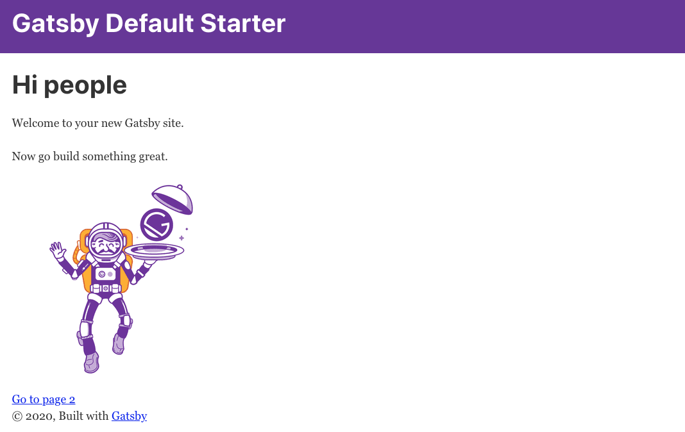
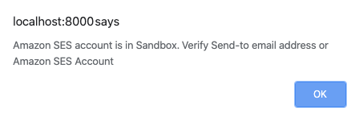
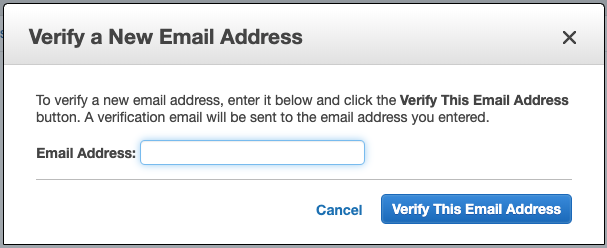
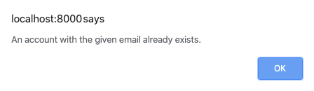

<figure class="fullwidth">

</figure>
<figcaption class="fullwidth">
Image credit: <a href="https://terraform.io" rel="noopener noreferrer">Hashicorp's Terraform</a>
</figcaption>

# Site

We've completed the setup for our AWS infrastructure; but at this point we don't really have a website. As we said earlier, we'll use Gatsby to make the primary website. It will be deployed to our S3 bucket, leverage Cognito for authentication and authorization and interact with our API hosted on Lambda.

In a larger company your website might be split across various repositories with varying developer permissions. To keep things simpler, we'll create a single repository and follow the [Gatsby Quick Start Guide](https://www.gatsbyjs.org/docs/quick-start/).[^gatsby]

[^gatsby]: Actually, when making a Gatsby site, I usually follow [my own blog](../gatsby-with-typescript) and build everything in TypeScript. Again, we'll stick to a more vanilla Gatsby site for the purposes of this post.

Install the Gatsby client (globally):

```bash
npm install -g gatsby-cli
```

Make sure you are **not** in the `terraform` folder when generating your Gatsby site; we'll want everything to be kept separately. We'll setup the projects as follows:

```bash
gatsby new site
```

This should generate a new folder with a default Gatsby site:

```bash
cd site
```

Within the `site` folder you can start the server:

```bash
gatsby develop
```

At this point you should have a basic Gatsby website running on http://localhost:8000.



With this in place we can:

- Let users signup
- Handle email verification
- Let users login
- Allow password resets
- Let users logout
- Create an account page

Before we can do that, however, we'll need a foundation.

## Configuring Amplify

You can communicate Amazon Web Services by writing all of the requests and responses manually. This offers you a lot of control but at the cost of complexity. [AWS Amplify](https://aws.amazon.com/amplify/https://aws.amazon.com/amplify/) hides most of that complexity. Because of this we'll use it here; even though it is overkill. Install the package (from within the `site` folder):

```bash
npm install --save-dev aws-amplify
```

Next we'll need to setup the AWS configuration. Create a new folder called `src/util`:

```bash
mkdir src/util
```

Within the `util` folder create a new file called `aws-config.js`:

```js
import Amplify, {Auth} from 'aws-amplify'

const isBrowser = typeof window !== `undefined`

if (isBrowser) {
  try {
    Amplify.configure({
      Auth: {
        mandatorySignIn: true,
        region: 'YOUR_REGION',
        identityPoolId: 'YOUR_IDENTITY_POOL_ID',
        userPoolId: 'YOUR_USER_POOL_ID',
        userPoolWebClientId: 'YOUR_USER_POOL_WEB_CLIENT_ID',
      },
    })
  } catch (err) {
    console.error(err)
  }
}
```

This is where we connect the dots. You'll need to replace the above values with your specific identifiers. By default our region was `us-east-1` (though you may have chosen an alternate region). Luckily, we added the rest of the values as outputs. Back in your `terraform` folder run:

```bash
terraform output
```

With the values replaced, we're ready to use the configuration. So far, we're focusing only on the authentication. There is great documentation detailing all of the options at https://aws-amplify.github.io/docs/js/authentication.

## Hooks

Gatsby is based on React. When working with global state (such as authentication) there are several strategies for providing the state to all components: passing down `props`, using `redux`, and by leveraging `hooks`. We'll create a hook. Within the `src/util` folder create a new file called `use-auth.js`:

```js
import React, {useState, useEffect, useContext, createContext} from 'react'
import {Auth} from 'aws-amplify'
import './aws-config'

// We can't use auth when generating the static parts of the website
const isBrowser = typeof window !== `undefined`

// Create a context that we can provide and use
const authContext = createContext()

export const useAuth = () => {
  return useContext(authContext)
}

export const ProvideAuth = ({children}) => {
  const auth = useAuthEffect()
  return <authContext.Provider value={auth}>{children}</authContext.Provider>
}

const useAuthEffect = () => {
  const [isAuthenticating, setIsAuthenticating] = useState(true)
  const [isAuthenticated, setIsAuthenticated] = useState(false)
  const [user, setUser] = useState(null)

  useEffect(() => {
    if (!isBrowser) return

    try {
      // Check for a current valid session in the session storage
      Auth.currentSession()
        .then(cognitoUserSession => {
          setUser(cognitoUserSession)
          setIsAuthenticated(true)
          setIsAuthenticating(false)
        })
        .catch(error => {
          // "No current user" is expected when auth is missing or expired
          if (error !== 'No current user') {
            console.error({error})
          }
          setUser(null)
          setIsAuthenticating(false)
        })
    } catch (error) {
      console.error({error})
    }
  }, [])

  return {
    user,
    isAuthenticated,
    isAuthenticating,
  }
}
```

Hooks can be confusing and this one is no exception. Let's break it down.

We start of by importing the configuration we just created (along with some React and Amplify specific objects). Then we check to see if the current process is running in a browser. Gatsby is intended for client-side interactions but is built and deployed statically from the terminal. When we deploy our website it will attempt to generate a static copy all of the pages to make the initial loading faster. No users will be logged in when building (in fact Amplify isn't even available); so we skip it.

Next we create a context (which is shared) and export a hook called `useAuth` and a provider component called `ProvideAuth`. The provider will eventually provide helpful methods but for the moment only checks to see if there is a current session. It does this by using the `Auth` singleton from Amplify which checks for session values in the browser's local storage. No users have ever signed in (or even signed up) so at this point the user will always be `null`.

We'll be adding more to this hook but this should be enough to get started.

By default, we want to use the provider globally. Open `gatsby-browser.js` and replace the contents:

```js
import React from 'react'
import {ProvideAuth} from './src/util/use-auth'

export const wrapRootElement = ({element}) => {
  return <ProvideAuth>{element}</ProvideAuth>
}
```

We wrap the root element with our new `ProvideAuth` component. By doing this, our context will be initialized with our root element and won't be reinitialized do to changing state or re-renders.

> If you haven't used `useState` or `useEffect` before, I highly recommend the deep dive on Overreacted: https://overreacted.io/a-complete-guide-to-useeffect/

## Signup page

We've added a lot but if you refresh the browser you shouldn't see anything change. Let's add a signup page so that users can create accounts. To start, we'll add a link to the signup page in the header; we won't show the link if you are already logged in.

Replace `src/components/header.js` with:

```jsx
import {Link} from 'gatsby'
import PropTypes from 'prop-types'
import React from 'react'
import {useAuth} from '../util/use-auth.js'

const Header = ({siteTitle}) => {
  // When not rendering in a browser useAuth() will return null
  const auth = useAuth() || {}

  return (
    <header
      style={{
        background: `rebeccapurple`,
        marginBottom: `1.45rem`,
      }}>
      <div
        style={{
          margin: `0 auto`,
          maxWidth: 960,
          padding: `1.45rem 1.0875rem`,
        }}>
        <h1 style={{margin: 0}}>
          <Link
            to="/"
            style={{
              color: `white`,
              textDecoration: `none`,
            }}>
            {siteTitle}
          </Link>
        </h1>
        <div style={{color: `white`}}>
          {auth.user ? (
            <div>
              <span>You are logged in</span>
            </div>
          ) : (
            <>
              <div>You are not logged in</div>
              <div>
                Don't have an account?{' '}
                <Link to="/signup" style={{color: `white`}}>
                  Signup
                </Link>
              </div>
            </>
          )}
        </div>
      </div>
    </header>
  )
}

Header.propTypes = {
  siteTitle: PropTypes.string,
}

Header.defaultProps = {
  siteTitle: ``,
}

export default Header
```

Let's break this down. We've added an import for our new hook:

```js
import {useAuth} from '../util/use-auth.js'
```

And then called it in the `Header` function (because we added another line to the `Header` function, we had to convert the function to use `{` and `}` instead of defaulting the returned JSX):

```js
// When not rendering in a browser useAuth() will return null
const auth = useAuth() || {}
```

With this in place we can check for a currently authenticated user and show the link to Signup if no user is present:

```jsx
<div style={{color: `white`}}>
  {auth.user ? (
    <div>
      <span>You are logged in</span>
    </div>
  ) : (
    <>
      <div>You are not logged in</div>
      <div>
        Don't have an account?{' '}
        <Link to="/signup" style={{color: `white`}}>
          Signup
        </Link>
      </div>.
    </>
  )}
</div>
```

We're linking to a `signup` page that doesn't exist yet. Let's make that next; create `src/pages/signup.js`:

```jsx
import React, {useState} from 'react'
import {Link} from 'gatsby'

import Layout from '../components/layout'
import SEO from '../components/seo'

import {useAuth} from '../util/use-auth.js'

const Signup = () => {
  const [email, setEmail] = useState('')
  const [password, setPassword] = useState('')
  const [confirmPassword, setConfirmPassword] = useState('')
  const [confirmationCode, setConfirmationCode] = useState('')
  const [isLoading, setIsLoading] = useState(false)

  const auth = useAuth() || {}

  const validateForm = () => {
    return email.length > 0 && password.length > 0 && password === confirmPassword
  }

  const validateConfirmationForm = () => {
    return confirmationCode.length > 0
  }

  const handleSubmit = async event => {
    event.preventDefault()
    setIsLoading(true)
    try {
      await auth.signUp(email, password)
    } catch (error) {
      alert(error.message)
      console.error(error)
    }
    setIsLoading(false)
  }

  const handleConfirmationSubmit = async event => {
    event.preventDefault()
    setIsLoading(true)
    try {
      await auth.confirmSignUp(confirmationCode, email, password)
    } catch (error) {
      alert(error.message)
      console.error(error)
    }
    setIsLoading(false)
  }

  return (
    <Layout>
      <SEO title="Signup" />
      <div className="Signup">
        {auth.user ? (
          <form onSubmit={handleConfirmationSubmit}>
            <div>
              <label>Confirmation Code</label>
              <br />
              <input type="tel" value={confirmationCode} onChange={e => setConfirmationCode(e.target.value)} />
              <br />
              <div>Check your email for your confirmation code.</div>
            </div>
            <br />
            <div>
              <button disabled={!validateConfirmationForm() || isLoading}>
                {isLoading ? 'Confirming...' : 'Confirm'}
              </button>
            </div>
          </form>
        ) : (
          <form onSubmit={handleSubmit}>
            <div>
              <label>Email</label>
              <br />
              <input type="email" value={email} onChange={e => setEmail(e.target.value)} />
            </div>
            <div>
              <label>Password</label>
              <br />
              <input type="password" value={password} onChange={e => setPassword(e.target.value)} />
            </div>
            <div>
              <label>Confirm Password</label>
              <br />
              <input type="password" value={confirmPassword} onChange={e => setConfirmPassword(e.target.value)} />
            </div>
            <br />
            <div>
              <button disabled={!validateForm() || isLoading}>{isLoading ? 'Submitting...' : 'Signup'}</button>
            </div>
          </form>
        )}
      </div>

      <Link to="/">Go back to the homepage</Link>
    </Layout>
  )
}

export default Signup
```

If you get a Sandbox Error when signing up it means that your sending limit request hasn't been approved.



You can find details about the limit increase request in the [support section](https://console.aws.amazon.com/support) in AWS console. For now you can simply verify your own email address and use it for testing. Go to the [SES console](https://console.aws.amazon.com/ses) and click on **Email Addresses** in the sidebar. Then click the **Verify a New Email Address** button:



Enter your email address, wait for the confirmation and confirm it.

If you see an error that `An account with the given email already exists`:



Then you may have already registered the user. You have three options:

1. Use a different email address (you might have to verify another email in the SES console)
2. Delete the user (either through the terminal or through the Cognito User Pool console)
3. Use the `+` trick.[^plus]

[^plus]: When registering for an account using your email address, most websites treat `name@example.com` and `name+anything@example.com` as completely different email addresses. Luckily, most email providers ignore everything after the `+` when receiving email. This means you can create multiple accounts for the same email address.

## Login page

## Password reset page

## Logout link

## Account page

# Bonus: Stripe

# Bonus: Uploads
