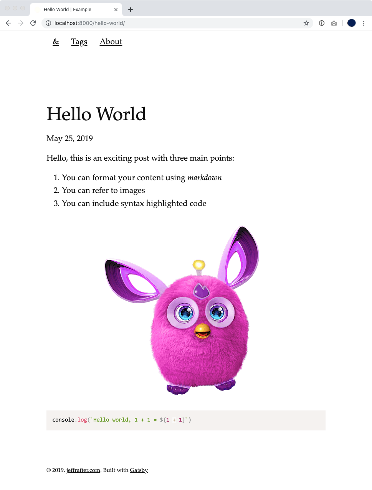

Creating a static website involves an almost infinite set of choices. Amongst the plethora of
choices you'll find Gatsby – a static site framework based on `React`, `JSX`, `CSS-in-JS` and
many other modern approaches. Gatsby is, in many ways, the JavaScript successor to
[Jekyll](https://jekyllrb.com/). I've upgraded several sites to Gatsby (including this one) finding
a way to integrate TypeScript as part of the journey.

Before you read this it is important to point out: you should start with a template. In this post I
am going to work through all of the steps and try to explain them along the way. Included
in this post are some of the reasons behind why I've chosen one particular plugin or skipped
another. Often – especially when you choose a default Gatsby starter – it is difficult to understand
how all of the pieces fit together, or how you might build your own starter template. Hopefully
this post provides some helpful examples.

Also: the Gatsby [documentation](https://www.gatsbyjs.org/docs/) is extremely good. There is a
fantastic [tutorial](https://www.gatsbyjs.org/tutorial/), [quick start](https://www.gatsbyjs.org/docs/quick-start) and some recipes. I've relied on those and a host of other blogs when working on this
post.

In order to follow this, you'll need access to a terminal (or console) and you'll need Node, Node Version Manager, and git installed.

# Getting started

First you want to create a folder for your project:

```bash
mkdir example
cd example
```

We'll be using Gatsby which is a toolkit that is written in TypeScript and requires Node. If you have multiple local projects you might run into a conflict about which Node version should be used. Node Version Manager solves this problem. To control which version of Node should be used in your project, add an `.nvmrc`[^dotfiles] file:

```json
10.16.0
```

The file is pretty simple; just the version. At the time you read this there may be a newer version of Node. You can check https://nodejs.org.

[^dotfiles]:

  Notice that the `.nvmrc` file starts with a "`.`" (period). By default on most systems this creates a hidden file. Oftentimes general project config is hidden away. On MacOS you can show hidden files in Finder by running `defaults write com.apple.finder AppleShowAllFiles -bool true` and restarting Finder. If you want to list hidden files in your console use the `-a` parameter: `ls -a`.

## Ignore some things

We plan to use `git` to keep track of our changes. As we work on our project locally, there will be a lot of files we won't want to keep track of; we'll want to ignore them. To do this we'll create a new file called `.gitignore` [^gitignore]. These files can be very short and specific, or they can be very long and general. We'll use a more generic one that will work on different kinds of computers. If you are looking for an example `.gitignore` you can check out https://github.com/github/gitignore. For now, just copy the following:

```.gitignore
# =========================
# Node.js-Specific Ignores
# =========================

# Build directory
public/

# Gatsby cache
.cache/

# Logs
logs
*.log
npm-debug.log*
yarn-debug.log*
yarn-error.log*

# Runtime data
pids
*.pid
*.seed
*.pid.lock

# Directory for instrumented libs generated by jscoverage/JSCover
lib-cov

# Coverage directory used by tools like istanbul
coverage

# nyc test coverage
.nyc_output

# Grunt intermediate storage (http://gruntjs.com/creating-plugins#storing-task-files)
.grunt

# Bower dependency directory (https://bower.io/)
bower_components

# node-waf configuration
.lock-wscript

# Compiled binary addons (http://nodejs.org/api/addons.html)
build/Release

# Dependency directories
node_modules/
jspm_packages/

# Typescript v1 declaration files
typings/

# Optional npm cache directory
.npm

# Optional eslint cache
.eslintcache

# Optional REPL history
.node_repl_history

# Output of 'npm pack'
*.tgz

# Yarn Integrity file
.yarn-integrity

# dotenv environment variables file
.env

# =========================
# Operating System Files
# =========================

# OSX
# =========================

.DS_Store
.AppleDouble
.LSOverride

# Thumbnails
._*

# Files that might appear on external disk
.Spotlight-V100
.Trashes

# Directories potentially created on remote AFP share
.AppleDB
.AppleDesktop
Network Trash Folder
Temporary Items
.apdisk

# Windows
# =========================

# Windows image file caches
Thumbs.db
ehthumbs.db

# Folder config file
Desktop.ini

# Recycle Bin used on file shares
$RECYCLE.BIN/

# Windows Installer files
*.cab
*.msi
*.msm
*.msp

# Windows shortcuts
*.lnk
```

[^gitignore]: `.gitignore` also starts with a "`.`" and you can start to see a pattern emerge.

### Configure your editor

> **Note**: this is completely optional. This is here mostly so I can copy and paste the configuration for myself. 🎡

If there are several people working on your project, the chances are high that they use different editors for their code. At the very least their settings might not be consistent. You can provide hints to their editors. This can be done by includig a generic `.editorconfig` file (based on the format from https://editorconfig.org):

```bash
root = true

[*]
indent_style = space
indent_size = 2
charset = utf-8
trim_trailing_whitespace = true
insert_final_newline = true
```

Depending on the editor this may or may not be used. Not to worry, we'll add `prettier` later which will ensure that the code is consistent. One final note: you might be using [VSCode](https://code.visualstudio.com/). In that case you can add some additional configuration. To do that you can create a `.vscode` folder with the settings for your project.

Create the folder:

```bash
mkdir .vscode
```

And in that folder make `settings.json`

```json
{
  "editor.tabSize": 2,
  "editor.insertSpaces": true,
  "editor.renderWhitespace": "boundary",
  "editor.rulers": [100],
  "editor.formatOnSave": true,
  "files.encoding": "utf8",
  "files.trimTrailingWhitespace": true,
  "files.insertFinalNewline": true,
  "prettier.eslintIntegration": true,
  "prettier.requireConfig": false,
  "typescript.tsdk": "node_modules/typescript/lib",
  "search.exclude": {
    "public/**": true,
    "node_modules/**": true
  }
}
```

## Keeping things clean

People have different preferences when they edit code. Some prefer tabs over spaces. Some want
two spaces instead of four. Some prefer semicolons and some don't. It shouldn't matter right?
Actually it does. If editors are autoformatting code based on user preferences, it is important
to make sure everyone has chosen the same set of defaults. This makes it easy to tell what changed
between versions – even when different developers (with different preferences) have made changes.

### Prettier & `.prettierrc`

Prettier works to autoformat your code based on a shared configuration. To do this, create
a `.prettierrc` file:

```json
{
  "tabWidth": 2,
  "singleQuote": true,
  "trailingComma": "all",
  "bracketSpacing": false,
  "jsxBracketSameLine": true,
  "printWidth": 100,
  "semi": false
}
```

You might have different preferences in your project. That's fine, so long as all of the developers
on your website agree.

### `tslint`

Because we'll be using typescript, we'll want to use TSlint[^tslint]. "Linting" is very similar to using
prettier and in fact the two toolkits work together.

[^tslint]:

  `tslint` is related to `eslint` or EcmaScript linter. In fact, you could use `eslint` instead of
  `tslint`. When only focusing on TypeScript I've found `tslint` slightly easier to configure.

To configure `tslint`, create a new file called `tslint.config`:

```json
{
  "compilerOptions": {
    "module": "commonjs",
    "target": "esnext",
    "jsx": "preserve",
    "lib": ["dom", "es2015", "es2017"],
    "strict": true,
    "noEmit": true,
    "isolatedModules": true,
    "esModuleInterop": true,
    "skipLibCheck": true,
    "noUnusedLocals": true,
    "noUnusedParameters": true,
    "removeComments": false,
    "preserveConstEnums": true
  },
  "include": ["./src/**/*"]
}
```

Because we'll be using it with prettier we will also want to create a `tslint.json` file:

```json
{
  "rulesDirectory": ["tslint-plugin-prettier"],
  "extends": ["tslint-config-blvd/react", "tslint-config-prettier"],
  "rules": {
    "prettier": true
  }
}
```

## Save your progress using version control

At this point we really haven't made anything (except a lot of configuration). Even though our website isn't even a website yet – it still makes sense to save our work. If we make a mistake having our code saved will help us. To do this we'll use `git` - a version control software that lets us create commits or _versions_ as we go. To initialize a `git` repository run:

```bash
git init
```

By default this creates an empty git repository (none of our files have been added to it). Generally, I use [GitHub Desktop](https://desktop.github.com/)[^microcommits]; however, I'll use the command line here.

[^microcommits]:

  It might surprise you but some of the top coders at GitHub including [cheshire137](https://github.com/cheshire137) use GitHub Desktop and micro-commit; that is, they make lots of very small commits for every change they make.

You can check the status of your changes and repository:

```bash
git status
```

You should see:

```bash
On branch master

No commits yet

Untracked files:
  (use "git add <file>..." to include in what will be committed)

	.editorconfig
	.gitignore
	.nvmrc
	.prettierrc
	.vscode/
	tslint.config
	tslint.json

nothing added to commit but untracked files present (use "git add" to track)
```

Let's get ready to create a commit by adding all of the files:

```bash
git add .
```

Here the `.` means: "everything in the current folder". But what are we adding it to? We are adding it to the commit _stage_. Let's check the status again:

```bash
git status
```

You should see:

```bash
On branch master

No commits yet

Changes to be committed:
  (use "git rm --cached <file>..." to unstage)

	new file:   .editorconfig
	new file:   .gitignore
	new file:   .nvmrc
	new file:   .prettierrc
	new file:   .vscode/settings.json
	new file:   tslint.config
	new file:   tslint.json
```

We're getting ready to add four new files to our repository. Let's commit:

```bash
git commit -m "Initial commit with configuration"
```

This creates a commit with the message we specified. The commit acts like a save point. If we add or delete files or change something and make a mistake, we can always revert back to this point. We'll continue to commit as we make changes.

## Packages & Dependencies

For almost any Node project you'll find that you use a lot of packages – you'll have far more code in packages in your `node_modules` folder (where package code is stored) than your main project.[^node-modules]

[^node-modules]:

  In fact the size of the `node_modules` folder has become a meme: 

Initialize your packages:

```bash
npm init -y
```

Now you have a `package.json`:

```json
{
  "name": "blog",
  "version": "1.0.0",
  "description": "",
  "main": "index.js",
  "scripts": {
    "test": "echo \"Error: no test specified\" && exit 1"
  },
  "keywords": [],
  "author": "",
  "license": "ISC"
}
```

Let's simplify it a bit:

```json
{
  "private": true,
  "scripts": {
    "build": "gatsby build",
    "deploy": "gatsby build --prefix-paths",
    "dev": "gatsby develop"
  },
  "license": "ISC"
}
```

We'll start off by installing packages for Gatsby. There are a lot of options and this list contains
my own opinions:

```bash
npm install \
  gatsby \
  gatsby-image \
  gatsby-plugin-canonical-urls \
  gatsby-plugin-google-analytics \
  gatsby-plugin-manifest \
  gatsby-plugin-react-helmet \
  gatsby-plugin-sharp \
  gatsby-plugin-typescript \
  gatsby-remark-autolink-headers \
  gatsby-remark-copy-linked-files \
  gatsby-remark-images \
  gatsby-remark-responsive-iframe \
  gatsby-remark-smartypants \
  gatsby-source-filesystem \
  gatsby-transformer-json \
  gatsby-transformer-remark \
  gatsby-transformer-sharp
```

This matches my setup for Gatsby; because I tend to write about code I want to support syntax-highlighting. Prism highlights code blocks in multiple languages:

```bash
npm install \
  gatsby-remark-prismjs \
  prism-themes \
  prismjs
```

And better support for styled components:

```bash
npm install \
  gatsby-plugin-styled-components \
  styled-components \
  babel-plugin-styled-components \
  classnames
```

Additionally, we'll want to customize some parts so we'll install React:

```bash
npm install \
  react \
  react-dom \
  react-helmet
```

And typescript support:

```bash
npm install typescript
```

Finally, because we're using TypeScript, we'll want to add type support for development:

```bash
npm install --save-dev \
  @types/node \
  @types/react \
  @types/react-dom \
  @types/react-helmet \
  @types/classnames \
  @types/styled-components
```

Our website still doesn't work, but this is a good opportunity to create another commit; check the
status:

```bash
git status
```

You should see:

```bash
On branch master
Untracked files:
  (use "git add <file>..." to include in what will be committed)

	package-lock.json
	package.json

nothing added to commit but untracked files present (use "git add" to track)
```

We've added a lot of files to our folder but many of them are ignored. For example, the
`node_modules` folder contains tons of files (as mentioned before), but it isn't necessary to keep
those in our version control (`git`) because they can easily be reinstalled on any machine. We want
everyone working on our project to install the same dependencies. When installing, they were
automatically added to the `package.json` file. The `package-lock.json` ensures that the
dependencies of our packages are locked to specific versions. Because of this, we'll add both of
these files to `git`:

```bash
git add .
```

And then commit:

```bash
git commit -m "Setting up our packages"
```

# Setting up Gatsby

At this point we have a solid foundation but not much to show for it. Let's setup Gatsby so that
we can see some output. Gatsby is made up of a collection of packages, many of which are optional
based on your particular use case. Which packages you choose to use is configured in three files:

- `gatsby-config.js` - general configuration and plugins
- `gatsby-node.js` - build time and development generation and resolvers
- `gatsby-browser.js` - client side code bundled to run in a user's browser

## Configuration - `gatsby-config.js`

The configuration is broken down into two main sections: `siteMetadata` and a list of `plugins`,
some of which have custom options. Here is the whole `gatsby-config.js` file:

```js
'use strict'

module.exports = {
  siteMetadata: {
    title: 'Example',
    description: 'This is an example site I made.',
    siteUrl: 'https://example.com',
    author: {
      name: 'Jeff Rafter',
      url: 'https://twitter.com/jeffrafter',
      email: 'jeffrafter@gmail.com',
    },
    social: {
      twitter: 'https://twitter.com/jeffrafter',
      github: 'https://github.com/jeffrafter',
    },
  },
  plugins: [
    {
      resolve: `gatsby-source-filesystem`,
      options: {
        path: `${__dirname}/content/posts`,
        name: `posts`,
      },
    },
    {
      resolve: `gatsby-source-filesystem`,
      options: {
        path: `${__dirname}/content/assets`,
        name: `assets`,
      },
    },
    {
      resolve: `gatsby-transformer-remark`,
      options: {
        plugins: [
          {
            resolve: `gatsby-remark-images`,
            options: {
              maxWidth: 1280,
            },
          },
          {
            resolve: `gatsby-remark-responsive-iframe`,
            options: {
              wrapperStyle: `margin-bottom: 1.0725rem`,
            },
          },
          `gatsby-remark-autolink-headers`,
          `gatsby-remark-prismjs`,
          `gatsby-remark-copy-linked-files`,
          `gatsby-remark-smartypants`,
        ],
      },
    },
    {
      resolve: `gatsby-plugin-canonical-urls`,
      options: {
        siteUrl: `https://jeffrafter.com`,
      },
    },
    {
      resolve: `gatsby-plugin-manifest`,
      options: {
        name: `Jeff Rafter`,
        short_name: `jeffrafter.com`,
        start_url: `/`,
        background_color: `#ffffff`,
        theme_color: `#663399`,
        display: `minimal-ui`,
        icon: `static/logo.png`,
      },
    },
    {
      resolve: `gatsby-plugin-google-analytics`,
      options: {
        // trackingId: `ADD YOUR TRACKING ID HERE`,
      },
    },
    `gatsby-plugin-react-helmet`,
    `gatsby-plugin-sharp`,
    `gatsby-plugin-styled-components`,
    `gatsby-plugin-typescript`,
    `gatsby-transformer-sharp`,
  ],
}
```

Let's break down each part.

### `siteMetadata`

The `siteMetadata` section is entirely custom. You can put whatever you want in here and later use
it in your pages (using GraphQL, which we'll cover later). The fields that I've specified are
commonly used by different Gatsby sites and are often supported in different plugins and themes.

```js
  siteMetadata: {
    title: 'Example',
    description: 'This is an example site I made.',
    siteUrl: 'https://example.com',
    author: {
      name: 'Jeff Rafter',
      url: 'https://twitter.com/jeffrafter',
      email: 'jeffrafter@gmail.com',
    },
    social: {
      twitter: 'https://twitter.com/jeffrafter',
      github: 'https://github.com/jeffrafter',
    },
  },
```

### `plugins`

There are a list of plugins. Like the `siteMetadata` section you have a lot of choices.

#### `gatsby-source-filesystem`

The first two plugins are actually all the same: `gatsby-source-filesystem`. This allows us to
use files in our folder to generate our website. In this case we've split the site content into
two different folders:

- `content/posts`
- `content/assets`

This isn't a requirement, it just helps us with organization later:

```js
    {
      resolve: `gatsby-source-filesystem`,
      options: {
        path: `${__dirname}/content/posts`,
        name: `posts`,
      },
    },
    {
      resolve: `gatsby-source-filesystem`,
      options: {
        path: `${__dirname}/content/assets`,
        name: `assets`,
      },
    },
```

You'll see these sources used when we dig into the `gatsby-node.js` configuration.

#### `gatsby-transformer-remark`

Gatsby has a class of plugins called "transformers". These plugins take the content (from the folders
specified above) and transform them to be viewable as HTML (and other formats). Remark is a
transformer based on `Remarkable` which converts Markdown content to HTML. Markdown is a text format
that is intended to be quicker and easier to type – while giving you a consistent output.[^markdown]

[^markdown]:

  Want to know more about Markdown? It was created by John Gruber and Aaron Swartz and initially
  released on [Daring Fireball](https://daringfireball.net/projects/markdown/). For more information
  on how it works, check out the [guide](https://www.markdownguide.org/basic-syntax).

The output can be more complex, and because of that there are a set of plugins that extend Remarkable listed as well:

```js
    {
      resolve: `gatsby-transformer-remark`,
      options: {
        plugins: [
          {
            resolve: `gatsby-remark-images`,
            options: {
              maxWidth: 1280,
            },
          },
          {
            resolve: `gatsby-remark-responsive-iframe`,
            options: {
              wrapperStyle: `margin-bottom: 1.0725rem`,
            },
          },
          `gatsby-remark-autolink-headers`,
          `gatsby-remark-prismjs`,
          `gatsby-remark-copy-linked-files`,
          `gatsby-remark-smartypants`,
        ],
      },
    },
```

The extensions:

- `gatsby-remark-images` - autosizes the images so they fit better with the rest of the content
- `gatsby-remark-prismjs` - syntax highlighting for code blocks
- `gatsby-remark-responsive-iframe` - allows iframes to resize correctly
- `gatsby-remark-autolink-headers` - adds a link target (and `<a>`) to each header in your posts
- `gatsby-remark-copy-linked-files` - copies externally linked files to your project on build
- `gatsby-remark-smartypants` - converts quotes and apostropes to smart-quotes and smart-apostrophes

#### `gatsby-plugin-sharp` and `gatsby-transformer-sharp`

The sharp image plugin and transformer enhance and size your images. These work together with
`gatsby-remark-images`but can also be used on other images throughout your site.

#### `gatsby-plugin-manifest`

Do you have a fancy `favicon`? Do you want it to work in every browser and mobile device and also
work as a home-screen icon and Desktop cover photo? Generating all of those and creating a manifest
to refer to them is cumbersome... unless you use `gatsby-plugin-manifest`:

```js
    {
      resolve: `gatsby-plugin-manifest`,
      options: {
        name: `Jeff Rafter`,
        short_name: `jeffrafter.com`,
        start_url: `/`,
        background_color: `#ffffff`,
        theme_color: `#663399`,
        display: `minimal-ui`,
        icon: `static/logo.png`,
      },
    },
```

#### `gatsby-plugin-canonical-urls`

When you deploy your website you may have a custom domain name like `jeffrafter.com`. However you
might have additional ways to get to your site such as `wwww.jeffrafter.com` or
`jeffrafter.github.io`. When Google's search engine sees the same content at three different sites
it thinks something is fishy. Setting a "canonical URL" tells Google (and others), "Hey, if you
find this content via different URLs, just ignore that and use the canonical URL."

```js
    {
      resolve: `gatsby-plugin-canonical-urls`,
      options: {
        siteUrl: `https://jeffrafter.com`,
      },
    },
```

#### `gatsby-plugin-google-analytics`

If you want to use Google Analytics you can add it via the plugin and all of the default scripts
will be injected automatically:

```js
    {
      resolve: `gatsby-plugin-google-analytics`,
      options: {
        // trackingId: `ADD YOUR TRACKING ID HERE`,
      },
    },
```

#### `gatsby-plugin-react-helmet`

Though we've included some plugins that inject content into the `<head>` of each webpage, you may
want to include custom content, such as OpenGraph tags or Twitter cards. For this, you'll need `react-helmet`. React generally focuses on the `<body>` of webpages, but `react-helmet` focuses on
the `<head>`.

#### `gatsby-plugin-styled-components`

Gatbsy has good support for styled components (or CSS-in-js). Many Gatsby users use [Emotion](https://www.gatsbyjs.org/docs/emotion/). I tend to prefer the patterns in https://www.styled-components.com/ which this plugin enables.

#### `gatsby-plugin-typescript`

We'll be developing in TypeScript. This plugin adds support (including typings) to help while
developing.

## Build time and development server - `gatsby-node.js`

When developing your website or when building, Gatsby (running on Node) relies on the setup in
`gatsby-node.js`[^gatsby-node]. This is where all of the pages for the website are transformed and
generated. As with other parts of Gatsby there are lots of options here. For our setup, we need to
export two functions:

- `createPages = ({graphql, actions})`
- `.onCreateNode = ({node, actions, getNode})`

[^gatsby-node]:

  Notice that this file has a `.js` extension? When I said we would be building our site in
  TypeScript I meant _most_ of the site. Writing the config files in JavaScript is a little easier
  and once you've written them they tend to not change.

Create a file called `gatsby-node.js`:

```js
const path = require(`path`)
const {createFilePath} = require(`gatsby-source-filesystem`)

exports.createPages = ({graphql, actions}) => {
  return graphql(
    `
      {
        allMarkdownRemark(sort: {fields: [frontmatter___date], order: DESC}, limit: 1000) {
          edges {
            node {
              fields {
                slug
              }
              frontmatter {
                tags
                title
              }
            }
          }
        }
      }
    `,
  ).then(result => {
    if (result.errors) {
      throw result.errors
    }

    // Get the templates
    const postTemplate = path.resolve(`./src/templates/post.tsx`)
    const tagTemplate = path.resolve('./src/templates/tag.tsx')

    // Create post pages
    const posts = result.data.allMarkdownRemark.edges
    posts.forEach((post, index) => {
      const previous = index === posts.length - 1 ? null : posts[index + 1].node
      const next = index === 0 ? null : posts[index - 1].node

      actions.createPage({
        path: post.node.fields.slug,
        component: postTemplate,
        context: {
          slug: post.node.fields.slug,
          previous,
          next,
        },
      })
    })

    // Iterate through each post, putting all found tags into `tags`
    let tags = []
    posts.forEach(post => {
      if (post.node.frontmatter.tags) {
        tags = tags.concat(post.node.frontmatter.tags)
      }
    })
    const uniqTags = [...new Set(tags)]

    // Create tag pages
    uniqTags.forEach(tag => {
      if (!tag) return
      actions.createPage({
        path: `/tags/${tag}/`,
        component: tagTemplate,
        context: {
          tag,
        },
      })
    })
  })
}

exports.onCreateNode = ({node, actions, getNode}) => {
  if (node.internal.type === `MarkdownRemark`) {
    const value = createFilePath({node, getNode})
    actions.createNodeField({
      name: `slug`,
      node,
      value,
    })
  }
}
```

Let's break it down piece by piece. We'll start off by requiring a couple of packages we'll need:

```js
const path = require(`path`)
const {createFilePath} = require(`gatsby-source-filesystem`)
```

Next we'll write the `createPages` function. The function starts with a GraphQL query. GraphQL is
an API that accesses a datastore-- in this case Gatsby itself. The plugins that we've installed
into Gatsby provide content; specifically the `gatsby-filsesystem-source` grabs all of the files
in the specified locations and transforms them using `gatsby-transformer-remark`. This provides a
resource containing the rendered markdown.

```js
return graphql(
  `
    {
      allMarkdownRemark(sort: {fields: [frontmatter___date], order: DESC}, limit: 1000) {
        edges {
          node {
            fields {
              slug
            }
            frontmatter {
              tags
              title
            }
          }
        }
      }
    }
  `,
)
```

We execute the query (asyncronously), selecting the specific fields we want. Each markdown file
will have _frontmatter_: a formatted set of fields before the Markdown content starts. For example:

    ---
    title: Basic Gatsby Site with TypeScript
    date: '2019-05-25T00:01:00'
    published: true
    slug: basic-gatsby-with-typescript
    layout: post
    tags: ['javascript', 'typescript', 'node', 'gatsby']
    category: Web
    ---

Each one of these fields is available as items in the `frontmatter` connection in GraphQL. However,
if you try to access an item via GraphQL and it is not listed in the `frontmatter` of every page
you'll get an error. For this reason we only grab the `tags` and the `title` and require that
these are set in the `frontmatter` of each post.

Once the GraphQL query completes we handle the result. If there is an error we immediately throw it.
This only happens at development or build time so throwing the error should give us immediately
useful feedback:

```js
if (result.errors) {
  throw result.errors
}
```

In the next part of the function we setup our templates. We have two kinds of pages:

- Post pages
- Tag pages

```js
// Get the templates
const postTemplate = path.resolve(`./src/templates/post.tsx`)
const tagTemplate = path.resolve('./src/templates/tag.tsx')
```

We'll construct these templates a little later.

Next we'll use the data we fetched (now in the GraphQL result) and generate each page using the
`actions.createPage` method that was passed to us:

```js
// Create post pages
const posts = result.data.allMarkdownRemark.edges
posts.forEach((post, index) => {
  const previous = index === posts.length - 1 ? null : posts[index + 1].node
  const next = index === 0 ? null : posts[index - 1].node

  actions.createPage({
    path: post.node.fields.slug,
    component: postTemplate,
    context: {
      slug: post.node.fields.slug,
      previous,
      next,
    },
  })
})
```

Notice that we are checking for a `previous` and `next` page and passing them into the `context`
field when we create the page. Each of the context fields will be converted to `props` we can
use in our `React` templates. The `previous` and `next` allow us to build a carousel in the
footer of our pages.

At a minimum our website should be able to display the posts we write. For my website I wanted to
be able to add `tags` to posts to easily group them together. In the `frontmatter` I can supply a
list of tags:

```js
tags: ['javascript', 'typescript', 'node', 'gatsby']
```

In our generator we'll loop through all of the posts and grab all of the tags. Once we have
them all we'll make them unique (using the `Set` trick) so that there are no duplicates. For
each tag we'll create a new page using our `tag` template:

```js
// Iterate through each post, putting all found tags into `tags`
let tags = []
posts.forEach(post => {
  if (post.node.frontmatter.tags) {
    tags = tags.concat(post.node.frontmatter.tags)
  }
})
const uniqTags = [...new Set(tags)]

// Create tag pages
uniqTags.forEach(tag => {
  if (!tag) return
  actions.createPage({
    path: `/tags/${tag}/`,
    component: tagTemplate,
    context: {
      tag,
    },
  })
})
```

With this we can create all of the pages. There is one small problem: in our GraphQL query we
selected the `slug` field:

```graphql
fields {
  slug
}
```

This field doesn't exist by default – we'll need to create it. We can do this by adding an `onCreateNode`
function to our `gatsby-node.js` file:

```js
exports.onCreateNode = ({node, actions, getNode}) => {
  if (node.internal.type === `MarkdownRemark`) {
    const value = createFilePath({node, getNode})
    actions.createNodeField({
      name: `slug`,
      node,
      value,
    })
  }
}
```

Whenever a `node` is created this function will be called. If it is a `MarkdownRemark` node we'll
create a new field called `slug` that we generate based on the filename.

## Client side - `gatsby-browser.js`

In general, you want to keep the client side JavaScript and stylesheets as minimal as possible.
This helps your pages load fast and keeps users (and Lighthouse checks) happy. Some of the plugins
we've chosen will generate client-side JavaScript automatically. In fact, for our setup we only need
to add one requirement. Create `gatsby-browser.js`:

```js
require('prismjs/themes/prism.css')
```

This will inject the CSS for our syntax highlighting into the downloadable payload.

## Save your progress

With our configuration complete we should create another commit:

```bash
git status
```

You should see:

```bash
On branch master
Untracked files:
  (use "git add <file>..." to include in what will be committed)

	gatsby-browser.js
	gatsby-config.js
	gatsby-node.js

nothing added to commit but untracked files present (use "git add" to track)
```

Add those files:

```bash
git add .
```

And commit them:

```bash
git commit -m "Configuring Gatsby"
```

# Building the site structure: layout, pages, templates, styles and components

Now that we have the configuration of the site we'll need to setup the structure. This
includes things like the header and footer on each page and how the pages look. We'll
create the `about` page the `index` and more. Here's the file structure:

```
src/styles/theme.ts
src/components/layout.tsx
src/components/head.tsx
src/components/bio.tsx
src/pages/index.tsx
src/pages/about.tsx
src/pages/404.tsx
src/pages/tags.tsx
src/templates/post.tsx
src/templates/tag.tsx
static/logo.png
```

Notice that most of these files are in the `src` folder.

```bash
mkdir src
mkdir src/styles
mkdir src/components
mkdir src/pages
mkdir src/templates
mkdir static
```

## Styles

For some, the design and presentation of a website is the most important aspect. There are a lot of
options when theming a Gatsby site (a giant inlined CSS stylesheet isn't necessarily ideal). For
example, we could split our CSS into modules, rely only on locally styled components, or fully
support Gatsby themes.[^themes] For now we will start with something very basic: a simple CSS reset
and an inline stylesheet.Create the file `src/styles/theme.ts`:

[^themes]:

  When Gatsby was introduced it had very little support for custom themes. In fact, changing
  the theme of the site was done primarily by creating a site from a new starter template. There are
  lots of [starters](https://www.gatsbyjs.org/starters/?v=2) available and changing themes wasn't
  very common so everything worked out. As Gatsby's popularity increased, the need for theming
  increased and themes were added. You can check those out on the
  [Gatsby Site](https://www.gatsbyjs.org/docs/themes/introduction/).

```ts
import styled, {css, createGlobalStyle} from 'styled-components'

export {css, styled}

export const theme = {
  colors: {
    black: '#000000',
    background: '#fffff8',
    contrast: '#111',
    contrastLightest: '#dad9d9',
    accent: 'red',
    white: '#ffffff',
  },
}

const reset = () => `
html {
  box-sizing: border-box;
  margin: 0;
  padding: 0;
}

*, *::before, *::after {
  box-sizing: inherit;
}

body {
  margin: 0 !important;
  padding: 0;
}

::selection {
  background-color: ${theme.colors.contrastLightest};
  color: rgba(0, 0, 0, 0.70);
}

a.anchor, a.anchor:hover, a.anchor:link {
  background: none !important;
}

figure {
  a.gatsby-resp-image-link {
    background: none;
  }

  span.gatsby-resp-image-wrapper {
    max-width: 100% !important;
  }
}
`

// These style are based on https://edwardtufte.github.io/tufte-css/
const styles = () => `
html {
  font-size: 15px;
}

body {
  width: 87.5%;
  margin-left: auto;
  margin-right: auto;
  padding-left: 12.5%;
  font-family: Palatino, 'Palatino Linotype', 'Palatino LT STD', 'Book Antiqua', Georgia, serif;
  background-color: white;
  color: #111;
  max-width: 1400px;
}

h1 {
  font-weight: 400;
  margin-top: 4rem;
  margin-bottom: 1.5rem;
  font-size: 3.2rem;
  line-height: 1;
}

h2 {
  font-style: italic;
  font-weight: 400;
  margin-top: 2.1rem;
  margin-bottom: 1.4rem;
  font-size: 2.2rem;
  line-height: 1;
}

h3 {
  font-style: italic;
  font-weight: 400;
  font-size: 1.7rem;
  margin-top: 2rem;
  margin-bottom: 1.4rem;
  line-height: 1;
}

hr {
  display: block;
  height: 1px;
  width: 55%;
  border: 0;
  border-top: 1px solid #ccc;
  margin: 1em 0;
  padding: 0;
}

article {
  position: relative;
  padding: 5rem 0rem;
}

section {
  padding-top: 1rem;
  padding-bottom: 1rem;
}

p,
ol,
ul {
  font-size: 1.4rem;
  line-height: 2rem;
}

p {
  margin-top: 1.4rem;
  margin-bottom: 1.4rem;
  padding-right: 0;
  vertical-align: baseline;
}

blockquote {
  font-size: 1.4rem;
}

blockquote p {
  width: 55%;
  margin-right: 40px;
}

blockquote footer {
  width: 55%;
  font-size: 1.1rem;
  text-align: right;
}

section > p,
section > footer,
section > table {
  width: 55%;
}

section > ol,
section > ul {
  width: 50%;
  -webkit-padding-start: 5%;
}

li:not(:first-child) {
  margin-top: 0.25rem;
}

figure {
  padding: 0;
  border: 0;
  font-size: 100%;
  font: inherit;
  vertical-align: baseline;
  max-width: 55%;
  -webkit-margin-start: 0;
  -webkit-margin-end: 0;
  margin: 0 0 3em 0;
}

figcaption {
  float: right;
  clear: right;
  margin-top: 0;
  margin-bottom: 0;
  font-size: 1.1rem;
  line-height: 1.6;
  vertical-align: baseline;
  position: relative;
  max-width: 40%;
}

figure.fullwidth figcaption {
  margin-right: 24%;
}

a:link,
a:visited {
  color: inherit;
}

img {
  max-width: 100%;
}

div.fullwidth,
table.fullwidth {
  width: 100%;
}

div.table-wrapper {
  overflow-x: auto;
  font-family: 'Trebuchet MS', 'Gill Sans', 'Gill Sans MT', sans-serif;
}

code {
  font-family: Consolas, 'Liberation Mono', Menlo, Courier, monospace;
  font-size: 1rem;
  line-height: 1.42;
}

h1 > code,
h2 > code,
h3 > code {
  font-size: 0.8em;
}

pre.code {
  font-size: 0.9rem;
  width: 52.5%;
  margin-left: 2.5%;
  overflow-x: auto;
}

pre.code.fullwidth {
  width: 90%;
}

.fullwidth {
  max-width: 90%;
  clear: both;
}

.iframe-wrapper {
  position: relative;
  padding-bottom: 56.25%; /* 16:9 */
  padding-top: 25px;
  height: 0;
}

.iframe-wrapper iframe {
  position: absolute;
  top: 0;
  left: 0;
  width: 100%;
  height: 100%;
}

@media (max-width: 760px) {
  body {
    width: 84%;
    padding-left: 8%;
    padding-right: 8%;
  }

  hr,
  section > p,
  section > footer,
  section > table {
    width: 100%;
  }

  pre.code {
    width: 97%;
  }

  section > ol {
    width: 90%;
  }

  section > ul {
    width: 90%;
  }

  figure {
    max-width: 90%;
  }

  figcaption,
  figure.fullwidth figcaption {
    margin-right: 0%;
    max-width: none;
  }

  blockquote {
    margin-left: 1.5em;
    margin-right: 0em;
  }

  blockquote p,
  blockquote footer {
    width: 100%;
  }

  label.margin-toggle:not(.sidenote-number) {
    display: inline;
  }

  label {
    cursor: pointer;
  }

  div.table-wrapper,
  table {
    width: 85%;
  }

  img {
    width: 100%;
  }
}
`

export const GlobalStyle = createGlobalStyle`
${reset()}
${styles()}
`
```

The important pieces here are `createGlobalStyle` and the generic reset. The styles that are in
the `styles` function are based on [Edward Tufte's](https://edwardtufte.github.io/tufte-css/)
styles. This provides a very minimalast theme to build on.

## Layout

Now that we have our basic styles we can move on to the layout. A website's layout includes
the header of the page, maybe the site navigation and the site's footer that appears on every page.
It is the thing that makes each page feel consistent. Create `src/components/layout.tsx`:

```tsx
import React from 'react'
import {Link} from 'gatsby'
import {GlobalStyle, styled} from '../styles/theme'

const StyledNav = styled.nav`
  ul {
    list-style-type: none;
    margin: 0;
    padding: 0;
  }

  li {
    display: inline-block;
    margin: 16px;

    a {
      background: none;
    }
  }
`

const StyledFooter = styled.footer`
  padding-bottom: 36px;
`

interface Props {
  readonly title?: string
}

export default class Layout extends React.Component<Props> {
  render() {
    const {children} = this.props

    return (
      <>
        <GlobalStyle />
        <StyledNav className="navigation">
          <ul>
            <li>
              <Link to={`/`}>&</Link>
            </li>
            <li>
              <Link to={`/tags`}>Tags</Link>
            </li>
            <li>
              <Link to={`/about`}>About</Link>
            </li>
          </ul>
        </StyledNav>
        <main className="content" role="main">
          {children}
        </main>
        <StyledFooter className="footer">
          © {new Date().getFullYear()},{` `}
          <a href="https://jeffrafter.com">jeffrafter.com</a>. Built with
          {` `}
          <a href="https://www.gatsbyjs.org">Gatsby</a>
        </StyledFooter>
      </>
    )
  }
}
```

First, we create a couple of custom styled components:

- `StyledNav`
- `StyledFooter`

Styled components allow you to inject custom CSS at the component level and in this case are only
used in this file. We can name them anything we want but it is common to prefix the name
with _Styled_.

We then declare the `Props` interface. Declaring interfaces and types is what gives TypeScript its
power.

```tsx
interface Props {
  readonly title?: string
}
```

Here we are saying that the component can accept an optional `title` property. You'll notice
that in the component itself we access the `children` prop. We get that for free (it is
inherited) from `React.Component`.

The `Layout` itself, is a simple React component. We use the styled components we created to build
a small site-navigation with links to our main pages, we have a main content area and a footer.
The only other component is the global style declaration:

```tsx
<GlobalStyle />
```

We inject this inside our layout (not in the `<head>`) so that changes to the style will trigger a
re-render when using hot-module-reloading.

## Head

Like the `Layout` component, the `Head` component will be used on every page. We'll use it to setup
keywords, `<meta>` tags (like OpenGraph tags and Twitter cards) and more. Create the
file `src/components/head.tsx`:

```tsx
import React from 'react'
import Helmet from 'react-helmet'
import {StaticQuery, graphql} from 'gatsby'

type StaticQueryData = {
  site: {
    siteMetadata: {
      title: string
      description: string
      author: {
        name: string
      }
    }
  }
}

interface Props {
  readonly title: string
  readonly description?: string
  readonly lang?: string
  readonly keywords?: string[]
}

export default class Head extends React.Component<Props> {
  render() {
    return (
      <StaticQuery
        query={graphql`
          query {
            site {
              siteMetadata {
                title
                description
                author {
                  name
                }
              }
            }
          }
        `}
        render={(data: StaticQueryData) => {
          const metaDescription = this.props.description || data.site.siteMetadata.description
          const lang = this.props.lang || 'en'
          const title = this.props.title
          const keywords = this.props.keywords || []
          return (
            <Helmet
              htmlAttributes={{
                lang,
              }}
              title={title}
              titleTemplate={`%s | ${data.site.siteMetadata.title}`}
              meta={[
                {
                  name: `description`,
                  content: metaDescription,
                },
                {
                  property: `og:title`,
                  content: title,
                },
                {
                  property: `og:description`,
                  content: metaDescription,
                },
                {
                  property: `og:type`,
                  content: `website`,
                },
                {
                  name: `twitter:card`,
                  content: `summary`,
                },
                {
                  name: `twitter:creator`,
                  content: data.site.siteMetadata.author.name,
                },
                {
                  name: `twitter:title`,
                  content: title,
                },
                {
                  name: `twitter:description`,
                  content: metaDescription,
                },
              ].concat(
                keywords.length > 0
                  ? {
                      name: `keywords`,
                      content: keywords.join(`, `),
                    }
                  : [],
              )}
            />
          )
        }}
      />
    )
  }
}
```

The first thing we do is declare a `StaticQueryData` type. When the `<Head>` component is built
we execute a `<StaticQuery>`. This is a GraphQL query that will execute and fetch results from
Gatsby similarly to the `gatsby-node.js` query we saw earlier:

```ts
query={graphql`
  query {
    site {
      siteMetadata {
        title
        description
        author {
          name
        }
      }
    }
  }
`}
```

In this query we are accessing `siteMetadata` which we setup earlier in `gatsby-config.js`.
Because we are using TypeScript we want to declare a type for the expected result and each of
its fields:

```tsx
type StaticQueryData = {
  site: {
    siteMetadata: {
      title: string
      description: string
      author: {
        name: string
      }
    }
  }
}
```

The type and the query are very similar. If you add a field to one of them you have to add it
to the other. The `query` prop of `StaticQuery` is executed and the results are passed to the render
function declared in the `render` prop.

We'll use the default configuration for most props but allow some overrides to be passed in. For
example each page may choose to have a different `title` so we allow that to be passed in.
The header is rendered using a `<Helmet>` element from `react-helmet`.

## Bio

Creating a `Bio` component isn't required. I've created one mostly as a placeholder in case I want
to add more components throughout the site. Create `src/components/bio.tsx`:

```tsx
import React from 'react'
import {StaticQuery, graphql} from 'gatsby'

type StaticQueryData = {
  site: {
    siteMetadata: {
      description: string
      social: {
        twitter: string
      }
    }
  }
}

export default function() {
  return (
    <StaticQuery
      query={graphql`
        query {
          site {
            siteMetadata {
              description
              social {
                twitter
              }
            }
          }
        }
      `}
      render={(data: StaticQueryData) => {
        const {description, social} = data.site.siteMetadata
        return (
          <div>
            <h1>{description}</h1>
            <p>
              By Jeff Rafter
              <br />
              <a href={social.twitter}>Twitter</a>
            </p>
          </div>
        )
      }}
    />
  )
}
```

This component is very similar to our `Head` component. It uses a `<StaticQuery>` declaration to
execute a GraphQL query to fetch some values from our `siteMetadata` config. Then it renders the results.
We could expand this component if we wanted to, possibly allowing for an `author` prop to be passed
in the event that we had multiple authors.

## Pages

With the basic structure like `Layout` and `Head` in place we can start building out individual pages.
When the user attempts to navigate to a particular page Gatsby will first look for a corresponding
page created via `createPages` in `gatsby-node.js`. If it doesn't find the page there it will
next look for a page in `src/pages`[^pages].

[^pages]:

  According to the Gatsby [structure docs](https://www.gatsbyjs.org/docs/gatsby-project-structure/): "Components under `src/pages` become pages automatically with paths based on their file name."
  You can find more about it in the [pages documentation](https://www.gatsbyjs.org/docs/recipes/#creating-pages).

For example, if a user goes to `/about`, Gatsby will try to find `src/pages/about.tsx`. For the
root page of the site (also known as the `index`) we can create a file called `src/pages/index.tsx`.
Each page in the `src/pages` folder should export a default `React` component. Additionally,
it can export a `pageQuery` constant. The `pageQuery` constant is a GraphQL query that will be
executed prior to rendering the component. The results from the query will be passed into the
component as a `prop` called `data`.

### `index` Page

The `index` is the home page of our website. Create the file `src/pages/index.tsx`:

```tsx
import React from 'react'
import {Link, graphql} from 'gatsby'

import Layout from '../components/layout'
import Head from '../components/head'
import Bio from '../components/bio'

interface Props {
  readonly data: PageQueryData
}

export default class Index extends React.Component<Props> {
  render() {
    const {data} = this.props
    const siteTitle = data.site.siteMetadata.title
    const posts = data.allMarkdownRemark.edges

    return (
      <Layout title={siteTitle}>
        <Head title="All posts" keywords={[`blog`, `gatsby`, `javascript`, `react`]} />
        <Bio />
        <article>
          <div className={`page-content`}>
            {posts.map(({node}) => {
              const title = node.frontmatter.title || node.fields.slug
              return (
                <div key={node.fields.slug}>
                  <h3>
                    <Link to={node.fields.slug}>{title}</Link>
                  </h3>
                  <small>{node.frontmatter.date}</small>
                  <p dangerouslySetInnerHTML={{__html: node.excerpt}} />
                </div>
              )
            })}
          </div>
        </article>
      </Layout>
    )
  }
}

interface PageQueryData {
  site: {
    siteMetadata: {
      title: string
    }
  }
  allMarkdownRemark: {
    edges: {
      node: {
        excerpt: string
        fields: {
          slug: string
        }
        frontmatter: {
          date: string
          title: string
        }
      }
    }[]
  }
}

export const pageQuery = graphql`
  query {
    site {
      siteMetadata {
        title
      }
    }
    allMarkdownRemark(
      filter: {frontmatter: {published: {ne: false}}}
      sort: {fields: [frontmatter___date], order: DESC}
    ) {
      edges {
        node {
          excerpt
          fields {
            slug
          }
          frontmatter {
            date(formatString: "MMMM DD, YYYY")
            title
          }
        }
      }
    }
  }
`
```

Let's break this down. We start of by importing the components we created earlier:

```tsx
import Layout from '../components/layout'
import Head from '../components/head'
import Bio from '../components/bio'
```

Then we declare an interface for the `Props` we expect to receive when this component is rendered.
As we saw earlier, pages in Gatsby are passed the result of a GraphQL query.

```tsx
interface Props {
  readonly data: PageQueryData
}
```

The type of `data` is `PageQueryData`. We haven't declared that type yet; it's declared lower in
`index.tsx`.

The `Index` component itself is fairly straightforward. We render all of the content in the page
inside of a `<Layout>` component (imported above) so that the page looks consistent with the rest
of the site. We've included the `<Head>` and `<Bio>` for the same reason. The rest of the content
is a list of articles constructed by looping through the `props.data`:

```tsx
export default class Index extends React.Component<Props> {
  render() {
    const {data} = this.props
    const siteTitle = data.site.siteMetadata.title
    const posts = data.allMarkdownRemark.edges

    return (
      <Layout title={siteTitle}>
        <Head title="All posts" keywords={[`blog`, `gatsby`, `javascript`, `react`]} />
        <Bio />
        <article>
          <div className={`page-content`}>
            {posts.map(({node}) => {
              const title = node.frontmatter.title || node.fields.slug
              return (
                <div key={node.fields.slug}>
                  <h3>
                    <Link to={node.fields.slug}>{title}</Link>
                  </h3>
                  <small>{node.frontmatter.date}</small>
                  <p dangerouslySetInnerHTML={{__html: node.excerpt}} />
                </div>
              )
            })}
          </div>
        </article>
      </Layout>
    )
  }
}
```

Notice that we link to each page using the `<Link>` object. Gatsby is really great at rendering
content on the client side and the `<Link>` component helps handle that routing where possible.

Lastly, we construct the query and the corresponding interface:

```tsx
interface PageQueryData {
  site: {
    siteMetadata: {
      title: string
    }
  }
  allMarkdownRemark: {
    edges: {
      node: {
        excerpt: string
        fields: {
          slug: string
        }
        frontmatter: {
          date: string
          title: string
        }
      }
    }[]
  }
}

export const pageQuery = graphql`
  query {
    site {
      siteMetadata {
        title
      }
    }
    allMarkdownRemark(
      filter: {frontmatter: {published: {ne: false}}}
      sort: {fields: [frontmatter___date], order: DESC}
    ) {
      edges {
        node {
          excerpt
          fields {
            slug
          }
          frontmatter {
            date(formatString: "MMMM DD, YYYY")
            title
          }
        }
      }
    }
  }
`
```

Again, we could have selected any of the fields we wanted (we aren't required to select them all).

### `about` Page

The `/about` page follows the same pattern of the `Index`. Create a file
called `src/pages/about.tsx`:

```tsx
import React from 'react'
import {graphql} from 'gatsby'

import Layout from '../components/layout'
import Head from '../components/head'

interface Props {
  readonly data: PageQueryData
}

export default class Tags extends React.Component<Props> {
  render() {
    const {data} = this.props
    const siteTitle = data.site.siteMetadata.title

    return (
      <Layout title={siteTitle}>
        <Head title="All tags" keywords={[`blog`, `gatsby`, `javascript`, `react`]} />
        <article>About Jeff Rafter...</article>
      </Layout>
    )
  }
}

interface PageQueryData {
  site: {
    siteMetadata: {
      title: string
    }
  }
}

export const pageQuery = graphql`
  query {
    site {
      siteMetadata {
        title
      }
    }
  }
`
```

We haven't added any real content to this page; it is here more as a placeholder. If you want to
add pages (such as a terms of service or privacy page), this file can serve as a basic example.

### `404` Page

The `404` page of website is what the user should see when they attempt to go to a page that
doesn't exist. This page is special because it isn't rendered based on the name. Create a
file called `src/pages/404.tsx`:

```tsx
import React from 'react'
import {graphql} from 'gatsby'

import Layout from '../components/layout'
import Head from '../components/head'

interface Props {
  readonly data: PageQueryData
}

export default class NotFoundPage extends React.Component<Props> {
  render() {
    const {data} = this.props
    const siteTitle = data.site.siteMetadata.title

    return (
      <Layout title={siteTitle}>
        <Head title="404: Not Found" />
        <h1>Not Found</h1>
        <p>You just hit a route that doesn&#39;t exist... the sadness.</p>
      </Layout>
    )
  }
}

interface PageQueryData {
  site: {
    siteMetadata: {
      title: string
    }
  }
}

export const pageQuery = graphql`
  query {
    site {
      siteMetadata {
        title
      }
    }
  }
`
```

### `tags` Page

When we generated all of the pages in `gatsby-node.js` we created a page for each `tag` used in
the frontmatter of our posts. Let's add a page that lists all of the tags available on our site
to make it easy to find those pages. Create a file called `src/pages/tags.tsx`:

```tsx
import React from 'react'
import {Link, graphql} from 'gatsby'

import Layout from '../components/layout'
import Head from '../components/head'

interface Props {
  readonly data: PageQueryData
}

export default class Tags extends React.Component<Props> {
  render() {
    const {data} = this.props
    const siteTitle = data.site.siteMetadata.title
    const group = data.allMarkdownRemark.group

    return (
      <Layout title={siteTitle}>
        <Head title="All tags" keywords={[`blog`, `gatsby`, `javascript`, `react`]} />
        <article>
          <h1>All tags</h1>
          <div className={`page-content`}>
            {group.map(
              tag =>
                tag && (
                  <div key={tag.fieldValue}>
                    <h3>
                      <Link to={`/tags/${tag.fieldValue}/`}>{tag.fieldValue}</Link>
                    </h3>
                    <small>
                      {tag.totalCount} post
                      {tag.totalCount === 1 ? '' : 's'}
                    </small>
                  </div>
                ),
            )}
          </div>
        </article>
      </Layout>
    )
  }
}

interface PageQueryData {
  site: {
    siteMetadata: {
      title: string
    }
  }
  allMarkdownRemark: {
    group: {
      fieldValue: string
      totalCount: number
    }[]
  }
}

export const pageQuery = graphql`
  query {
    site {
      siteMetadata {
        title
      }
    }
    allMarkdownRemark(filter: {frontmatter: {published: {ne: false}}}) {
      group(field: frontmatter___tags) {
        fieldValue
        totalCount
      }
    }
  }
`
```

## Templates

We've created all of the pages and completed the configuration but we aren't quite done. You'll
remember that when we generated the pages in `gatsby-node.js` we referred to the `post` and `tag`
template files:

```js
// Get the templates
const postTemplate = path.resolve(`./src/templates/post.tsx`)
const tagTemplate = path.resolve('./src/templates/tag.tsx')
```

We haven't created those templates yet. Let's do that now:

### `post` Template

The `post` template is used when rendering each post for our blog. Create a file
called `src/templates/post.tsx`:

```tsx
import React from 'react'
import {Link, graphql} from 'gatsby'
import {styled} from '../styles/theme'

import Layout from '../components/layout'
import Head from '../components/head'

interface Props {
  readonly data: PageQueryData
  readonly pageContext: {
    previous?: any
    next?: any
  }
}

const StyledUl = styled('ul')`
  list-style-type: none;

  li::before {
    content: '' !important;
    padding-right: 0 !important;
  }
`

export default class PostTemplate extends React.Component<Props> {
  render() {
    const post = this.props.data.markdownRemark
    const siteTitle = this.props.data.site.siteMetadata.title
    const {previous, next} = this.props.pageContext

    return (
      <Layout title={siteTitle}>
        <Head title={post.frontmatter.title} description={post.excerpt} />
        <article>
          <header>
            <h1>{post.frontmatter.title}</h1>
            <p>{post.frontmatter.date}</p>
          </header>
          <div className={`page-content`}>
            <div dangerouslySetInnerHTML={{__html: post.html}} />
            <StyledUl>
              {previous && (
                <li>
                  <Link to={previous.fields.slug} rel="prev">
                    ← {previous.frontmatter.title}
                  </Link>
                </li>
              )}
              {next && (
                <li>
                  <Link to={next.fields.slug} rel="next">
                    {next.frontmatter.title} →
                  </Link>
                </li>
              )}
            </StyledUl>
          </div>
        </article>
      </Layout>
    )
  }
}

interface PageQueryData {
  site: {
    siteMetadata: {
      title: string
    }
  }
  markdownRemark: {
    id?: string
    excerpt?: string
    html: string
    frontmatter: {
      title: string
      date: string
    }
  }
}

export const pageQuery = graphql`
  query BlogPostBySlug($slug: String!) {
    site {
      siteMetadata {
        title
      }
    }
    markdownRemark(fields: {slug: {eq: $slug}}) {
      id
      excerpt(pruneLength: 160)
      html
      frontmatter {
        title
        date(formatString: "MMMM DD, YYYY")
      }
    }
  }
`
```

This page is very similar to the `index` and `about` pages. We export a default component and
export a `pageQuery` object that Gatsby will execute before rendering. In addition to passing
the `data` results from the GraphQL query, this template will also recieve a `pageContext` object.

```tsx
interface Props {
  readonly data: PageQueryData
  readonly pageContext: {
    previous?: any
    next?: any
  }
}
```

The `pageContext` object is actually constructed in the `createPages` function in `gatsby-node.js`.
In our case we've passed a `previous` and `next` field (optional) so that we generate a carousel
at the bottom of each post.[^any]

[^any]:

  You'll notice that the type of `previous` and `next` is `any` – in TypeScript this is
  considered bad practice and represents someone throwing their hands in the air saying "I
  have know idea what you are sending me." I'll leave these as an exercise for the reader.

Another interesting part of this template is the ominously named `dangerouslySetInnerHTML`.

```tsx
<div dangerouslySetInnerHTML={{__html: post.html}} />
```

We saw this earlier as well. What's it doing here? When the `gatsby-remark` plugin converts our
Markdown it generates HTML. Normally, if we inserted the HTML directly in our template it would
all be escaped (for example `&` would become `&amp;`). Not escaping HTML content is considered
dangerous as it could introduce security vulnerabilities. In this case we know that the content
we are injecting was already properly escaped (by the `gatsby-remark` plugin) and we know we can
assign it directly. The prop `dangerouslySetInnerHTML` is named as such to prevent you using it
on accident.

### `tag` Template

The `tag` template is extremely similar to the `post` template. Create a file
called `src/templates/tag.tsx`:

```tsx
import React from 'react'
import {Link, graphql} from 'gatsby'

import Layout from '../components/layout'
import Head from '../components/head'

interface Props {
  readonly data: PageQueryData
  readonly pageContext: {
    tag: string
  }
}

export default class TagTemplate extends React.Component<Props> {
  render() {
    const {pageContext, data} = this.props
    const {tag} = pageContext
    const siteTitle = data.site.siteMetadata.title
    const posts = data.allMarkdownRemark.edges

    return (
      <Layout title={siteTitle}>
        <Head
          title={`Posts tagged "${tag}"`}
          keywords={[`blog`, `gatsby`, `javascript`, `react`, tag]}
        />
        <article>
          <header>
            <h1>Posts tagged {tag}</h1>
          </header>
          <div className={`page-content`}>
            {posts.map(({node}) => {
              const title = node.frontmatter.title || node.fields.slug
              return (
                <div key={node.fields.slug}>
                  <h3>
                    <Link to={node.fields.slug}>{title}</Link>
                  </h3>
                  <small>{node.frontmatter.date}</small>
                  <p dangerouslySetInnerHTML={{__html: node.excerpt}} />
                </div>
              )
            })}
          </div>
        </article>
      </Layout>
    )
  }
}

interface PageQueryData {
  site: {
    siteMetadata: {
      title: string
    }
  }
  allMarkdownRemark: {
    totalCount: number
    edges: {
      node: {
        excerpt: string
        fields: {
          slug: string
        }
        frontmatter: {
          date: string
          title: string
        }
      }
    }[]
  }
}

export const pageQuery = graphql`
  query TagPage($tag: String) {
    site {
      siteMetadata {
        title
      }
    }
    allMarkdownRemark(limit: 1000, filter: {frontmatter: {tags: {in: [$tag]}}}) {
      totalCount
      edges {
        node {
          excerpt
          fields {
            slug
          }
          frontmatter {
            date
            title
          }
        }
      }
    }
  }
`
```

## Static content

Static assets like images, PDF documents, videos and embedded fonts will be used throughout a
site. We've only referred to one static asset in our site so far: `static/logo.png`. We linked
to this in the manifest in `gastby-config.js`.

```js
{
  resolve: `gatsby-plugin-manifest`,
  options: {
    name: `Jeff Rafter`,
    short_name: `jeffrafter.com`,
    start_url: `/`,
    background_color: `#ffffff`,
    theme_color: `#663399`,
    display: `minimal-ui`,
    icon: `static/logo.png`,
  },
},
```

If you want to use images in your static folder elsewhere in the site you can import them directly:

```tsx
import Logo from '../../static/logo.png'
```

And then refer to returned URL:

```tsx

```

In some cases you don't need to import the files you put in the static folder but can refer to them
directly and Gatsby will automatically expand the path. For more information, see the
[static asset documentation](https://www.gatsbyjs.org/docs/importing-assets-into-files/).

## Save your progress

We've setup the entire structure of our Gatsby site. Really, we could have committed each of the
files as we added them instead of creating a giant commit. Let's commit again:

```bash
git status
```

You should see:

```bash
On branch master
Untracked files:
  (use "git add <file>..." to include in what will be committed)

	src/
	static/

nothing added to commit but untracked files present (use "git add" to track)
```

It just shows the two folders we added to the root. Add those folders:

```bash
git add .
```

Let's check the status again:

```bash
git status
```

Now you should see:

```bash
On branch master
Changes to be committed:
  (use "git reset HEAD <file>..." to unstage)

	new file:   src/components/bio.tsx
	new file:   src/components/head.tsx
	new file:   src/components/layout.tsx
	new file:   src/pages/404.tsx
	new file:   src/pages/about.tsx
	new file:   src/pages/index.tsx
	new file:   src/pages/tags.tsx
	new file:   src/styles/theme.ts
	new file:   src/templates/post.tsx
	new file:   src/templates/tag.tsx
	new file:   static/logo.png
```

We've added everything recursively and all of the files we've created are staged for the next commit.
Let's commit them:

```bash
git commit -m "Adding styles, components, pages and templates"
```

# Writing posts

Writing content is the most important part of your blog and where you will spend most of your
time. When writing a post you'll create a markdown file in `content/posts` and store any images
in `content/assets`. Let's start by making the folders:

```bash
mkdir -p content/posts
mkdir -p content/assets
```

Next, create a post by creating a file `content/posts/hello-world.md`:

    ---
    title: Hello World
    date: '2019-05-25'
    published: true
    layout: post
    tags: ['markdown', 'hello', 'world']
    category: example
    ---

    Hello, this is an exciting post with three main points:

    1. You can format your content using *markdown*
    2. You can refer to images
    3. You can include syntax highlighted code

    

    ```js
    console.log(`Hello world, 1 + 1 = ${1 + 1}`);
    ```

Copy this Furby image and save it as `content/assets/furby.png`:


## Save your progress

That's it, we have the first post and static content:

```bash
git status
```

You should see:

```bash
On branch master
Untracked files:
  (use "git add <file>..." to include in what will be committed)

	content/

nothing added to commit but untracked files present (use "git add" to track)
```

Add the `content` folder (and the files it contains):

```bash
git add .
```

And commit them:

```bash
git commit -m "Initial post"
```

# Developing

Now that we have content, everything should work. To get started let's run the development server:

```bash
npm run dev
```

This will prepare the package and compile all of the pages, transforming the markdown and preparing
and executing the GraphQL:

```bash
> @ dev /Users/example/Code/Examples/blog
> gatsby develop

success open and validate gatsby-configs - 0.035 s
success load plugins - 0.453 s
success onPreInit - 0.005 s
success initialize cache - 0.006 s
success copy gatsby files - 0.050 s
success onPreBootstrap - 0.010 s
success source and transform nodes - 0.055 s
success building schema - 0.250 s
success createPages - 0.033 s
success createPagesStatefully - 0.037 s
success onPreExtractQueries - 0.005 s
success update schema - 0.027 s
success extract queries from components - 0.126 s
success run static queries - 0.016 s — 2/2 161.46 queries/second
success run page queries - 0.061 s — 10/10 176.16 queries/second
success write out page data - 0.004 s
success write out redirect data - 0.002 s
success Build manifest and related icons - 0.113 s
success onPostBootstrap - 0.121 s
⠀
info bootstrap finished - 3.439 s
⠀
 DONE  Compiled successfully in 2230ms                                                                                      12:15:58 PM
⠀
⠀
You can now view undefined in the browser.
⠀
  http://localhost:8000/
⠀
View GraphiQL, an in-browser IDE, to explore your site's data and schema
⠀
  http://localhost:8000/___graphql
⠀
Note that the development build is not optimized.
To create a production build, use npm run build
⠀
info ℹ ｢wdm｣:
info ℹ ｢wdm｣: Compiled successfully.
```

At this point you should be able to open your website in your browser: http://localhost:8000/:



The server utilizes Hot-module-reloading (HMR) so that, as you make changes, your webpage will be
immediately updated in the browser. This is true for themes, structure changs and content.

> _Note_ for some changes you do need to restart the server. Generally the changes that require
> a restart are related to configuration changes, for example in `gatsby-config.js` or
> `gatsby-node.js` or if you add a new package to your `package.json`.

# Deploying

The power of Gatsby is that it can be served statically – you don't need a server at all. There are
lots of options for deploying. I've used the following:

- Netlify
- Now.sh
- AWS S3
- GitHub Pages

Since we have been keeping track of our changes in `git`, using GitHub Pages is a natural fit.

## Create a repository on github

If you don't already have an account on GitHub, create one. For me, my username is
[jeffrafter](https://github.com/jeffrafter). You can sign up for a free account and still host your
blog.

> **Note**: by default, your username will be part of the URL for your blog. We can change
> that later.

Next, create a new repository and name the repository `<your_user_name>.github.io`. For me, I've
named mine `jeffrafter.github.io`.[^org-pages]

[^org-pages]:

  You might already have a GitHub Pages site for your username. Did you know you can create a pages
  site for an organization? Check out the [documentation](https://help.github.com/en/articles/user-organization-and-project-pages#user-and-organization-pages-sites). It works exactly the same
  as a user-based GitHub Pages site. You can create a public organization for free and connect it
  to your existing account; log in and press the `+` in the header and choose `New organization`.

## Build and push

Once you've created the repository you need to add it as an `origin` to your local copy:

```bash
 git remote add origin git@github.com:your-user-name/your-user-name.github.io.git
 git push -u origin master
```

Again, using [GitHub Desktop](https://desktop.github.com/) can simplify pushing code as it manages
your login.

## Pull requests and branches

## Custom domains
