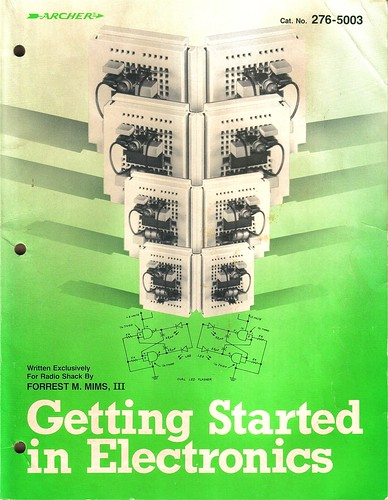
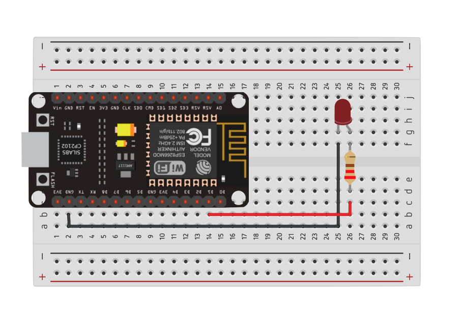
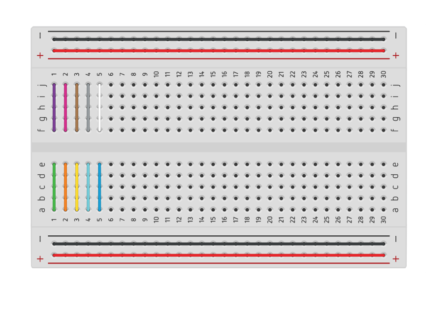
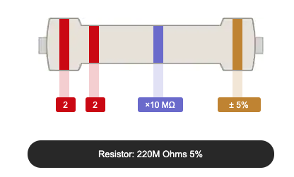

<figure>

</figure>
<figcaption>
Getting Started in Electronics, by Forrest M. Mims, III.
</figcaption>

I've always wanted to be able to work with hardware and put together interesting and complex circuits in the same way I've been able to build software. Before I was a teenager my grandfather bought me the now classic [Getting Started In Electronics](https://www.amazon.com/gp/product/0945053282) which has been called [The Greatest Electronics Book Ever Written](https://mightyohm.com/blog/2008/12/the-greatest-electronics-book-ever-written/). I struggled to understand it and never had the parts to try out the circuits; working instead with pencil and paper and ending up confused. These days it is pretty easy to get lots of parts cheaply to try things out.

## Buy some parts

To get started it is good to have some electronics to play with. We'll need:

* Any Arduino (preferably an ESP8266 based device)
* Breadboard
* LED
* A `220 Ω` resistor
* Some jumper wires
* Micro-USB cable

These parts are often hard to find individually so I tend to buy them in kits. I purchased the following:

* ESP8266 NodeMCU: https://www.amazon.com/gp/product/B081CSJV2V ($13.99 pack of 3)
* Smraza Basic Starter Kit: https://www.amazon.com/Arduino-Starter-Tutorials-Compatible-Mega2560/dp/B01MATM4XF ($19.98)
* Micro-USB cables: https://www.amazon.com/gp/product/B07V6GZ5GM ($7.99 pack of 5)
* Wall chargers (2.1A 5V): https://www.amazon.com/gp/product/B082TZZJZR ($9.99 pack of 3)

You don't need to buy multiples (often I buy three of each thing), but I've found I want to have multiple projects going at once. You might have micro-USB and wall chargers laying around which should be fine: just make sure they are 5V, ~2A  and that the cables are _data_ cables. The Smraza Basic Starter Kit has a ton of parts - most of which we aren't going to use here; but the kit is great and allows you to build all kinds of projects in the future.

## Setup a circuit


(designed on https://tinkercad.com)

### About breadboards

Setting up a breadboard like this makes it easy to test simple circuits without needing to solder anything. You can connect different components using jumper wires (normal wires, that you push into the various holes on the breadboard). The breadboard makes it easy to do this because certain holes of the breadboard are connected internally. It is tough to guess how everything is connected if you are looking at a breadboard for the first time.



The breadboard has two halves, each with two "power rails" (red and black in the above diagram). Each row is connected: for example row `1`: `a`, `b`, `c`, `d,` and `e` are all connected internally (shown in green above).

The gap running down the center of the breadboard separates the two sides.  The `a`, `b`, `c`, `d`, `e` slots are all connected and the  `f`, `g`, `h`, `i`, `j`  are all connected but they are not connected to each other. In our circuit above we've placed the `ESP8266` device in the middle so that half of the pins are on one side of the breadboard and the other pins are on the other side of the breadboard. This allows us to connect jumpers to pins to either side of the device without accidentally connecting them to one another. Looking closely you'll see that the `ESP8266` board is seated with `GND` pin in `2`,`c` on the breadboard. This means that we can plug a jumper into `2`,`b` to connect it to the device.

In order to connect one half of the board to the other half you have to "bridge" across. In our circuit above we "bridge" the ground wire directly but we use a resistor to "bridge" the power. This is because we don't want the full power (5V or 3.3V depending on which pin we use) going into the LED - we would burn it up. The resistor limits the total power.

### About resistors

There are different resistors for different power levels - which you need depends on your components, circuit, and amount of power. In this case we need a `220 Ω` resistor. You can identify resistors by the bands on them:



There is a helpful calculator here: https://www.digikey.com/en/resources/conversion-calculators/conversion-calculator-resistor-color-code-4-band

### About LEDs

When using an LED there are a couple of things to remember: one of the pins on the LED is longer than the other. On a 2-pin LED the shorter pin is ground (`GND`). On an RGB LED there are 4 pins. Usually there is one pin that is longer and that pin is ground.

## Setting up Arduino command line interface

Most people use the Arduino IDE. I tend to prefer my own editor and enjoy using the command line so I opted for the Arduino command line interface at https://github.com/arduino/arduino-cli. I'm using a Mac, so I installed the CLI through homebrew:

```
brew install arduino-cli
```

Install the `esp8266` board

```
arduino-cli core update-index --additional-urls=http://arduino.esp8266.com/stable/package_esp8266com_index.json
arduino-cli core search esp8266 --additional-urls=http://arduino.esp8266.com/stable/package_esp8266com_index.json
arduino-cli core install esp8266:esp8266 --additional-urls=http://arduino.esp8266.com/stable/package_esp8266com_index.json
```

Next, plug in the micro-USB to your board and your computer. On my board I see a quick blue blink when I plug it in. We'll need to figure out which port our board is connected to. Run the following:

```
arduino-cli board list
```

On a Mac you'll see a list of `tty` and `cu` ports. For example:

```
Port                            Type              Board Name FQBN Core
/dev/cu.Bluetooth-Incoming-Port Serial Port       Unknown
/dev/cu.usbserial-0001          Serial Port (USB) Unknown
```

The port for our device is `/dev/cu.usbserial-0001`. If you have a lot of things plugged in you'll probably see a longer list. To figure out try unplugging your USB cable and running `arduino-cli board list`. Plug the cable back in and run it again. The port you want is the one that appears the the second time you run the command.

Rad, you got this.

#### References

* https://www.devdungeon.com/content/arduino-cli-tutorial

## Build and run a sketch

When working with Arduino devices (and their clones) you will often write a _sketch_. A sketch is just a program that can be run on a device. Create a sketch:

```
arduino-cli sketch new blink
```

Change into that folder:

```
cd blink
```

Inside the folder you should see a file called `blink.ino` - this is our main file. `INO`  files (the extension comes from the last three letters in Arduino) is really just a special C++ format that has `setup` and `loop` functions that will be run by default.

In addition to the `blink.ino` file, we'll setup a `package.json` to prepare some default scripts. I chose to use a `package.json` file because I tend to integrate my hardware projects into node-based websites and tools and I know I'll need it eventually anyway. This is not a requirement at all; you could use a `makefile` or just some default scripts (or again, the Arduino IDE).

```
npm init -y
```

Let's edit that. Change the contents to:

```json
{
  "name": "blink",
  "version": "1.0.0",
  "description": "",
  "scripts": {
    "compile": "arduino-cli compile --fqbn esp8266:esp8266:nodemcuv2:baud=115200",
    "upload": "arduino-cli upload -p /dev/cu.usbserial-0001 --fqbn esp8266:esp8266:nodemcuv2:baud=115200"
  },
  "keywords": [],
  "author": "",
  "license": "ISC"
}
```

Here I am using `nodemcuv2` which matches my specific `esp8266` (this information can be found when you purchase the board). You can see all of the available board profiles by running `arduino-cli board listall`. I've also set the `baud` to `115200` - this tends to be the most reliable upload and transmit speed for my device.

The new sketch has a default `blink.ino` file. By default this doesn't do anything. Change the code to:

```cpp
void setup() {
  pinMode(D1, OUTPUT);
}

void loop() {
  digitalWrite(D1, HIGH);
  delay(500);
  digitalWrite(D1, LOW);
  delay(500);
}
```

Save the code then compile it:

```
npm run compile
```

Upload it to the device:

```
npm run upload
```

You should see the output:

```
> blink@1.0.0 upload blink
> arduino-cli upload -p /dev/cu.usbserial-0001 --fqbn esp8266:esp8266:nodemcuv2:baud=115200

No new serial port detected.
esptool.py v2.8
Serial port /dev/cu.usbserial-0001
Connecting....
Chip is ESP8266EX
Features: WiFi
Crystal is 26MHz
MAC: c8:2b:96:1e:26:d8
Uploading stub...
Running stub...
Stub running...
Configuring flash size...
Auto-detected Flash size: 4MB
Compressed 266192 bytes to 196120...
Wrote 266192 bytes (196120 compressed) at 0x00000000 in 17.3 seconds (effective 123.0 kbit/s)...
Hash of data verified.

Leaving...
Hard resetting via RTS pin...
```

You should see the LED blinking.[^sketch]

[^sketch]: This simple blink sketch came directly from [@mikekavouras](https://github.com/mikekavouras) who has helped me to understand the details of hardware hacking so consistently.

### Troubleshooting

Lots of things can go wrong when you are trying your first projects. Here are a few:

*Upload failed*

If you are seeing a bad upload (but it worked at least once) there is a good chance that turning it off and back on will fix the problem. For some of these devices you can press the `RST` button on board to reset them. In other cases you need to unplug and plug the device back in to reset it.

If that doesn't fix it, here are some other problems you might be running into:

* Wrong port - it is possible you selected the wrong port when uploading (we've been using `/dev/cu.usbserial-0001`); try unplugging your USB cable and running `arduino-cli board list`, then plug in the cable and run it again. The port you want is the one that appears the the second time you run the command.
* Bad cable - If the upload starts to work and fails, you might have a bad micro-USB cable. Are you sure that the cable you selected is a data cable (not just a charging cable)? Try another cable and see if it helps.
* Bad board - you might have a bad board (though unlikely) - when you plug it in you should see a quick blink from the onboard LED. If you aren't seeing this then the board might be bad. To test it, move the jumper wire from `D1` to `VIN`. This sets up the LED power to be always on (still using the resistor in between the board and the LED): if the board is working powered you should see the LED light.
* Flash mode broken - In some cases you need to hold the `FLASH` button on the board while flashing (see https://randomnerdtutorials.com/solved-failed-to-connect-to-esp32-timed-out-waiting-for-packet-header/). I haven't needed to do this with any modern firmware or any of my boards but if you have an old board it might be worth a shot.

*Light is not blinking*

If the upload is working but the light isn't blinking it is usually a problem with the circuit. Double check the diagram and make sure everything is setup correctly. If you're sure the circuit is setup correctly it might be one of the following:

* LED - you might have a bad/burned LED. If you have another just swap it out and try again.
* Resistor - double check that you picked the right resistor for your LED - maybe you grabbed a `220K Ω` instead of a `220 Ω`. Double check that you have a `red`, `red`,  `violet` , `gold` (https://www.digikey.com/en/resources/conversion-calculators/conversion-calculator-resistor-color-code-4-band). If your resistor is too strong (or incorrect) then the LED might not be getting enough power to light.
* Wires - you might have a bad jumper wire or connection; I've had this happen a couple of times. You can check the continuity with a multimeter.
* Wrong pin selected - if you selected a board model that didn't exactly match then there is a chance the the `D1` constant is not set correctly (the number is different for different boards). Double check that the value for `D1` is right (mine is `5`); recompile and re-upload.


## Debugging and Serial

When developing programs it is often helpful to add debugging output. Unfortunately our program will be running on our
device - in order to see any output that our program writes, we'll need to read data from the serial port on our computer. Let's change our sketch:

```cpp
void setup() {
  pinMode(D1, OUTPUT);

  // Open the serial port and set the baud rate to 9600
  Serial.begin(9600);
}

void loop() {
  Serial.println("Blinking on");
  digitalWrite(D1, HIGH);
  delay(500);

  Serial.println("Blinking off");
  digitalWrite(D1, LOW);
  delay(500);
}
```

We've added some `println` commands to output text when the the light blinks. Save and compile:

```
npm run compile
```

Upload the compiled binary to the device:

```
npm run upload
```

Just like before the light is blinking - but we're not seeing any output. There are a couple of ways to see what's happening, but the easiest is to use `cat` on the port:

```
cat /dev/cu.usbserial-0001
```

You should see `Blinking on` and `Blinking off` print every time the light blinks on and off. To stop it, type `Ctrl+C`. Let's turn this into a command in our `package.json`:

```json
{
  "name": "blink",
  "version": "1.0.0",
  "description": "",
  "scripts": {
    "compile": "arduino-cli compile --fqbn esp8266:esp8266:nodemcuv2:baud=115200",
    "upload": "arduino-cli upload -p /dev/cu.usbserial-0001 --fqbn esp8266:esp8266:nodemcuv2:baud=115200",
    "listen": "cat /dev/cu.usbserial-0001"
  },
  "keywords": [],
  "author": "",
  "license": "ISC"
}
```

Now we can run:

```
npm run listen
```

But what if you want the device to _read_ data from serial. In that case `cat` will not work. There are a number of ways start an interactive `TTY` but the easiest is `screen`[^screen]. Let's modify our sketch:

[^screen]: The `screen` command is available on Linux and Mac by default. For Windows you might need to install Cygwin to access the command.


```cpp
int blinking = 1;

void setup() {
  pinMode(D1, OUTPUT);
  // Open the serial port and set the baud rate to 9600
  Serial.begin(9600);
}

void loop() {
  if (blinking) {
    Serial.println("Blinking on");
    digitalWrite(D1, HIGH);
    delay(500);

    Serial.println("Blinking off");
    digitalWrite(D1, LOW);
    delay(500);
  }

  if (Serial.available() > 0) {
    int value = Serial.read();

    if (value == 'y') {
      Serial.println("Start blinking");
      blinking = 1;
    } else {
      Serial.println("Stop blinking");
      blinking = 0;
    }
  }
}
```

By default when the sketch starts the LED should be blinking. If we receive serial input the behavior changes: if the input is anything other than a `y` (we only read one byte at a time) then we stop blinking. If it is a `y`, we start it again.

Make sure you have stopped `cat` (or `npm run listen`). Then save the changes and compile:

```
npm run compile
```

And upload to the device:

```
npm run upload
```

Next run:

```
screen /dev/cu.usbserial-0001 9600
```

This will start an interactive `screen` session. You should immediately see the output again. Typing characters into this session will send the output over the serial connection to the device. If you type `y` the LED should blink and you should see `Start blinking` appear. Typing any other character will stop the blinking.

It is possible to detach and re-attach to screen sessions and even name them - though that probably isn't needed for our purposes. A full tutorial on `screen` can be found at http://www.kinnetica.com/2011/05/29/using-screen-on-mac-os-x/.

To exit the running screen session type: `Ctrl+A` followed by `Ctrl+\`.

Let's change `package.json` again:

```json
{
  "name": "blink",
  "version": "1.0.0",
  "description": "",
  "scripts": {
    "compile": "arduino-cli compile --fqbn esp8266:esp8266:nodemcuv2:baud=115200",
    "upload": "arduino-cli upload -p /dev/cu.usbserial-0001 --fqbn esp8266:esp8266:nodemcuv2:baud=115200",
    "listen": "cat /dev/cu.usbserial-0001",
    "screen": "echo '[Starting screen, press Ctrl+A Ctrl+\\ to exit]' && sleep 2 && screen /dev/cu.usbserial-0001 9600"
  },
  "keywords": [],
  "author": "",
  "license": "ISC"
}
```

The `echo` message and `sleep` at the start of the command aren't required, but they can be helpful. `Ctrl+A`, `Ctrl+\` can be tough to remember. Because of this I added a reminder that shows every time I run the command; otherwise I forget it and end up hopelessly trapped in a `screen` session.


Now, if we need to be able to pass input to the device over serial we can run:

```
npm run screen
```

Press `Ctrl+A`, `Ctrl+\` to exit.

#### References

* https://www.arduino.cc/reference/en/language/functions/communication/serial/read
* http://www.kinnetica.com/2011/05/29/using-screen-on-mac-os-x/

# Improving the developer experience

So far the `package.json` has been useful for hiding away the complexity of some commands; but we still have to remember which ones we want to run. Let's add a `start` script to batch them together:

```json
{
  "name": "blink",
  "version": "1.0.0",
  "description": "",
  "scripts": {
    "compile": "arduino-cli compile --fqbn esp8266:esp8266:nodemcuv2:baud=115200",
    "upload": "arduino-cli upload -p /dev/cu.usbserial-0001 --fqbn esp8266:esp8266:nodemcuv2:baud=115200",
    "listen": "cat /dev/cu.usbserial-0001",
    "screen": "echo '[Starting screen, press Ctrl+A Ctrl+\\ to exit]' && sleep 2 && screen /dev/cu.usbserial-0001 9600",
  "start": "npm run compile && npm run upload && npm run listen"
  },
  "keywords": [],
  "author": "",
  "license": "ISC"
}
```

This `start` command runs our main three scripts, stopping if any of the steps fail.

```
npm start
```

This should compile, upload and then start listening (to stop this, type `Ctrl+C`).

We still haven't leveraged any node modules. To improve the development experience we'll create a new command to watch our files and when we save changes we'll have it automatically restart.

> Again: we don't have to use node or node modules for this; I just happen to have them already installed.

Install the `nodemon` package to your development dependencies:

```
npm install --save-dev nodemon
```

The `nodemon` package allows you to monitor files and execute a program when those files change. Let's add another script to the `package.json` called `watch`:

```json
{
  "name": "blink",
  "version": "1.0.0",
  "description": "",
  "scripts": {
    "compile": "arduino-cli compile --fqbn esp8266:esp8266:nodemcuv2:baud=115200",
    "upload": "arduino-cli upload -p /dev/cu.usbserial-0001 --fqbn esp8266:esp8266:nodemcuv2:baud=115200",
    "listen": "cat /dev/cu.usbserial-0001",
    "screen": "echo '[Starting screen, press Ctrl+A Ctrl+\\ to exit]' && sleep 2 && screen /dev/cu.usbserial-0001 9600",
  "start": "npm run compile && npm run upload && npm run listen",
  "watch": "nodemon --ext ino --exec npm start"
  },
  "keywords": [],
  "author": "",
  "license": "ISC"
}
```

Run the `watch` script:

```
npm run watch
```

This will immediately kick off the `npm start` process and continue outputting data from the `listen` script. Make a change to the sketch (maybe change the blink delay milliseconds to be shorter or longer) and save the file. You'll notice the `listen` output stop while the code is recompiled and re-uploaded. Uploading takes about 30 seconds, so the restart is not fast. Still, having it work in the background can make your development more iterative.

# Still getting started

Getting started with hardware has always been a challenge for me. The simple things feel difficult and it is hard to know what to do when you make a mistake. With these small pieces, however, it is possible to build an incredible number of interesting and complex circuits that can interact with the real world.
