<figure class="fullwidth">

</figure>
<figcaption class="fullwidth">
Image credit: <a href="https://oculus.com">Oculus Quest</a>
</figcaption>

Virtual reality is incredibly immersive and a blast to play with. The Oculus Quest 2 has made it more accessible than ever before. Of course, the moment I put it on, I immediately wanted to make my own games and got started with Unity[^unity]. Best practices for setting up your environment and building a game have changed frequently enough that it can be hard to find current tutorials and examples without getting confused.

[^unity]: Unity is a game engine that makes it easier to build a fully functioning game (including physics, collisions, rendering, and much more) that works on multiple platforms. There are many freely available game engines but the most popular are Unity and Unreal Engine. There are [lots](https://gametorrahod.com/objectively-comparing-unity-and-unreal-engine/) of [articles](https://developer.oculus.com/documentation/quest/latest/concepts/book-intro/?locale=en_US) on Unity versus Unreal Engine versus building your own engine entirely from scratch using Oculus Native support. For me, my goal was to get something running as quickly as possible. Harder decisions later.

### Mac versus Windows

If you are using Windows, you are in luck: many of the tutorials and videos you'll find assume you're working on Windows. I'm using a MacBook Pro. This can create some challenges but the biggest challenges are around the platform support for the Oculus Quest itself. Oculus doesn't make a version of it's Oculus Desktop app (or libraries) available on MacOS. Because of this you'll usually want to start with tutorials that are specific to the Mac and adjust. This post will try to focus on what works in both environments.

## Getting started

We'll be using Unity to develop our game. Unity is constantly releasing new versions and new features. Because of this it is very common to have multiple versions of Unity installed (for different projects). Luckily this is easy to manage using Unity Hub. [Download](https://unity3d.com/get-unity/download) Unity Hub and install it[^unity-hub].

[^unity-hub]: Can't you just download and install a specific version of Unity instead of Unity Hub? Of course. But even if you only plan to use one version of Unity forever, Unity Hub is still extremely useful for configuring your installation.

Once you have installed Unity Hub, you'll need to install a version of Unity.


I generally try to install the latest Official Release. Even though the LTS (long term support) versions are guaranteed to receive updates they won't necessarily have all of the newest features. Choose a version and click the "NEXT" button.

When building a game for Oculus Quest (which uses a custom Android operating system internally), you'll need to use a version of Unity with Android Support and OpenJDK. Select the Android Build Support option (and all sub-options):


I also select `Mac Build Support` and `Documentation`. If you're not sure if you'll need something, you can always add modules later. Click the "NEXT" button.

You'll need to agree to the Android SDK and NDK License Terms from Google:


Check the box and click the "DONE" button. The installation should take a few minutes.

## Setting up a basic project

In Unity Hub, click on Projects on the left, then click on the New button. Create a new project with the Universal Render Pipeline selected:

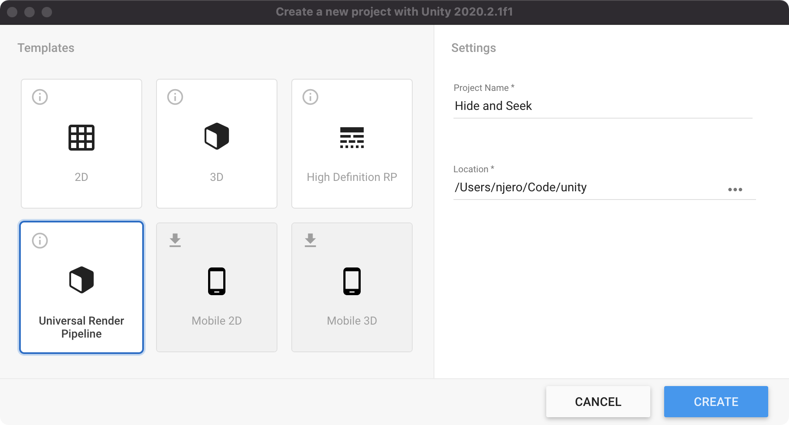

The project should open and have a default scene in it. For our purposes, we don't care about this scene and want to start with a blank canvas.[^layout]

[^layout]: In many of the screenshots you'll notice I am using the `Tall` layout. I tend to prefer this layout but you can choose whatever layout you want. To change the layout click on the `Window` menu, click `Layouts` then choose `Tall`.


Delete the following:

- `Assets/Scenes/SampleScene`
- `Assets/Scenes/SampleSceneLightingSettings`
- `Assets/ExampleAssets`
- `Assets/TutorialInfo`
- `Assets/Settings/SampleSceneProfile`

Before we can build our game for the Oculus Quest, we'll need to add some packages. Some of the packages we'll need are very new. In current versions of Unity, you'll need to show the preview packages. To do this we'll need to enable preview packages in the Project Settings. Open the `Edit` menu and choose `Project Settings...`. Select `Package Manager` on the left then check the `Enable Preview Packages` checkbox:


You may see a warning that the packages are "not ready for production." Click "I understand":


Open the Package Manager by clicking on the `Window` menu and choosing `Package Manager`. Once open, change the packages filter to `Unity Registry`:


Find the `XR Interaction Toolkit`[^xr] package, select it, and click install:

[^xr]: Wait - what is "XR". XR is short for "cross-reality" - and is the abbreviation for games and projects that support both VR (virtual-reality) and AR (augmented-reality).

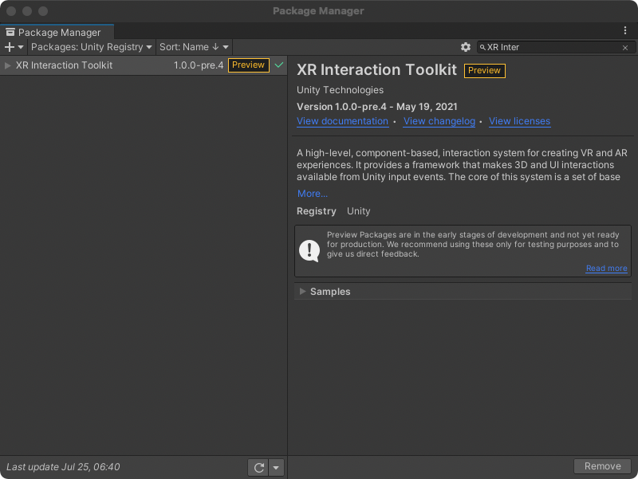

Install the `Android Logcat` plugin as well:

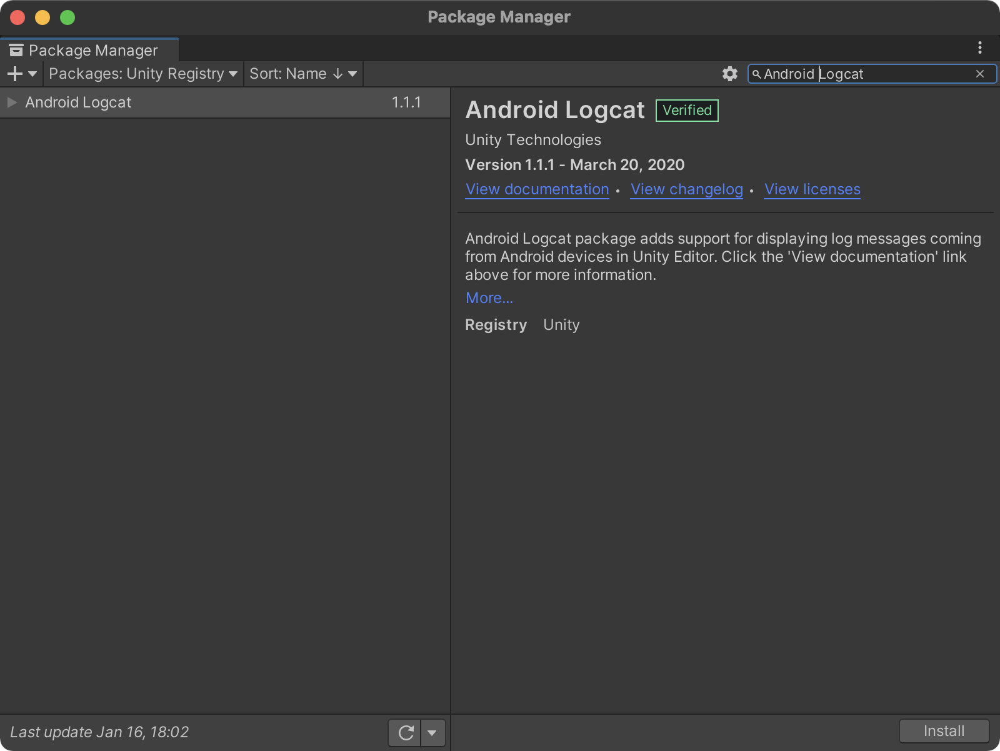

We're ready to create our scene. In the `Scenes` folder in `Assets`, create a new scene called Game (select the folder, then right-click in the blank panel and select `Create` and then click `Scene`):


Double click to open it.

###

1. Edit | Project Settings | XR Plugin Management | Install XR Plugin Management
2. Edit | Project Settings | Packages | Enable Preview Packages
3. Window Package Manager | Unity filter
   1. Open XR
   2. XR Interaction Toolkit
      1. Install samples
         1. Default Input Actions
         2. XR Device Simulator
4. Edit | Project Settings | XR Plugin Management
   1. Select Open XR (Preview)
   2. Click the red !
      1. Fix All (restart)
   3. Go to the Open XR Features submenu, then choose Oculus Touch (it will have a giant black screen)

5. (If you have a bug) - uncheck OpenXR and check Oculus

6. Go to Assets | Samples | XR Interaction Toolkit - Install all of the items
7. Edit | Project Settings | Preset Manager
   1. ActionBasedController: type Right and Left

8. Right click | XR | Room-Scale XR Rig (Action based)
9. Select the XR Rig object and add Input Action Manager. Add 1 Action Assets element and set it to XRI Default Input Actions
10. Right click | XR | Locomotion System
### Setting up XR

To get started, we'll want to setup our scene so that our headset is tracked and is used as the primary camera. In general this is the way VR works: think about your eyes as cameras that are filming the world. As your head moves around your eyes move as well. In Unity we'll create a camera that tracks your head position and update the rendered view accordingly.

In the Hierarchy tab create a new empty object called `XR` (to do this, right click on the `Game` node, select `GameObject` from the menu and choose `Create Empty`; then name the newly created object `XR`):

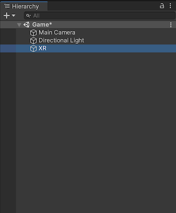

Select the object, set the `Y` position to `1`[^y-1] and add an `XR Rig` component.

[^y-1]: Why did we set the `Y` to `1`? We'll be adding a one-meter tall "floor" for us to stand on. The actual height of the camera from the "floor" will be controlled by how the headset position is tracked in the `Tracking Origin Mode` (which we've set to the default: `Device`).

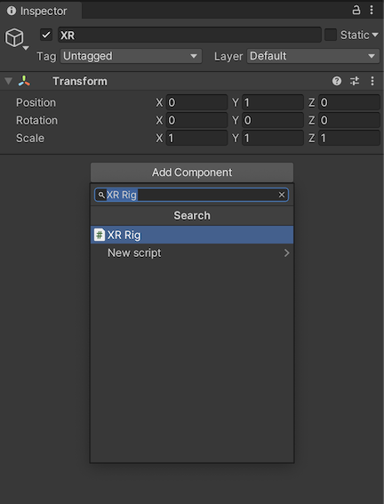

Within the `XR` object create a new empty object:

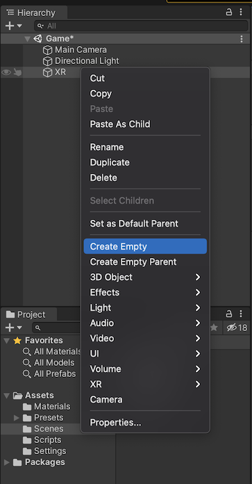

Name it `Camera Offset`. Within the `Camera Offset` add a new Camera object:

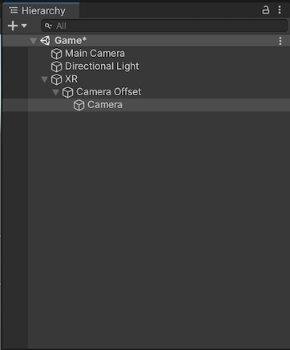

Add a `Tracked Pose Driver` component to the Camera object:

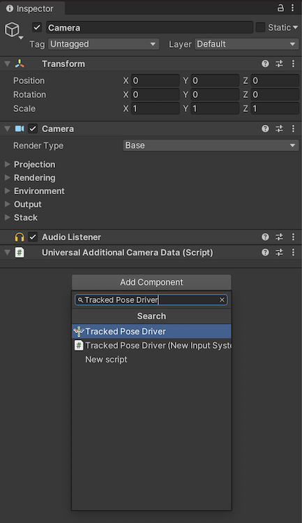

Set the `Tag` to `MainCamera`:

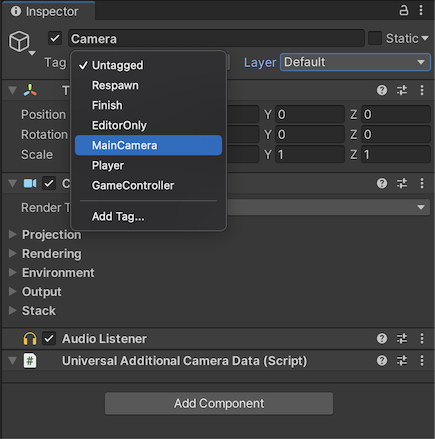

That's all we need for now (this is just to get the scene running and visible; not pretty); we just need to wire things together. Select the `XR` object again. Then drag the child Camera object to `Camera Game Object` property on the `XR Rig` component. Drag the `Camera Offset` object to the `Camera Floor Offset Object` property.

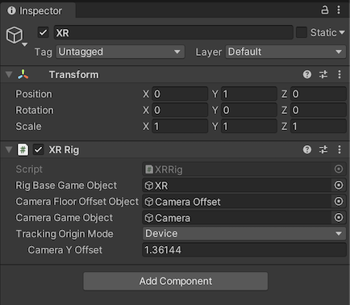

At this point we can remove the `Main Camera` game object; we'll be using the `XR` camera instead.

### Creating a basic world

We've created enough for our player to put on their headset and be in the world - but we haven't actually created anything for them to see. Let's add a basic platform for them to stand on and a table.

Right click on the `Game` scene node in the Hierarchy panel, select `GameObject` then create a new `3D Object`, `Cube`:


Name it `Floor`. Set the scale to `100, 1, 100`:


Create another new `3D Object`, `Cube` and name it `Table`. Set the `Z` position to `10` (so it is 10 meters in front of the camera) and set the `X` scale to `10` so it appears like a long desk and set the `Y` position to `1` so it is sitting on the `Floor`.


We'll need some materials for the objects (so we can see them). Select the `Materials` folder in your `Assets` and create a new material and name it `Black`. Set the `Base Map` color to black:


Make another material called `Red` and set the `Base Map` color to red:


Drag the `Black` material into your scene view and drop it onto the `Floor` object. Drag the `Red` material into the scene view and drop it onto the `Table` object.


### Testing out what we have

At this point we could run our game by pressing the ▶️ button in Unity to see how it all works. By default the game will start (Unity will switch to the Game view) and we'll see the red table in front of our first-person player. But we can't move or look around. We could add controls to do this but we're trying to build a game for VR so let's focus on that.

### Building and deploying the application to your Oculus Quest

To utilize Oculus and Facebook features such as social integration and user avatars, you'll need a Facebook account (starting with Oculus Quest 2) and an Oculus Developer account (free, but starting in February 2021, you need a [Verified Developer Account](https://developer.oculus.com/faqs/?locale=en_US#faq_343265393702048) which requires a payment method on file). Go to https://developer.oculus.com and sign up using your Facebook account. You'll also need to [setup your device for developer mode](https://developer.oculus.com/documentation/native/android/mobile-device-setup/). To do this you'll need to:

* Join or Create an Oculus Developer Organization (part of your Oculus account)
* Enable Developer Mode on your headset
* Plug in your USB cable and Allow USB Debugging[^usb-cable]
* Install the Oculus ADB Drivers (Windows only)

[^usb-cable]: The USB cable that comes with the Oculus will work for development. An Oculus Link cable will also work. In general, any data-capable USB-C cable should work. If you are having trouble you might want to check the cable. Also, if you have an Oculus Elite Strap (or another external battery pack) make sure your USB cable is plugged into the headset itself, not the battery pack.

 The [instructions on the Oculus website](https://developer.oculus.com/documentation/native/android/mobile-device-setup/) explain how to do each of these steps.

Once your Quest is in developer mode and plugged in, you can configure your project.

In the `File` menu, choose  `Build Settings...` and click `Add Open Scenes`. Then click on the `Android` platform option and change the default texture compression to `ATSC`[^atsc]. Then click `Switch Platform`:

[^atsc]: I've skipped most of the platform specific changes you can make but changed the texture compression. Why? Changing this later can be very slow. Because of that I tend to do it as early as possible in the process.


Next, click on the `Player Settings` button. With the `Player` item selected in the left sidebar, find the `Other Settings` subpanel. Expand the panel and scroll down to `Minimum API Level`. Oculus requires that this be set to at least `API level 23` as a target:


After you have set the minimum API level, select the `XR Plugin Management` category in the left sidebar then click `Install XR Plugin Management`:


Once installed, check the `Oculus` box (this will install the [Oculus OpenXR Mobile SDK](https://developer.oculus.com/downloads/package/oculus-openxr-mobile-sdk/)):

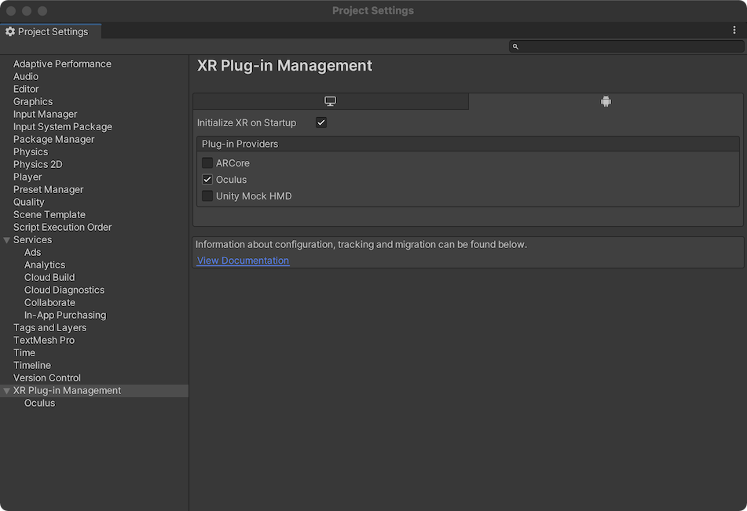

We won't change any other settings for now - though we'll want to change some settings later to increase the performance. Oculus has additional information about setting up your application in the documentation under [Configure Unity Settings](https://developer.oculus.com/documentation/unity/unity-conf-settings/). It details specific quality configurations and rendering preferences which we'll explore in the future.

> You may see a warning about Vulkan support: "Vulkan is currently experimental on Oculus Quest. It has been removed from your list of Android graphics APIs." Don't worry, it is safe to ignore this for now.

Click `Build and Run` in the `Build Settings` window, choose a name when saving the game and get ready (I've called my game `Hide-and-seek` even though there isn't really any hiding or seeking):


Once you save the game it should start compiling the application. This generally takes a few minutes to complete the first time (if you have a very complex scene with advanced shaders and lighting it can take much longer) but will be quicker on subsequent runs. Eventually the progress dialog will say `Deploying player`. At that point your Oculus Quest should pause what it is doing and switch to a screen that says `Made with Unity` then your game should start.

When the game starts on the headset, Unity will connect to the logs from the headset and display them in an `Android Logcat` window (because we installed the `Android Logcat` plugin into our project). The logging is almost constant but can be filtered. This is a cumbersome way to get debugging information from the headset as you play - but it is the only way to do it on MacOS. On Windows you can use the ▶️ button in Unity to start the application in development mode on the headset. This is not possible on MacOS because there are no Apple-compatible Oculus drivers and applications.

Our game is not very exciting (we don't even have hands!), but from this point you should be able to make changes in Unity, then click the `File` menu and choose `Build and Run`. Your new changes will be compiled and a new version of the game (the compiled `APK` file) will be deployed to the headset and the game will restart.

# Writing a script

So far we haven't needed to write any code for our game. Eventually, though, we'll want some customization and game logic. C# is the default coding language for Unity. You can use any coding editor to work on your scripts but most people use Visual Studio or VS Code because of their advanced auto completions.

I tend to use VS Code. If you don't have it, download and install it from https://code.visualstudio.com/download. On MacOS you'll need additional tools to support .Net and C#. Install `mono`:

```bash
brew install mono
```

Then open VS Code (if you already have VS Code open, restart it). You'll want to install the following plugins:

* https://marketplace.visualstudio.com/items?itemName=ms-dotnettools.csharp
* https://marketplace.visualstudio.com/items?itemName=Unity.unity-debug
* https://marketplace.visualstudio.com/items?itemName=Tobiah.unity-tools
* https://marketplace.visualstudio.com/items?itemName=kleber-swf.unity-code-snippets
* https://marketplace.visualstudio.com/items?itemName=YclepticStudios.unity-snippets

Edit the Extension Settings of the `C#` plugin (click on the gear icon) and set the `Omnisharp: Use Global Mono` setting to `always`:


More information and options are available at https://code.visualstudio.com/docs/other/unity (note, you should not need to install any additional language packs with the latest version of Mono).

Next, open the Unity Preferences and choose `Visual Studio Code` as the `External Script Editor`:


In order to get the most out of VS Code you have to adjust some settings. Let's start by creating a script in Unity so we can try it out. In the Hierarchy, select the `XR` game object. In the inspector click `Add component`, type `Logger` then choose `New script`, name it `Logger` and click `Create and Add`.


Once the component is created click on the three dots to the right and choose `Edit Script`:

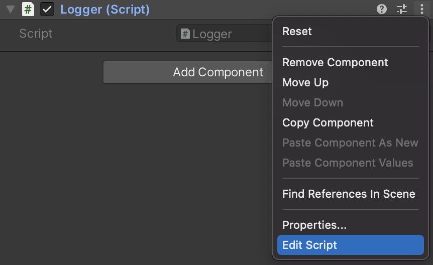

The script should open in VS Code:


Let's edit the script to add some debug logging into the `Update` method:

```csharp
using System.Collections;
using System.Collections.Generic;
using UnityEngine;

public class Logger : MonoBehaviour
{
    // Start is called before the first frame update
    void Start()
    {

    }

    // Update is called once per frame
    void Update()
    {
        Vector3 pos = transform.position;
        Debug.Log("Update: " + pos);
    }
}
```

As you start to type you should see an auto-complete window:


Once you've added the log message, save the file and return to Unity. You'll notice there is a small delay as Unity recompiles the code when the Unity window regains focus. Once the code is recompiled you can `Build and Run`.

# More advanced ways of connecting to your headset

Unity relies on the Android Platform Tools (Android SDK) to connect to the headset, deploy games and start them. The Android Debugging Bridge (or `adb`) gives you access to a number of additional tools including a command line interface to the Quest. It isn't required, but I tend to use it.

If you are working on Windows there are some instructions available; read [Enable Device for Development and Testing](https://developer.oculus.com/documentation/unity/unity-enable-device/). On a Mac, in a Terminal, run:

```bash
brew install android-platform-tools
```

Once installed, attach your Oculus via USB-C and run:

```bash
adb connect
```

In some cases the version of `adb` you install is different than the version that is used in Unity. This can lead to unexplainable errors either in Unity or in the Terminal. In most cases it simply causes one of the two tools to repeatedly lose its connection to the Oculus Quest. To work around this, there are a few options, but the simplest is to copy the `adb` binary from the Unity installation to `/usr/local/bin`.

You can find the path in the Unity Preferences window (in the `platform-tools` folder inside of the Android SDK path):


Copy the path, then change to that folder (your path will probably be different):

```bash
cd /Applications/Unity/Hub/Editor/2020.2.1f1/PlaybackEngines/AndroidPlayer/SDK
```

Then copy the `adb` binary:

```bash
cp platform-tools/adb /usr/local/bin/
```

Re-connect:

```
adb connect
```

### Checking the logs

We've been using the Android Logcat plugin in Unity to see the logs, but you can also view the logs from terminal. The logs are verbose so it is sometimes helpful to start by clearing them:

```
adb logcat -c
```

Then check them:

```
adb logcat -d
```

Using `System.Debug` statements in your application will output information to the logs making it a useful way to see what is happening in your program.

### Connecting via Wi-fi

So far, all of our interaction with the Oculus Quest has required it to be plugged in via USB-C cable. Luckily, you can also connect via Wi-fi. First you'll want to make sure that the device is connected via USB:

```bash
adb devices
```

You should see something like:

```
List of devices attached
12345999M92373	device
```

Once you've got the device connected you can check it's local IP address:

```bash
adb shell ip route
```

You should see something like (the IP address at the end is what we are looking for):

```
192.168.86.0/24 dev wlan0 proto kernel scope link src 192.168.86.99
```

Now setup `tcpip` for the connected device and tell it to listen on port `5555`:

```bash
adb tcpip 5555
```

Once you've done this the device is still connected to USB and your computer is communicating via
USB but it is also listening for `tcpip` connections via Wi-Fi. Connect to it via Wi-Fi:

```bash
adb connect <ipaddress>:5555
```

At this point you can unplug the USB cable and you should still be able to work with the Quest via
`adb` over Wi-Fi. This includes compiling and deploying to the Oculus Quest from Unity. You can also continue to check logs over Wi-Fi. For example:

```bash
adb logcat -d
```

If you want to explicitly connect to a particular Quest you can specify the server with `-s`:

```bash
adb -s <ipaddress>:5555 logcat -d
```

To go back to using USB, plug in the cable again and connect:

```bash
adb connect usb
```

### Disconnecting

If you get an error about the connection you can usually run:

```bash
adb disconnect
```

If that doesn't work you can do the more extreme:

```bash
adb kill-server
```

And then run the `adb connect` commands again. In some cases (when using USB) it is helpful to disconnect the USB cable and reconnect.

### Seeing what the player sees

Though you could use the built in casting functionality for the Oculus Quest you might find it doesn't always reflect what the player sees (especially if there are differences per-eye). Luckily the `scrcpy` program allows us to stream the player's view. Install it:

```bash
brew install scrcpy
```

Then run:

```bash
scrcpy -c 1440:1550:0:0
```


This should attach a view for a single eye. Be careful! Sometimes what you see in the `scrcpy` window doesn't always perfectly match what the player sees on the Oculus Quest. If you want to see both eyes you can just use `scrcpy` without any additional parameters[^scrcpy].

[^scrcpy]: `scrcpy` or Screen-Copy is part of Genymobile and can be found https://github.com/Genymobile/scrcpy#mac-os. There are options for other platforms as well. See also: https://note.mu/masaki_ponpoko/n/nc759f6499c79

## More learning

I've used other resources when learning. I'll list some of them here:

- [The Ultimate Guide to Game Development with Unity 2019](https://www.udemy.com/share/1000lMBkQac1dQRng=/). This course costs between \$10-12 if you catch it on sale. I highly recommend it if you are just getting started. It clearly explains how to move around the Unity interface, how to move quickly, and basic concepts of scripting.
- Using the new Terrain Tools: [Speed up your work with the new Terrain Tools Package](https://blogs.unity3d.com/2019/05/28/speed-up-your-work-with-the-new-terrain-tools-package/).
- [Using GitHub Desktop to Manage your Project](https://wiki.unrealengine.com/GitHub_Desktop_to_manage_your_project) and [How to use GitHub with Unity](https://www.youtube.com/watch?v=qpXxcvS-g3g) (youtube).
