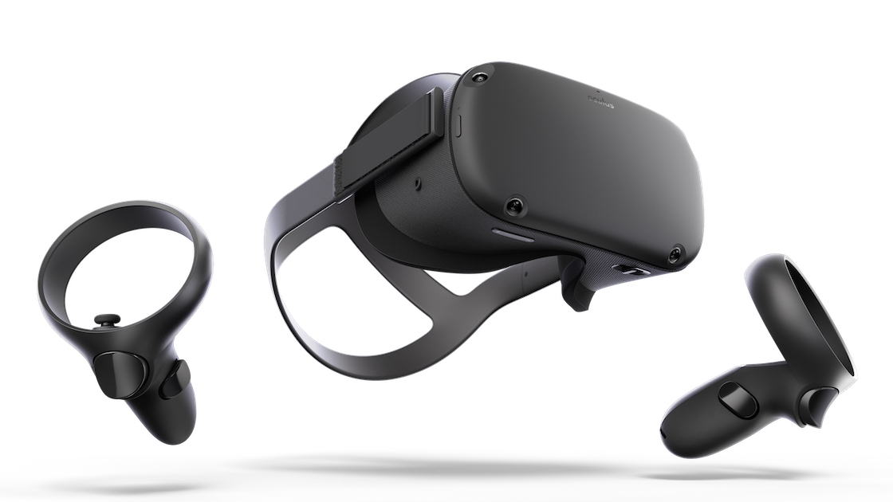

<figure class="fullwidth">

</figure>
<figcaption class="fullwidth">
Image credit: <a href="https://amzn.to/2SEOSJG">Oculus Quest on Amazon</a>
</figcaption>

For Father's Day I got an Oculus Quest. It is entirely immersive and a blast to play with my kids. Of course, I immediately wanted to make my own games and got started with Unity[^unity]. There are a few blog posts and videos that helped me on my way.

[^unity]: There are [lots](https://gametorrahod.com/objectively-comparing-unity-and-unreal-engine/) of [articles](https://developer.oculus.com/documentation/quest/latest/concepts/book-intro/?locale=en_US) on Unity versus Unreal versus building your own engine entirely from scratch using Oculus Native support. For me, my goal was to get something running as quickly as possible. Harder decisions later.

## Getting started

To develop for you Oculus you'll not only need an Oculus account but you may want to setup an Oculus Organiztion (free). Additionally (for my purposes), you'll need a Unity account. I'm using a personal account (also free).

### Mac versus Windows

I'm using a MacBook Pro. Many of the tutorials and videos you'll find assume you're working on Windows. This can create some challenges but the biggest challenges are around the platform support for the Oculus Quest itself. Oculus doesn't make a version of it's Oculus Desktop app (or libraries) available on MacOS. Because of this you'll want to start with tutorials that are specific to the Mac and adjust.

### Unity & initial setup

I followed a couple of tutorials for getting Unity Hub and Unity installed. I recommend:

- [How to get started with Oculus Quest and Unity on macOS](https://medium.com/@sofaracing/how-to-develop-for-oculus-quest-on-macos-with-unity-5aa487b80d13)
- [How to get started with Oculus Quest development in Unity](https://skarredghost.com/2019/06/08/how-get-started-oculus-quest-development-unity/)

If you prefer videos:

<iframe width="560" height="315" src="https://www.youtube.com/embed/eySe4Wj6xbk" frameborder="0" allow="accelerometer; autoplay; encrypted-media; gyroscope; picture-in-picture" allowfullscreen></iframe>

<iframe width="560" height="315" src="https://www.youtube.com/embed/qiJpjnzW-mw" frameborder="0" allow="accelerometer; autoplay; encrypted-media; gyroscope; picture-in-picture" allowfullscreen></iframe>

## Learn

Once I had the basics working, and could load games I built in Unity on my Quest, I wanted to do more. I found a set of fantastic tutorial videos by [Valem](https://www.youtube.com/channel/UCPJlesN59MzHPPCp0Lg8sLw), [Quentin Valembois](https://twitter.com/ValemVR) and was hooked. As I went through the videos I took notes and (with permission) am posting those here.

While watching these videos, you might notice Valem is using the ▶ button to debug. This works because he is actually developing for the Rift in the videos (notice that the controllers are upside-down). In a later [video on recreating Slenderman](https://www.youtube.com/watch?v=LihEW5a1Tjw) (at 1:47) he explains how to use the ▶ button while building for the Oculus Quest. Unfortunately that won't work on MacOS because the Oculus plugin is not supported. There are notes on how to get this working at the end of this post.

## How to make a VR game in Unity - Part 1 - Setup, Hand presence, Grabbing object

<iframe width="560" height="315" src="https://www.youtube.com/embed/sKQOlqNe_WY" frameborder="0" allow="accelerometer; autoplay; encrypted-media; gyroscope; picture-in-picture" allowfullscreen></iframe>

### Setup the project

- Set Unknown Sources in the Oculus app (Windows only)
- In Unity Hub create a new 3D app
- Click Build Settings in the File menu
- Choose Android, click Switch Platform
- Change the Texture Compression to ASTC (not required[^astc], very slow)
- Open Player Settings:
  - Set the Company and Product Name
  - Remove `Vulkan` from the Graphics APIs list (Other Settings)
  - Set the Package Name (Other Settings)
  - Set the Minimum API Level to Android 4.4 'KitKat' (Other Settings)
  - Check VR Intergation (XR Settings)
  - Add the Oculus Virtual Reality SDK (XR Settings)
- Download Oculus Integration from the Asset Store (slow)
- Import All from the Oculus Integration (very slow)

[^astc]: DXT, PVRTC, ATC, and ASTC are all support textures with an alpha channel. These formats also support higher compression rates and/or better image quality, but they are only supported on a subset of Android devices. https://docs.unity3d.com/Manual/android-GettingStarted.html. ASTC is considered the best choice for Oculus Quest.

### Make the scene

- Create a 3D plane
- Create a 3D cube
- Create a red material and apply it to cube
- Create a black material and apply it to plane
- Delete the main camera
- Add `OVRPlayerController` to the scene and move it back away from the cube
- Set Tracking Origin Type to `Floor` on the `OVRCameraRig` child (note: if you are using the ▶ button, this should be `Stage`)
- Add the `Character Camera Constraint` component to the `OVRPlayerController`
- Drag the `OVRCameraRig` to the `Character Camera Constraint` Camera Rig field
- Check the Dynamic Height box

### Simple grabbing

- Add `LocalAvatar` prefab to the `TrackingSpace` of the `OVRPlayerController`
- Add `AvatarGrabberLeft` and `AvatarGrabberRight` prefab to the `LocalAvatar`
- Make the red cube wider (more like a table)
- Add an empty object called Cubes and add some cubes (6 of them)
- Select all of the cubes and add the `OVRGrabbable` script
- Add the `RigidBody` component

### Build and run

- In Build Settings click Add Open Scenes
- Plug in your Oculus (you may need to "Trust this computer")
- On Windows you should be able to click play
- On Mac click Build and Run (slow first build)

> From the comments: Colliding with the cubes and flying into the air? "Some of you have experienced a bug where the player fly when you put your hands under you. A really simple fix is to set the body and the hand to a different layer then in Physics settings uncheck the collision between the two layer in the collision layer matrix! :) Hope this will help some of you!" https://www.youtube.com/watch?v=sKQOlqNe_WY&lc=Ugy0IV2wmiRMywTkPk94AaABAg Note: setting up layer interactions happens more in the next section.

## How to make a VR game in Unity - Part 2 - Custom Hand, Distance grab

<iframe width="560" height="315" src="https://www.youtube.com/embed/rnOR1OANIAU" frameborder="0" allow="accelerometer; autoplay; encrypted-media; gyroscope; picture-in-picture" allowfullscreen></iframe>

### Setting up custom hands

- Remove the `LocalAvatar` you added
- Add `CustomHandLeft` and `CustomHandRight` to the scene
- Select both, drag the `TrackingSpace` of the `OVRCameraRig` to the Parent Transform property of the custom hands
- Find the `hand:Rhand` component in `CustomHandRight`, expand the Materials section and set the material to `Hands_transparent` (same as the material for `hand:Lhand`)
- Expand the `Hands_transparent` material, change the Inner Color to aqua, increase the Rim Power
- Go to Project Settings | Time and change the Fixed Timestep to `1 / 90` [^jittery]

### Setting up distance grab

- Remove the custom hands
- Select all of the cubes
  - Set the Collision Detection to Continuous Dynamic
  - Remove the OVR Grabbable Script
  - Add the Distance Grabbable Script
- Add `DistanceGrabLeft` and `DistanceGrabRight` prefabs to scene
- Set the Player field to the `OVRPlayerController`
- Set the `TrackingSpace` to the Parent Transform
- Set the Grab Object in Layer field to the number corresponding to your Cubes Layer (9)
- Set Obstruction Layer to -1 (none)
- Create an Empty Game Object and call it Grab Manager and add it to the `OVRPlayerController` (this is different from the video, but solves the problem where only one box can be grabbed, also this is fixed in the following videos)
- Add the Sphere Collider component to the Grab Manager
- Set Is Trigger to true
- Set the Radius to something larger (3.5 is good)

### Adding the crosshairs

- Click the object that you want to have a crosshair on
- Once selected, create an Empty Game Object called Crosshair
- Add the Grabbable Crosshair Script to the object
- Create a child Quad object called "On"
  - Remove the mesh collider of the quad
  - Add the `TriangleCursorTargeted` Material
  - Move it slightly behind the cube
- Duplicate the child Quad and call it "Off"
  - Change the material to `TriangleCursorUntargeted`
  - Make it smaller by lowering the scale
  - Change the material color to gray
- Drag `On` to the Targeted Crosshair field of the Crosshair script
- Drag `Off` to the Enabled Crosshair field of the Crosshair script
- Make a prefab from the crosshair (drag from the scene to Assets)
- Drag the prefab into the remaining cubes

[^jittery]: Still jittery? Move the hands under the OVRPlayerController LeftHandAnchor and RightHandAnchor and remove the Parent Tansform [comment](https://www.youtube.com/watch?v=rnOR1OANIAU&lc=UgxZk-kL_RAwHIIMnTl4AaABAg.8rOyDN6n0A68s4HvbTUUai)(see also: [unity distance grab](https://developer.oculus.com/documentation/unity/latest/concepts/unity-sf-distancegrab/) and [kinematic rigid bodies](https://forum.unity.com/threads/kinematic-rigid-bodies-does-not-move-smoothly-with-moveposition.142516/)), note: I couldn't get this to align correctly in the latest version for the `DistanceGrabHandLeft` and `DistanceGrabHandRight`

## How to make a VR game in Unity - Part 3 - VR Shooter

<iframe width="560" height="315" src="https://www.youtube.com/embed/98gfkursxYI" frameborder="0" allow="accelerometer; autoplay; encrypted-media; gyroscope; picture-in-picture" allowfullscreen></iframe>

### Setup the gun

- In the Asset Store find the asset: "Modern Guns: Handgun" published by NOKOBOT. Smash the download button.
- Click Import, then Import All
- Open the folder in Assets, Nokobot, ModernGuns_Handgun, Prefabs, Active guns
- Drag `Handgun_M1911A_Black (WithScript)` prefab into the scene
- Scale it down (0.3) and move it to the left of the boxes
- Add a `Rigidbody` component
- Add the `Distance Grabbable` script
- Set the layer to the Grabbable layer (same as Cubes)
  - Add a new Empty 3D object to the gun called `COLLIDERS`
  - Add a new Cube to `COLLIDERS` that aligns to the barrel [^barrel]
  - Duplicate that cube to `COLLIDERS` and align the duplicate to the grip [^grip]
  - Remove the Mesh Renderer of both cubes
  - Remove the Cube (Mesh Filter) of both cubes
  - Drag each cube to the Grab Points field of the Distance Grabbable object in the gun
- Add the crosshair prefab to the gun
- Scale the crosshair down a little bit

[^barrel]: Barrel: 

>

[^grip]: Grip: 

### Modify the Distance Grabbable script

- Click on the gun, go to the Distance Grabbable object, click the gear and choose Edit Script.
- Everywhere we are using the `m_renderer` check if null and return (`if (!m_renderer) return;`):

```csharp
/************************************************************************************

Copyright (c) Facebook Technologies, LLC and its affiliates. All rights reserved.

See SampleFramework license.txt for license terms.  Unless required by applicable law
or agreed to in writing, the sample code is provided “AS IS” WITHOUT WARRANTIES OR
CONDITIONS OF ANY KIND, either express or implied.  See the license for specific
language governing permissions and limitations under the license.

************************************************************************************/

using System;
using UnityEngine;
using OVRTouchSample;

namespace OculusSampleFramework
{
    public class DistanceGrabbable : OVRGrabbable
    {
        public string m_materialColorField;

        GrabbableCrosshair m_crosshair;
        GrabManager m_crosshairManager;
        Renderer m_renderer;
        MaterialPropertyBlock m_mpb;


        public bool InRange
        {
            get { return m_inRange; }
            set
            {
                m_inRange = value;
                RefreshCrosshair();
            }
        }
        bool m_inRange;

        public bool Targeted
        {
            get { return m_targeted; }
            set
            {
                m_targeted = value;
                RefreshCrosshair();
            }
        }
        bool m_targeted;

        protected override void Start()
        {
            base.Start();
            m_crosshair = gameObject.GetComponentInChildren<GrabbableCrosshair>();
            m_renderer = gameObject.GetComponent<Renderer>();
            m_crosshairManager = FindObjectOfType<GrabManager>();
            m_mpb = new MaterialPropertyBlock();
            RefreshCrosshair();
            m_mpb.SetColor(m_materialColorField, Color.white);
            if (!m_renderer) return;
            m_renderer.SetPropertyBlock(m_mpb);
        }

        void RefreshCrosshair()
        {
            if (m_crosshair)
            {
                if (isGrabbed) m_crosshair.SetState(GrabbableCrosshair.CrosshairState.Disabled);
                else if (!InRange) m_crosshair.SetState(GrabbableCrosshair.CrosshairState.Disabled);
                else m_crosshair.SetState(Targeted ? GrabbableCrosshair.CrosshairState.Targeted : GrabbableCrosshair.CrosshairState.Enabled);
            }
            if (m_materialColorField != null)
            {
                if (!m_renderer) return;
                m_renderer.GetPropertyBlock(m_mpb);
                if (isGrabbed || !InRange) m_mpb.SetColor(m_materialColorField, Color.white);
                else if (Targeted) m_mpb.SetColor(m_materialColorField, m_crosshairManager.OutlineColorHighlighted);
                else m_mpb.SetColor(m_materialColorField, m_crosshairManager.OutlineColorInRange);
                m_renderer.SetPropertyBlock(m_mpb);
            }
        }

        public void SetColor(Color focusColor)
        {
            if (!m_renderer) return;
            m_mpb.SetColor(m_materialColorField, focusColor);
            m_renderer.SetPropertyBlock(m_mpb);
        }

        public void ClearColor()
        {
            if (!m_renderer) return;
            m_mpb.SetColor(m_materialColorField, Color.white);
            m_renderer.SetPropertyBlock(m_mpb);
        }
    }
}
```

### Modify the Grab Manager script

- Click on the Grab Manager in the `OVRPlayerController`
- Click the gear icon on the Grab Manager Script and choose Edit Script
- Change `GetComponentInChildren` to `GetComponentInParent`:

```csharp
/************************************************************************************

Copyright (c) Facebook Technologies, LLC and its affiliates. All rights reserved.

See SampleFramework license.txt for license terms.  Unless required by applicable law
or agreed to in writing, the sample code is provided “AS IS” WITHOUT WARRANTIES OR
CONDITIONS OF ANY KIND, either express or implied.  See the license for specific
language governing permissions and limitations under the license.

************************************************************************************/

/************************************************************************************

Quick implementation notes:

Grab candidates and grab range:
-------------------------------
The trigger volume on the OVRPlayerController, which also has a GrabManager component,
determines whether an object is in range or out of range.

Hands (via the DistanceGrabber component) determine the target object in one of two
ways, depending on bool m_useSpherecast:
true: cast a sphere of radius m_spherecastRadius at distance m_maxGrabDistance. Select
the first collision.
false: from all objects within the grab volume, select the closest object that can be
hit by a ray from the player's hand.

IMPORTANT NOTE: if you change the radius of the trigger volume on the
OVRPlayerController, you must ensure the spherecast or the grab volume on the grabbers
is big enough to reach all objects within that radius! Keep in mind the hand may be a
little behind or two the side of the player, so you need to make it somewhat larger
than the radius. There is no major concern with making it too large (aside from minor
performance questions), because if an object is not in range according to the
OVRPlayerController's trigger volume, it will not be considered for grabbing.

Crosshairs and Outlines:
------------------------

Objects with a DistanceGrabbable component draw their own in range / targeted
highlight. How these states are best presented is highly app-specific.

************************************************************************************/

using UnityEngine;

namespace OculusSampleFramework
{
    public class GrabManager : MonoBehaviour
    {
        Collider m_grabVolume;

        public Color OutlineColorInRange;
        public Color OutlineColorHighlighted;

        void OnTriggerEnter(Collider otherCollider)
        {
            DistanceGrabbable dg = otherCollider.GetComponentInParent<DistanceGrabbable>();
            if(dg)
            {
                dg.InRange = true;
            }

        }

        void OnTriggerExit(Collider otherCollider)
        {
            DistanceGrabbable dg = otherCollider.GetComponentInParent<DistanceGrabbable>();
            if(dg)
            {
                dg.InRange = false;
            }
        }
    }
}
```

### Fix the gun position and make it snap

- Note the position of the gun;l remember where it is (-1, 1.15, -0.23)
- Move the gun position to 0, 0, 0 (temporarily)
- Create an Empty Game Object called Hand Gun Offset
- Move the object to 0, 0, 0 then align it where the gun should be held [^handgun]
- Drag the empty game object to Assets to make a prefab
- Replace the gun where you had it on the table
- Drag the Hand Gun Offset prefab to the gun Snap Offset
- Check Snap Position and Snap Orientation

[^handgun]: Hand gun offset

  

### Fix the DistanceGrabber script for the left hand

- Click on the `DistanceGrabHandLeft`
- Click on the gear icon in the Distance Grabber component and choose Edit Script
- Copy the else statement of `GrabBegin` into `MoveGrabbedObject`

```csharp
/************************************************************************************

Copyright (c) Facebook Technologies, LLC and its affiliates. All rights reserved.

See SampleFramework license.txt for license terms.  Unless required by applicable law
or agreed to in writing, the sample code is provided “AS IS” WITHOUT WARRANTIES OR
CONDITIONS OF ANY KIND, either express or implied.  See the license for specific
language governing permissions and limitations under the license.

************************************************************************************/

using System.Collections.Generic;
using UnityEngine;
#if UNITY_EDITOR
using UnityEngine.SceneManagement;
#endif

namespace OculusSampleFramework
{
    /// <summary>
    /// Allows grabbing and throwing of objects with the DistanceGrabbable component on them.
    /// </summary>
    [RequireComponent(typeof(Rigidbody))]
    public class DistanceGrabber : OVRGrabber
    {

        // Radius of sphere used in spherecast from hand along forward ray to find target object.
        [SerializeField]
        public Color m_focusColor;

        // Radius of sphere used in spherecast from hand along forward ray to find target object.
        [SerializeField]
        float m_spherecastRadius;

        // Distance below which no-snap objects won't be teleported, but will instead be left
        // where they are in relation to the hand.
        [SerializeField]
        float m_noSnapThreshhold = 0.05f;

        [SerializeField]
        bool m_useSpherecast;
        public bool UseSpherecast
        {
            get { return m_useSpherecast; }
            set
            {
                m_useSpherecast = value;
                GrabVolumeEnable(!m_useSpherecast);
            }
        }

        // Public to allow changing in demo.
        [SerializeField]
        public bool m_preventGrabThroughWalls;

        [SerializeField]
        float m_objectPullVelocity = 10.0f;
        float m_objectPullMaxRotationRate = 360.0f; // max rotation rate in degrees per second

        bool m_movingObjectToHand = false;

        // Objects can be distance grabbed up to this distance from the hand.
        [SerializeField]
        float m_maxGrabDistance;

        // Only allow grabbing objects in this layer.
        [SerializeField]
        int m_grabObjectsInLayer;
        [SerializeField]
        int m_obstructionLayer;

        [SerializeField]
        GameObject m_player;
        DistanceGrabber m_otherHand;

        protected DistanceGrabbable m_target;
        // Tracked separately from m_target, because we support child colliders of a DistanceGrabbable.
        // MTF TODO: verify this still works!
        protected Collider m_targetCollider;

        protected override void Start()
        {
            base.Start();

            // Set up our max grab distance to be based on the player's max grab distance.
            // Adding a liberal margin of error here, because users can move away some from the
            // OVRPlayerController, and also players have arms.
            // Note that there's no major downside to making this value too high, as objects
            // outside the player's grabbable trigger volume will not be eligible targets regardless.
            SphereCollider sc = m_player.GetComponentInChildren<SphereCollider>();
            m_maxGrabDistance = sc.radius + 3.0f;

            if(m_parentHeldObject == true)
            {
                Debug.LogError("m_parentHeldObject incompatible with DistanceGrabber. Setting to false.");
                m_parentHeldObject = false;
            }

            DistanceGrabber[] grabbers = FindObjectsOfType<DistanceGrabber>();
            for (int i = 0; i < grabbers.Length; ++i)
            {
                if (grabbers[i] != this) m_otherHand = grabbers[i];
            }
            Debug.Assert(m_otherHand != null);

#if UNITY_EDITOR
            OVRPlugin.SendEvent("distance_grabber", (SceneManager.GetActiveScene().name == "DistanceGrab").ToString(), "sample_framework");
#endif
    }

    void Update()
        {

            Debug.DrawRay(transform.position, transform.forward, Color.red, 0.1f);

            DistanceGrabbable target;
            Collider targetColl;
            FindTarget(out target, out targetColl);

            if (target != m_target)
            {
                if (m_target != null)
                {
                    m_target.Targeted = m_otherHand.m_target == m_target;
                }
                if(m_target != null)
                    m_target.ClearColor();
                if(target != null)
                    target.SetColor(m_focusColor);
                m_target = target;
                m_targetCollider = targetColl;
                if (m_target != null)
                {
                    m_target.Targeted = true;
                }
            }
        }

        protected override void GrabBegin()
        {
            DistanceGrabbable closestGrabbable = m_target;
            Collider closestGrabbableCollider = m_targetCollider;

            GrabVolumeEnable(false);

            if (closestGrabbable != null)
            {
                if (closestGrabbable.isGrabbed)
                {
                    ((DistanceGrabber)closestGrabbable.grabbedBy).OffhandGrabbed(closestGrabbable);
                }

                m_grabbedObj = closestGrabbable;
                m_grabbedObj.GrabBegin(this, closestGrabbableCollider);

                m_movingObjectToHand = true;
                m_lastPos = transform.position;
                m_lastRot = transform.rotation;

                // If it's within a certain distance respect the no-snap.
                Vector3 closestPointOnBounds = closestGrabbableCollider.ClosestPointOnBounds(m_gripTransform.position);
                if(!m_grabbedObj.snapPosition && !m_grabbedObj.snapOrientation && m_noSnapThreshhold > 0.0f && (closestPointOnBounds - m_gripTransform.position).magnitude < m_noSnapThreshhold)
                {
                    Vector3 relPos = m_grabbedObj.transform.position - transform.position;
                    m_movingObjectToHand = false;
                    relPos = Quaternion.Inverse(transform.rotation) * relPos;
                    m_grabbedObjectPosOff = relPos;
                    Quaternion relOri = Quaternion.Inverse(transform.rotation) * m_grabbedObj.transform.rotation;
                    m_grabbedObjectRotOff = relOri;
                }
                else
                {
                    // Set up offsets for grabbed object desired position relative to hand.
                    m_grabbedObjectPosOff = m_gripTransform.localPosition;
                    if (m_grabbedObj.snapOffset)
                    {
                        Vector3 snapOffset = m_grabbedObj.snapOffset.position;
                        if (m_controller == OVRInput.Controller.LTouch) snapOffset.x = -snapOffset.x;
                        m_grabbedObjectPosOff += snapOffset;
                    }

                    m_grabbedObjectRotOff = m_gripTransform.localRotation;
                    if (m_grabbedObj.snapOffset)
                    {
                        m_grabbedObjectRotOff = m_grabbedObj.snapOffset.rotation * m_grabbedObjectRotOff;
                        if (m_controller == OVRInput.Controller.LTouch) m_grabbedObjectRotOff = Quaternion.Inverse(m_grabbedObjectRotOff);
                    }
                }

            }
        }

        protected override void MoveGrabbedObject(Vector3 pos, Quaternion rot, bool forceTeleport = false)
        {
            if (m_grabbedObj == null)
            {
                return;
            }

            // Set up offsets for grabbed object desired position relative to hand.
            m_grabbedObjectPosOff = m_gripTransform.localPosition;
            if (m_grabbedObj.snapOffset)
            {
                Vector3 snapOffset = m_grabbedObj.snapOffset.position;
                if (m_controller == OVRInput.Controller.LTouch) snapOffset.x = -snapOffset.x;
                m_grabbedObjectPosOff += snapOffset;
            }

            m_grabbedObjectRotOff = m_gripTransform.localRotation;
            if (m_grabbedObj.snapOffset)
            {
                m_grabbedObjectRotOff = m_grabbedObj.snapOffset.rotation * m_grabbedObjectRotOff;
                if (m_controller == OVRInput.Controller.LTouch) m_grabbedObjectRotOff = Quaternion.Inverse(m_grabbedObjectRotOff);
            }

            Rigidbody grabbedRigidbody = m_grabbedObj.grabbedRigidbody;
            Vector3 grabbablePosition = pos + rot * m_grabbedObjectPosOff;
            Quaternion grabbableRotation = rot * m_grabbedObjectRotOff;

            if (m_movingObjectToHand)
            {
                float travel = m_objectPullVelocity * Time.deltaTime;
                Vector3 dir = grabbablePosition - m_grabbedObj.transform.position;
                if(travel * travel * 1.1f > dir.sqrMagnitude)
                {
                    m_movingObjectToHand = false;
                }
                else
                {
                    dir.Normalize();
                    grabbablePosition = m_grabbedObj.transform.position + dir * travel;
                    grabbableRotation = Quaternion.RotateTowards(m_grabbedObj.transform.rotation, grabbableRotation, m_objectPullMaxRotationRate * Time.deltaTime);
                }
            }
            grabbedRigidbody.MovePosition(grabbablePosition);
            grabbedRigidbody.MoveRotation(grabbableRotation);
        }

        static private DistanceGrabbable HitInfoToGrabbable(RaycastHit hitInfo)
        {
            if (hitInfo.collider != null)
            {
                GameObject go = hitInfo.collider.gameObject;
                return go.GetComponent<DistanceGrabbable>() ?? go.GetComponentInParent<DistanceGrabbable>();
            }
            return null;
        }

        protected bool FindTarget(out DistanceGrabbable dgOut, out Collider collOut)
        {
            dgOut = null;
            collOut = null;
            float closestMagSq = float.MaxValue;

            // First test for objects within the grab volume, if we're using those.
            // (Some usage of DistanceGrabber will not use grab volumes, and will only
            // use spherecasts, and that's supported.)
            foreach (OVRGrabbable cg in m_grabCandidates.Keys)
            {
                DistanceGrabbable grabbable = cg as DistanceGrabbable;
                bool canGrab = grabbable != null && grabbable.InRange && !(grabbable.isGrabbed && !grabbable.allowOffhandGrab);
                if (!canGrab)
                {
                    continue;
                }

                for (int j = 0; j < grabbable.grabPoints.Length; ++j)
                {
                    Collider grabbableCollider = grabbable.grabPoints[j];
                    // Store the closest grabbable
                    Vector3 closestPointOnBounds = grabbableCollider.ClosestPointOnBounds(m_gripTransform.position);
                    float grabbableMagSq = (m_gripTransform.position - closestPointOnBounds).sqrMagnitude;
                    if (grabbableMagSq < closestMagSq)
                    {
                        bool accept = true;
                        if(m_preventGrabThroughWalls)
                        {
                            // NOTE: if this raycast fails, ideally we'd try other rays near the edges of the object, especially for large objects.
                            // NOTE 2: todo optimization: sort the objects before performing any raycasts.
                            Ray ray = new Ray();
                            ray.direction = grabbable.transform.position - m_gripTransform.position;
                            ray.origin = m_gripTransform.position;
                            RaycastHit obstructionHitInfo;
                            Debug.DrawRay(ray.origin, ray.direction, Color.red, 0.1f);

                            if (Physics.Raycast(ray, out obstructionHitInfo, m_maxGrabDistance, 1 << m_obstructionLayer))
                            {
                                float distToObject = (grabbableCollider.ClosestPointOnBounds(m_gripTransform.position) - m_gripTransform.position).magnitude;
                                if(distToObject > obstructionHitInfo.distance * 1.1)
                                {
                                    accept = false;
                                }
                            }
                        }
                        if(accept)
                        {
                            closestMagSq = grabbableMagSq;
                            dgOut = grabbable;
                            collOut = grabbableCollider;
                        }
                    }
                }
            }

            if (dgOut == null && m_useSpherecast)
            {
                return FindTargetWithSpherecast(out dgOut, out collOut);
            }
            return dgOut != null;
        }

        protected bool FindTargetWithSpherecast(out DistanceGrabbable dgOut, out Collider collOut)
        {
            dgOut = null;
            collOut = null;
            Ray ray = new Ray(m_gripTransform.position, m_gripTransform.forward);
            RaycastHit hitInfo;

            // If no objects in grab volume, raycast.
            // Potential optimization:
            // In DistanceGrabbable.RefreshCrosshairs, we could move the object between collision layers.
            // If it's in range, it would move into the layer DistanceGrabber.m_grabObjectsInLayer,
            // and if out of range, into another layer so it's ignored by DistanceGrabber's SphereCast.
            // However, we're limiting the SphereCast by m_maxGrabDistance, so the optimization doesn't seem
            // essential.
            if (Physics.SphereCast(ray, m_spherecastRadius, out hitInfo, m_maxGrabDistance, 1 << m_grabObjectsInLayer))
            {
                DistanceGrabbable grabbable = null;
                Collider hitCollider = null;
                if (hitInfo.collider != null)
                {
                    grabbable = hitInfo.collider.gameObject.GetComponentInParent<DistanceGrabbable>();
                    hitCollider = grabbable == null ? null : hitInfo.collider;
                    if(grabbable)
                    {
                        dgOut = grabbable;
                        collOut = hitCollider;
                    }
                }

                if (grabbable != null && m_preventGrabThroughWalls)
                {
                    // Found a valid hit. Now test to see if it's blocked by collision.
                    RaycastHit obstructionHitInfo;
                    ray.direction = hitInfo.point - m_gripTransform.position;

                    dgOut = grabbable;
                    collOut = hitCollider;
                    if (Physics.Raycast(ray, out obstructionHitInfo, 1 << m_obstructionLayer))
                    {
                        DistanceGrabbable obstruction = null;
                        if(hitInfo.collider != null)
                        {
                            obstruction = obstructionHitInfo.collider.gameObject.GetComponentInParent<DistanceGrabbable>();
                        }
                        if (obstruction != grabbable && obstructionHitInfo.distance < hitInfo.distance)
                        {
                            dgOut = null;
                            collOut = null;
                        }
                    }
                }
            }
            return dgOut != null;
        }

        protected override void GrabVolumeEnable(bool enabled)
        {
            if(m_useSpherecast) enabled = false;
            base.GrabVolumeEnable(enabled);
        }

        // Just here to allow calling of a protected member function.
      protected override void OffhandGrabbed(OVRGrabbable grabbable)
        {
            base.OffhandGrabbed(grabbable);
        }
    }
}
```

### Handle shooting if grabbed

- Modify the `SimpleShoot` script replacing the `Update` method with a new `TriggerShoot` method:

```csharp
    public void TriggerShoot()
    {
        GetComponent<Animator>().SetTrigger("Fire");
    }
```

- Add a new `GetController` method to the `OVRGrabber` script (at line 50):

```csharp
    public OVRInput.Controller GetController() {
        return m_controller;
    }
```

- Click on the gun object in the scene hierarchy
- Add a new component `ShootIfGrabbed` as a New script
- Make the script:

```csharp
using System.Collections;
using System.Collections.Generic;
using UnityEngine;

public class ShootIfGrabbed : MonoBehaviour
{

    private SimpleShoot simpleShoot;
    private OVRGrabbable ovrGrabbable;
    public OVRInput.Button shootingButton;

    // Start is called before the first frame update
    void Start()
    {
        simpleShoot = GetComponent<SimpleShoot>();
        ovrGrabbable = GetComponent<OVRGrabbable>();
    }

    // Update is called once per frame
    void Update()
    {
        if (ovrGrabbable.isGrabbed && OVRInput.GetDown(shootingButton, ovrGrabbable.grabbedBy.GetController()))
        {
            simpleShoot.TriggerShoot();
        }
    }
}
```

- Set the Shooting Button field of the new script to `Primary Index Trigger`

### Modify some variables

- Click on the gun, change the Shot Power field to 1500
- Double-click the `Handgun_M1911` value in the Controller field of the Animator component
- Click on the Shooting node and set the speed to 10

## How to make a VR game in Unity - Part 4 - User Interface

<iframe width="560" height="315" src="https://www.youtube.com/embed/h7z4E8Qy8Ks" frameborder="0" allow="accelerometer; autoplay; encrypted-media; gyroscope; picture-in-picture" allowfullscreen></iframe>

### The wrong way

- Right click on the Scene Hierarchy, select UI, then click Canvas
- Right click on the Canvas, select UI, then click Text
- Select the text, click on the box and select Stretch Mode 
- Change Left, Top, Pos Z, Right, Bottom all to 0
- Change the font size to 135
- Change the text to "Not VR Friendly Text"
- Select the Canvas, change the Render Mode to Screen Space - Camera

### Fixing it

- Select the Canvas, change the Render Mode to World Space
- Scale down the Canvas to 0.001, 0.001, 0.001
- Reset the position to 0, 2, 1
- Change the text of the Text node to "VR Friendly Text"

### Making a bullet display

- Move the Canvas component to a child of the gun
- Reset the position to 0, 0, 0 and then move and scale the canvas
- Change the text to 0
- Modify the `SimpleShoot` script to track the number of bullets:

```csharp
using System.Collections;
using System.Collections.Generic;
using UnityEngine;
using UnityEngine.UI;

public class ShootIfGrabbed : MonoBehaviour
{

    private SimpleShoot simpleShoot;
    private OVRGrabbable ovrGrabbable;
    public OVRInput.Button shootingButton;
    public int maxNumberOfBullets = 10;
    public Text bulletText;

    // Start is called before the first frame update
    void Start()
    {
        simpleShoot = GetComponent<SimpleShoot>();
        ovrGrabbable = GetComponent<OVRGrabbable>();
        bulletText.text = maxNumberOfBullets.ToString();
    }

    // Update is called once per frame
    void Update()
    {
        if (ovrGrabbable.isGrabbed && OVRInput.GetDown(shootingButton, ovrGrabbable.grabbedBy.GetController()) && maxNumberOfBullets > 0)
        {
            simpleShoot.TriggerShoot();
            bulletText.text = maxNumberOfBullets.ToString();
            maxNumberOfBullets--;
        }
    }
}
```

- Assign the Text component to the Bullet Text property

### Make an interactable button

- Create another Canvas in the scene
- Add a Button to the Canvas
- Select the Canvas, change the Render Mode to World Space
- Scale down the Canvas to 0.001, 0.001, 0.001
- Reset the position to 0, 2, 1
- Select the Button change the scale to 4, 4, 1
- Select the Text node child of the Button
- Change the text to "More cubes!"
- Remove the Canvas Raycaster component from the Canvas
- Add the `OVR Raycaster` script to the Canvas
- Delete the `EventSystem` from the scene
- Search your project for `UIHelpers` and drag the prefab into the scene
- Drag the `LaserPointer` game object (in UIHelpers) to Pointer field of the `OVR Raycaster` component of the Canvas
- Set the Event Camera of the Canvas to the `CenterEyeAnchor` of the `TrackingSpace` in the `OVRPlayerController`

### Make the button do something

- Add a component to the Button game object called `MoreCubes` (new script)
- Once created, click the gear icon and Edit Script:

```csharp
using System.Collections;
using System.Collections.Generic;
using UnityEngine;

public class MoreCubes : MonoBehaviour
{

    public GameObject cubePrefab;

    public void Cube()
    {
        Instantiate(cubePrefab);
    }
}
```

- Drag the Cubes game object from the scene to the Assets in your project to create a prefab
- Drag the Cubes prefab to the `Cube Prefab` field of the `MoreCubes` script on the Button
- In the Button object's Button Script click the `+` in the On Click() section
- Drag the `MoreCubes` script into the slot marked None
- Choose the `MoreCubes.Cube()` function

### Add Raycasting

- Select the Sphere under the `UIHelpers`object and increase the scale
- Select the `LaserPointer` check the box for the Line Renderer
- Change the width in Postions to 50% (0.005)
- In the `LaserPointer`, click on the gear icon of the Laser Pointer (Script) and choose Edit Script
- Add `[SerializeField]` to the `_laserBeamBehavior` private field:

```csharp
    [SerializeField]
    private LaserBeamBehavior _laserBeamBehavior;
```

- In the editor change the field to `On When Hit Target`

## How to make a VR game in Unity - Part 5 - Controller Vibration

<iframe width="560" height="315" src="https://www.youtube.com/embed/9KJqZBoc8m4" frameborder="0" allow="accelerometer; autoplay; encrypted-media; gyroscope; picture-in-picture" allowfullscreen></iframe>

### Add a gunfire sound

Unless you already have a Desert Eagle sound effect here are some good choices (search for them in the Asset Store):

- Post Apocalypse Guns Demo by SOUND EARTH GAME AUDIO (AutoGun_1p_01.wav)
- Futuristic Gun SoundFX by MGWSOUNDDESIGN (GunShot9.wav)
- Fog of War Gun Sound FX Free by INTO THE VOID SOUND DESIGN (impacter.wav)

### Setup the Audio Source

- Select the gun game object and add an Audio Source component
  - Uncheck Play on Awake
  - Set the Spatial Blend to 3D
- Modify the `ShootIfGrabbed` script to add `shootingAudio`:

```csharp
using System.Collections;
using System.Collections.Generic;
using UnityEngine;
using UnityEngine.UI;

public class ShootIfGrabbed : MonoBehaviour
{

    private SimpleShoot simpleShoot;
    private OVRGrabbable ovrGrabbable;
    public OVRInput.Button shootingButton;
    public int maxNumberOfBullets = 10;
    public Text bulletText;
    public AudioClip shootingAudio;

    // Start is called before the first frame update
    void Start()
    {
        simpleShoot = GetComponent<SimpleShoot>();
        ovrGrabbable = GetComponent<OVRGrabbable>();
        bulletText.text = maxNumberOfBullets.ToString();
    }

    // Update is called once per frame
    void Update()
    {
        if (ovrGrabbable.isGrabbed && OVRInput.GetDown(shootingButton, ovrGrabbable.grabbedBy.GetController()) && maxNumberOfBullets > 0)
        {
            GetComponent<AudioSource>().PlayOneShot(shootingAudio);
            simpleShoot.TriggerShoot();
            bulletText.text = maxNumberOfBullets.ToString();
            maxNumberOfBullets--;
            if (maxNumberOfBullets <= 0) maxNumberOfBullets = 10;
        }
    }
}
```

### Haptic feedback

- Create an empty game object called Vibration Manager and reset the position
- Add a component to the object called `VibrationManager` (new script)
- Edit the `VibrationManager` script:

```csharp
using System.Collections;
using System.Collections.Generic;
using UnityEngine;

public class VibrationManager : MonoBehaviour
{
    public static VibrationManager singleton;

    // Start is called before the first frame update
    void Start()
    {
        if (singleton && singleton != this) {
            Destroy(this);
        }
        else
        {
            singleton = this;
        }
    }

    public void TriggerVibration(AudioClip vibrationAudio, OVRInput.Controller controller)
    {
        OVRHapticsClip clip = new OVRHapticsClip(vibrationAudio);

        if (controller == OVRInput.Controller.LTouch)
        {
            OVRHaptics.LeftChannel.Preempt(clip);
        }
        else if (controller == OVRInput.Controller.RTouch)
        {
            OVRHaptics.RightChannel.Preempt(clip);
        }
    }
}
```

- Edit the `ShootIfGrabbed` script and add the following line (just after the call to `PlayOneShot` in `Update`):

```csharp
VibrationManager.singleton.TriggerVibration(shootingAudio, ovrGrabbable.grabbedBy.GetController());
```

### Custom haptic clips

- Edit the `VibrationManager` script and add another version of the `TriggerVibration` method:

```csharp
    public void TriggerVibration(int iteration, int frequency, int strength, OVRInput.Controller controller)
    {
        OVRHapticsClip clip = new OVRHapticsClip();

        for (int i = 0; i < iteration; i++)
        {
            clip.WriteSample(i % frequency == 0 ? (byte) strength : (byte) 0);
        }

        if (controller == OVRInput.Controller.LTouch)
        {
            OVRHaptics.LeftChannel.Preempt(clip);
        }
        else if (controller == OVRInput.Controller.RTouch)
        {
            OVRHaptics.RightChannel.Preempt(clip);
        }
    }
```

- Within the `ShootIfGrabbed` script, replace the call to `TriggerVibration` with:

```csharp
VibrationManager.singleton.TriggerVibration(40, 2, 255, ovrGrabbable.grabbedBy.GetController());
```

## Debugging on MacOS and the ▶ button in Unity

> Note: the following is for 1.38

To get setup:

- Remove the Main Camera
- Set the Tracking Origin Type of the `OVRCameraRig` to `Stage`

Click ▶ and you'll see:


```
NullReferenceException: Object reference not set to an instance of an object
OculusSampleFrameworkUtil.HandlePlayModeState (UnityEditor.PlayModeStateChange state) (at Assets/Oculus/SampleFramework/Editor/OculusSampleFrameworkUtil.cs:43)
UnityEditor.EditorApplication.Internal_PlayModeStateChanged (UnityEditor.PlayModeStateChange state) (at /Users/builduser/buildslave/unity/build/Editor/Mono/EditorApplication.cs:302)
```

This error is occuring because the `wrapperVersion` static variable is `null`. You could remove this line, but it will only lead to another problem down the line. Instead fix the `wrapperVersion` by changing this line (for me it is line 41) of `OVRPlugin.cs`:

```csharp
	public static readonly System.Version wrapperVersion = _versionZero;
```

to:

```csharp
	public static readonly System.Version wrapperVersion = new System.Version(0, 0, 0);
```

Changing this eliminates the error, but the OVR Headset Emulator script will not work. The problem is that the `OVRPlugin` is never initialized and therefore the `OVRManager` is never initialized. The `initialized` method (at line 890 for me) looks like:

```csharp
	public static bool initialized
	{
		get {
#if OVRPLUGIN_UNSUPPORTED_PLATFORM
			return false;
#else
			return OVRP_1_1_0.ovrp_GetInitialized() == OVRPlugin.Bool.True;
#endif
		}
	}
```

The Unity Editor on Mac does not support the `OVRPlugin` (it is an unsupported platform). That's fine, but let's pretend it was initialized, even though it is unsupported (changing `return false` to `return true`):

```csharp
	public static bool initialized
	{
		get {
#if OVRPLUGIN_UNSUPPORTED_PLATFORM
			return true;
#else
			return OVRP_1_1_0.ovrp_GetInitialized() == OVRPlugin.Bool.True;
#endif
		}
	}
```

With this, the ▶ button should work for some quicker debugging. Note: nothing is running on the Oculus when you use that button, it is all faked.

If you are using Oculus Avatar features (i.e., you've added a `LocalAvatar`) those are not currently emulated properly. When hitting the play button you can simply uncheck the LocalAvatar or you can implement checks for platform support before attempting to use the functionality.

```csharp
#if !(UNITY_EDITOR_WIN || UNITY_STANDALONE_WIN || (UNITY_ANDROID && !UNITY_EDITOR))
#define OVRPLUGIN_UNSUPPORTED_PLATFORM
#endif

using UnityEngine;
using System.Collections;
using Oculus.Avatar;
using System;
using System.Collections.Generic;
using System.Runtime.InteropServices;

public delegate void specificationCallback(IntPtr specification);
public delegate void assetLoadedCallback(OvrAvatarAsset asset);
public delegate void combinedMeshLoadedCallback(IntPtr asset);

public class OvrAvatarSDKManager : MonoBehaviour
{
    private static OvrAvatarSDKManager _instance;
    private Dictionary<UInt64, HashSet<specificationCallback>> specificationCallbacks;
    private Dictionary<UInt64, HashSet<assetLoadedCallback>> assetLoadedCallbacks;
    private Dictionary<IntPtr, combinedMeshLoadedCallback> combinedMeshLoadedCallbacks;
    private Dictionary<UInt64, OvrAvatarAsset> assetCache;

    public static OvrAvatarSDKManager Instance
    {
        get
        {
            if (_instance == null)
            {
                _instance = GameObject.FindObjectOfType<OvrAvatarSDKManager>();
                if (_instance == null)
                {
                    GameObject manager = new GameObject("OvrAvatarSDKManager");
                    _instance = manager.AddComponent<OvrAvatarSDKManager>();
                    _instance.Initialize();
                }
            }
            return _instance;
        }
    }

    private void Initialize()
    {
        string appId = GetAppId();

        if (appId == "")
        {
          AvatarLogger.Log("No Oculus App ID has been provided for target platform. " +
            "Go to Oculus Avatar > Edit Configuration to supply one", OvrAvatarSettings.Instance);
          appId = "0";
        }

#if OVRPLUGIN_UNSUPPORTED_PLATFORM
        return;
#endif

#if UNITY_ANDROID && !UNITY_EDITOR
        CAPI.ovrAvatar_InitializeAndroidUnity(appId);
#else
        CAPI.ovrAvatar_Initialize(appId);
        CAPI.SendEvent("initialize", appId);
#endif
        specificationCallbacks = new Dictionary<UInt64, HashSet<specificationCallback>>();
        assetLoadedCallbacks = new Dictionary<UInt64, HashSet<assetLoadedCallback>>();
        combinedMeshLoadedCallbacks = new Dictionary<IntPtr, combinedMeshLoadedCallback>();
        assetCache = new Dictionary<ulong, OvrAvatarAsset>();
    }

    void OnDestroy()
    {
#if OVRPLUGIN_UNSUPPORTED_PLATFORM
        return;
#endif
        CAPI.ovrAvatar_Shutdown();
    }

	// Update is called once per frame
	void Update () {
#if OVRPLUGIN_UNSUPPORTED_PLATFORM
        return;
#endif
        IntPtr message = CAPI.ovrAvatarMessage_Pop();
        if (message == IntPtr.Zero)
        {
            return;
        }

        ovrAvatarMessageType messageType = CAPI.ovrAvatarMessage_GetType(message);
        switch (messageType)
        {
            case ovrAvatarMessageType.AssetLoaded:
                {
                    ovrAvatarMessage_AssetLoaded assetMessage = CAPI.ovrAvatarMessage_GetAssetLoaded(message);
                    IntPtr asset = assetMessage.asset;
                    UInt64 assetID = assetMessage.assetID;
                    ovrAvatarAssetType assetType = CAPI.ovrAvatarAsset_GetType(asset);
                    OvrAvatarAsset assetData;
                    IntPtr avatarOwner = IntPtr.Zero;

                    switch (assetType)
                    {
                        case ovrAvatarAssetType.Mesh:
                            assetData = new OvrAvatarAssetMesh(assetID, asset, ovrAvatarAssetType.Mesh);
                            break;
                        case ovrAvatarAssetType.Texture:
                            assetData = new OvrAvatarAssetTexture(assetID, asset);
                            break;
                        case ovrAvatarAssetType.Material:
                            assetData = new OvrAvatarAssetMaterial(assetID, asset);
                            break;
                        case ovrAvatarAssetType.CombinedMesh:
                            avatarOwner = CAPI.ovrAvatarAsset_GetAvatar(asset);
                            assetData = new OvrAvatarAssetMesh(assetID, asset, ovrAvatarAssetType.CombinedMesh);
                            break;
                        default:
                            throw new NotImplementedException(string.Format("Unsupported asset type format {0}", assetType.ToString()));
                    }

                    HashSet<assetLoadedCallback> callbackSet;
                    if (assetType == ovrAvatarAssetType.CombinedMesh)
                    {
                        if (!assetCache.ContainsKey(assetID))
                        {
                            assetCache.Add(assetID, assetData);
                        }

                        combinedMeshLoadedCallback callback;
                        if (combinedMeshLoadedCallbacks.TryGetValue(avatarOwner, out callback))
                        {
                            callback(asset);
                            combinedMeshLoadedCallbacks.Remove(avatarOwner);
                        }
                        else
                        {
                            AvatarLogger.LogWarning("Loaded a combined mesh with no owner: " + assetMessage.assetID);
                        }
                    }
                    else
                    {
                        if (assetLoadedCallbacks.TryGetValue(assetMessage.assetID, out callbackSet))
                        {
                            assetCache.Add(assetID, assetData);

                            foreach (var callback in callbackSet)
                            {
                                callback(assetData);
                            }

                            assetLoadedCallbacks.Remove(assetMessage.assetID);
                        }
                    }

                    break;
                }
            case ovrAvatarMessageType.AvatarSpecification:
                {
                    ovrAvatarMessage_AvatarSpecification spec = CAPI.ovrAvatarMessage_GetAvatarSpecification(message);
                    HashSet<specificationCallback> callbackSet;
                    if (specificationCallbacks.TryGetValue(spec.oculusUserID, out callbackSet))
                    {
                        foreach (var callback in callbackSet)
                        {
                            callback(spec.avatarSpec);
                        }

                        specificationCallbacks.Remove(spec.oculusUserID);
                    }
                    else
                    {
                        AvatarLogger.LogWarning("Error, got an avatar specification callback from a user id we don't have a record for: " + spec.oculusUserID);
                    }
                    break;
                }
            default:
                throw new NotImplementedException("Unhandled ovrAvatarMessageType: " + messageType);
        }
        CAPI.ovrAvatarMessage_Free(message);
    }

    public void RequestAvatarSpecification(
        UInt64 userId,
        specificationCallback callback,
        bool useCombinedMesh,
        ovrAvatarAssetLevelOfDetail lod,
        bool forceMobileTextureFormat,
        ovrAvatarLookAndFeelVersion lookVersion,
        ovrAvatarLookAndFeelVersion fallbackVersion,
        bool enableExpressive)
    {
#if OVRPLUGIN_UNSUPPORTED_PLATFORM
        return;
#endif
        CAPI.ovrAvatar_SetForceASTCTextures(forceMobileTextureFormat);

        HashSet<specificationCallback> callbackSet;
        if (!specificationCallbacks.TryGetValue(userId, out callbackSet))
        {
            callbackSet = new HashSet<specificationCallback>();
            specificationCallbacks.Add(userId, callbackSet);

            IntPtr specRequest = CAPI.ovrAvatarSpecificationRequest_Create(userId);
            CAPI.ovrAvatarSpecificationRequest_SetLookAndFeelVersion(specRequest, lookVersion);
            CAPI.ovrAvatarSpecificationRequest_SetFallbackLookAndFeelVersion(specRequest, fallbackVersion);
            CAPI.ovrAvatarSpecificationRequest_SetLevelOfDetail(specRequest, lod);
            CAPI.ovrAvatarSpecificationRequest_SetCombineMeshes(specRequest, useCombinedMesh);
            CAPI.ovrAvatarSpecificationRequest_SetExpressiveFlag(specRequest, enableExpressive);
            CAPI.ovrAvatar_RequestAvatarSpecificationFromSpecRequest(specRequest);
            CAPI.ovrAvatarSpecificationRequest_Destroy(specRequest);
        }

        callbackSet.Add(callback);
    }

    public void BeginLoadingAsset(
        UInt64 assetId,
        ovrAvatarAssetLevelOfDetail lod,
        assetLoadedCallback callback)
    {
#if OVRPLUGIN_UNSUPPORTED_PLATFORM
        return;
#endif
        HashSet<assetLoadedCallback> callbackSet;
        if (!assetLoadedCallbacks.TryGetValue(assetId, out callbackSet))
        {
            callbackSet = new HashSet<assetLoadedCallback>();
            assetLoadedCallbacks.Add(assetId, callbackSet);
        }

        AvatarLogger.Log("Loading Asset ID: " + assetId);

        CAPI.ovrAvatarAsset_BeginLoadingLOD(assetId, lod);
        callbackSet.Add(callback);
    }

    public void RegisterCombinedMeshCallback(
        IntPtr sdkAvatar,
        combinedMeshLoadedCallback callback)
    {
#if OVRPLUGIN_UNSUPPORTED_PLATFORM
        return;
#endif
        combinedMeshLoadedCallback currentCallback;
        if (!combinedMeshLoadedCallbacks.TryGetValue(sdkAvatar, out currentCallback))
        {
            combinedMeshLoadedCallbacks.Add(sdkAvatar, callback);
        }
        else
        {
            throw new Exception("Adding second combind mesh callback for same avatar");
        }
    }


    public OvrAvatarAsset GetAsset(UInt64 assetId)
    {
        OvrAvatarAsset asset;
        if (assetCache.TryGetValue(assetId, out asset))
        {
            return asset;
        }
        else
        {
            return null;
        }
    }

    public string GetAppId()
    {
        return UnityEngine.Application.platform == RuntimePlatform.Android ?
                OvrAvatarSettings.MobileAppID : OvrAvatarSettings.AppID;
    }
}
```
