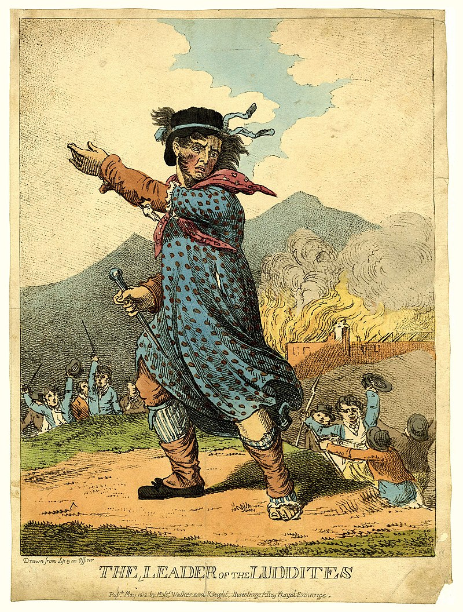
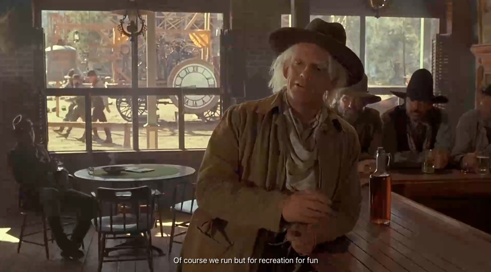

<figure class="">

</figure>
<figcaption class="fullwidth">
Leader of the Luddites, 1812 [source](https://en.wikipedia.org/wiki/Luddite)
</figcaption>

In 1812, the Luddites protested against the industrial revolution, fearing that machines would replace their jobs and dehumanize their work. They were not against technology itself, but rather the way it was being implemented without regard for the workers it affected. In scattered uprisings across England, they destroyed textile machinery and sought to halt the spread of the technology. We're about to go through a similar upheaval with the rise of artificial intelligence; maybe it is a good time to be optimistic about what comes next.

## Doomers in the age of Muscley-Brain-Things

Geoffrey Hinton is widely considered the Godfather of AI. He earned the nickname for pioneering work on neural networks and deep learning, including popularizing backpropagation and mentoring many leading researchers in the field including Ilya Sutskever, and Yann LeCun. He is also known for his advocacy of AI safety and ethics. Some would label him a Doomer. In a recent interview on [Diary of a CEO with Steven Bartlett](https://www.youtube.com/watch?v=giT0ytynSqg&t=2567s) he worried about the future of humanity in the face of rapidly advancing AI technology.

<blockquote style="font-family: sans-serif; font-size: 1em; line-height: 1.9em; width: 80%; margin-right: auto; padding-left: 1em; color: #222;">
Steven Bartlett: Am I right in thinking the sort of Industrial Revolution played a role in replacing muscles? 
Geoffrey Hinton: Yes, exactly 
Steven Bartlett: ...and this revolution in AI replaces intelligence; the brain? 
Geoffrey Hinton: So mundane intellectual labor is like having strong muscles and it's not worth much anymore. 
Steven Bartlett: So, muscles have been replaced, now intelligence is being replaced. So what remains? 
Geoffrey Hinton: Maybe for a while some kinds of creativity.  
Geoffrey Hinton: But the whole idea of Superintelligence is nothing remains.  
Geoffrey Hinton: These things will get to be better than us at everything. 
Steven Bartlett: So, what's do we end up doing in such a world? 
Geoffrey Hinton: Well, If they work for us we end up getting lots of goods and services for not much effort. 
</blockquote>

<iframe width="560" height="315" src="https://www.youtube.com/embed/giT0ytynSqg?t=2567s" title="YouTube video player" frameborder="0" allow="accelerometer; autoplay; clipboard-write; encrypted-media; gyroscope; picture-in-picture; web-share" referrerpolicy="strict-origin-when-cross-origin" allowfullscreen></iframe>

The moral of the interview is that we should be afraid. Humans are just muscley-brain-things and having already replaced the muscles with machines, brains are next. The only thing of value is goods and services.

What an incredibly bleak assessment of humanity.

## Humans are more than just muscley-brain-things. What else are we?

About a year ago I started to keep a list of things I do or care about that will never be replaced by Artificial Intelligence. As a computer engineer and technologist, I have a deep appreciation for what AI can do, but I also believe that humans are more than just muscley-brain-things.

My list might feel trite or obvious or even uninteresting and that is maybe the point. The list is personal. AI will never:

* Feel the feeling I feel when I play the guitar
* Roller skate for me
* Love for me

Hinton's indictment of humanity can be easily inverted. Artificial Intelligence is only concerned with replacing intelligence. He reduces us to our utility as workers, ignoring the rich tapestry of human experience that goes beyond mere labor. In fact, the real limitation is that the total addressable market for AI is intelligence and nothing more. It cannot replace the full spectrum of human experience.

If humans are more than just muscley-brain-things, what else are we? Here is a non-exhaustive list:

* Humans have connection
* Humans have culture
* Humans have communication
* Humans have love
* Humans have soul
* Humans have belief
* Humans have hope
* Humans have emotion
* Humans have experience
* Humans have feeling
* Humans have awareness
* Humans have perception
* Humans have preference
* Humans have value
* Humans have need
* Humans have breath
* Humans have flow

You might be thinking many of these things can be simulated or mimicked by AI. While that may be true to some extent, the depth and authenticity of human experience cannot be fully captured by algorithms. It is only happenstance that these experiences can be superficially imitated because we communicate them through language and behavior, which large language models can replicate to some degree. However, the subjective experience of these human qualities is beyond the reach of AI.

Imagine a scenario where I build a new feature for a product at my job. I use Cursor to write vibe-code for the feature, Copilot to write unit tests, and ChatGPT to generate documentation. The feature is a a success. My boss notices the feature and is prompted by an AI to write me an email praising my work. He presses a button and the AI generates a heartfelt email expressing gratitude for my contribution. I read the email and feel appreciated. Later, at lunch I thank him for the email and point out that I really liked the part where he said "I am impressed with your attention to detail and inspired by your approach to problem-solving." He looks at me confused and says "I didn't write that." I would instantly feel a disconnect and feel devalued.

The email, while well-written, lacks the genuine human connection that comes from knowing that someone took the time to express their appreciation. Even if the generated words are perfectly trained on my boss' writing, and even if they are exactly the same as the words he would have written, the AI-generated email cannot replicate the authenticity of a human interaction. Whatever that substance is that makes human connection real and meaningful cannot be captured by AI and is, in fact, undermined by it.

## Luddites and the American Economy

We often label those who resist technological change as Luddites. However, the original Luddites were not against technology itself, but rather the way it was being implemented without regard for the workers it affected. They sought to protect their livelihoods and communities from the disruptive effects of industrialization.

While I am optimistic about the future, the reality is - as it was with the Luddites and industrialization - AI will disrupt most aspects of our lives. It is unavoidable.

1. Our society is built on capitalism, which rewards efficiency and productivity.
2. Intelligence work offers a disproportionate amount of value relative to effort.
3. AI will perform many intelligence tasks more efficiently and accurately than humans.
4. Capitalism will incentivize the adoption of AI to maximize profits.

The Luddite movement negotiated with the forces of industrialization by advocating for fair labor practices and protections for workers similar to modern labor unions. In the north of England they lobbied for government intervention to regulate the use of machinery and protect workers' rights with letter-writing campaigns and protests. In many cases they turned to sabotage and destruction of machinery when peaceful negotiations failed. In several notable cases they assassinated factory owners and overseers who were seen as threats to their livelihoods.

The economic forces then are not dissimilar from those we face now. Two important economic factors in the United States today are: inflation and unemployment. The government typically reports the unemployment rate as a lagging indicator of economic health. When unemployment is low, it indicates that the economy is strong and businesses are hiring.

For the Luddites the mechanized looms replaced 85-90% the core Luddite craft: Woollen Croppers. For all of the associated crafts it is estimated that 280,000 English workers were displaced in the first few decades of industrialization. This represented about 3.2% of the entire population of England at the time.

During the COVID-19 pandemic there was an unemployment increase of 10.3% (7.2M, April 2020, [bls.gov](https://www.bls.gov/opub/ted/2020/unemployment-rate-rises-to-record-high-14-point-7-percent-in-april-2020.htm)) as businesses shut down and laid off workers - the highest single-month increase on record. This was associated with a 34% decrease in GDP (about 2.15 trillion dollars, Q2 2020, [bea.gov](https://www.bea.gov/news/2020/gross-domestic-product-2nd-quarter-2020-advance-estimate-and-annual-update)). The government responded with stimulus packages and unemployment benefits to support those affected and the job market gradually recovered over the next year.

Anthropic’s CEO Dario Amodei has warned that AI could eliminate up to 50% of entry-level white‑collar roles within five years. That number could be as high as [81 million jobs in the US alone](https://fred.stlouisfed.org/series/PAYEMS). That's 23% of the total population and ten times the number of jobs lost during April 2020. The [National Skills Coalition](https://nationalskillscoalition.org/news/press-releases/new-report-92-of-jobs-require-digital-skills-one-third-of-workers-have-low-or-no-digital-skills-due-to-historic-underinvestment-structural-inequities/) reports that 92% of jobs require digital skills, yet one-third of workers have low or no digital skills due to historic underinvestment and structural inequities. This means that a significant portion of the workforce may be ill-equipped to adapt to the changing job market.

Modest changes to the workforce dramatically affect the stock market and economy. It is for this reason that in August 2025, President Trump publicly questioned the credibility of the monthly jobs report. He cited weak payroll gains and downward revisions and ordered the firing of Erika McEntarfer, the Senate-confirmed commissioner of the Bureau of Labor Statistics. [He accused the data of being "rigged."](https://www.cfr.org/expert-brief/trump-fires-bls-chief-skips-causes-weak-jobs-report).

This period of increased unemployment was coupled with "sticky wage inflation." Sticky wage inflation occurs when wages do not adjust downward in response to economic conditions, leading to persistent inflationary pressures. This is indicative of a labor market where entry-level or lower-digital-literacy workers are unable to negotiate higher wages or find new employment opportunities, resulting in a stagnation of income growth and increased economic inequality.

In is unsurprising then that the September 2025 jobs report has not yet been released and according to Karoline Leavitt, the White House press secretary, the Labor Department’s October reports on jobs and inflation are ["unlikely ever to be released"](https://www.wsj.com/politics/policy/white-house-says-october-jobs-inflation-reports-unlikely-to-be-released-05e57e2b).

In England, this led to the passage of the [Destruction of Stocking Frames, etc. Act 1812](https://en.wikipedia.org/wiki/Destruction_of_Stocking_Frames,_etc._Act_1812) which made the destruction of mechanized looms a capital offense punishable by death (many Luddites were executed for their actions). The military was deployed to suppress the uprisings and restore order. If modern workers are faced with the same economic upheaval as the Luddites how will they respond? In the age of multi-billion-dollar data centers which drive up prices for electricity and water, will modern Luddites resort to sabotage and destruction of AI infrastructure? Will they lobby for government intervention to regulate the use of AI and protect workers' rights?

Regardless of how we respond, it is clear that AI will have a profound and often negative impact on the economy and society.

## The Rise of the Information Age

It is easy to look back at the Industrial Revolution and see the negative impacts it had on workers and communities. However, it is also important to recognize the positive changes that came about as a result of industrialization. Value was created through increased productivity, innovation, and economic growth. New industries and job opportunities emerged, leading to improved standards of living for many people.

Work that was once tedious and labor-intensive became more efficient and accessible and scaled in output. Work that could not be replaced by machines suddenly had a larger pool of unskilled labor to draw from. That drove down wages for unskilled labor but also made goods and services more affordable for the average person. Highly skilled workers were able to focus on more complex and creative tasks, leading to advancements in technology and science.

Farm work that once required an entire family to tend a small plot of land could now be done by a single individual operating a tractor. This not only increased yields, but also freed up time and resources for people to pursue other interests and activities, leading to a more diverse and vibrant society.

Goods which were once luxury items became accessible to the masses. Clothing, food, and household goods that were once handmade and expensive could now be produced in large quantities at lower costs. Additionally, goods that were produced only in a given region could be moved by improved transportation networks, making them available to a wider audience. This democratization of goods and services improved the quality of life for many people and contributed to the growth of a consumer culture.

So what did humanity do with all of the extra time and resources? We thought.

The [1870 Education Act](https://www.parliament.uk/about/living-heritage/transformingsociety/livinglearning/school/overview/1870educationact/) established schools for all children in England and Wales, leading to a significant increase in literacy rates and educational attainment.

> The views expressed by industrialists that mass education was vital to the nation's ability to maintain its lead in manufacture carried considerable weight in Parliament.

Public education eventually became compulsory and free, leading to a more educated and skilled workforce. This, in turn, drove innovation and economic growth, as people were able to contribute their knowledge and skills to various industries and fields. We had to keep the kids busy.

Entire industries emerged which required almost no physical labor at all. Many existed before the industrial revolution, but they were often small-scale and localized. Organization and efficiency became paramount, leading to the rise of the service sector and the birth of the Information Age.

- Medicine
- Law
- Finance
- Technology
- Entertainment
- Arts
- Media

These industries relied heavily on intellectual labor, creativity, and problem-solving skills. They required a different set of skills and knowledge than traditional manual labor, leading to the emergence of new professions and career paths.

In Back to the Future III, Doc Brown explains that in the Future people run for fun, not because they have to. This is a perfect metaphor for how the Industrial Revolution transformed human labor. We no longer have to work with our muscles to survive; instead, we can focus on intellectual pursuits and creative endeavors. We still do physical labor - but often it is for recreation or exercise rather than survival.

<!--
 -->

<iframe src="https://clip.cafe/e/162086" style="position: absolute;top: 0;left: 0;bottom: 0;right: 0;width: 480px;height: 280px;"></iframe>

> Think for fun? What the hell kinda fun is that?

In this way it is easier to think of AI not as a new age, but rather the end of the Information Age. The Information Age was characterized by the rise of intellectual labor and the service sector. AI threatens to replace much of this labor, leading to a potential collapse of the Information Age.

## The Age of Robotics

Robotics is the intersection of physical machines and intelligence through AI. Robots are physical embodiments of AI, capable of performing tasks that require both intelligence and physical manipulation. Robotics has the potential to revolutionize many industries, from manufacturing to healthcare to transportation.

It is very possible that we will largely replace effort with robotics and machines. While this is interesting in how it combines both muscle and brain, it still does not address the full spectrum of human experience. Robots may be able to perform high effort tasks that require physical manipulation and intelligence, but it is just the industrial revolution all over again. Robots will almost definitely replace muscley-brain-things.

## A New Age

The eventualities feel daunting. But, like the Information Age, something must come after Artificial Intelligence. In this new age value will not come from physical labor, intelligence or effort. It will come from the uniquely human experiences that AI cannot replicate. Here is where many people hand-wave and say "some new industry will emerge." But what industry? What new value?

If it is anything like the Industrial Revolution, the new age will likely be characterized by a shift in focus from labor to experience. People will seek out experiences that are authentic, meaningful, and fulfilling. Industries that cater to these desires will thrive.

What will schools look like in this new age? Already administrators and educators are apoplectic about AI. Students are using AI to do their homework and write essays. All the while teachers are using AI to write lesson plans and grade assignments. Eventually it will be AI lessons and homework solved by other AIs. Students will still learn but the focus will shift from memorization and regurgitation to subjective experience and understanding. Learning about U.S. history will be less about memorizing dates and events and more about understanding the human experiences behind them. This is the training that young people will need to thrive in the new age.

In this new era the ability to have an emotional response, to connect with others, to create art and culture, to experience love and hope will be the most valuable skills.

This will stem from new-found efficiencies afforded by AI supported work. For example, in engineering you can easily prototype and iterate designs using AI tools. At scale the number of prototypes that can be created is enormous. The limiting factor becomes the human experience of evaluating and selecting among the options. The human element becomes the bottleneck and the source of value. Being able to discern quality, authenticity, and meaning will be the most valuable skills in this new age. How something makes us feel, how it connects us to others, how it resonates with our values and beliefs will be the key determinants of its success.

We'll spend more time in meditation and contemplation, seeking to understand ourselves and our place in the world. We'll explore new forms of art and culture, pushing the boundaries of human creativity and expression. We'll build deeper connections with others, fostering empathy and understanding across cultures and communities.

We'll do this because companies that are comprised of individuals with these skills will create products and services that resonate with more people on a deeper level. They'll build brands that people feel connected to, fostering loyalty and trust. They'll create experiences that are memorable and meaningful, leading to repeat business and positive word-of-mouth. When all of the intelligence and labor advantages are commoditized, the only remaining differentiator will be the human experience.

Before the Industrial Revolution and the Information Age, the thinkers were philosophers, artists, and writers. They explored the human condition and sought to understand the world around them. In this new age, we may return to this focus on the human experience, but with the added benefit of advanced technology and tools to aid in our exploration.

The future we are heading towards will be painful in the short term, but profoundly beautiful in the long term. The Shamans, Yogis, Priests, Mystics, Psychologists, and Artists will lead the way. It will be rich, vibrant, and fulfilling _because_ it will be uniquely human.

<!--
# Notes

Progression of the ages
    AI as an ending, a culmination not the next age

What else are things that humans do
    Connection
        Culture
        Communication
            GMAIL example
        Love
    Soul
        Belief
        Hope
    Experience
        Perception
            Sense
            Reality
        Preference
            Opinion
        Creativity
    Creativity is an awareness
        Postmodernism
            Readerly writerly and beyond
                This fits more into Experience (c.f. Walt Whitman)
        Sam Altman and latent creativity
            https://stratechery.com/2025/an-interview-with-openai-ceo-sam-altman-about-devday-and-the-ai-buildout/
            Separating talent from creativity or talent from the idea of creativity
    Effort
        Muscles and brains over time
            Replacing with robots, machines

What is yet beyond
    Beauty
    Creation?
    Subjective dependence, collapsing the wave function and decoherence
        How you choose to entangle your quantum self

People will still think
    Back to the Future quote

Stickiness confers value. If we come back to them

What will school look like?
    Administrators are apoplectic about AI, yet the use AI
        Eventually it will be AI lessons and homework solved by other AIs
            we will be mediators
    Time
    Meditation
        Contemplation and action
        Yoga

Scientists and Psychologists
Shamans
Eternal sunshine of the spotless mind
    Pharmacology
-->
