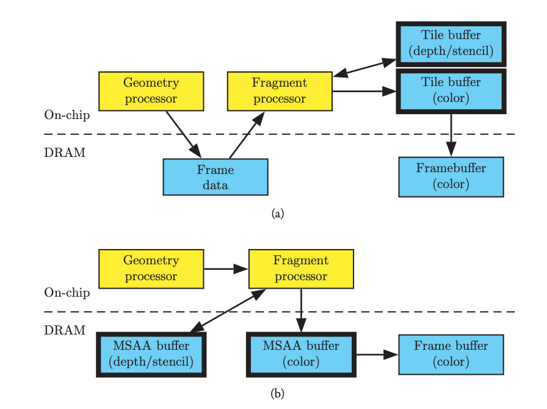

<figure>

</figure>
<figcaption>
Data flow in (a) tiled-based and (b) immediate-mode GPUs for multisampled rendering. Yellow boxes are computational units, blue boxes are memory, and thick borders indicate multisampled buffers. The immediate-mode GPU moves multisampled pixel data on and off the chip, consuming a lot of bandwidth. From [OpenGL Insights, Performance Tuning for Tile-Based Architectures](https://www.seas.upenn.edu/~pcozzi/OpenGLInsights/OpenGLInsights-TileBasedArchitectures.pdf) by Bruce Merry
</figcaption>

**🗺 Exploring - Work in progress**

Getting every ounce of performance out of your game is a dark art. Its study leads to game specific and platform specific shader optimizations, baked lighting, mesh decimation, and horrific tales of endless overdraw. To make it even more difficult, the answers that you've learned along the way for every other platform and every other game engine (and their successive rendering pipelines) are probably not applicable.

For me, I'm just beginning this journey; struggling like many others to make a fun game in my garage using Unity - adding store-bought assets and clicking checkboxes to turn on beautiful effects in my scene. Luckily there are some tricks and many, many good references I've stumbled upon (indexed at the end of this post).

This post is mostly about working to make your game render at the required 72 FPS (frames-per-second) with all of the visual effects and tricks - especially when you are GPU-bound. This post does not cover complex animations, physics simulations and will only briefly discuss shadows.

## Why is this difficult?

Just a quick note: you might be wondering why this is hard? Or why this is different from other platforms? Oculus Quest is an all-in-one device - within the headset is everything you need (and everything you have) to run your game. It is an Android-based device with a Snapdragon 835 chipset and built in Adreno 540 GPU:

> Oculus Quest has two 1600x1440 OLED screens that run at 72 frames per second. By default, apps render to 1216x1344 eye textures... Internally Oculus Quest runs on a Qualcomm Snapdragon 835 chipset... The Snapdragon 835 has 8 cores, 4 of which are large, fast “gold” cores that run up to 2.3 Ghz. Of the four gold cores, applications have full access to 3 of them, while we reserve the fourth for TimeWarp and other system services. The remaining low-power “silver” cores are reserved for tracking and other system software... The Snapdragon 835 chipset includes an Adreno 540 GPU, which runs at 710 Mhz. This is a “binning” or “tiled” GPU, which means that it cuts the scene up into a grid of tiles and renders each in sequence. Oculus Quest comes with 4 GB of memory, 2.75 GB of which is available for applications. - From https://developer.oculus.com/blog/down-the-rabbit-hole-w-oculus-quest-the-hardware-software/?locale=en_US

The key here is that the GPU is a tile-based renderer. Because the chipset is smaller (its a mobile device) there is a limited amount of silicon and power. Because of this the GPU makes tradeoffs between how much bandwidth is used internally to move data back and forth between the more resource-hungry system memory. In immediate mode GPUs, like your gaming PC, these trade-offs fall in the other direction (it isn't a small, mobile device and is plugged into the wall) so a different set of optimizations are typically used. In fact, some optimizations you might normally make for PC/console games will actually hurt the performance of your mobile game. Also, there are two high-resolution screens. So you need to do everything twice - which brings more challenges and - in some cases - more optimizations.

The difference between tile based and immediate mode GPUs is explained in great detail in [OpenGL Insights, Performance Tuning for Tile-Based Architectures](https://www.seas.upenn.edu/~pcozzi/OpenGLInsights/OpenGLInsights-TileBasedArchitectures.pdf) by Bruce Merry.

Luckily there are some tricks which work regardless of the platform. We'll try to use those too.

## Setting up a basic project

Make sure you are using a version of Unity with Android Support and OpenJDK (in the Unity Hub):


Then create a new project with the Universal Render Pipeline selected:


The project should open and have a default scene in it. For our purposes, we don't care about this scene and want to start with a blank canvas.


Delete:

- `Assets/Scenes/SampleScene`
- `Assets/ExampleAssets`
- `Assets/TutorialInfo`
- `Assets/Settings/SampleSceneProfile`

Before we can build our game for the Oculus Quest, we'll need to add some packages. Open the Package Manager. For current versions of Unity, you'll need to show the preview packages. Currently you do this using the drop-down:


In `2020.*` versions enabling preview packages has moved.

Select the `XR Interaction Toolkit`[^xr] package and click install:

[^xr]: Wait - what is "XR". XR is short for "cross-reality" - and is the abbreviation for games and projects that support both VR (virtual-reality) and AR (augmented reality).


I also install the `Android Logcat` plugin:


We're ready to create our scene. In the `Scenes` folder in `Assets`, create a new scene called Game:


Double click to open it.

### Setting up XR

To get started, we'll want to setup our scene so that our headset is tracked and is used as the primary camera. In the Hierarchy tab create a new empty object called `XR`:


Select the object, set the `Y` position to `1` and add an `XR Rig` component.


Within the `XR` object create a new empty object:


Name it `Camera Offset`. Within the `Camera Offset` add a new Camera object:


Add a `Tracked Pose Driver` component to the Camera object:


That's all we need for now (this is just to get the scene running and visible; not pretty); we just need to wire things together. Select the `XR` object again. Then drag the child Camera object to `Camera Game Object` property on the `XR Rig` component. Drag the `Camera Offset` object to the `Camera Floor Offset Object` property.


At this point we can remove the `Main Camera` game object, we'll be using the `XR` camera instead.

### Creating a basic world

We've created enough for our player to put on their headset and be in the world - but we haven't actually created anything for them to see. Let's add a basic platform for them to stand on and a table.

Create a new `3D Object`, `Cube` and name it `Floor`. Set the scale to `100, 1, 100`:


Create another new `3D Object`, `Cube` and name it `Table`. Set the `Z` position to `10` (so it is 10 meters in front of the camera) and set the `X` scale to `10` so it appears like a long desk and set the `Y` position to `1` so it is sitting on the `Floor`.


We'll need some materials for the objects (so we can see them). Select the `Materials` folder in your `Assets` and create a new material and name it `Black`. Set the `Base Map` color to black:


Make another material called `Red` and set the `Base Map` color to red:


Drag the `Black` material into your game view and drop it onto the `Floor` object. Drag the `Red` material into the game view and drop it onto the `Table` object.


### Building and deploying the application to your Oculus Quest

If you are working on Windows and have an Oculus Link then you might be tempted to click the ▶️ button in Unity and see how it all works. That's great; but the performance you see using this method won't correctly reflect the performance on the Quest (the Oculus Link leverages the GPU on your computer). Instead we'll want to build the project for Android and send it to the Oculus Quest.

To do this you'll need to [setup your device for developer mode](https://developer.oculus.com/documentation/native/android/mobile-device-setup/). Once your Quest is in developer mode and plugged in, you can configure your project.

Open `Build Settings...` and click `Add Open Scenes`, then click on the `Android` platform option and change the default texture compression to `ATSC`[^atsc]. Then click `Switch Platform`:

[^atsc]: I've skipped most of the platform specific changes you can make but changed the texture compression. Why? Changing this later can be very slow. Because of that I tend to do it as early as possible in the process.


Next, click on `Player Settings`. Choose the `XR Plugin Management` category on the left then click `Install XR Plugin Management`:


Once installed, check the `Oculus` box (this will install the [Oculus OpenXR Mobile SDK](https://developer.oculus.com/downloads/package/oculus-openxr-mobile-sdk/)):


We won't change any other settings for now - though we'll want to change some settings later to increase the performance. Click `Build and Run`, choose a name when saving the game and get ready:


Oculus has additional information about setting up your application in the documentation under [Configure Unity Settings](https://developer.oculus.com/documentation/unity/unity-conf-settings/). It details specific quality configurations and rendering preferences which we'll explore below.

## Seeing and measuring our progress

When the game is deployed and starts we should immediately begin seeing logs in Unity because we've installed the Android Logcat plugin. The logs will have a lot of useful information. For starters it is useful to look at the `VrApi` logs for `FPS` (frames per second). For example:

```
2020/07/11 11:08:28.274 15077 15283 Info VrApi FPS=72,Prd=45ms,Tear=0,Early=72,Stale=0,VSnc=1,Lat=1,Fov=0,CPU4/GPU=2/2,1651/414MHz,OC=FF,TA=0/0/0,SP=N/N/N,Mem=1804MHz,Free=954MB,PSM=0,PLS=0,Temp=34.0C/0.0C,TW=2.98ms,App=2.85ms,GD=0.00ms,CPU&GPU=6.76ms,LCnt=1,GPU%=0.43,CPU%=0.16(W0.19),DSF=1.00
```

What do all of these values mean? They are all defined in the [VrApi Stats Definition Guide](https://developer.oculus.com/documentation/tools/tools-logcat-stats/?locale=en_US). At a minimum you should focus on the `FPS`. The Oculus Quest refresh rate is `72hz` and therefore the target `FPS` for games is `72`. As players move and the complexity of the scene changes this may fall below `72` occasionally, but it should normally not. Unfortunately the `FPS` is really a result of all of the other numbers and is more of a "final-answer" than a starting point. In fact, only watching the `FPS` can be misleading as it should never go above `72`.

Instead you should focus on the `App` (how much time only the GPU took to render a frame) and `CPU&GPU` times. In order to render `72fps` the total rendering time per frame must be `13.88ms` or less. In our example above our `FPS` is a solid `72` and our `App` is `2.85ms`. This means we have an additional `11.03ms` per frame to make our scene prettier without impacting our `FPS` (again, this is not exact; it is possible our application is CPU bound instead). According to the documentation for `App`:

> This value is one of the most useful numbers to monitor when optimizing an application. If the length of time shown is longer than a single frame’s length (13.88ms for 72 frames per second), the app is GPU bound. If the length is less than a frame’s length, the app is probably CPU bound.
> In addition to using this metric to determine if an app is GPU or CPU bound, it’s also useful to monitor it as you change shaders, add textures, change meshes, and make other changes. This can allow insight into how much headroom remains on the GPU, and if debug logic is used to turn on and off specific objects, you can tell how performance-intensive those objects are.

There are a number of other useful pieces of information in the logs. For example, `CPU4/GPU=2/2` indicates the clock levels of the CPU and GPU. These can go up to `4/4` to give even more power (for faster rendering) at the cost of battery life and heat. It is best if these remain `2/2` but it indicates that there is still some additional capacity if we start to miss our `FPS` budget. We can also see the GPU and CPU usage percent. Once those near `1.0` our application will become GPU or CPU-bound and we will start to miss our targets.

### Using `adb` and `scrcpy`

The Android Debugging Bridge (or `adb`) gives you access to a number of additional tools including a command line interface to the Quest. It isn't required, but I tend to use it.

If you are working on Windows there are some instructions available; read [Enable Device for Development and Testing](https://developer.oculus.com/documentation/unity/unity-enable-device/). On a Mac, in a Terminal, run:

```bash
brew cask install android-platform-tools
brew install scrcpy
```

Once that is installed, attach your Oculus via USB-C and run:

```bash
scrcpy -c 1440:1550:0:0
```


This should attach a view for a single eye. Be careful! Sometimes what you see in the `scrcpy` window doesn't always perfectly match what the player sees on the Oculus Quest. If you want to see both eyes you can just use `scrcpy` [^scrcpy]. If you get an error about the connection you can usually run:

```bash
adb disconnect
```

If that doesn't work you can do the more extreme:

```bash
adb kill-server
```

And then run `scrcpy` again.

[^scrcpy]: `scrcpy` or Screen-Copy is part of Genymobile and can be found https://github.com/Genymobile/scrcpy#mac-os. There are options for other platforms as well. See also: https://note.mu/masaki_ponpoko/n/nc759f6499c79

### Checking the logs

We've been using the Android Logcat plugin in Unity to see the logs, but you can also view the logs from terminal. The logs are verbose so it is sometimes helpful to start by clearing them:

```
adb logcat -c
```

Then check them:

```
adb logcat -d
```

Using `System.Debug` statements in your application will output information to the logs making it a useful way to see what is happening in your program.

### Connecting via Wi-fi

So far all of our interaction with the Oculus Quest has required it to be plugged in via USB-C cable. Unsurprisingly, you can also connect via Wi-fi. First you'll want to make sure that the device is connected via USB:

```bash
adb devices
```

Once you've got the device connected you can check it's local IP address:

```bash
adb shell ip route
```

Now setup `tcpip` for the connected device and tell it to listen on port `5555`:

```bash
adb tcpip 5555
```

Once you've done this the device is still connected to USB and your computer is communicating via
USB but it is also listening for `tcpip` connections via Wi-Fi. Connect to it via Wi-Fi:

```bash
adb connect <ipaddress>:5555
```

At this point you can unplug the USB cable and you should still be able to work with the Quest via
`adb` over Wi-Fi. For example:

```bash
adb logcat -d
```

If you want to explicitly connect to a particular Quest you can specify the server with `-s`:

```bash
adb -s <ipaddress>:5555 logcat -d
```

To go back to using USB, plug in the cable again and connect:

```bash
adb connect usb
```

In some cases the version of `adb` you install is different than the version that is used in Unity. This can lead to unexplainable errors either in Unity or in the Terminal. In most cases it simply causes one of the two tools to repeatedly lose its connection to the quest. To work around this, copy the `adb` binary from the Unity installation to `/usr/local/bin`.

You can find the path in the Unity Preferences window (in the `platform-tools` folder inside of the Android SDK path):


### OVR Metrics Tool

Working with the logs can be helpful, but sometimes you want to play your game and keep an eye on the `FPS` at the same time. To do this you can use the [OVR Metrics Tool](https://developer.oculus.com/documentation/tools/tools-ovrmetricstool). To install it, (agree to the Terms of Service and Privacy Policy) and [download](https://developer.oculus.com/downloads/package/ovr-metrics-tool/) it.

To install it, use `adb`:

```bash
adb install ~/Downloads/OVRMetricsTool_v1.5/OVRMetricsTool_v1.5.apk
```

Once it is installed you can configure it directly on the Oculus Quest by going to your apps, choosing `Unknown Sources` and running the `OVR Metrics Tool`. You can also start the application using `adb`:

```bash
adb shell am start omms://app
```

I normally choose the advanced view and enable the persistent overlay. Once configured, you can also enable the metrics as an overlay using `adb`:

```bash
adb shell setprop debug.oculus.omms.enableOverlay true
```

Restart your application:


Sometimes getting the overlay to show up takes a few tries. If you find yourself struggling to show the overlay try turning the Quest off and on (even without a full restart) or try killing the `omms://app` via `adb`, restarting it and relaunching your application from Unity's `Build and Run` menu.

The Oculus blog goes into much greater detail in [OVR Metrics Tool + VrApi: What Do These Metrics Mean?](https://developer.oculus.com/blog/ovr-metrics-tool-vrapi-what-do-these-metrics-mean/?locale=en_US).

### GPU Profiling with `ovrgpuprofiler`

Using `logcat` and the OVR Metrics Tool will help you understand where to focus you attention. But how should you proceed if your application is running slowly and is GPU-bound? You might need to remove complex post-processing effects, reduce the number of triangles in your scene, adjust your shaders, or find areas of excessive overdraw. How do you know? You need to profile what is happening on the GPU.

To do this you can use `ovrgpuprofiler`. This is explained in the documentation in [GPU Profiling with ovrgpuprofiler](https://developer.oculus.com/documentation/tools/tools-ovrgpuprofiler). Run:

```bash
adb shell ovrgpuprofiler -m -v
```

Using this tool you can run traces or request specific statistics. Additionally, if you enable the `ovrgpuprofiler` you'll have access to more statistics in the OVR Metrics Tool (not in the Basic or Advanced view). For more information, see [OVR Metrics Tool Stats Definition Guide](https://developer.oculus.com/documentation/tools/tools-ovrstats/).

To enable it, run:

```bash
adb shell ovrgpuprofiler -e
```

Then restart your program. To display it again, run:

```bash
adb shell ovrgpuprofiler -d
```

> Note: running the profiler will affect performance, make sure to disable it when you are done tuning your performance

### GPU Systrace for Render Stage Tracing

Though you can use `ovrgpuprofiler` to see real-time metrics and record traces, it is incredibly helpful to visualize those traces. To do this you can use [GPU Systrace for Render Stage Tracing](https://developer.oculus.com/documentation/tools/tools-gpusystrace/). Download the replacement [`systrace_trace_viewer.html`](https://developer.oculus.com/downloads/package/gpu-systrace/) and install it.

In order to capture a systrace your application will need to be built with the `INTERNET` permission in your `AndroidManifest.xml`:

```xml
<uses-permission android:name="android.permission.INTERNET" />
```

By default the manifest is auto-generated. To activate the `INTERNET` permission we can override the auto-generated file, or just change the corresponding setting. Open the Player Settings and change Internet Access to `Required`:


If your build is not a `Development Build`, your `systrace` will be completely blank. Check the `Development Build`[^development] box in the `Build Settings`:


[^development]: Note: you cannot publish a development build to Oculus. You'll need to uncheck this box when preparing your final submission.

From the command line, enable GPU tracing:

```bash
adb shell ovrgpuprofiler -e
```

Rebuild your app and run it. Then:

```bash
adb shell pm list packages
```

Find your package and then begin tracing:

```bash
python2 systrace.py --app="package:com.DefaultCompany.VRPerformance" app renderstage
```

Let this run just for a couple of seconds, then press **Enter**. Open the resulting file:


From here you can zoom in on individual frames and see where the delay is happening.

### Unity Profiler

One of the best tools you can use is the [Unity Profiler](https://docs.unity3d.com/Manual/ProfilerWindow.html). This tool allows you to dig into individual frames and how they are processed.


To use this, open the `Profiler` item in the `Window`, `Analysis` menu. By default this will not show the GPU rendering as it can be performance intensive. To prepare your build make sure you have enabled:

- `Development Build`
- `Autoconnect Profiler`
- `Deep profiling support`


Also, it can be helpful to open the Player Settings and check `Enable Internal Profiler* (Deprecated)`.

Now when you `Build and Run` your application the profiler should start right away. If it doesn't auto-connect, verify you are connected to the correct device:


The Unity documentation has more detailed information on the various profiler panes. When debugging graphic performance make sure to look at:

- [GPU Usage Profiler module](https://docs.unity3d.com/Manual/ProfilerGPU.html)
- [Rendering Profiler](https://docs.unity3d.com/Manual/ProfilerRendering.html)

## Multi-sample anti-aliasing

The first thing you should do for your Oculus Quest game is turn on Multi-sample anti-aliasing (MSAA) to `4X`. This may sound surprising, but MSAA at `4X` is so common that it is built-in on many mobile platforms. Because of this, it is often believed that you can add this effect for "free". In fact, choosing `4X` is often faster than `2X` and almost always faster than the temptingly-named "Fast Approximate Anti-aliasing" (FXAA).

There are a few ways to make this change. If you've created your project using the Universal Rendering Pipeline template (as we did above) you'll want to change the Universal Render Pipeline settings. Before you do that, ensure that the `Camera` object in our `XR` is deferring to those settings:


Notice that `Anti-aliasing` is set to `None` and that the `MSAA` setting (under Output) is set to `Use Pipeline Settings`.

With this configured you can change your `UniversalRP` asset in the `Settings` folder under `Assets`. But wait, there are three:

- `UniversalRP-HighQuality`
- `UniversalRP-LowQuality`
- `UniversalRP-MediumQuality`

How do you know which one will be used? The answer is: it depends. Within then `Project Settings` is a `Quality` pane. At the top of this pane is a grid of checkboxes. Notice that the default quality (green checkbox) for Android is "Medium". This means that when your application is run on the Oculus Quest it will use the settings from the `UniversalRP-MediumQuality` asset. However, if you click the ▶️ button in Unity, the game will run on your computer and will use the settings from the `UniversalRP-HighQuality` asset. This can be horribly confusing, but is actually a nice feature that allows you to adjust the quality of your game based on the platform.


Let's open the `UniversalRP-MediumQuality` asset and change `MSAA` to `4X` and then build our application and run it. In our simple scene this was the impact:

- `MSAA` at `2X` adds about 0.6ms to the `App` time
- `MSAA` at `4X` adds about 1.2ms to the `App` time
- `MSAA` at `8X` adds about 1.3ms to the `App` time
- `FXAA` (with Post Processing) adds about 4.8ms to the `App` time

Again, because FXAA is added as a post-processing effect it performs poorly on the tile-based GPU. Additionally, the color quality is lower compared to `MSAA` anti-aliasing. I suspect as the scene increases in complexity the difference between `4X` and `8X` time will increase. It is worth testing in your own application.

## Lighting effects

## Baking lights

## Post-processing

## Occlusion culling

- Use mesh-based occlusion culling (see [Occlusion Culling](https://docs.unity3d.com/Manual/OcclusionCulling.html) in the Unity Manual).[^1]

## LOD

## Baking colliders

## Textures

- Use trilinear or anisotropic filtering on textures. See [Textures](https://docs.unity3d.com/Manual/class-TextureImporter.html) in the Unity Manual for more information.[^1]

## Adding assets

## References

- [OpenGL Insights, Performance Tuning for Tile-Based Architectures](https://www.seas.upenn.edu/~pcozzi/OpenGLInsights/OpenGLInsights-TileBasedArchitectures.pdf) (PDF) by Bruce Merry - An in-depth chapter on the differences (and trade-offs) between Immediate-mode GPU and Tile-base GPU architectures.

- [Oculus OpenXR Mobile SDK](https://developer.oculus.com/downloads/package/oculus-openxr-mobile-sdk/) - Oculus toolkit for integrating Oculus into your Unity project.

- [Down The Rabbit Hole w/ Oculus Quest: The Hardware + Software](https://developer.oculus.com/blog/down-the-rabbit-hole-w-oculus-quest-the-hardware-software/?locale=en_US) - Chris Pruett, Oculus Blog, 2019 - An overview of some of the trade-offs when optimizing for an Oculus Quest.

- [VrApi Stats Definition Guide](https://developer.oculus.com/documentation/tools/tools-logcat-stats/?locale=en_US) - Documentation on the logging format for `logcat` output for Oculus Go and Quest.

- [Squeezing Performance out of your Unity Gear VR Game](https://argos.vu/squeezing-performance-out-of-your-unity-gear-vr-game/) - 2016 article performance tuning in Unity; fantastic techniques; many still available on Oculus Quest.

- [Measuring performance with the built-in profiler](https://docs.unity3d.com/Manual/iphone-InternalProfiler.html) - Unity Manual article; not sure if this is relevant.

- [Getting Started w/ The Unity GPU Profiler for Oculus Quest and Go](https://developer.oculus.com/blog/getting-started-w-the-unity-gpu-profiler-for-oculus-quest-and-go/)

- [Testing and Performance Analysis](https://developer.oculus.com/documentation/unity/unity-perf/) - Overview of performance testing on the Oculus website - lists the targets, some tips, and shows some profiling and analysis options.

- [Oculus Profiler Panel](https://developer.oculus.com/documentation/unity/unity-profiler-panel/)

---

[^1]: https://developer.oculus.com/documentation/unity/unity-best-practices-intro/

<!--

https://developer.oculus.com/documentation/unity/book-unity-gsg/

- Android Marshmallow
- Deep Profiling Support
- Enable Frame Timing Stats
- Enable Internal Profile (Deprecated)
- Stack Trace full https://rpl.cat/lj2rjcNqSPeM972ddQeYcNIPAI63XSjzdxUsi5kc2QA


https://developer.oculus.com/documentation/unity/unity-best-practices-intro/

-->
