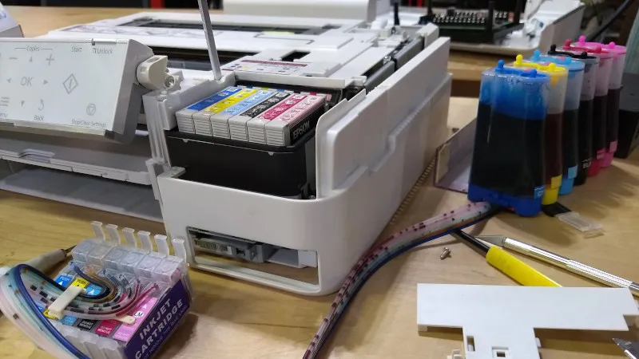
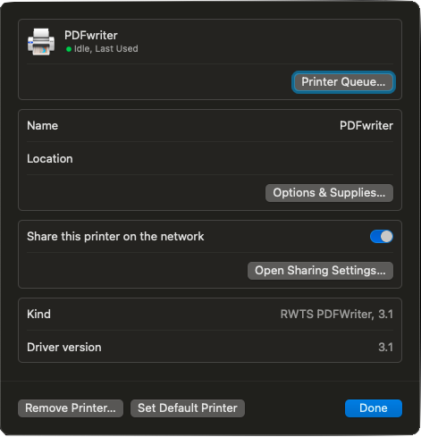
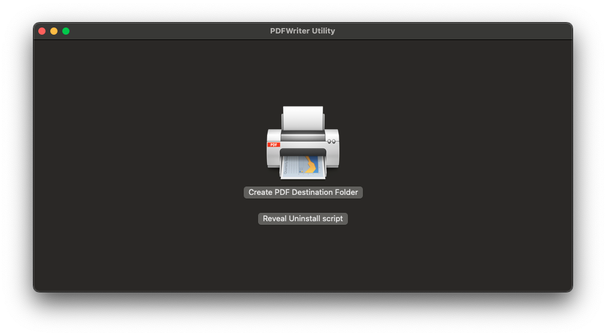
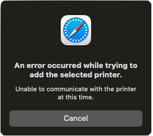

<figure class="fullwidth">

</figure>
<figcaption class="fullwidth">
Image credit: <a href="https://hackaday.com/2019/12/06/inkjet-printing-on-the-cheap-with-a-continuous-ink-system/">INKJET PRINTING ON THE CHEAP WITH A CONTINUOUS INK SYSTEM</a>
</figcaption>

When the economy crashes and the world ends you'll find us all trading ink cartridges for currency. Until then, you probably want to make amazing prints of your favorite projects and if you are like me you are afraid to spend the ink.

When I was working on my PhotoBooth project I found myself iterating on the print design. I'd done the math and figured out that each print on my photo printer would cost me just under $1.00. I was not going to print 1000 copies of my design to get it right. I needed a way to print to a PDF to test my designs.

Instead of solving the problem in code (which I show at the end of this post) I found myself solving it in the printer. I had to figure out how to print to a PDF from an iPad. If I could start over, I would solve the problem in code and just render the PDF and send it to a file.

## Fake printers are like real printers

My real printer connects to my WiFi (after an incredible number of strange key-presses) and has a Bonjour name. I can print to it from my phone, my iPad, and my laptop. I can also print to it from my server. I can print to it from anywhere on my network.

[Bonjour](https://developer.apple.com/bonjour/) is Apple's implementation of Zeroconf or multicast DNS. It's a way for devices to find each other on a network, including printers, and advertise their services.

Now, all I needed was a fake printer I could install onto my Mac. It turns out [PDFwriter](https://github.com/rodyager/RWTS-PDFwriter) is exactly that. It's a printer driver that prints to a PDF.

[Download](https://github.com/rodyager/RWTS-PDFwriter/releases/download/v3.1/RWTS-PDFwriter.pkg) the package and install it.



Then run the PDFWriter Utility to create the destination folder for your PDFs. The utility will create a folder in `/private/var/spool/pdfwriter/[username]`. And then it will create a symlink to that folder at `~/Documents/PDFWriter`. It will also create a folder `/private/var/spool/pdfwriter/anonaymous` (or `anonymous` depending on your version). Technically, it will not create these immediately but on first use.  [^destination]



[^destination]: If you get an error creating the destination folder because it already exists you can probably safely ignore it. If you are a purist you can delete the folders and symlinks and try again.

You're done. You can now print to a PDF from any application on your Mac. Select `PDFwriter` as your printer and you will see the PDF show up in the destination folder you created. But we want to be able to print to it from our iPad.

Open your Printer Sharing settings and share the PDFwriter printer.


This makes the printer available to other computers on your network, but not on your iPad. It turns out this is exactly what would happen with a real printer.

> At this point you should restart your computer. This will ensure that the printer is properly shared and that the CUPS configuration is updated. It is possible that you don't need to do this, but I couldn't find the magic set of services that needed to be restarted to see all of the changes.

In order to share the printer to your iPad you need to enable AirPrint.

Luckily there is an application called `dns-sd` that can advertise a printer as an AirPrint printer. Open a terminal and run the following command:

```bash
dns-sd -R "PDFwriter @ AirPrint" _ipp._tcp,_universal . 631 \
  pdl=application/octet-stream,application/pdf,image/jpeg,image/png,image/pwg-raster,image/urf \
  adminurl= \
  rp=printers/PDFwriter \
  TLS=1.2 \
  Color=T \
  Copies=T
```

This command will advertise the PDFwriter printer as an AirPrint printer. It will start a daemon and continue to run (until you stop it with `Ctrl+C`). You should see:

```bash
Registering Service PDFwriter @ AirPrint._ipp._tcp,_universal port 631 TXT pdl=application/octet-stream,application/pdf,image/jpeg,image/png,image/pwg-raster,image/urf adminurl= rp=printers/PDFwriter TLS=1.2 Color=T Copies=T
DATE: ---Sat 17 Feb 2024---
11:22:40.253  ...STARTING...
11:22:40.899  Got a reply for service PDFwriter @ AirPrint._ipp._tcp.local.: Name now registered and active
```

At this point, if you were to try to print to this printer from another computer on your network, you could select it and install the driver but you would end up seeing an error message:



In order for us to properly share this printer we need to update the CUPS configuration.

## CUPS

CUPS is the [Common Unix Printing System](https://www.cups.org) and is the system that manages printers on your Mac. In fact, it is probably the system that manages printers on your Linux machine as well. It is also the default printing system for Windows Subsystem for Linux (WSL) and is used by Docker for Mac. [^cups]

[^cups]: It has a long and interesting history: it was created in 1997, by Michael Sweet and open sourced (as GPL) in 1999 and was subsequently bought by Apple in 2007. It continues to be owned by Apple and is open source. However, as of 2018 Apple indicated that they would begin deprecating it in MacOS and subsequently the version that ships has fallen behind. The most current versions fall under the [OpenPrinting](https://openprinting.github.io/) project.

Some helpful links:

* [CUPS Documentation](https://www.cups.org)
* [CUPS Apple Open Source](https://opensource.apple.com/source/cups) (v494.1 at the time of this writing)
* [CUPS GitHub Repository](https://github.com/apple/cups)
* [OpenPrinting](https://openprinting.github.io/)

The configuration file for CUPS is located on your computer at `/etc/cups/cupsd.conf` (the default non-modified version is `/etc/cups/cupsd.conf.default` as a backup in case you or some process has made changes). We'll need to share our printer and make some changes to this file in order to print using AirPrint. In a terminal, run the following:

```bash
lpadmin -p PDFwriter -o printer-is-shared=true -o cupsIPPSupplies=false -o cupsSNMPSupplies=false -u allow:all -E
```

### Changing your CUPS configuration

> Note: if you are running this on a MacOS older than High Sierra you may not need this.

The default configuration for CUPS is set to only listen for connections from the local machine on the local interfaces. This is a security feature. But there are cases where you want to relax this security feature. For example, if you want to share a printer on your network or if you want to enable the web interface for CUPS, like we do.

CUPS relies on the `ipp` protocol (Internet Printing Protocol) which is a simple protocol that is based on HTTP. It is a RESTful protocol that uses the POST method to send print jobs and the GET method to get information about printers. We'll want to allow other machines on our network to access our printer using this protocol.

Edit the file `/etc/cups/cupsd.conf`. Change:

```conf
# Only listen for connections from the local machine.
Listen localhost:631
Listen /private/var/run/cupsd
```

to:

```conf
# Listen to connections from any interface.
Port 631
Listen /private/var/run/cupsd
ServerAlias *
```

This changes the configuration to listen to port 631 on all interfaces (including your ipv4 and ipv6 network interfaces). It also sets the server alias to `*` which is a wildcard for any hostname. Technically this is less secure than you need. If you know your server's hostname you can set it to that instead.

It is not required, but can be helpful to enabled the web interface. Change:

```conf
# Web interface setting...
WebInterface No

# Restrict access to the server...
<Location />
  Order allow,deny
</Location>
```

to:

```conf
# Web interface setting...
WebInterface Yes

# Restrict access to the server...
<Location />
  Order allow,deny
  Allow All
</Location>
```

This will enable the web interface and allow access to it (only the root page, you'll need to change the `Location` permissions for other paths) from any computer on your network.

Finally, restart the CUPS service:

```bash
sudo launchctl stop org.cups.cupsd
sudo launchctl start org.cups.cupsd
```

Stopping and starting the service appears fast when you run these commands. But it takes a while (sometimes one to two minutes) for the service to actually stop and start.

You might be thinking: "hey I can just use [`cupsctl`](https://www.cups.org/doc/man-cupsctl.html) to change the configuration". You can, but it doesn't allow you to change the `Listen` directive directly. Also, it reformats and removes all comments from the file. Because of this, I edit the file directly. If you want to use `cupsctl`, you would run the following:

```bash
# Only run this if you are sure
sudo cupsctl --share-printers --remote-any --remote-admin "WebInterface=Yes"
```

At this point you should be able to go to http://localhost:631 (or http://computername.local:631) and see the CUPS web interface. You should be able to see the PDFwriter printer and you should be able to print to it from any computer or iOS device on your network.

If you are still getting an error (or if it appears to print but you do not see a file) you will need to look at the CUPS logs:

```bash
tail -f /var/log/cups/error_log
```

The `-E` flag on our `lpadmin` command should have set the printer to allow all users. If you are still getting an error you can try to adjust the permissions in the CUPS configuration file.

### Canceling jobs

After printing I noticed that the Print Center was full of jobs. You might think you could change the permissions of CUPS to allow you to cancel these jobs (see the `Cancel-Job` directive in the `cupsd.conf` file) or you could use the `cupsctl` command to allow you to cancel jobs (see `cupsctl --user-cancel-any`). But you would be wrong. If you did this you would see the following error in your local CUPS error log:

```bash
E [18/Feb/2024:07:52:19 -0500] [Client 4] Returning IPP client-error-not-possible for Cancel-Job (ipp://localhost:631/jobs/47) from localhost.
```

Unfortunately, CUPS doesn't know anything about these jobs. They are job remnants. If you look in the CUPS web interface you will see that the jobs are not there. In order to remove these jobs you will need to use the `cancel` command:

```bash
cancel -a -x
```

This removes all jobs (`-a`) and forces the removal of the jobs (`-x`). You can also remove a specific job by running `cancel [job-id]`.

## Printing to an AirPrint printer from your localhost

You may have noticed that I said you should be able to print to it from any computer or iOS device on your network. If you tried to print from your local computer to the AirPrint computer, you would find that it doesn't work. This is because the CUPS restricts printing to the localhost from the localhost. If you attempt to print to the AirPrint printer from your local computer you will see the following error in your local CUPS error log:

```bash
E [18/Feb/2024:08:51:49 -0500] [Client 18] Request from "localhost" using invalid Host: field "computername.local:63
```

This is completely intentional and is a security feature. In the [CUPS code](https://github.com/apple/cups/blob/a8968fc4257322b1e4e191c4bccedea98d7b053e/scheduler/client.c#L3579C1-L3590C4) you can see that it checks to see if the request is coming from the localhost and if it is it checks to see if the Host header is the same as the server name. If it is not it returns an error:

```c
if (httpAddrLocalhost(httpGetAddress(con->http)))
{
 /*
  * Only allow "localhost" or the equivalent IPv4 or IPv6 numerical
  * addresses when accessing CUPS via the loopback interface...
  */

  return (!_cups_strcasecmp(con->clientname, "localhost") ||
          !_cups_strcasecmp(con->clientname, "localhost.") ||
          !strcmp(con->clientname, "127.0.0.1") ||
          !strcmp(con->clientname, "[::1]"));
}
```

This code was added in 2009 https://github.com/apple/cups/issues/3118. The goal was to prevent a DNS rebinding attack. This is a type of attack where a malicious website could use a DNS rebinding attack to access the CUPS web interface and print to your printer. Unfortunately, it also prevents you from printing to your AirPrint printer from your local computer (we are explicitly using `dns-sd` to rebind our localhost).There is no way to disable this feature.

The worst part is this applies to any local loopback interface. For example, if you are attempting to print from the iOS simulator you will also see this error. Printing from an actual iOS device will work because it will not use the loopback interface.

# Troubleshooting

* You may have noticed that the casing of `PDFwriter` (or `PDFWriter`) is inconsistent. If you are having trouble printing to the printer you may want to check the case of the printer name in the CUPS web interface and in the `dns-sd` command.

* If you are attempting to print using an older application you might run into issues with PostScript. In older versions of MacOS (before MacOS Sonoma) the operating system would natively accept PostScript and convert it to PDF. This is no longer the case and any PostScript jobs result in an error. If you are having trouble printing from an older application you might want to try to print to a PostScript file and then convert it to PDF using `ps2pdf`. PDFWriter relied on this behavior and because of this no longer supports PostScript. For more information see https://github.com/rodyager/RWTS-PDFwriter/issues/42
