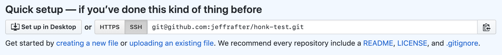

<figure class="fullwidth">

</figure>
<figcaption class="fullwidth">
Image credit: GitHub's <a href="https://www.youtube.com/watch?v=STWzZsg973o" rel="noopener noreferrer">Bring innovation to work with GitHub Enterprise</a>
</figcaption>

Previously, I posted about <a href="./working-with-github-actions">working with GitHub Actions</a>. It covered how the basics of setting up a repository, configuring embedded actions and the associated workflows. If you haven't worked with GitHub Actions before, you might want to read that first.

Once you've created your amazing GitHub Actions, you'll want to re-use them and share them with your friends. To do that you'll want to organize your project a little differently. Also, you'll want to release your actions with all of the dependencies included so that they run efficiently. In this post we'll create a repository which contains a GitHub Action - built in TypeScript - and a second repository which will use the action.

Before you read this it is important to note: starting with a [template](https://github.com/jeffrafter/typescript-action-template) will save you a lot of time and setup. Creating actions can be very simple. In this post, however, I am going to work through and explain all of the steps. Included in this post are some of the reasons I've chosen one particular setup and skipped another. When getting started with GitHub Actions it is difficult to understand how all of the pieces fit together, or why you might want to create an action for a particular task. Hopefully this post provides some helpful examples. That said, there are probably steps here that you've seen before, don't care about, or just want to skip and that's okay.

In order to follow this, you'll need a GitHub account. Additionally, you'll need to [sign up for the GitHub Actions beta](https://github.com/features/actions). The examples will be in TypeScript.

# Honk

For our example we'll create a GitHub Action which listens for new issue comments - if the comment doesn't contain the word "honk" our action will delete the comment and add a new comment with a picture of the goose from [Untitled Goose Game](https://goose.game/).[^goose] This isn't very practical, but it should serve as a good foundation for building actions that respond to comments.

[^goose]: The inspiration for this GitHub Action came from a Discord Bot created by [@melissamcewen](https://twitter.com/melissamcewen/status/1176980019811405824).

Here is the layout for our action:

```
__tests__
  honk.test.ts
.eslintignore
.eslintrc.json
.gitignore
.nvmrc
action.yml
honk.ts
jest.config.js
package-lock.json
package.json
README.md
tsconfig.json
```

Notice that `honk.ts` and `__tests__` are both in the root of our respository. In this case our action is not very complex, using only a single file. If you have a complex action which contains many modules it might make sense to to put these into a `src` or `lib` folder.

We'll dig into each of these files.

# Setup

First you want to create a folder for your project:

```bash
mkdir honk-action
cd honk-action
```

## Environment

As we did in the previous post we'll be using TypeScript to build our action, which requires Node. Out of the box GitHub supports a few environments for your actions to run [^environments]. There is built-in support for running actions built in JavaScript (using Node). When we release our action we'll package up the compiled JavaScript so that users of the action don't need to install the TypeScript dependencies. Taking a few extra seconds to build your action on execution may not seem like a big deal; but GitHub Actions have a limited about of [free](https://github.com/features/actions) compute time. While developing an action this might not matter; but long-term those seconds can add up. Leveraging the default environments means your action will run more quickly and reduce the amount of billable hours used.

[^environments]: There are several different [virtual operating systems](https://help.github.com/en/articles/virtual-environments-for-github-actions#supported-virtual-environments-and-hardware-resources) you can use for your actions which come preloaded with [useful software](https://help.github.com/en/articles/software-in-virtual-environments-for-github-actions). Additionally, you can utilize Docker containers running in one of these virtual environments to pre-configure your hosts.

Let's setup our example to use Node. If you have multiple local projects you might run into a conflict about which Node version should be used. [Node Version Manager](https://npm.github.io/installation-setup-docs/installing/using-a-node-version-manager.html) solves this problem. To control which version of Node should be used in your project, add an `.nvmrc`[^dotfiles] file:

```json
12.7.0
```

The file is pretty simple; just the version. I chose 12.7.0 because it matches the version that is used to run our action (`node12`). Node 10.16.3 is installed in the default [GitHub Action software environment](https://help.github.com/en/articles/software-in-virtual-environments-for-github-actions) and can be used as well but will not match the running action environment. At the time you read this there may be a newer version of Node or you may chose to use an older version because your code requires it. You can check https://nodejs.org.

[^dotfiles]: Notice that the `.nvmrc` file starts with a "`.`" (period). By default on most systems this creates a hidden file. Oftentimes general project config is hidden away. On MacOS you can show hidden files in Finder by running `defaults write com.apple.finder AppleShowAllFiles -bool true` and restarting Finder. If you want to list hidden files in your console use the `-a` parameter: `ls -a`.

## Ignore some things

We plan to use `git` to keep track of our changes. As we work on our project locally, there will be a lot of files we won't want to keep track of; we'll want to ignore them. To do this we'll create a `.gitignore` file. If you are looking for an complete example `.gitignore` you can check out https://github.com/github/gitignore. For now, just copy the following (this `.gitignore` includes only what is important for this post. For a more complete version see [here](https://github.com/jeffrafter/honk-action/blob/master/.gitignore)):

```.gitignore
# Dependency directories
node_modules/

# Logs
logs
*.log
npm-debug.log*

# Typescript v1 declaration files
typings/

# Optional npm cache directory
.npm

# Optional eslint cache
.eslintcache
```

With this setup we'll ignore `node_modules`. Again, when we release our action we'll want to include these files. If we don't we'll need users of our action to install them which will not only take 25 to 30 seconds but will require extra steps in the calling workflow.

## Packages & Dependencies

For almost any Node project you'll find that you use a lot of packages – you'll have far more code in packages in your `node_modules` folder (where package code is stored) than your main project.

Initialize your packages:

```bash
npm init -y
```

Now you have a `package.json`:

```json
{
  "name": "honk-action",
  "version": "1.0.0",
  "description": "",
  "main": "index.js",
  "scripts": {
    "test": "echo \"Error: no test specified\" && exit 1"
  },
  "keywords": [],
  "author": "",
  "license": "ISC"
}
```

Let's simplify it a bit (you can fill out or keep fields you like here, but this is the minimum):

```json
{
  "private": true,
  "scripts": {
    "build": "tsc",
    "test": "tsc --noEmit && jest"
  },
  "license": "ISC"
}
```

The only scripts we need at the moment are `build` which will convert our TypeScript to JavaScript and `test` which will run our tests. While we're developing our action we'll need access to all of our project's dependencies; but when we release our action we don't want to include the testing, linting and TypeScript dependencies. Because of this, the difference between `dependencies` and `devDependencies` is important (as well as `--save` versus `--save-dev`).

```bash
npm install --save \
  @actions/core \
  @actions/github
```

The `@actions/core` and `@actions/github` are the baseline for interacting with GitHub and the incoming events. Our published action will need these dependencies when it runs.

When developing we'll want to add testing support to test our action:

```bash
npm install --save-dev \
  jest \
  nock
```

## TypeScript

Let's add TypeScript support to our development dependencies:

```bash
npm install --save-dev \
  typescript \
  ts-jest
```

Finally, because we're using TypeScript, we'll want to add type support for development:

```bash
npm install --save-dev \
  @types/jest \
  @types/node
```

We'll need to configure TypeScript before we can build our action. Create `tsconfig.json`:

```json
{
  "compilerOptions": {
    "module": "commonjs",
    "target": "esnext",
    "lib": ["es2015", "es2017"],
    "strict": true,
    "esModuleInterop": true,
    "skipLibCheck": true,
    "noUnusedLocals": true,
    "noUnusedParameters": true,
    "noImplicitAny": true,
    "removeComments": false,
    "preserveConstEnums": true
  },
  "include": ["**/*.ts"],
  "exclude": ["node_modules"]
}
```

By default this allows us to build all of the actions contained in our repository, adds some strict compile-time checks, and skips type checking for our dependencies.

## Keep it clean (optional)

> Note: this section is not required to complete this tutorial; if you want to skip it feel free.

Everyone has different preferences when they edit code. Some prefer tabs over spaces. Some want two spaces instead of four. Some prefer semicolons and some don't. It shouldn't matter right? But it does. If editors are autoformatting code based on user preferences it is important to make sure everyone has chosen the same set of defaults for that autoformatting. This makes it easy to tell what changed between versions – even when different developers (with different preferences) have made changes.

For this reason we'll setup a linter and code formatter for our code. Install [eslint](https://eslint.org/) and [prettier](https://prettier.io/):

```bash
npm install --save-dev \
  eslint \
  @typescript-eslint/eslint-plugin \
  @typescript-eslint/parser \
  eslint-config-prettier \
  eslint-plugin-prettier \
  prettier
```

Now that we have the packages we'll need to configure them in `.eslintrc.json`:

```json
{
  "parser": "@typescript-eslint/parser",
  "plugins": ["@typescript-eslint", "prettier"],
  "extends": [
    "eslint:recommended",
    "plugin:@typescript-eslint/recommended",
    "prettier/@typescript-eslint",
    "plugin:prettier/recommended"
  ],
  "rules": {
    "prettier/prettier": [
      "error",
      {
        "singleQuote": true,
        "trailingComma": "all",
        "bracketSpacing": false,
        "printWidth": 120,
        "tabWidth": 2,
        "semi": false
      }
    ],
    // octokit/rest requires parameters that are not in camelcase
    "camelcase": "off",
    "@typescript-eslint/camelcase": ["error", {"properties": "never"}]
  },
  "env": {
    "node": true,
    "jest": true
  },
  "parserOptions": {
    "ecmaVersion": 2018,
    "sourceType": "module"
  }
}
```

I won't go into too much detail here; there are [better explanations](https://www.robertcooper.me/using-eslint-and-prettier-in-a-typescript-project) to be found. This configuration does a few things:

- Relies on the typescript eslint parser with the prettier plugin - I've found this works very well in @Code. If you were previously using `ts-lint` with prettier this setup should replace your old configuration.
- This eslint config doesn't work perfectly for projects that contain both JavaScript and TypeScript - because of that we won't attempt to lint JavaScript files in our project
- I've turned off the camelcase rules for properties - when writing GitHub Actions you will likely use properties from `@actions/github` and from the API and these will not be camelcase.[^camelcase]
- The expected environment should include `node` and `jest` - this will help `eslint` ignore missing declarations for things like `describe`, `process`, `module`, etc.

[^camelcase]: There are lots of ways to name variables including `camelCase`, `snake_case`, `ProperCase`, and `CONSTANT_CASE`. JavaScript and TypeScript tend to use `camelCase` for variable names, but Ruby (which is what much of GitHub and the GitHub API is written in) generally uses `snake_case`. This is one of those places where the idioms of different languages collide and you have to make the best of it.

If you need to ignore specific files when linting you can add them to `.eslintignore`. Because our setup doesn't work well for JavaScript we'll ignore all JavaScript files in `.eslintignore`:

```
*.js
```

Add a `lint` item to the `scripts` node in `package.json`:

```
  "scripts": {
    "build": "tsc",
    "test": "tsc --noEmit && jest",
    "lint": "eslint . --ext .ts"
  },
```

With this in place we can run:

```bash
npm run lint
```

Wait, there's an error:

```
Oops! Something went wrong! :(

ESLint: 6.6.0.

No files matching the pattern "." were found.
Please check for typing mistakes in the pattern.
```

We haven't written any TypeScript to lint yet. Time to stop configuring and start writing code.

# Building the action

Create a new file called `honk.ts`:

```ts
import * as core from '@actions/core'
import * as github from '@actions/github'

const run = async (): Promise<void> => {
  try {
    // Our action will need to API access the repository so we require a token
    // This will need to be set in the calling workflow, otherwise we'll exit
    const token = process.env['GITHUB_TOKEN']
    if (!token) return

    // Create the octokit client
    const octokit: github.GitHub = new github.GitHub(token)

    // The environment contains a variable for current repository. The repository
    // will be formatted as a name with owner (`nwo`); e.g., jeffrafter/example
    // We'll spliit this into two separate variables for later use
    const nwo = process.env['GITHUB_REPOSITORY'] || '/'
    const [owner, repo] = nwo.split('/')

    // This action works on issue comments. Because of this we expect the context
    // payload to contain the issue and the comment
    const issue = github.context.payload['issue']
    if (!issue) return
    const comment = github.context.payload.comment
    const commentBody = comment.body

    // If the comment contains "honk" anywhere in the body, there is nothing for our action to do
    if (commentBody.match(/honk/i)) return

    // The comment didn't contain "honk", delete it
    // https://octokit.github.io/rest.js/#octokit-routes-issues-delete-comment
    const deleteCommentResponse = await octokit.issues.deleteComment({
      owner,
      repo,
      comment_id: comment.id,
    })
    console.log(`Deleted comment! ${JSON.stringify(deleteCommentResponse.status)}`)

    // Add a new comment that says honk
    // https://octokit.github.io/rest.js/#octokit-routes-issues-create-comment
    const issueCommentResponse = await octokit.issues.createComment({
      owner,
      repo,
      issue_number: issue.number,
      body:
        '',
    })
    console.log(`Honk! ${issueCommentResponse.data.url}`)
  } catch (error) {
    // If there is any error we'll fail the action with the error message
    console.error(error.message)
    core.setFailed(`Honk-action failure: ${error}`)
  }
}

run()

export default run
```

The code inside your action should be auto-executing. In this case we define a `run`[^run] method and then immediately call it right after it has been defined. In fact, you don't even need to define a method, you could include the code for your action directly. In some cases that might be okay, but as the complexity of the action increases it would become confusing. We've also made our function the default export. This isn't required but will make things easier as we move forward and test our code.

The image this includes is:


[^run]: We've named our function `run` but you could name the function anything you wanted. `run` is a convention used in the base [`javascript-template`](https://github.com/actions/javascript-template/blob/master/src/main.ts)

## Testing the action

Create a new file called `__tests__/honk.test.ts`:

```ts
import * as github from '@actions/github'
import {WebhookPayload} from '@actions/github/lib/interfaces'
import nock from 'nock'
import run from '../honk'

beforeEach(() => {
  // resetModules allows you to safely change the environment and mock imports
  // separately in each of your tests
  jest.resetModules()

  process.env['GITHUB_REPOSITORY'] = 'example/repository'
  process.env['GITHUB_TOKEN'] = '12345'

  // Create a mock payload for our tests to use
  // https://developer.github.com/v3/activity/events/types/#issuecommentevent
  github.context.payload = {
    action: 'created',
    issue: {
      number: 1,
    },
    comment: {
      id: 1,
      user: {
        login: 'monalisa',
      },
      body: 'Honk',
    },
  } as WebhookPayload
})

describe('honk action', () => {
  // The most basic test is just checking that the run method doesn't throw an error.
  // This test relies on our default payload which contains "honk" in the comment body.
  it('runs', async () => {
    expect(async () => {
      await run()
    }).not.toThrow()
  })

  it('deletes the comment and adds a comment', async () => {
    // Override the default payload so that it doesn't include "honk". This should make the
    // action run through more of the code
    github.context.payload.comment.body = 'No geese allowed'

    // Use nock to mock out the external call to delete the comment
    // Setting this up creates an expectation that must be called and returns a 200 response
    nock('https://api.github.com')
      .delete('/repos/example/repository/issues/comments/1')
      .reply(200, {})

    // Use nock to mock out the external call to create the honk comment
    // Setting this up creates an expectation that must be called and returns a 200 response
    nock('https://api.github.com')
      .post(`/repos/example/repository/issues/1/comments`, body => {
        return (
          body.body ===
          ''
        )
      })
      .reply(200, {
        url: 'https://github.com/#example',
      })

    await run()
  })
})
```

We import the actions core library and the run method we just created in our honk action. We only have two tests, a very basic test which guarantees that by default we don't throw errors. The second uses `nock` to mock out any external calls. These expectations must be satisfied or the test will fail. Additionally, if there are any unexpected external calls the test will fail.

In order to run these tests we'll need to configure Jest. Create a new file called `jest.config.js` in the root of your project:

```js
// Setup nock to disable all external calls
const nock = require('nock')
nock.disableNetConnect()

// By default, debug messages are written to the console which can make the test output confusing
// Instead, bind to stdout and hide all debug messages
const processStdoutWrite = process.stdout.write.bind(process.stdout)
process.stdout.write = (str, encoding, cb) => {
  // Debug messages begin with ::
  if (str.match(/^::/)) return false
  return processStdoutWrite(str, encoding, cb)
}

module.exports = {
  clearMocks: true,
  moduleFileExtensions: ['js', 'ts'],
  testEnvironment: 'node',
  testMatch: ['**/*.test.ts'],
  transform: {
    '^.+\\.ts$': 'ts-jest',
  },
  verbose: true,
}
```

At this point you can run the tests. From your terminal run:

```bash
npm run test
```

You should see:

```
> @ test /Users/njero/Code/Examples/honk-action-2
> tsc --noEmit && jest

 PASS  __tests__/honk.test.ts
  honk action
    ✓ runs (10ms)
    ✓ deletes the comment and adds a comment (32ms)

  console.log honk.ts:37
    Deleted comment! 200

  console.log honk.ts:47
    Honk! https://github.com/#example

Test Suites: 1 passed, 1 total
Tests:       2 passed, 2 total
Snapshots:   0 total
Time:        1.729s
Ran all test suites.
```

We can also run our `lint` task to verify that our code is clean:

```bash
npm run lint
```

It should succeed with no errors and no warnings.

### Create the action.yml for the honk action

We've written the code for our action and a test that tells us it is working. Unfortunately we haven't defined how our action should be used. To do that we have to configure the action in a `yml` file. In our previous post on Working with GitHub Actions our action was embedded in our project and wasn't meant to be reused. In this case we want the action to be used; create `action.yml` in the project root:

```yaml
name: honk
description: "Checks to see if a comment contains 'Honk', otherwise deletes it"
author: '@jeffrafter'
runs:
  using: 'node12'
  main: './honk.js'
```

There are [more configuration options available](https://help.github.com/en/articles/metadata-syntax-for-github-actions) for actions but this represents the minimum amount needed to run. Specifically, it gives the action a name (which does not need to match the name of our TypeScript file) and points to the the code `./honk.js`. Unfortunately, we don't yet have a file called `honk.js`, we have a file called `honk.ts`.

GitHub Actions have built-in support for JavaScript and cannot run TypeScript directly. Because of this we will need to _transpile_ our TypeScript to JavaScript before it can be run. We'll do this as part of our release step.

# Releasing a GitHub Action

At this point our action is built. If we create the honk-action repository on GitHub and push up the results, however, it won't work. When workflows refer to actions defined in other repositories it expects there to be a release.

GitHub provides documentation on releasing your action:

- https://help.github.com/en/github/automating-your-workflow-with-github-actions/creating-a-javascript-action#commit-and-push-your-action-to-github
- https://help.github.com/en/github/automating-your-workflow-with-github-actions/publishing-actions-in-github-marketplace

In order to use a published action a repository must use a workflow. For example:

```yml
name: Honk workflow
on:
  issue_comment:
    types: [created]

jobs:
  build:
    name: Honk
    runs-on: ubuntu-latest
    steps:
      - uses: jeffrafter/honk-action@v1
        env:
          GITHUB_TOKEN: ${{ secrets.GITHUB_TOKEN }}
```

Notice that the action is referenced by the username and action repository along with a versions number; in this case `@v1`. This version number refers to a tagged release. This helps ensure that that users of your action have consistent behavior (for example providing the correct inputs and seeing consistent outputs). As an action author you can make use of whatever versioning system you want (including semantic versions) however the actions runned will treat everything after the `@` as a ref[^ref] and expects and exact match.

[^ref]: Workflows can also refer to GitHub Actions by SHA. In many cases this is much safer as an author could make changes to the code for a given tag.

To release our action we need to do the following:

1. Verify that our tests pass and there are no lint errors
1. Compile our TypeScript to JavaScript
1. Include our dependencies (but not our development dependencies)
1. Push our release
1. Create a tag for our release

Start by creating a new branch:

```bash
git checkout -b releases/v1
```

Run all of the checks:

```bash
npm run lint
npm test
```

Build our TypeScript

```bash
npm run build
```

This will generate two files. If you check the current `git status` you'll see:

```bash
On branch releases/v1
Untracked files:
  (use "git add <file>..." to include in what will be committed)

	__tests__/honk.test.js
	honk.js

nothing added to commit but untracked files present (use "git add" to track)
```

For our release we need to include `*.js` so let's add these files to the commit:

```bash
git add .
```

We also need to add our action's dependencies. These are stored in the `node_modules` folder. Unfortunately our `node_modules` folder includes all of our development dependencies as well (which we needed to run our checks and build our TypeScript). At this point we need to reset the `node_modules` folder to remove those dependencies. We'll do this by deleting the folder and reinstalling:

```bash
rm -rf node_modules
npm install --production
```

Now our `node_modules` folder is smaller, but it still can't be added to our release because we've explicitly ignored it. We'll have to remove that line from the `.gitignore`. On a Mac you can run:

```bash
sed -i '' '/node_modules/d' .gitignore
```

Or you could just open the `.gitignore` and remove the line manually and save the file. Running `git status` you should see:

```bash
On branch releases/v1
Changes to be committed:
  (use "git reset HEAD <file>..." to unstage)

	new file:   __tests__/honk.test.js
	new file:   honk.js

Changes not staged for commit:
  (use "git add <file>..." to update what will be committed)
  (use "git checkout -- <file>..." to discard changes in working directory)

	modified:   .gitignore

Untracked files:
  (use "git add <file>..." to include in what will be committed)

	node_modules/
```

We've changed the `.gitignore` and are no longer ignoring the `node_modules` folder. Let's add it:

```bash
git add .
```

At this point we can create a commit:

```bash
git commit -m "v1"
```

Let's push the `releases/v1` branch to GitHub:

```bash
git push origin releases/v1
```

Next we'll want to create a tag for our release and push it:

```bash
git tag -fa v1 -m "v1"
git push origin v1
```

Honk action `v1` is now ready to be used by remote workflows.

When you begin developing again you'll need to re-install the development dependencies. This feels cumbersome. In fact, you can use Zeit's packaging tool you can avoid changing `node_modules` completely.

## Compiling a release using Zeit's `ncc`

If your action is utilizing a small set of runtime dependencies which are cross-platform then you can utilize [zeit/ncc](https://github.com/zeit/ncc) to compile your action to a single file. In most cases this is a much simpler and better workflow as it completely eliminates the need to swap your node modules. Install it as a development dependency:

```bash
npm install --save-dev @zeit/ncc
```

> Note: Zeit recommends you install `ncc` globally. I tend to avoid global packages as the interface may change over time and you may have multiple projects using the dependency differently.

## Pushing changes to a release

When you are first creating your action you might want to push changes to your tagged release. You can do this by creating a new commit and force-pushing it and removing and republishing the associated tags. I've included all of the commands to reset to master, remove and install node modules and force push commits here:

```bash
git checkout releases/v1
# Get this branch even with master so the latest changes are included
git reset --hard master
# Reinstalling all dependencies here might be redundant
rm -rf node_modules
npm install
# Rerun the checks and rebuild the TypeScript
npm run build
# Reinstall only the production dependencies
rm -rf node_modules
npm install --production
# Make it non-ignored
sed -i '' '/node_modules/d' .gitignore
git add .
git commit -m "v1"
# Force push to overwrite any previous commits for this branch
git push -f origin releases/v1
# Remove previously pushed tags (v1 will be unusable momentarily until you re-push)
git push origin :refs/tags/v1
# Tag and push the new tag
git tag -fa v1 -m "v1"
git push origin v1
```

# Using the released action in a workflow

In order to execute the `honk-action` we need to create a workflow. Let's create another repository called `honk-test`.

```
mkdir honk-test
cd honk-test
```

Workflows should be kept in the `.github/workflows` folder in your repository. Your repository may contain multiple workflows. Create `.github/workflows/honk-workflow.yml`:

```yml
name: Honk workflow
on:
  issue_comment:
    types: [created]

jobs:
  build:
    name: Honk
    runs-on: ubuntu-latest
    steps:
      - uses: jeffrafter/honk-action@v1
        env:
          GITHUB_TOKEN: ${{ secrets.GITHUB_TOKEN }}
```

We've created a workflow that should be executed whenever issue comments are `[created]`. There are many different [events that trigger worklows](https://help.github.com/en/articles/events-that-trigger-workflows). By specifying `[created]` we're saying that every time a new comment is added to an issue in our GitHub repository our workflow should be executed. In this case we've chosen to execute our workflow using the `ubuntu-latest` environment. Our workflow has a single step which uses the `honk-action@v1` we released.

Notice that we've also specified the `GITHUB_TOKEN` to be used in the environemnt of the `honk-action` step. The environment for each step is is sandboxed so you must specify the variables you want to use for every step that uses them.

This should be enough to run our `honk-action`. Commit this and push it to GitHub.

```bash
git status
```

You should see:

```bash
On branch master
Untracked files:
  (use "git add <file>..." to include in what will be committed)

	.github/workflows/

nothing added to commit but untracked files present (use "git add" to track)
```

Let's add the workflow:

```bash
git add .
```

And commit:

```bash
git commit -m "Honk workflow and configuration"
```

All that's left is to push it to GitHub and try it out. Create a [new repository](https://github.com/new). Again, I called mine `honk-test` and made it public.


Once you've created the repository you'll need to click the `SSH` button make sure to setup the remote for your repository to use `ssh` instead of HTTPs:



Unfortunately you can't push workflow changes via HTTPs as it is considered an integration. If you try you'll see something like the following when you try to push:

```bash
Enumerating objects: 31, done.
Counting objects: 100% (31/31), done.
Delta compression using up to 12 threads
Compressing objects: 100% (25/25), done.
Writing objects: 100% (31/31), 55.08 KiB | 7.87 MiB/s, done.
Total 31 (delta 6), reused 0 (delta 0)
remote: Resolving deltas: 100% (6/6), done.
To https://github.com/jeffrafter/honk-test.git
 ! [remote rejected] master -> master (refusing to allow an integration to create or update .github/workflows/debug-workflow.yml)
error: failed to push some refs to 'https://github.com/jeffrafter/honk-test.git'
```

Setup your remote by copying the instructions on the page for `an existing repository from the command line`:

```bash
git remote add origin git@github.com:jeffrafter/honk-test.git
```

Then push:

```bash
git push -u origin master
```

On GitHub, click on the `Actions` tab of your repository. Nothing is running yet. Remember, our workflow only runs when issue comments are created. [Open an issue](https://github.com/jeffrafter/honk-test/issues/1) and then create a comment that doesn't contain the word `honk`.


Once you add the comment, the action will run and be marked as successful.


The action should have deleted the comment and added a honk comment in it's place:


# Next steps

Things not yet covered:

- Versioning via the `package.json` and utilizing `npm release`
- Publishing your release with [zeit/ncc](https://github.com/zeit/ncc)
- Packaging native libraries
- Switching to a `dist` folder for TypeScript output
- https://github.com/actions/toolkit/blob/master/docs/action-versioning.md#recommendations

# Thanks

Lots of folks @GitHub helped review and solve some of the issues I came across while writing this post. Also, special thanks to the docs team and the octokit/rest.js team who make great things.
