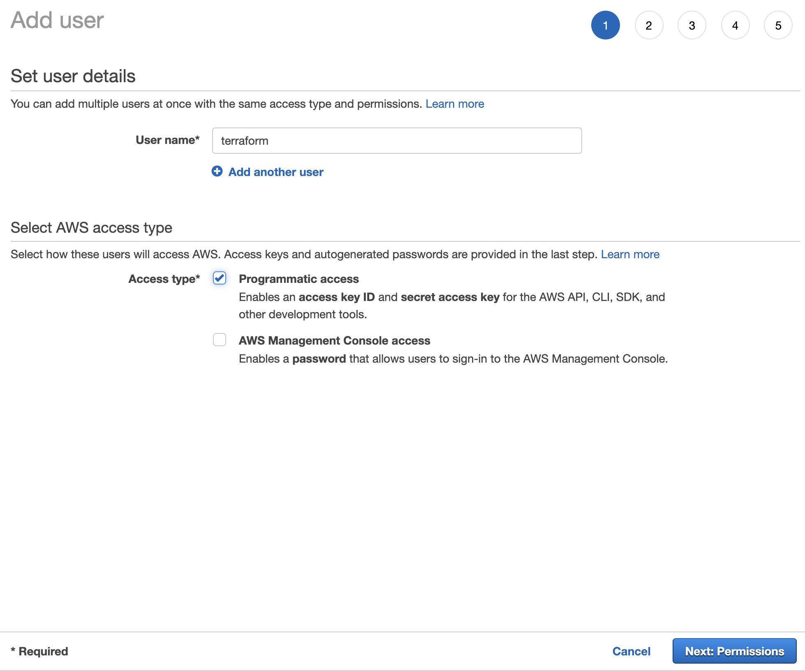

<figure class="fullwidth">

</figure>
<figcaption class="fullwidth">
Image credit: <a href="https://terraform.io" rel="noopener noreferrer">Hashicorp's Terraform</a>
</figcaption>

I've previously written about [building a static website with Gatsby and TypeScript](./gatsby-with-typescript). If you're building a static website like a blog then deploying to GitHub Pages is more than enough. But what if the website you are building needs user authentication and authorization? What if you need to store and retrieve items from a database? What if you need server side processing. What if you want to integrate payment processing? There are a lot of options and managing it all quickly becomes difficult.

# Who is this for?

This is a long post. Even by my standards. Also, this isn't exactly introductory or beginner friendly (though I do try to explain how things are setup and how to make decisions). This post is more of a long-winded reference. I've written it because I needed opinionated documentation with all of my choices in one place. Your choices will probably be different because there are lots of trade-offs. Because this is opinionated it is also limited. There are many deeper technical topics I omit because I don't use them. Nevertheless, hopefully this is useful for you.

# Some history

Years ago, I was helping to build an E-Commerce startup. It was one of those experiences where you're surrounded by brilliant and creative people that can make anything. Our platform was built using Ruby on Rails 1.2, relied on an early beta of Stripe for payment processing, and we used the beta of Slack to communicate.

We deployed everything to Amazon Web Services because we knew it could scale. At the time the tooling was limited. So we hired a consultant named Mitchell Hashimoto to help us. Mitchell and I would work late setting up the infrastructure using a series of YAML files and a AWS API tool called fog. It was rudimentary but it worked amazingly well.

From experience I can tell you that Mitchell is one of the fastest, most brilliant people I have ever seen. He built everything we needed flawlessly. One night, he started telling me about what he envisioned as a much better configuration language and platform. Looking back, I realize now he was envisioning Terraform.

# Setup

Before you begin building anything it is useful to understand the trade-offs associated with different platforms, frameworks, and languages. When I'm building something new I tend to optimize for the following:

1. Price
2. Scalability
3. Performance
4. Maintainability

It is very likely your priorities are different. I put price first because I don't want to be restricted from making a lot of websites. Using [Now](https://now.sh) or [Netlify](https://netflify.com) or [Heroku](https://heroku.com) will get you up and running very quickly. In many cases you can get your website running for free and it will be free forever. As you scale your service though - adding authentication, storage, background jobs and more the price quickly goes up - even if you don't have a large number of users.

If you anticipate a small consistent scale you could spin up a VPS (virtual private server) on [Digital Ocean](https://digitalocean.com) and the price will stay constant, but you'll have a lot more to manage including security updates.

Building on a cloud platform like AWS, Azure or Google Cloud allows you to keep a low price while providing massive scalability. These platforms have a free-tier that allows you to build your website at virtually no-cost. For the kinds of websites I build Amazon Web Services has the best pricing, but is arguably the most difficult to work with. That's the trade-off: you get more options, scalability and lower-price but it comes with higher complexity.

In this post, I'll detail my setup. It should allow you to build a dynamic website at essentially no cost until it scales beyond 50,000 users per month.

Our website can be divided into three main projects:

- Our infrastructure - built using Terraform
- Our server-side API - built using Express
- Our front-end website - built using Gatsby

We'll keep these in separate folders (and each will have a separate repository):

```
example/
  |
  |- terraform/
  |   |- .git
  |   |- ... Terraform project files
  |- api/
  |   |- .git
  |   |- ... Express project files
  |- site/
  |   |- .git
  |   |- ... Gatsby project files
```

# Terraform

[Terraform](https://terraform.io) is a tool for configuring remote infrastructure. There are a lot of other options for configuring AWS.[^tools] but Terraform provides much more flexibility (even allowing you to deploy to multiple cloud providers). You can create Terraform configuration files (`*.tf`) and treat your infrastructure as code; versioning the changes and storing your settings in your repository.

[^tools]: One of the best tools is [serverless](https://serverless-stack.com) which is generally much simpler than Terraform to use. You can also check out [apex](https://apex.run) but it is no longer maintained. Additionally, you could use AWS CloudFormation directly but Terraform is slightly easier to manage when working with larger organizations.

You'll need to [download and install](https://www.terraform.io/downloads.html) Terraform. You can also use Homebrew (if you are on a Mac):

```bash
brew install terraform
```

## Getting started

To get started I'll assume you've purchased a domain, but for the purposes of this post, we'll pretend our domain is `example.com` (you'll need to replace `example.com` with your domain throughout). You can buy a domain pretty much anywhere for $0.99 to $12.00 for the first year. I use [Google Domains](https://domains.google) because I use Gmail so it's easier to keep track of. By default you get an email address you can use to start setting up services.


Within your domain provider, setup an alias for `*@example.com` to point to your personal email address. This way any email sent to `example.com` will still get through.

Next, [sign up for AWS](https://aws.amazon.com/) using the new email address. When signing up, I tend to use a single-use email like `aws@example.com` and I generally use the domain name as the AWS Account Name (for example: if my domain is example.com my I would choose `example` as my account name). To complete your account creation you'll need to enter a credit card for billing[^billing] and you'll need to select a support plan (I generally choose the free support plan). You'll also need a phone number for verification.

[^billing]: Though we'll attempt to keep the costs down, we'll be utilizing Route53 for DNS. Because of this the bill will be at least \$0.50 per month (the cost of the primary DNS zone). There are alternatives for setting up your DNS, but keeping everything together makes things simpler.

## Setting up an IAM user

In general, it is not a good practice to use root user accounts to log into the console and manage your configuration. Creating IAM users for each person in your organization allows you to control access at an individual level. Additionally, if credentials are compromised for a given user those credentials can be revoked centrally.

Let's create a user in the [Identity and Access Management service](https://console.aws.amazon.com/iam/home?#/home). Choose your own (personal) user name and choose **AWS Management Console Access**:


Setup your password and configure your policies:


You might want more granular access controls, but when getting started `AdministratorAccess` policy keeps things simple.

Create a user for programmatic access; I've called my user `terraform`:



Once you create the user you'll need to keep a copy of the `AWS Access Key ID` and the `AWS Secret Access Key`. We'll configure the AWS Command Line Interface (CLI) on our machine use these. [Download and install](https://docs.aws.amazon.com/cli/latest/userguide/cli-chap-install.html) `awscli`. On a mac you can use Homebrew:

```bash
brew install awscli
```

Once installed, `awscli` will need to know about your credentials. There are a few ways to do this:

- Saving your credentials in Terraform
- Configuring the default credentials
- Configuring a profile
- Using environment variables

### Saving your credentials in Terraform (wrong)

It is possible to put your credentials directly inside of Terraform (**don't do this**):

```tf
# DON'T DO THIS
provider "aws" {
  aws_access_key_id = "YOUR_AWS_ACCESS_KEY_ID"
  aws_secret_access_key = "YOUR_AWS_SECRET_ACCESS_KEY"
}
```

Not only is this unsafe (we'll be using version control for our configuration files and you should never store credentials in your repository), it cannot be easily overridden by other developers; meaning everyone will share credentials.

### Configuring the default credentials

Instead, it is much better to let the `awscli` tool store the credentials locally. To do this run:

```bash
aws configure
```

You'll be prompted to enter your credentials and region:

```bash
AWS Access Key ID [None]: YOUR_ACCESS_KEY_ID
AWS Secret Access Key [None]: YOUR_SECRET_ACCESS_KEY
Default region name [None]: us-east-1
Default output format [None]: json
```

By default, I've chosen to use `us-east-1` (also known as `N. Virginia`). You might prefer another region but unless you have a specific reason not to, you should choose `us-east-1` as it will make later configuration a little easier. Setting the default credentials with `aws configure` allows all of the developers to use individual credentials without needing to change anything within the Terraform configuration.

### Configuring a profile

Storing default credentials works great, but what if you have multiple projects on your machine - each with different credentials? Luckily, `awscli` can work with multiple profiles. Profile names may include your project name, domain name, an environment (like staging or production). There is [good documentation](https://docs.aws.amazon.com/cli/latest/userguide/cli-chap-configure.html) on different configurations for the `awscli` tool.

You can name a profile anything you like. For now, just use your domain name without the `.com` (in our case, `example`). Run:

```bash
aws configure --profile example
```

Fill in the prompts as you did before.

In order to use a profile you'll need to export an environment variable (replacing `example` with the profile name you configured). On Mac/Linux you can do this with the `export` command:

```
export AWS_PROFILE=example
```

Or if you are using an alternative shell like the `fish` shell:

```
set -x AWS_PROFILE example
```

On Windows:

```
C:\> setx AWS_PROFILE example
```

### Using environment variables

It is also possible to skip the `awscli` configuration altogether. To do this you'll need to set environment variables for your credentials. For example, on Mac/Linux:

```
export AWS_ACCESS_KEY_ID=YOUR_ACCESS_KEY_ID
export AWS_SECRET_ACCESS_KEY=YOUR_SECRET_ACCESS_KEY
```

On Windows:

```
C:\> setx AWS_ACCESS_KEY_ID YOUR_ACCESS_KEY_ID
C:\> setx AWS_SECRET_ACCESS_KEY YOUR_SECRET_ACCESS_KEY
```

This pattern is particularly useful when running terraform in a continuous integration platform (such as GitHub Actions).[^env]

[^env]: Managing multiple environments locally can be cumbersome. A helpful tool for this is [`direnv`](https://direnv.net/): it allows you to control the environment on a per-folder basis. We won't use that here, though.

## Project organization choices

Terraform uses its own configuration language and uses the file extension `*.tf`. Our project will have _a lot_ of Terraform configuration. There are several different approaches we could use to organize our Terraform project. These fit into three categories:

- Keep all of the configuration in one folder or one file
- Separate the configuration of resources into separate modules
- Control access and permissions to each resource configuration and state individually

Each of these patterns offer advantages and disadvantages.

### Keep all of the configuration in one folder or one file

Terraform is made up of a series of configuration files, variables, outputs and states. When starting a project, all of this can be kept in a single `terraform.tf` file:

```
terraform/
  |
  |- terraform.tf
```

After you `apply` your Terraform configuration, a local copy of your state will be created:

```
terraform/
  |
  |- terraform.tf
  |- terraform.tfstate
  |- terraform.tfstate.backup
```

As your infrastructure grows, however, the number of services and resources you rely on will quickly grow and a single file will become unwieldy. It is possible to separate out each service to a separate file as well as separating out the variables and outputs to separate files. When running, Terraform loads all of the files and treats them as a single configuration and figures out the interdependencies. For example:

```
terraform/
  |
  |- dns.tf
  |- certs.tf
  |- email.tf
  |- storage.tf
  |- site.tf
  |- database.tf
  |- users.tf
  |- identities.tf
  |- api.tf
  |- logging.tf
  |- variables.tf
  |- outputs.tf
  |- terraform.tfstate
  |- terraform.tfstate.backup
```

In this case, it is clear where changes need to be made for specific resources. This makes it easier for developers. Unfortunately is still relies on a single state file even though we're using separate files. Because of this, when applying the configuration using `terraform apply`, it will need to check and compare the state of every service. If you have a lot of services this can be slow. If you're making lots of changes that makes sense. But when making a small change (such as just changing the version of a lambda function) this might not be a good choice.

### Separate the configuration of resources into separate modules

Terraform has a built in module system that works well to separate out your resources. To do this you would create subfolders for each resource. A default `terraform.tf` file imports the modules and runs them:

```
terraform/
  |
  |- .gitignore
  |- README.md
  |- terraform.tf
  |- terraform.tfstate
  |- terraform.tfstate.backup
  |- dns/
  |   |- main.tf
  |   |- variables.tf
  |   |- outputs.tf
  |- certs/
  |   |- main.tf
  |   |- variables.tf
  |   |- outputs.tf
  |- email/
  |   |- main.tf
  |   |- variables.tf
  |   |- outputs.tf
  |- storage/
  |   |- main.tf
  |   |- variables.tf
  |   |- outputs.tf
  |- site/
  |   |- main.tf
  |   |- variables.tf
  |   |- outputs.tf
  |- database/
  |   |- main.tf
  |   |- variables.tf
  |   |- outputs.tf
  |- users/
  |   |- main.tf
  |   |- variables.tf
  |   |- outputs.tf
  |- identities/
  |   |- main.tf
  |   |- variables.tf
  |   |- outputs.tf
  |- api/
  |   |- main.tf
  |   |- variables.tf
  |   |- outputs.tf
  |- logging/
  |   |- main.tf
  |   |- variables.tf
  |   |- outputs.tf
```

This is a lot of repeated files and filenames and it is easy to get confused when making changes in an editor ("which `main.tf` am I editing?"). At the same time, this separation of concerns is very powerful. Normally the modules (subfolders) would not contain configuration specific to your website. Instead the specific names and values would be passed into the modules via variables. Because of this, modules can actually be open source and shared between projects.[^modules]

[^modules]: [Cloud Posse](https://cloudposse.com/) maintains a huge set of [open source modules](https://github.com/cloudposse) that can be used in your project. In many cases using these modules is the right choice if you are looking to follow best practices around specific resources.

Just as we saw in the previous setup, when running `terraform apply`, Terraform sees all of the modules as a single configuration. Knowing where to make a change is still relatively easy, but each change requires re-applying the entire state for every resource.

### Control access and permissions to each resource configuration and state individually

As your website grows and more developers are working on it, it will not make sense to keep everything in a single file. Likewise, maintaining all of your infrastructure in a single state file can become problematic. As your team grows you'll have developers that understand networking, others that understand database concerns, some will work on site security, and others will deploy changes to the API and site. You'll want to restrict access to different parts of the infrastructure. For example:

```
terraform-dns/
  |
  |- README.md
  |- terraform.tfstate
  |- terraform.tfstate.backup
  |- .gitignore
  |- main.tf
  |- variables.tf
  |- outputs.tf
terraform-database/
  |
  |- README.md
  |- terraform.tfstate
  |- terraform.tfstate.backup
  |- .gitignore
  |- main.tf
  |- variables.tf
  |- outputs.tf

...
```

In this setup, the Terraform state is managed per-module and each of the modules are kept in separate folders (and, likely, separate repositories). Access to the various services is managed through repository permissions and different IAM policies and roles so that only specific users can make changes to (or even see the configuration for) specific services. This is the most secure and least risky way to manage your infrastructure. Individual developers can't accidentally make a change or destroy a critical resource if they don't have access to it.

Unfortunately, this is also the most challenging setup. Making coordinated changes can be extremely cumbersome. For example, suppose you wanted to create an API action that sent an email from a new email sender when an entry was added to a new database table. You would need to coordinate changes to deploy the new database, create the new email address (and wait for verification), and deploy the serverless function. This would require changes to three repositories and at least three separate `terraform apply` invocations to modify the different services. In a production site with many active users, it makes sense to plan and execute changes like this independently. In a small site with only one or two developers, this level of rigor is probably over-zealous.

## Basic project setup

To keep things simple, we'll use a basic setup: keeping all of our configuration in a single folder but in separate Terraform files. We'll also manage our state centrally (even though this may slow down our `terraform apply` calls because the state of every resource must be checked). To start, we'll want to create a `terraform` folder:

```bash
mkdir terraform
cd terraform
```

We'll be using version control so that we can see what changes were made to our infrastructure over time. We'll want to make sure we aren't storing any secrets in our repository. Not only will we have secrets in our `.tfvars` files but Terraform itself will store secrets in its state files. Because of this we need to ensure that they are ignored when using version control. Add a `.gitignore`:

```gitignore
# Private key files
*.pem

#  Local .terraform directories
**/.terraform/*

# .tfstate files
*.tfstate
*.tfstate.*

# .tfvars files
*.tfvars
```

## Variables

Most of the configuration we'll create will be generic. In fact, it could easily be repurposed for multiple websites with only a few small changes. Unfortunately, those small changes will be scattered across our configuration files. Terraform allows you to declare and use variables to simplify this. In the `terraform` folder create a new file called `variables.tf`:

```tf
variable "region" {
  default = "us-east-1"
}

variable "domain" {
  default = "example.com"
}
```

We'll use these variables as we write our configuration. For more information, see the [Terraform documentation on input variables](https://www.terraform.io/docs/configuration/variables.html).

## Collaboration and remote backends

Terraform tracks the last-known state for your configuration in the `terraform.tfstate` and `terraform.tfstate.backup` files. Terraform compares the stored state and configuration with what exists in the cloud. Running `terraform apply` repeatedly should not make any changes. If we make a change to our configuration files and then run `terraform apply` it will check the local state and apply the changes without completely recreating the resource. Because of this, the state[^state] files are extremely important.

[^state]: For more information on how Terraform uses state files, see https://thorsten-hans.com/terraform-state-demystified.

Even though they are important, the state files aren't tracked in our repository (we've ignored them in the `.gitignore`). We don't want to store them in our repository because they will contain secrets which shouldn't be pushed to GitHub. But what happens if another developer on our team clones our repository without the state files and runs `terraform apply`? In some cases this can be bad - destroying and recreating resources that haven't changed; in other cases it is just slow. We could make the assumption that we're the only person working on our configuration via Terraform. Unfortunately, once you have multiple devices or multiple developers that assumption becomes very problematic.

Because of this we don't want to keep our state locally; instead, we'll move it to a shared, secure location and make sure it is encrypted.

To do this we'll rely on Terraform's [remote backends](https://www.terraform.io/docs/backends/index.html) to share our state. Because we are already using AWS as our cloud provider, we'll use the S3 backend. We'll create an S3 bucket solely for the purpose of sharing state among our developers. Again, if we had chosen a more complex setup (where we were keeping the state for each service separately) we could use multiple buckets or restrict access to the shared state by key using specific IAM policies. For more detail you can refer to https://codethat.today/tutorial/terraform-remote-state-for-collaboration/ and https://medium.com/@jessgreb01/how-to-terraform-locking-state-in-s3-2dc9a5665cb6.

Unsurprisingly, we'll use Terraform to setup our remote backend. To do this we'll need to configure three things:

1. Choose a cloud provider
2. Create an S3 bucket to store the state
3. Configure the remote state

To start, we'll set the provider. Again, for this post we'll be using AWS, so we'll configure that in Terraform, In the `terraform` folder, create a new file called `aws.tf`:

```tf
# Setup the provider for this Terraform instance
provider "aws" {
  region  = var.region
}
```

Notice that the value for the region uses a _variable interpolation_.

> Even though we configured `awscli` with our chosen region `us-east-1`, we still need to set the `region` in the provider block. This should be unnecessary but because of how Terraform connects to providers we must include it again.

We'll need to create an S3 bucket that will hold the state. Because S3 bucket names are global you'll need to choose a unique name. To make sure my bucket name is unique, I generally use my domain name (without the `.com`) as a prefix and add `-state`. For example: `example-state`. Create a new variable by adding the following to `variables.tf` (replacing `example` with your name):

```tf
variable "state_bucket" {
  default = "example-state"
}
```

Next, create a new file called `storage.tf` in the `terraform` folder:

```tf
# Create a bucket to for remotely tracking Terraform state
resource "aws_s3_bucket" "state" {
  bucket = var.state_bucket
  acl    = "private"

  versioning {
    enabled = true
  }

  lifecycle {
    prevent_destroy = true
  }
}
```

We've enabled `versioning` for the bucket (as well as turning on `prevent_destroy`). Though not required, this is highly recommended. Save `storage.tf` and run the following command (from within the `terraform` folder):

```bash
terraform init
```

> If you are using an `awscli` profile (as noted above) you'll need to make sure you've exported the `AWS_PROFILE` environment variable. On a Mac, you can even do this as part of the command, i.e, `AWS_PROFILE=example terraform init`.

You should see:

```
Initializing the backend...

Initializing provider plugins...
- Checking for available provider plugins...
- Downloading plugin for provider "aws" (hashicorp/aws) 3.7.0...

The following providers do not have any version constraints in configuration,
so the latest version was installed.

To prevent automatic upgrades to new major versions that may contain breaking
changes, it is recommended to add version = "..." constraints to the
corresponding provider blocks in configuration, with the constraint strings
suggested below.

* provider.aws: version = "~> 3.7"

Terraform has been successfully initialized!

You may now begin working with Terraform. Try running "terraform plan" to see
any changes that are required for your infrastructure. All Terraform commands
should now work.

If you ever set or change modules or backend configuration for Terraform,
rerun this command to reinitialize your working directory. If you forget, other
commands will detect it and remind you to do so if necessary.
```

Don't worry if your version is different. To make sure everything is correct we'll verify the plan. Terraform will read the configuration and create a plan for the changes it needs to make. Creating the plan doesn't make any changes to the AWS instance, it just shows the plan:

```bash
terraform plan
```

It should show the details of the S3 bucket it will create. We could save the plan to a file and re-use it later but we don't need to do that right now. If everything looks right, go ahead and apply it (this will actually make changes):

```bash
terraform apply
```

Answer `yes`[^yes] and your S3 bucket should be created.

[^yes]: Eventually, you may want to automate your infrastructure. If you are running the commands from your continuous integration for example, typing `yes` will be problematic. You can skip the prompt by adding the `-auto-approve` flag.

Notice that Terraform has created new file called `terraform.tfstate` (and possibly `terraform.tfstate.backup`).

Again, because Terraform is tracking the state, if we re-run `terraform apply`, it will not make any changes to our S3 bucket on AWS. If we make a change to our configuration (like adding a policy, for example) it can apply the changes without destroying and recreating the bucket. As mentioned above, we don't want to keep our state locally, so we'll move it to the remote backend (the S3 bucket we just created) by configuring it in Terraform.

Create a new file[^multiple] called `state.tf` in the `terraform` folder:

```tf
# Indicate how state should be managed
terraform {
  backend "s3" {
    region  = "us-east-1"
    bucket  = "example-state"
    key     = "terraform"
    encrypt = true
  }
}
```

[^multiple]: Terraform will still work even though we're splitting our configuration across multiple files. Terraform will read all of the `*.tf` files in the current folder when it is run. The order of your declarations doesn't matter. Terraform will do its best to determine the order things should be created or applied based on the interdependencies in the declarations.

Again we'll want to set the `bucket` value to the name of the bucket we've just created (replace `example-state` with your chosen name).

> Wait - why aren't we using `var.region` and `var.state_bucket` variables? Terraform reads the values for the `backend` resource very early in its lifecycle; because of this you cannot use variable interpolations and it cannot utilize the values in the `provider` node. All of the values need to be redeclared as shown.

With this new configuration in place we can check the plan:

```bash
terraform plan
```

You should see:

```
Backend reinitialization required. Please run "terraform init".
Reason: Initial configuration of the requested backend "s3"

The "backend" is the interface that Terraform uses to store state,
perform operations, etc. If this message is showing up, it means that the
Terraform configuration you're using is using a custom configuration for
the Terraform backend.

Changes to backend configurations require reinitialization. This allows
Terraform to setup the new configuration, copy existing state, etc. This is
only done during "terraform init". Please run that command now then try again.

If the change reason above is incorrect, please verify your configuration
hasn't changed and try again. At this point, no changes to your existing
configuration or state have been made.

Failed to load backend: Initialization required. Please see the error message above.
```

Terraform has detected that we want to change the location of our state. In this case we'll do what it suggests:

```bash
terraform init
```

You should see:

```
Initializing the backend...
Do you want to copy existing state to the new backend?
  Pre-existing state was found while migrating the previous "local" backend to the
  newly configured "s3" backend. No existing state was found in the newly
  configured "s3" backend. Do you want to copy this state to the new "s3"
  backend? Enter "yes" to copy and "no" to start with an empty state.

  Enter a value:
```

Type `yes` and press enter:

```
Successfully configured the backend "s3"! Terraform will automatically
use this backend unless the backend configuration changes.

Initializing provider plugins...

The following providers do not have any version constraints in configuration,
so the latest version was installed.

To prevent automatic upgrades to new major versions that may contain breaking
changes, it is recommended to add version = "..." constraints to the
corresponding provider blocks in configuration, with the constraint strings
suggested below.

* provider.aws: version = "~> 3.7"

Terraform has been successfully initialized!

You may now begin working with Terraform. Try running "terraform plan" to see
any changes that are required for your infrastructure. All Terraform commands
should now work.

If you ever set or change modules or backend configuration for Terraform,
rerun this command to reinitialize your working directory. If you forget, other
commands will detect it and remind you to do so if necessary.
```

If you're working with an older version, you may see the following error:

```
Initializing the backend...
Error inspecting states in the "s3" backend:
    AccessDenied: Access Denied
	status code: 403, request id: ABCDEF123456789, host id: ABCDEF123456789/ABCDEF123456789+ABCDEF123456789=

Prior to changing backends, Terraform inspects the source and destination
states to determine what kind of migration steps need to be taken, if any.
Terraform failed to load the states. The data in both the source and the
destination remain unmodified. Please resolve the above error and try again.
```

If you see this error, upgrade Terraform or [follow the instructions](#error-setting-up-the-remote-backend) in the appendix.

If we run `terraform plan` again we should see that everything is up to date:

```
Refreshing Terraform state in-memory prior to plan...
The refreshed state will be used to calculate this plan, but will not be
persisted to local or remote state storage.

aws_s3_bucket.state: Refreshing state... (ID: example-state)

------------------------------------------------------------------------

No changes. Infrastructure is up-to-date.

This means that Terraform did not detect any differences between your
configuration and real physical resources that exist. As a result, no
actions need to be performed.
```

With the state moved to the remote backend, the local `terraform.tfstate` and `terraform.tfstate.backup` files are no longer needed and can be safely deleted.

```
rm terraform.tfstate
rm terraform.tfstate.backup
```

That's a lot of setup; but at this point we're ready to start building out the main resources for our application and, ideally, we won't need to configure anything else in the AWS console directly.

> Note: we could go even further and introduce remote-state locking (see https://dev.to/theodesp/using-terraform-remote-state-for-collaboration-4661). For now we'll assume that only one developer will be deploying at a time. Ultimately, we'll want to move our infrastructure management into our continuous deployment tooling; at that point locking will need to be managed differently.

## DNS

We'll want to use our own domain for everything: our site, our email, and our API. Domain configuration is controlled through a domain's nameservers. There are a number of options available for managing your DNS nameservers and entries. You could choose to use the default nameservers provided by the service where you purchased your domain (such as [Google Domains](https://domains.google)). You could also use [Cloudflare](https://developers.cloudflare.com/terraform/) which provides a built-in CDN, shared SSL certificates, and DOS protection (and is free for the basic plan). You can also use [Route53](https://aws.amazon.com/route53/) which is part of AWS.

In our case, we'll use Route53 as it is easily configurable in Terraform and makes some of our service approvals automatic. This is the first thing we'll use that costs money. Creating a zone costs [\$0.50 per hosted zone per month](https://aws.amazon.com/route53/pricing/) and is charged immediately (it is not prorated). For larger sites with many zones responding to many queries it is possible the cost could go up; but because we'll be pointing to other AWS services we should only need one zone and our costs shouldn't go up..

> Actually, if you destroy the zone within 12 hours of creation the cost of the zone will be refunded.

We'll start with our primary zone configuration and nameservers. Within the `terraform` directory create a new file, `dns.tf`:

```tf
# Define the primary zone for our domain
resource "aws_route53_zone" "domain_zone" {
  name = var.domain
}

# Create the nameservers for our domain
resource "aws_route53_record" "domain_nameservers" {
  zone_id         = aws_route53_zone.domain_zone.zone_id
  name            = aws_route53_zone.domain_zone.name
  type            = "NS"
  ttl             = "30"
  allow_overwrite = true

  records = [
    aws_route53_zone.domain_zone.name_servers.0,
    aws_route53_zone.domain_zone.name_servers.1,
    aws_route53_zone.domain_zone.name_servers.2,
    aws_route53_zone.domain_zone.name_servers.3,
  ]
}
```

We've configured the `name` of our zone using a variable. We've already setup the `domain` variable in `variables.tf`. Your domain name should be set to the root domain name (such as `example.com`) and should not include the subdomain. For example, do not include `www` or the protocol `https`.

Notice that we have set a very short `ttl` (Time-to-live). This controls how long DNS servers (and browsers) should cache your domain after looking it up. Setting a very short time like this (30 seconds) makes it much faster to make changes without needing to wait a long time for propagation. However, it also increases the number of requests that users need to make (and that AWS needs to serve). Long-term, we'll want to change this to `300` or `600` (5 minutes or 10 minutes).

We've also specified `allow_overwrite`. When the nameservers are created, [Terraform automatically generates](https://www.terraform.io/docs/providers/aws/r/route53_record.html#ns-and-soa-record-management) `NS` and `SOA` entries by default. We want to allow those entries to be set in our state (overwriting anything that might already be present).

With this setup, we can check the plan:

```bash
terraform plan
```

According to the plan we'll add a zone and setup the nameservers. Let's apply it:

```bash
terraform apply
```

When prompted, answer `yes`:

```
aws_s3_bucket.state: Refreshing state... [id=example-state]

An execution plan has been generated and is shown below.
Resource actions are indicated with the following symbols:
  + create

Terraform will perform the following actions:

  # aws_route53_record.domain_nameservers will be created
  + resource "aws_route53_record" "domain_nameservers" {
      + allow_overwrite = true
      + fqdn            = (known after apply)
      + id              = (known after apply)
      + name            = "example.com"
      + records         = (known after apply)
      + ttl             = 30
      + type            = "NS"
      + zone_id         = (known after apply)
    }

  # aws_route53_zone.domain_zone will be created
  + resource "aws_route53_zone" "domain_zone" {
      + comment       = "Managed by Terraform"
      + force_destroy = false
      + id            = (known after apply)
      + name          = "example.com"
      + name_servers  = (known after apply)
      + zone_id       = (known after apply)
    }

Plan: 2 to add, 0 to change, 0 to destroy.

Do you want to perform these actions?
  Terraform will perform the actions described above.
  Only 'yes' will be accepted to approve.

  Enter a value: yes

aws_route53_zone.domain_zone: Creating...
aws_route53_zone.domain_zone: Still creating... [10s elapsed]
aws_route53_zone.domain_zone: Still creating... [20s elapsed]
aws_route53_zone.domain_zone: Still creating... [30s elapsed]
aws_route53_zone.domain_zone: Creation complete after 35s [id=REDACTED]
aws_route53_record.domain_nameservers: Creating...
aws_route53_record.domain_nameservers: Still creating... [10s elapsed]
aws_route53_record.domain_nameservers: Still creating... [20s elapsed]
aws_route53_record.domain_nameservers: Still creating... [30s elapsed]
aws_route53_record.domain_nameservers: Creation complete after 34s [id=REDACTED_example.com_NS]

Apply complete! Resources: 2 added, 0 changed, 0 destroyed.
```

The primary zone and nameserver entries should be created. Now that the nameservers have been created we'll need to fetch them. Run:

```
terraform state show aws_route53_record.domain_nameservers
```

In the output you should see the list of nameservers:

```
...
records         = [
    "ns-1283.awsdns-32.org",
    "ns-1574.awsdns-04.co.uk",
    "ns-492.awsdns-61.com",
    "ns-862.awsdns-43.net",
]
...
```

> These nameservers are just an example; the nameservers listed for your zone will be different.

We'll need to copy these values so that we can set the nameservers our domain registrar points to.[^dns]


[^dns]: _Be careful_: at this point our Route53 configuration is completely empty. For a new domain that's probably fine. If you've added DNS entries to your current nameservers (or if there are default entries managed by your registrar) these will no longer be set. For example, if you've setup an email alias (as described earlier) your existing DNS configuration likely has an `MX` record denoting it. We'll fix this later but if you are relying on your current setup, you should proceed cautiously.

Once saved, you'll need to wait for the changes to propagate through DNS. This can take up to 48 hours; however I find this usually happens much faster (sometimes as fast as 5 minutes). If you want to check what nameservers are reported for your domain run:

```bash
 dig +short NS example.com
```

If the DNS has fully propagated the answer should match the nameservers listed above. You'll need to wait for this before proceeding.

## Certs

Once your DNS is setup to point at Route53 you'll want to create a certificate for securing communications with your domain (SSL/TLS). To do this we will use AWS Certificate Manager (`acm`). Luckily, [public certificates are free](https://aws.amazon.com/certificate-manager/pricing/):

> From the AWS Certificate Manager pricing page: "Public SSL/TLS certificates provisioned through AWS Certificate Manager are free. You pay only for the AWS resources you create to run your application."

Create a new file in the `terraform` folder called `cert.tf`:

```tf
# An ACM certificate is needed to apply a custom domain name
# to the API Gateway resource and cloudfront distributions
resource "aws_acm_certificate" "cert" {
  domain_name       = aws_route53_zone.domain_zone.name
  validation_method = "DNS"

  subject_alternative_names = [
    "*.${aws_route53_zone.domain_zone.name}",
  ]

  lifecycle {
    create_before_destroy = true
  }
}

# AWS needs to verify that we own the domain; to prove this we will create a
# DNS entry with a validation code
resource "aws_route53_record" "cert_validation_record" {
  name    = tolist(aws_acm_certificate.cert.domain_validation_options)[0].resource_record_name
  type    = tolist(aws_acm_certificate.cert.domain_validation_options)[0].resource_record_type
  records = [tolist(aws_acm_certificate.cert.domain_validation_options)[0].resource_record_value]
  zone_id = aws_route53_zone.domain_zone.zone_id
  ttl     = 60
}

resource "aws_acm_certificate_validation" "cert_validation" {
  certificate_arn         = aws_acm_certificate.cert.arn
  validation_record_fqdns = [aws_route53_record.cert_validation_record.fqdn]
}
```

We've created three resources:

- A new `acm` certificate for our domain name
- A DNS record for domain ownership validation
- A certificate validation that connects the two

When generating a secure certificate for a domain; the certificate authority must ensure that you are the owner of the domain. To validate this, a DNS record is added to prove you are in control of the domain. We'll use Terraform to generate the entry and AWS will validate it and generate the certificate. Luckily, because we're using Route53 for our domain, this validation is almost instantaneous. If you are utilizing another nameserver, you'll need to wait on propagation.

Notice that we've set our `domain_name` to `aws_route53_zone.domain_zone.name`. This is an _value_ which uses the name we already entered in our `domain_zone`. Technically the `domain_zone` domain name has an extra `.` at the end of the name but Terraform is smart enough to remove that. Creating interdependencies between your resources makes it easier to make changes in the future because there is less to change.

Check the plan:

```bash
terraform plan
```

And if it looks right, apply it:

```bash
terraform apply
```

This might take a few minutes to complete.

## Email

Eventually we will want to send and receive emails from our website. To do this we'll use AWS Simple Email Service (SES). We could use [SendGrid](https://sendgrid.com/) or [MailChimp](https://mailchimp.com/) to do this but AWS Simple Email Service is easy to integrate with all of our services[^email]. Additionally, AWS Simple Email Service shouldn't cost anything initially. According to the [pricing page](https://aws.amazon.com/ses/pricing/):

> You pay $0 for the first 62,000 emails you send each month, and $0.10 for every 1,000 emails you send after that.

Although we don't need to setup email just yet, verifying your email and increasing your usage limits can take a lot of time and may involve a lot of waiting. Because of this I like to start the process as early as I can.

[^email]: Checkout [Mailtrap's Amazon SES vs Sendgrid](https://blog.mailtrap.io/amazon-ses-vs-sendgrid/) post for a thorough breakdown of the differences.

For now we have three goals:

- Enable sending from a `no-reply@example.com` email address
- Enable SPF verification of the emails we send
- Allow email forwarding through our Google Domain email forwards

Create a new file in the `terraform` folder called `email.tf`:

```tf
resource "aws_ses_domain_identity" "domain_identity" {
  domain = aws_route53_zone.domain_zone.name
}

# Note: this may take up to 72 hours to verify
resource "aws_route53_record" "amazonses_verification" {
  zone_id = aws_route53_zone.domain_zone.id
  name    = "_amazonses.${aws_ses_domain_identity.domain_identity.domain}"
  type    = "TXT"
  ttl     = "600"
  records = [aws_ses_domain_identity.domain_identity.verification_token]
}

resource "aws_ses_domain_mail_from" "domain_mail_from" {
  domain           = aws_ses_domain_identity.domain_identity.domain
  mail_from_domain = "mail.${aws_ses_domain_identity.domain_identity.domain}"
}

resource "aws_route53_record" "domain_mail_from_mx" {
  zone_id = aws_route53_zone.domain_zone.id
  name    = aws_ses_domain_mail_from.domain_mail_from.mail_from_domain
  type    = "MX"
  ttl     = "600"

  # The region must match the region in which `aws_ses_domain_identity` is created
  records = ["10 feedback-smtp.${var.region}.amazonses.com"]
}

resource "aws_route53_record" "domain_mail_from_spf" {
  zone_id = aws_route53_zone.domain_zone.id
  name    = aws_ses_domain_mail_from.domain_mail_from.mail_from_domain
  type    = "TXT"
  ttl     = "600"
  records = ["v=spf1 include:amazonses.com -all"]
}

resource "aws_ses_email_identity" "no_reply" {
  email = "no-reply@${aws_ses_domain_identity.domain_identity.domain}"
}

# This enables Google's domain email forwarding for emails
# https://support.google.com/domains/answer/9428703
# Create this record first to avoid resending the email verification
resource "aws_route53_record" "google_mx" {
  zone_id = aws_route53_zone.domain_zone.id
  type    = "MX"
  ttl     = "30"
  name    = ""

  records = [
    "5 gmr-smtp-in.l.google.com",
    "10 alt1.gmr-smtp-in.l.google.com",
    "20 alt2.gmr-smtp-in.l.google.com",
    "30 alt3.gmr-smtp-in.l.google.com",
    "40 alt4.gmr-smtp-in.l.google.com",
  ]
}
```

There's a lot going on here; let's break it down.

The first resource we create is an `aws_ses_domain_identity`. This identity is for our root domain and is the basis of the rest of the declarations. Also, this is the domain that will be used for our email address. Ideally this matches your main site domain. Before Amazon sends emails from this address it must be verified. Just like we saw with the certificate verification, the email verification is performed by adding another DNS record to Route53. Unlike the certificate verification, this verification can take a long time - up to 72 hours (I've seen it take longer than 24 hours and as little as 5 minutes).

Based on the domain identity we'll create an `aws_ses_domain_mail_from` resource. The mail-from domain is not directly visible to end users but is used for bounced messages and domain verification by email servers.[^mailfrom] Because of this, the mail-from domain and root domain must be different; the mail-from domain is usually a subdomain. Here we've specified `mail.` as the subdomain.

[^mailfrom]: Custom mail-from domains add legitimacy to your emails. For more information, see https://docs.aws.amazon.com/ses/latest/DeveloperGuide/mail-from.html

When sending or receiving mail, remote servers will look up the domain of the email address in DNS. It will use the records to determine how to exchange mail for the domain and whether or not to trust the email. Because of this we need to add a Mail Exchanger (`MX`) record to Route53 for our mail-from domain. Additionally we'll add a Sender Policy Framework (`SPF`) record. Without this, our emails would always end up in user's spam folders.

With the mail-from domain configured we can create an email identity for sending emails. In this case, I've chosen `no-reply@example.com`. This is fairly standard if you don't plan on handling replies, however you might want something more personal or in-line with your website's brand. Change the `name` however you like.

Lastly, we configure what happens to emails sent directly to our domain. Remember, we configured email forwarding at the very beginning of the post. You might have noticed when we changed our nameservers to point to Route53 that email forwarding completely broke. This is because email exchange servers no longer know where to send the emails. To fix this we need to point the exchangers back to our registrar (in my case Google Domains).

Let's check the plan:

```bash
terraform plan
```

And apply it:

```bash
terraform apply
```

This should complete in a few minutes.

### Verifications

With the creation complete we can move on to the approvals. If you open the [Simple Email Service console](https://console.aws.amazon.com/ses/) and click on **Email Addresses** in the sidebar. You'll see that you need to confirm the email address for sending.


You should have received an email to `no-reply@example.com`. If you haven't received an email it might be because your email forwarding setup hasn't propagated. Wait a few minutes and click **resend**. Once you've clicked the link in the verification email, you're done.

### Sandbox mode and sending limits

At this point your account should still be in **Sandbox** mode (you can see this by going to https://console.aws.amazon.com/ses and clicking on the **Sending Statistics** link in the sidebar). In this mode you can send emails only to verified email addresses. You can verify your own email address for development purposes but you need to request that the limit be increased before moving to production.


Click **Request a Sending Limit Increase**.


Choose \*_Service limit increase_ (it should be selected by default).


Next make sure the **Limit type** is `SES Sending Limit`, the **Mail Type** is `Transactional` and you have entered your domain name (it is okay that your website isn't deployed).

Amazon's Terms and AUP are very specific about how emails, bounces, and unsubscribes are treated. The links offer helpful recommendations and are worth reading. We're not planning on using SES for a mailing list (all of our emails are transactional and related to the service). For the next two questions I answer:

```
The emails in this case are all transactional (signup, password-reset)
```

Handling complaints and - more importantly - reducing the number of complaints is also important. Here is how I describe my process:

```
We'll remove addresses that bounce as well as addresses of users
that have complained. But more importantly valid addresses are required
to be verified to submit content. We only ask for an account at the time
we need to; to avoid fake addresses.
```


To start, I've chosen to increase the `Desired Daily Sending Quota` to `10000`. This should be more than enough to get started.


For the **Use case description** I normally keep it simple. We're trying to get to production and start a beta (remember to replace `example.com` with your domain):

```
We're building out example.com and would like to move our account out of
the sandbox so we can proceed to a beta. Thanks!
```

You shouldn't need to change the contact options:


Once filled out you can click **Submit**. This process can take up to 72 hours (though, I've seen it take less than a day). Luckily, you can continue while the limit increase request is processed.

## Storage

Storing files on Amazon Simple Storage Service (S3) is easy and reliable. We'll use private S3 buckets for two things:

- Storing Terraform state
- Transferring packaged lambda functions when deploying

We've already setup a bucket for storing our Terraform state in `storage.tf`.

Let's add a new bucket for deploying. First, let's add a variable for the name of our deploy bucket; like our state bucket, we'll use our domain name (without the `.com`) and the suffix `-deploys`. Add the following to `variables.tf`:

```tf
variable "deploys_bucket" {
  default = "example-deploys"
}
```

You'll need to change this value for your site. Next, add the following to `storage.tf`:

```tf
resource "aws_s3_bucket" "deploys" {
  bucket = var.deploys_bucket
  acl    = "private"

  versioning {
    enabled = true
  }

  lifecycle {
    prevent_destroy = true
  }
}
```

The deploys bucket is declared exactly like the state bucket; it is completely private and shouldn't be destroyed. Let's check the Terraform plan:

```bash
terraform plan
```

And apply it:

```bash
terraform apply
```

## Static site

When building our website we'll use Gatsby to generate all of the static content and assets. Though there are many tools and frameworks for making a static website (including pure HTML and CSS), Gatsby offers numerous plugins, themes, and tools that will help us build something professional with relatively little effort. When deploying our website, we'll generate a build and push all of the changes to an S3 bucket.

Before we setup Gatsby and the content for our website, let's create the bucket. Create a new file in the `terraform` folder called `site.tf`:

```tf
resource "aws_s3_bucket" "site" {
  bucket = var.domain
  acl    = "public-read"

  policy = <<EOF
{
    "Version": "2012-10-17",
    "Statement": [
        {
            "Sid": "PublicReadGetObject",
            "Effect": "Allow",
            "Principal": "*",
            "Action": [
                "s3:GetObject"
            ],
            "Resource": [
                "arn:aws:s3:::${var.domain}/*"
            ]
        }
    ]
}
EOF

  cors_rule {
    allowed_headers = ["*"]
    allowed_methods = ["GET"]
    allowed_origins = ["https://${var.domain}"]
    expose_headers  = ["ETag"]
    max_age_seconds = 3000
  }

  website {
    index_document = "index.html"
    error_document = "error.html"
  }

  lifecycle {
    prevent_destroy = true
  }
}
```

When creating the bucket for our static website the bucket name will be the same as our domain name (including the `.com` but without the `https`), i.e., `example.com`. We've used the `domain` variable.

The bucket is readable to anyone on the Internet. Even though it has the same name as our domain and is accessible, we don't expect people to actually read the content directly from our S3 bucket. It would be too slow. Because of this, we've configured a Cross-Origin-Resource-Sharing (`CORS`) rule to limit access to our domain. Note: it is possible to manually construct requests that will bypass the `CORS` rule (for example, using cURL); this rule only affects browsers. Additionally we've added a default `index_document` and `error_document`. This way if someone requests `https://example.com/` it will automatically return the file at `index.html` (which will work perfectly with a default Gatsby website). This is enough for us to setup our website.

Again, serving your website directly from S3 is not efficient. Instead, you'll want to use a CDN (Content Delivery Network) to ensure that users see the fastest page loads possible. This will also act as a cache to reduce the number of reads performed directly against our S3 buckets. Fortunately, Amazon offers a CDN, called CloudFront for exactly this purpose. The first 2,000,000 requests per month are free.

Add the following to `site.tf`:

```tf
resource "aws_cloudfront_distribution" "site_distribution" {
  origin {
    domain_name = aws_s3_bucket.site.bucket_domain_name
    origin_id   = var.domain
  }

  enabled             = true
  aliases             = [var.domain]
  price_class         = "PriceClass_100"
  default_root_object = "index.html"

  default_cache_behavior {
    allowed_methods  = ["GET", "HEAD", "OPTIONS"]
    cached_methods   = ["GET", "HEAD"]
    target_origin_id = var.domain

    forwarded_values {
      query_string = true

      cookies {
        forward = "all"
      }
    }

    viewer_protocol_policy = "redirect-to-https"
    min_ttl                = 0
    default_ttl            = 300
    max_ttl                = 86400
  }

  restrictions {
    geo_restriction {
      restriction_type = "none"
    }
  }

  viewer_certificate {
    acm_certificate_arn      = aws_acm_certificate.cert.arn
    ssl_support_method       = "sni-only"
    minimum_protocol_version = "TLSv1.1_2016"
  }
}
```

This is probably the most complex declaration we'll see. First we setup an `origin`. When users come to our website (via our domain) they'll actually be going to CloudFront. CloudFront maintains a number of edge nodes (servers that are distributed throughout the world to reduce network latency). When CloudFront receives a request for a file it will first check for a local copy and, if none is found, will fetch the original from the `origin` and cache it on the edge node. Because our content will be stored on S3, we've set the URL to our bucket as the `origin`.

We set the `price_class` to `PriceClass_100`, the cheapest option (but also the smallest distribution). For more information, see https://aws.amazon.com/cloudfront/pricing/

We've set the `viewer_protocol_policy` to `redirect-to-https` which will force users to the secure version of our website. By default, Cloudfront doesn't support SSL/TLS for custom domain names but we've already created a certificate that can be used to enable it.

We've also set defaults for the `ttl` (Time-to-live).[^ttl] This controls how long (in seconds) that the edge nodes should cache the assets. If set to `0` the edge nodes won't cache anything and the CDN will be useless. If set too high, however, it will make it difficult to push changes to the website efficiently. We've set it to `300` seconds, or five minutes.

[^ttl]: The values for `ttl` are defaults. It is possible to supply `Cache-Control max-age` or `Expires` headers when the origin responds for specific assets to override these defaults.

With the CloudFront distribution configured, all that's left is to create a DNS record pointing to it. Add the following to `site.tf`:

```tf
resource "aws_route53_record" "site" {
  name    = var.domain
  type    = "A"
  zone_id = aws_route53_zone.domain_zone.zone_id

  alias {
    name                   = aws_cloudfront_distribution.site_distribution.domain_name
    zone_id                = aws_cloudfront_distribution.site_distribution.hosted_zone_id
    evaluate_target_health = false
  }
}
```

This is our primary `A` record and points our domain directly at the CloudFront distribution. Because of the way distributions are deployed we've turned off `evaluate_target_health`. With this in place, lets check the plan:

```bash
terraform plan
```

And apply it:

```bash
terraform apply
```

Unlike our previous configurations, changes to CloudFront distributions can be very slow. It should take approximately 30-40 minutes for the distribution to be created. This is important to remember in the future. If you make changes to a deployed distribution, those changes will also need to be deployed taking another 30-40 minutes.

## Database

There are numerous database options available from AWS. Amazon RDS and Aurora offer traditional relational database interfaces (including MySQL and Postgres). DynamoDB is a much more scalable document database (but with none of the relational features). There are also options that fit specific use cases (like ElastiCache and Redshift) which we don't need right now.

The most cost-effective solution is DynamoDB.

> According to [Cloudberry Lab](https://www.cloudberrylab.com/resources/blog/aws-free-tier-databases/), "AWS provides a generous free tier for DynamoDB. You can store 25 GB per month within the free tier. Further, you can use 25 read capacity units and 25 write capacity units per month with the free tier. Fully-utilized, that would allow you to make 200 million requests to DynamoDB in a month. Even better, the DynamoDB free tier never expires -- you can keep using it even after the first 12 months of your AWS account."

This should be more than enough to get started. We'll start off by creating a table to record purchases on our website. Later, we'll tie this together with Stripe and a lambda function.

Create a new file in the `terraform` folder called `database.tf`:

```tf
resource "aws_dynamodb_table" "database" {
  name           = "Database"
  billing_mode   = "PROVISIONED"
  read_capacity  = 20
  write_capacity = 20
  hash_key       = "pk"
  range_key      = "sk"

  attribute {
    name = "pk"
    type = "S"
  }

  attribute {
    name = "sk"
    type = "S"
  }

  attribute {
    name = "data"
    type = "S"
  }

  global_secondary_index {
    name            = "gs1"
    hash_key        = "sk"
    range_key       = "data"
    write_capacity  = 5
    read_capacity   = 5
    projection_type = "ALL"
  }

  tags = {
    Name        = "Database"
    Environment = "production"
  }
}

```

DynamoDB is a document database and is very different from normal relational databases. In this case we've created a single table with a provisioned set of read and write units. Using [provisioned capacity](https://aws.amazon.com/dynamodb/pricing/provisioned/) units means we are attempting to predict our usage. Setting the `read_capacity` to `20` indicates that we expect a maximum of `40` (eventually consistent) reads per second. Setting `write_capacity` to `20` means we expect at most `20` writes per second. If we exceed the provisioned capacity our requests could be throttled. To avoid this you can instead use [on-demand capacity](https://aws.amazon.com/dynamodb/pricing/on-demand/). For more information, see [how it works](https://docs.aws.amazon.com/amazondynamodb/latest/developerguide/HowItWorks.ReadWriteCapacityMode.html).

We've added a Global Secondary Index (`GSI`) and set the read and write capacity to `5` (the minimum).

Our table is very generic (we've even named it generically: `Database`). We've declared three fields which we use for our `hash_key` and `range_key` and for the `range_key` of our `GSI`. This pattern allows you overload a single table with all of your data. This pattern is explained well at https://www.trek10.com/blog/dynamodb-single-table-relational-modeling/ and https://www.youtube.com/watch?v=HaEPXoXVf2k. Because we are following a very specific pattern I have named the fields after their purpose in the pattern: `pk` for "Primary Key", `sk` for "Secondary Key" and `data` for the generic (non-indexed) contents of each document. There are many other ways to arrange your tables in DynamoDB which may reflect your website's data more clearly, but this pattern scales very well and remains relatively inexpensive long term.

We won't go into detail about how these work right now; but this should be enough for us to record and quickly query almost any kind of information.

Let's check the plan:

```bash
terraform plan
```

And apply it:

```bash
terraform apply
```

Some helpful links:

- https://docs.aws.amazon.com/amazondynamodb/latest/developerguide/WorkingWithDynamo.html
- https://docs.aws.amazon.com/amazondynamodb/latest/developerguide/Query.html
- https://hackernoon.com/the-upside-down-world-of-dynamodb-8170411492c0
- https://www.dynamodbguide.com/leaderboard-write-sharding
- https://www.trek10.com/blog/dynamodb-single-table-relational-modeling/
- https://www.youtube.com/watch?v=HaEPXoXVf2k

## Users and Identities

User identity is an important part of any website. Not only does it allow you to authenticate (`AuthN`) and authorize (`AuthZ`) a user, it allows users to maintain custom settings and profiles. In our case we'll use it to record purchases made by specific users. There are many tools to manage user identity - either as part of your own application - or by using a service. For example, we could build our own authentication and authorization in JavaScript using [passport](https://www.npmjs.com/package/passport). We could also rely on an external service like [Auth0](https://auth0.com/). Because we're using AWS, Amazon's [Cognito](https://aws.amazon.com/cognito/) service gives us the best of both worlds.

For our website, we want:

- User signup and login via email address and password
- Email address verification
- Two-factor authentication via email and SMS
- Rate limiting and lockout
- Password resets
- Authenticated API requests

Cognito will give us all of this. Cognito is made up of two primary pieces: _Identity Pools_ and _User Pools_. You can find a very good explanation of the difference on Serverless Stack: https://serverless-stack.com/chapters/cognito-user-pool-vs-identity-pool.html. We'll be using both. We'll create users with email addresses and passwords in the User Pool and control their access with a shared identity in an Identity Pool. We want to use a shared identity for our permissions and access because we may have different user sources in the future (including our own email and password, Facebook, GitHub, SAML, etc.).

### User pool configuration

Let's start by creating our User Pool, which we will call (very generically) "Users". In the `terraform` folder create `users.tf` and add:

```tf
resource "aws_cognito_user_pool" "users" {
  name = "Users"

  password_policy {
    minimum_length                   = 8
    require_lowercase                = false
    require_numbers                  = true
    require_symbols                  = false
    require_uppercase                = true
    temporary_password_validity_days = 7
  }

  schema {
    name                     = "email"
    attribute_data_type      = "String"
    required                 = true
    developer_only_attribute = false
    mutable                  = false

    # Note: attribute constraints are required or the user pool will be recreated
    string_attribute_constraints {
      min_length = 1
      max_length = 1024
    }
  }

  username_attributes      = ["email"]
  auto_verified_attributes = ["email"]

  email_verification_subject = "Device Verification Code"
  email_verification_message = "Please use the following code {####}"

  verification_message_template {
    default_email_option = "CONFIRM_WITH_CODE"
  }

  # Note: you have to wait for the email to be verified and check your sending limits
  email_configuration {
    source_arn             = aws_ses_email_identity.no_reply.arn
    reply_to_email_address = aws_ses_email_identity.no_reply.email
    email_sending_account  = "DEVELOPER"
  }
}
```

There are a lot of choices when creating a User Pool (see https://www.terraform.io/docs/providers/aws/r/cognito_user_pool.html). Here we have focused on the basics to get started. We've created a pool called `Users` and set a very basic password policy. You might want to include more restrictions. We've only defined one attribute for our users: `email` and we've made it required. There are a number of standard attributes available including name, birthdate, and more:


In this case we've marked the email address as `required` and set a minimum and maximum length. If you don't set the constraints, Terraform will re-create the User Pool every time you apply the configuration which would be bad.

We want the email address to be verified (this dramatically reduces the amount of fake users). To do this, we'll have Cognito send a confirmation email with a code. We'll send it from the `no-reply` address we created earlier[^verification].

[^verification]: There are several ways to verify an account. We've chosen to use email and SES because it supports the highest sending rate at the lowest cost (we get 10,000 free emails per month). You could let Cognito itself send the emails but the maximum sending rate is very low and there is little customization. You could also choose to send SMS verifications through SNS. SNS allows you to send 100 free text messages per month to U.S. numbers, after that the cost is charged per send.

With the pool configuration created, we'll also want to register a client for interacting with the pool from our website. Add the following to `users.tf`:

```tf
resource "aws_cognito_user_pool_client" "users_client" {
  name = "users"

  user_pool_id = aws_cognito_user_pool.users.id

  generate_secret = false

  explicit_auth_flows = [
    "USER_PASSWORD_AUTH",
  ]
}
```

We won't need a secret for the website. If you were creating a server-to-server or mobile application you would want to create another client and generate a secret.

By default, our website will need to communicate with the default Cognito domain `https://cognito-idp.us-east-1.amazonaws.com/`.[^userdomain] We can create a custom domain for our User Pool. Add the following to `users.tf`:

```tf
resource "aws_cognito_user_pool_domain" "users_domain" {
  domain          = "auth.${var.domain}"
  certificate_arn = aws_acm_certificate.cert.arn
  user_pool_id    = aws_cognito_user_pool.users.id
}

resource "aws_route53_record" "auth" {
  name    = aws_cognito_user_pool_domain.users_domain.domain
  type    = "A"
  zone_id = aws_route53_zone.domain_zone.zone_id

  alias {
    evaluate_target_health = false
    name                   = aws_cognito_user_pool_domain.users_domain.cloudfront_distribution_arn
    zone_id                = "Z2FDTNDATAQYW2"
  }
}
```

> Note: custom auth domains is used for the built-in hosted auth pages; because of existing `CORS` policies, I haven't been able to use a custom domain to back my website authentication.

[^userdomain]: Creating a custom user pool domain requires changes to a cloudfront distribution which takes time to propagate. If you want to skip this to speed things along it will not be visible to users (unless they use a developer console on your website).

Here we've created a domain and secured it using the certificate we generated earlier. We've also generated an alias in Route53 for the zone `Z2FDTNDATAQYW2`. This is the zone id of Cloudfront itself and it is standard to use it in this way. One caveat: the certificate attached to the domain must be created in the `us-east-1` region. If you've created the certificate in another region, it won't be usable.

Let's check the plan:

```bash
terraform plan
```

And apply it:

```bash
terraform apply
```

The first time you apply the plan it will need to configure the distribution for the custom domain. This takes 30-40 minutes to propagate.

### Identity pool configuration

With the User Pool created, we can move on to the Identity Pool. In the `terraform` folder, create a new file called `identities.tf`:

```tf
resource "aws_cognito_identity_pool" "identities" {
  identity_pool_name               = "Identities"
  allow_unauthenticated_identities = false

  cognito_identity_providers {
    client_id               = aws_cognito_user_pool_client.users_client.id
    server_side_token_check = true
    provider_name = "cognito-idp.${var.region}.amazonaws.com/${aws_cognito_user_pool.users.id}"
  }
}
```

We've created an Identity Pool with a single provider: the User Pool we just created. Note that the provider name includes the region and the User Pool `id`. If you've created your User Pool in a different region, you'll need to modify the provider name to point to it. This is all we need to create the Identity Provider but we haven't set any access restrictions or permissions yet. To do that, we'll need to create `IAM` roles for authenticated and unauthenticated users and attach policies to those roles. Add the following to `identities.tf`:

```tf
resource "aws_iam_role" "cognito_authenticated" {
  name = "cognito_authenticated"

  # This represents the Trust Relationships for the role
  assume_role_policy = <<EOF
{
  "Version": "2012-10-17",
  "Statement": [
    {
      "Effect": "Allow",
      "Principal": {
        "Federated": "cognito-identity.amazonaws.com"
      },
      "Action": "sts:AssumeRoleWithWebIdentity",
      "Condition": {
        "StringEquals": {
          "cognito-identity.amazonaws.com:aud": "${aws_cognito_identity_pool.identities.id}"
        },
        "ForAnyValue:StringLike": {
          "cognito-identity.amazonaws.com:amr": "authenticated"
        }
      }
    }
  ]
}
EOF
}

resource "aws_iam_role_policy" "cognito_authenticated_role_policy" {
  name = "cognito_authenticated_role_policy"
  role = aws_iam_role.cognito_authenticated.id

  policy = <<EOF
{
    "Version": "2012-10-17",
    "Statement": [
        {
            "Effect": "Allow",
            "Action": [
                "mobileanalytics:PutEvents",
                "cognito-sync:*",
                "cognito-identity:*"
            ],
            "Resource": [
                "*"
            ]
        }
    ]
}
EOF
}

resource "aws_iam_role" "cognito_unauthenticated" {
  name = "cognito_unauthenticated"

  # This represents the Trust Relationships for the role
  assume_role_policy = <<EOF
{
  "Version": "2012-10-17",
  "Statement": [
    {
      "Effect": "Allow",
      "Principal": {
        "Federated": "cognito-identity.amazonaws.com"
      },
      "Action": "sts:AssumeRoleWithWebIdentity",
      "Condition": {
        "StringEquals": {
          "cognito-identity.amazonaws.com:aud": "${aws_cognito_identity_pool.identities.id}"
        },
        "ForAnyValue:StringLike": {
          "cognito-identity.amazonaws.com:amr": "unauthenticated"
        }
      }
    }
  ]
}
EOF
}

resource "aws_iam_role_policy" "cognito_unauthenticated_role_policy" {
  name = "cognito_unauthenticated_role_policy"
  role = aws_iam_role.cognito_unauthenticated.id

  policy = <<EOF
{
    "Version": "2012-10-17",
    "Statement": [
        {
            "Effect": "Allow",
            "Action": [
                "mobileanalytics:PutEvents",
                "cognito-sync:*"
            ],
            "Resource": [
                "*"
            ]
        }
    ]
}
EOF
}

resource "aws_cognito_identity_pool_roles_attachment" "identities_roles" {
  identity_pool_id = aws_cognito_identity_pool.identities.id

  roles = {
    authenticated   = aws_iam_role.cognito_authenticated.arn
    unauthenticated = aws_iam_role.cognito_unauthenticated.arn
  }
}
```

These roles and associated policies will be the basis for user authorization in all of our services. At the moment they don't grant any specific permissions but we'll update them as we create more resources. For now, we can apply them as-is.

Let's check the plan:

```bash
terraform plan
```

And apply it:

```bash
terraform apply
```

## API

We'll be supporting payments, reading and writing from our DynamoDB database and performing authenticated actions. By default, this is very difficult to do from a static website. Because of this we'll need to create an API for our website: this will be a set of actions that are only executed on the server. Amazon Web Services allow you to create many different kinds of server side APIs including: Elastic Cloud (`EC2`) and Elastic Container Service (`ECS`), Kubernetes (using AWS Elastic Kubernetes Service, `EKS` and Fargate), AWS Lambda and more.

AWS Lambda allows you to create serverless functions - which are massively scalable. Lambda supports a number of different server-side programming languages, but we'll be using JavaScript (and, eventually TypeScript) to keep things consistent. Unfortunately, you can't call an AWS Lambda function directly from a website; instead you must route the request through AWS API Gateway. Lambda functions have a custom invocation context and output that must be mapped to HTTP to be used by websites.

We'll need to:

- Create a basic serverless function
- Use Terraform to upload and configure the function
- Create an API Gateway that proxies to the function
- Configure error responses for API Gateway
- Creating a deployment and custom domain
- Configure permissions for Lambda, API Gateway, and DynamoDB

### Create a basic serverless function

AWS Lambda serverless applications, at their essence, are simple functions that receive `event`, `context` and `callback` parameters. No matter how complex the application is, it must flow through a function like this. For now, we'll create a very simple handler function: it will log the event and the context and return them. We won't use the `callback` function at all. In the `terraform` folder create a new file called `api.js`:

```js
exports.handler = async (event, context) => {
  console.log('Event: ' + JSON.stringify(event))
  console.log('Context: ' + JSON.stringify(context))

  return {
    statusCode: 200,
    body: JSON.stringify({
      event: event,
      context: context,
    }),
  }
}
```

To upload this function we'll need to zip it:

```bash
zip -r api.zip api.js
```

> Note: while this is a very basic function which only echoes back the context and event; it can be very dangerous. You wouldn't want a function like this to exist for a production website as it could leak critical server-side information. Eventually, we'll replace this with a much more in-depth function built using Express.

### Use Terraform to upload and configure the function

Now that we've created the function (and compressed it) we can begin writing the Terraform configuration. In the `terraform` folder create `api.tf`:

```tf
resource "aws_lambda_function" "site_lambda_function" {
  function_name = "site_lambda_function"

  filename         = "api.zip"
  source_code_hash = filebase64sha256("api.zip")

  # "api" is the filename within the zip file (api.js) and "handler"
  # is the name of the property under which the handler function was
  # exported in that file.
  handler = "api.handler"

  runtime     = "nodejs10.x"
  timeout     = 60
  memory_size = 512

  environment {
    variables = {
      VERSION = "v1"
    }
  }

  role = aws_iam_role.site_lambda_function_role.arn
}

resource "aws_iam_role" "site_lambda_function_role" {
  name = "site_lambda_function_role"

  assume_role_policy = <<EOF
{
  "Version": "2012-10-17",
  "Statement": [
    {
      "Action": "sts:AssumeRole",
      "Principal": {
        "Service": "lambda.amazonaws.com"
      },
      "Effect": "Allow"
    }
  ]
}
EOF
}
```

We've declared a single Lambda function and attached an `IAM` role to it. We'll add permissions to this role soon. When we apply the Terraform configuration it will upload the `api.zip` we created previously. When we invoke the function, it will use the Node version 10 runtime and will timeout after 60 seconds (though it should really only take a few milliseconds to run). We've included a custom environment variable called `VERSION` as an example (it isn't required).

Let's check the plan:

```bash
terraform plan
```

And apply it:

```bash
terraform apply
```

With this in place we can invoke the function from our terminal:

```bash
aws lambda invoke \
    --function-name=site_lambda_function \
    --invocation-type=RequestResponse \
    response.json
```

Running this should create a new `response.json` file which will have show the logged context. There won't be an `event` object until we connect it to the API Gateway. Delete `response.json`:

```bash
rm response.json
```

### Create an API Gateway that proxies to the function

With the function created and uploaded we need to configure the API Gateway. Add the following to `api.tf`:

```tf
resource "aws_api_gateway_rest_api" "site_api" {
  name = "site_api"
}

resource "aws_api_gateway_resource" "site_api_resource" {
  rest_api_id = aws_api_gateway_rest_api.site_api.id
  parent_id   = aws_api_gateway_rest_api.site_api.root_resource_id

  # Proxy all invocations, regardless of the path
  path_part   = "{proxy+}"
}

resource "aws_api_gateway_method" "site_api_method" {
  rest_api_id   = aws_api_gateway_rest_api.site_api.id
  resource_id   = aws_api_gateway_resource.site_api_resource.id

  # Proxy all HTTP methods including POST, GET, DELETE, etc.
  http_method   = "ANY"

  # Authorize invocations through IAM
  authorization = "AWS_IAM"
}

resource "aws_api_gateway_integration" "site_api_integration" {
  rest_api_id = aws_api_gateway_rest_api.site_api.id
  resource_id = aws_api_gateway_resource.site_api_resource.id

  http_method             = "ANY"

  # Integration between API Gateway and Lambda always uses POST, this is not related to http_method
  integration_http_method = "POST"
  type                    = "AWS_PROXY"
  uri                     = aws_lambda_function.site_lambda_function.invoke_arn

  depends_on = [aws_api_gateway_method.site_api_method]
}
```

This creates an API Gateway called `site_api`. We've configured it as a proxy to the Lambda function we created. The `path_part` is `{proxy+}` which means that we'll pass all invocations to the function regardless of the path part of the URL. Notice that the `http_method` we've configured is `ANY`. Because of this, when a user issues any HTTP request to the gateway (such as `POST`, `GET`, `DELETE`, etc.) we'll pass it on to the function. We've also included a `depends_on` value to explicitly call out our resource dependencies.[^depends-on]

[^depends-on]: Terraform does an extremely good job of figuring out the interdependencies between resource declarations - but it isn't perfect (there are many situations where dependencies are not deterministic). Without the `depends_on` hint it might try to generate resources out of order and get an error. Usually if you get these kinds of errors you can just re-run the `apply` command.

This type of proxy setup is the most flexible but the least efficient. If you want to handle only specific HTTP methods for specific paths, applying that configuration in the API Gateway will result in faster response times and fewer Lambda invocations (especially in the case of errors). Additionally, it is possible to have different Lambda functions for different routes. Here, we're proxying all routes to a single function. In large applications this can become problematic as the function you need to upload grows.

For our use cases the efficiency gains are very small so we've opted for more flexibility.

We've configured how API Gateway handles and proxies requests (inputs) to Lambda but we also need to handle outputs from Lambda and send responses. Add the following to `api.tf`:

```tf
resource "aws_api_gateway_method_response" "site_api_method_response" {
  rest_api_id = aws_api_gateway_rest_api.site_api.id
  resource_id = aws_api_gateway_resource.site_api_resource.id
  http_method = "ANY"
  status_code = "200"

  # Note: your API responses must include 'Access-Control-Allow-Origin' as a header
  response_parameters = {
    "method.response.header.Access-Control-Allow-Origin" = true
  }

  depends_on = [aws_api_gateway_method.site_api_method]
}
```

Here we are allowing the header `Access-Control-Allow-Origin` to be sent in the response. This header is important for Cross-Origin-Resource-Sharing (`CORS`). Without it our website couldn't send requests and view responses from our API.

Unfortunately, `CORS` support is a little more complex. When determining if a server allows Cross-Origin-Resource-Sharing for a given domain, the browser will send an `OPTIONS` query to the server before sending the actual request (`POST`, `GET`, etc.). We could pass these `OPTIONS` requests through to Lambda but we would need to write handler functions for them and it would essentially double the number of invocations. Instead we'll create a `MOCK` integration in API Gateway itself. To create the integration we'll need to configure requests handlers and responses. Add the following to `api.tf`:

```tf
# The options integration and method is to support OPTIONS queries.
# The queries allow you to respond to CORS requests to determine expected
# and allowed headers directly in API Gateway
resource "aws_api_gateway_method" "site_api_options_method" {
  rest_api_id = aws_api_gateway_rest_api.site_api.id
  resource_id = aws_api_gateway_resource.site_api_resource.id

  http_method   = "OPTIONS"
  authorization = "NONE"
}

resource "aws_api_gateway_integration" "site_api_options_integration" {
  rest_api_id = aws_api_gateway_rest_api.site_api.id
  resource_id = aws_api_gateway_resource.site_api_resource.id

  http_method          = "OPTIONS"
  type                 = "MOCK"
  passthrough_behavior = "WHEN_NO_MATCH"

  request_templates = {
    "application/json" = "{statusCode:200}"
  }

  depends_on = [aws_api_gateway_method.site_api_options_method]
}

resource "aws_api_gateway_method_response" "site_api_options_method_response" {
  rest_api_id = aws_api_gateway_rest_api.site_api.id
  resource_id = aws_api_gateway_resource.site_api_resource.id

  http_method = "OPTIONS"
  status_code = "200"

  response_parameters = {
    "method.response.header.Access-Control-Allow-Headers" = true
    "method.response.header.Access-Control-Allow-Methods" = true
    "method.response.header.Access-Control-Allow-Origin"  = true
  }
}

resource "aws_api_gateway_integration_response" "site_api_options_integration_response" {
  rest_api_id = aws_api_gateway_rest_api.site_api.id
  resource_id = aws_api_gateway_resource.site_api_resource.id

  http_method = "OPTIONS"
  status_code = "200"

  # Note: You could specify an exact origin for Access-Control-Allow-Origin
  response_parameters = {
    "method.response.header.Access-Control-Allow-Headers" = "'Content-Type,X-Amz-Date,Authorization,X-Api-Key,X-Amz-Security-Token,X-Amz-User-Agent'"
    "method.response.header.Access-Control-Allow-Methods" = "'GET,POST,PUT,DELETE,HEAD,OPTIONS'"
    "method.response.header.Access-Control-Allow-Origin"  = "'*'"
  }

  response_templates = {
    "application/json" = <<EOF
#set($origin = $input.params("Origin"))
#if($origin == "") #set($origin = $input.params("origin")) #end
#if($origin.matches(".*")) #set($context.responseOverride.header.Access-Control-Allow-Origin = $origin) #end
EOF
  }

  depends_on = [aws_api_gateway_method.site_api_options_method]
}
```

Though the setup is confusing, the result is much faster[^faster] and much cheaper. We won't go into much detail as this is mostly (very confusing) boilerplate. Importantly, this configuration accepts requests from any domain (`*`) - it is not limited to only our domain. In many production cases you wouldn't want random websites to make requests to your API. To make this more secure, you could replace `*` with your domain (or list of domains) instead.

[^faster]: We've already configured API Gateway to handle requests _at the edge_. Our Gateway configuration will be distributed to servers located around the world. When users send requests they will be sent to the nearest server (because of GeoDNS). If we can handle the request and response entirely on that server we'll save a roundtrip to the servers in our default region. A roundtrip between Singapore and Washington is approximately 31000 kilometers. At the theoretical maximum (the speed of light) this would take 100ms. In reality (with network switches, latency, and packet loss) it actually takes around 270ms on average. A quarter-second delay is small but noticeable and with multiple requests can add up quickly. Handling `OPTIONS` requests entirely in API Gateway eliminates the roundtrip altogether.

### Configure error responses for API Gateway

We configured our API to handle requests and responses from our Lambda. But what happens if our function returns an error? In certain error cases the response comes directly from API Gateway itself. These errors can be very hard to debug when making a cross-origin request. To make things easier to understand we'll configure the default errors for API Gateway itself. Add the following to `api.tf`:

```tf
# Errors are hard to interpret because of CORS, this provides default responses
# https://docs.aws.amazon.com/apigateway/latest/developerguide/supported-gateway-response-types.html
resource "aws_api_gateway_gateway_response" "default_4xx" {
  rest_api_id   = aws_api_gateway_rest_api.site_api.id
  response_type = "DEFAULT_4XX"

  response_templates = {
    "application/json" = "{'message':$context.error.messageString}"
  }

  response_parameters = {
    "gatewayresponse.header.Access-Control-Allow-Headers" = "'*'"
    "gatewayresponse.header.Access-Control-Allow-Origin"  = "'*'"
  }
}

resource "aws_api_gateway_gateway_response" "default_5xx" {
  rest_api_id   = aws_api_gateway_rest_api.site_api.id
  response_type = "DEFAULT_5XX"

  response_templates = {
    "application/json" = "{'message':$context.error.messageString}"
  }

  response_parameters = {
    "gatewayresponse.header.Access-Control-Allow-Headers" = "'*'"
    "gatewayresponse.header.Access-Control-Allow-Origin"  = "'*'"
  }
}
```

### Creating a deployment and custom domain

Our API is configured, we've created multiple integrations, but we need to do a little more configuration to make it accessible - we need to create a deployment _stage_ so that our API is available on the Internet. Add the following to `api.tf`:

```tf
resource "aws_api_gateway_deployment" "site_api_deployment" {
  rest_api_id = aws_api_gateway_rest_api.site_api.id
  stage_name  = "production"

  depends_on = [
    aws_api_gateway_integration.site_api_integration,
    aws_api_gateway_integration.site_api_options_integration,
  ]
}
```

We've set `production` as our stage name. In theory, you could have multiple stages (possibly pointing to different Lambda functions) for `staging`, `development`, etc. Alternatively, you could use stages to deploy multiple versions of your API simultaneously (again, each pointing to a different Lambda function).

By default, Amazon generates a unique domain for our API. Even though it isn't directly visible to users (unless they are using the developer console), it's ugly. Luckily, we can specify a custom domain name that points to a particular deployment stage. Add the following to `api.tf`:

```tf
resource "aws_api_gateway_domain_name" "site_api_domain_name" {
  certificate_arn = aws_acm_certificate_validation.cert_validation.certificate_arn
  domain_name     = "api.${var.domain}"
}

resource "aws_api_gateway_base_path_mapping" "site_api_domain_mapping" {
  api_id      = aws_api_gateway_rest_api.site_api.id
  stage_name  = aws_api_gateway_deployment.site_api_deployment.stage_name
  domain_name = aws_api_gateway_domain_name.site_api_domain_name.domain_name
}

resource "aws_route53_record" "api" {
  name    = aws_api_gateway_domain_name.site_api_domain_name.domain_name
  type    = "A"
  zone_id = aws_route53_zone.domain_zone.id

  alias {
    name                   = aws_api_gateway_domain_name.site_api_domain_name.cloudfront_domain_name
    zone_id                = aws_api_gateway_domain_name.site_api_domain_name.cloudfront_zone_id
    evaluate_target_health = false
  }
}
```

We could choose any domain name but we've specified a subdomain: `api`. This let's us use our generated certificate to secure it. Just as we saw earlier, the API and certificate must be created in the same region (in our case, `us-east-1`). We've mapped the domain to our deployment stage and added a Route53 declaration. Again, our API is deployed through Cloudfront (Amazon's CDN) so that it can respond to requests _at the edge_. Because of this, we've setup our DNS record as an alias to the Cloudfront domain name and zone.

### Configure permissions for Lambda, API Gateway, and DynamoDB

By default our newly created API doesn't have permissions to invoke our Lambda function (even though we've connected them). Add the following to `api.tf`:

```tf
resource "aws_lambda_permission" "api_gateway_lambda_permission" {
  statement_id  = "AllowAPIGatewayInvoke"
  principal     = "apigateway.amazonaws.com"
  action        = "lambda:InvokeFunction"
  function_name = aws_lambda_function.site_lambda_function.arn

  # Grant access from any method on any resource within the API Gateway (`/*/*`)
  source_arn = "${aws_api_gateway_deployment.site_api_deployment.execution_arn}/*/*"
}
```

Similarly, our Lambda function cannot interact with our DynamoDB table. Add the following to `api.tf`:

```tf
resource "aws_iam_policy" "lambda_dynamodb_policy" {
  name = "lambda_dynamodb_policy"
  path = "/"

  policy = <<EOF
{
  "Version": "2012-10-17",
  "Statement": [
    {
      "Action": [
        "dynamodb:DescribeTable",
        "dynamodb:Query",
        "dynamodb:Scan",
        "dynamodb:GetItem",
        "dynamodb:PutItem",
        "dynamodb:UpdateItem",
        "dynamodb:DeleteItem"
      ],
      "Resource": "arn:aws:dynamodb:${var.region}:*:*",
      "Effect": "Allow"
    }
  ]
}
EOF
}

resource "aws_iam_role_policy_attachment" "site_lambda_function_dynamodb_policy_attachment" {
  role       = aws_iam_role.site_lambda_function_role.name
  policy_arn = aws_iam_policy.lambda_dynamodb_policy.arn
}
```

First we create a generic DynamoDB policy to allow access; then we attach that policy to the Lambda role we created earlier. Notice that our policy's `Resource` is locked to DynamoDB resources created in our default region (`${var.region}`). If you've created your database in another region you'll need to change the policy accordingly. Alternatively, you could change `${var.region}` to `*` to allow access to DynamoDB tables created in any region.

We'll also want to be able to send emails from our Lambda, add the following to `api.tf`:

```tf
resource "aws_iam_policy" "lambda_ses_policy" {
  name = "lambda_ses_policy"
  path = "/"

  policy = <<EOF
{
  "Version": "2012-10-17",
  "Statement": [
    {
      "Action": [
        "ses:SendEmail",
        "ses:SendRawEmail"
      ],
      "Resource": "*",
      "Effect": "Allow"
    }
  ]
}
EOF
}

resource "aws_iam_role_policy_attachment" "site_lambda_function_ses_policy_attachment" {
  role       = aws_iam_role.site_lambda_function_role.name
  policy_arn = aws_iam_policy.lambda_ses_policy.arn
}
```

For more information see https://aws.amazon.com/premiumsupport/knowledge-center/lambda-send-email-ses/.

We're finally ready to push our configuration. Let's check the plan:

```bash
terraform plan
```

And apply it:

```bash
terraform apply
```

With this our API and Lambda configuration should be fully usable.

Some helpful links:

- https://docs.aws.amazon.com/apigateway/latest/developerguide/api-gateway-create-api-as-simple-proxy-for-lambda.html
- https://seanmcgary.com/posts/how-to-deploy-an-aws-lambda-with-terraform/

## Authenticated API access with Cognito

We've setup user authentication and identities, an API, serverless functions, and more. It would be great if we could leverage our Cognito authentication within our API. We've already setup our proxy to pass Amazon specific authorization parameters through the API Gateway to our Lambda function. We can do more, though. If we modify our authenticated user policy, API Gateway will automatically preload our Cognito user identity and pass it to our function in the `context` parameter.

Having API Gateway preload our authenticated user may seem like a small thing; but this is the centerpiece of our entire authentication and authorization strategy. In fact, it is the singular motivation for writing this post, as it is poorly documented and extremely easy to misconfigure.

We'll need modify the `cognito_authenticated_role_policy` we created in `identities.tf`. Luckily, because we are using Terraform, we can make the change and when we run `terraform apply` it will detect the differences and only apply the necessary updates. This is the magic of Terraform and tools like it. Open `identities.tf` and change the `cognito_authenticated_role_policy` declaration:

```tf
resource "aws_iam_role_policy" "cognito_authenticated_role_policy" {
  name = "cognito_authenticated_role_policy"
  role = aws_iam_role.cognito_authenticated.id

  policy = <<EOF
{
    "Version": "2012-10-17",
    "Statement": [
        {
            "Effect": "Allow",
            "Action": [
                "mobileanalytics:PutEvents",
                "cognito-sync:*",
                "cognito-identity:*"
            ],
            "Resource": [
                "*"
            ]
        },
        {
            "Effect": "Allow",
            "Action": [
                "execute-api:Invoke"
            ],
            "Resource": [
                "arn:aws:execute-api:*:*:${aws_api_gateway_rest_api.site_api.id}/*/*/*"
            ]
        }
    ]
}
EOF
}
```

Make sure you save the changes and then check the plan:

```bash
terraform plan
```

The output should indicate one pending action and show the updated policy:

```
An execution plan has been generated and is shown below.
Resource actions are indicated with the following symbols:
  ~ update in-place

Terraform will perform the following actions:

  # aws_iam_role_policy.cognito_authenticated_role_policy will be updated in-place
  ~ resource "aws_iam_role_policy" "cognito_authenticated_role_policy" {
        id     = "cognito_authenticated:cognito_authenticated_role_policy"
        name   = "cognito_authenticated_role_policy"
      ~ policy = jsonencode(
          ~ {
              ~ Statement = [
                    {
                        Action   = [
                            "mobileanalytics:PutEvents",
                            "cognito-sync:*",
                            "cognito-identity:*",
                        ]
                        Effect   = "Allow"
                        Resource = [
                            "*",
                        ]
                    },
                  + {
                      + Action   = [
                          + "execute-api:Invoke",
                        ]
                      + Effect   = "Allow"
                      + Resource = [
                          + "arn:aws:execute-api:*:*:REDACTED/*/*/*",
                        ]
                    },
                ]
                Version   = "2012-10-17"
            }
        )
        role   = "cognito_authenticated"
    }

Plan: 0 to add, 1 to change, 0 to destroy.
```

This is exactly what we want. Let's apply the configuration:

```bash
terraform apply
```

## Logging

> This section is optional

When you're developing your website or trying to debug user problems, logging can be essential. The logs we created earlier (calls to `console.log`) in our Lambda function are entirely ephemeral. We could watch the logs; view them in the console, or store them for later retrieval.[^privacy] AWS CloudWatch allows you to store up to 5GB of logs per month completely free. If the data you are logging is small this can go a long way (for example, if all of your logs were 480 bytes on average, you could generate approximately 10 million logs). If your site grows rapidly or the size of your log messages is too large, the costs could grow quickly.

[^privacy]: Storing logs isn't only about cost. In many cases how you log information, and what information you log may have significant security and privacy implications. It is important to make sure you are not violating [GDPR](https://gdpr.eu/), [California's Consumer Privacy Act](https://oag.ca.gov/privacy/ccpa), or your own privacy policy before creating and storing logs.

In the `terraform` folder create a new file called `logging.tf`:

```tf
resource "aws_cloudwatch_log_group" "site_log_group" {
  name              = "Site"
  retention_in_days = 5
}

resource "aws_iam_policy" "site_log_policy" {
  name = "site_log_policy"
  path = "/"

  policy = <<EOF
{
  "Version": "2012-10-17",
  "Statement": [
    {
      "Action": [
        "logs:CreateLogGroup",
        "logs:CreateLogStream",
        "logs:PutLogEvents"
      ],
      "Resource": "arn:aws:logs:${var.region}:*:*",
      "Effect": "Allow"
    }
  ]
}
EOF
}

resource "aws_iam_role_policy_attachment" "site_lambda_function_log_policy_attachment" {
  role       = aws_iam_role.site_lambda_function_role.name
  policy_arn = aws_iam_policy.site_log_policy.arn
}
```

We've declared a new log group called `Site`. The retention is very low (`5` days) to increase our capacity without increasing our cost. However, this means older logs will be automatically deleted. You might want to choose a longer (or even shorter) retention period based on the use cases of your website. We also declared a policy to allow log creation and attached it to our Lambda role. This will allow logs generated by our function to automatically persist to CloudWatch.

Let's check the plan:

```bash
terraform plan
```

And apply it:

```bash
terraform apply
```

Once you've applied the configuration you can log into the [AWS console to view the logs](https://console.aws.amazon.com/cloudwatch/).

## Outputs

> This section is optional

Often, you'll need to know specific identifiers, URLs, and parameters that are attached to the resources created by Terraform. It's possible find these by reading the output of the various `terraform apply` commands or by showing the state for a resource:

```
terraform state show aws_route53_record.domain_nameservers
```

Alternatively, you could log into the AWS console and find the necessary information there.

Terraform offers a third way: declaring outputs.In the `terraform` directory, create a new file called `outputs.tf`:

```tf
output "user_pool_id" {
  value = aws_cognito_user_pool.users.id
}

output "user_pool_web_client_id" {
  value = aws_cognito_user_pool_client.users_client.id
}

output "identity_pool_id" {
  value = aws_cognito_identity_pool.identities.id
}
```

Here we've added three outputs (which will be very useful when we connect our website to our API). The values for these outputs will be printed at the end of each `terraform apply` that we run. However, if you only want to see these outputs and don't need to apply any configuration changes, just run:

```bash
terraform output
```

# We're done

With this setup we can make an incredible number of sites. Each site using this setup is only costing us \$0.50 per month. For most use cases the cost should remain fixed up to 10,000 users - and when it does increase it will grow as the scale grows. In most cases we don't need to worry about going viral - we've built everything here to be able to handle a large number of requests and users. Additionally we've pushed as much as possible to the edge to make our site fast and responsive. We've even considered what will happen when multiple developers are working on the site.

But even after all of this setup we don't really have a website or a real API. How can we say that we're done? Building an API that runs on AWS Lamda and is integrated with our infrastructure has its own set of challenges. Building and deploying a static website that integrates with the API (and all of our infrastructure) does as well.

- Coming soon: _Using Express to build an API on AWS_
- Coming soon: _Using Gatsby to build a site AWS_

# Bonus: User registration and login callbacks

It's possible to supercharge Cognito by connecting it to custom Lambda functions. You can respond to [several event triggers](https://www.terraform.io/docs/providers/aws/r/cognito_user_pool.html#lambda-configuration) such as:

- `create_auth_challenge` - The ARN of the lambda creating an authentication challenge.
- `custom_message` - A custom Message AWS Lambda trigger.
- `define_auth_challenge` - Defines the authentication challenge.
- `post_authentication` - A post-authentication AWS Lambda trigger.
- `post_confirmation` - A post-confirmation AWS Lambda trigger.
- `pre_authentication` - A pre-authentication AWS Lambda trigger.
- `pre_sign_up` - A pre-registration AWS Lambda trigger.
- `pre_token_generation` - Allow to customize identity token claims before token generation.
- `user_migration` - The user migration Lambda config type.
- `verify_auth_challenge_response` - Verifies the authentication challenge response.

These are set within the User Pool configuration in `users.tf`. They can all point to the same Lambda function or different ones; they can even point to our existing lambda function. By default, Cognito cannot invoke AWS Lambda functions; you'll need to add the following to `api.tf`:

```tf
resource "aws_lambda_permission" "cognito" {
  principal     = "cognito-idp.amazonaws.com"
  action        = "lambda:InvokeFunction"
  function_name = aws_lambda_function.site_lambda_function.arn

  # Grant access from the cognito users pool for internal cognito registration callbacks
  source_arn = aws_cognito_user_pool.users.arn
}
```

# Appendix

## Error setting up the remote backend

Sometimes when setting up the state bucket the permissions are too restrictive. You may see an error:

```
Initializing the backend...
Error inspecting states in the "s3" backend:
    AccessDenied: Access Denied
	status code: 403, request id: ABCDEF123456789, host id: ABCDEF123456789/ABCDEF123456789+ABCDEF123456789=

Prior to changing backends, Terraform inspects the source and destination
states to determine what kind of migration steps need to be taken, if any.
Terraform failed to load the states. The data in both the source and the
destination remain unmodified. Please resolve the above error and try again.
```

Why did we get a permission error? We just created the bucket; shouldn't we be able to see the contents? Actually, we shouldn't. We set the access control (`acl`) of the bucket to `private` and haven't told AWS that we should be able to see the private resources. In modern versions of Terraform this access is automatically available.

There are several ways to grant access to our user, including using Terraform itself. For state management, however I prefer to grant access through the [IAM console](https://console.aws.amazon.com/iam). Controlling state access through roles allows us to grant access to the state of each resource for specific groups of users.

Click on the **Policies** link on the sidebar then click **Create policy**:


Next, click on the **JSON** tab and enter the following (changing `example-state` to the name
of the S3 bucket created previously):

```
{
  "Version": "2012-10-17",
  "Statement": [
    {
      "Effect": "Allow",
      "Action": "s3:ListBucket",
      "Resource": "arn:aws:s3:::example-state"
    },
    {
      "Effect": "Allow",
      "Action": ["s3:GetObject", "s3:PutObject"],
      "Resource": "arn:aws:s3:::example-state/*"
    }
  ]
}
```

This policy is very permissive and grants access to all files in the state bucket. This is fine for now; we can add more specific controls later if we want more granular access. Click **Review Policy** and name the policy `terraform_state_access_policy`. Then clicked **Create Policy**.


After creating the policy, you'll need to attach it to the programmatic user you created earlier. Find the user in the Users section and click **Add Permissions** and select the new policy:


Click **Next: Review** and then **Add permissions**.

With those permissions in place we can try running the initialization again:

```bash
terraform init
```

Terraform should recognize that we are changing the backend and offer to copy our state; at the prompt type `yes`:

```
Initializing the backend...
Do you want to copy existing state to the new backend?
  Pre-existing state was found while migrating the previous "local" backend to the
  newly configured "s3" backend. No existing state was found in the newly
  configured "s3" backend. Do you want to copy this state to the new "s3"
  backend? Enter "yes" to copy and "no" to start with an empty state.

  Enter a value: yes


Successfully configured the backend "s3"! Terraform will automatically
use this backend unless the backend configuration changes.

Initializing provider plugins...

The following providers do not have any version constraints in configuration,
so the latest version was installed.

To prevent automatic upgrades to new major versions that may contain breaking
changes, it is recommended to add version = "..." constraints to the
corresponding provider blocks in configuration, with the constraint strings
suggested below.

* provider.aws: version = "~> 2.42"

Terraform has been successfully initialized!

You may now begin working with Terraform. Try running "terraform plan" to see
any changes that are required for your infrastructure. All Terraform commands
should now work.

If you ever set or change modules or backend configuration for Terraform,
rerun this command to reinitialize your working directory. If you forget, other
commands will detect it and remind you to do so if necessary.
```
