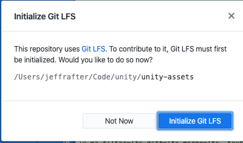
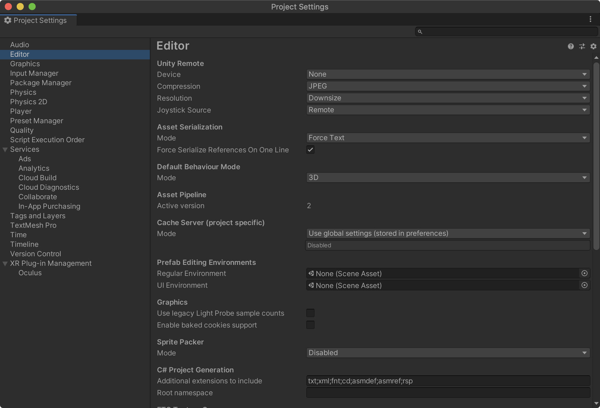
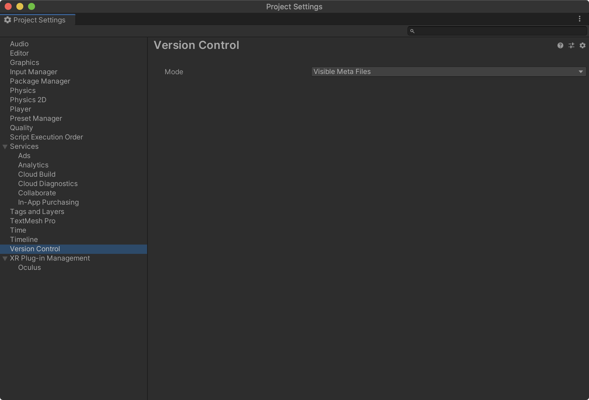

<figure class="fullwidth">

</figure>
<figcaption class="fullwidth">
</figcaption>

Working with Unity makes development easy. You can quickly prototype a game and show it off. But what if there are multiple developers. Storing your source code on GitHub makes collaboration easy; but there are a lot of tradeoffs when working with larger assets and projects.

Unity has built-in collaboration functionality: https://unity.com/unity/features/collaborate

Likewise, GitHub has released tools for working with GitHub inside Unity: https://unity.github.com/

In my case, I often use the command-line or GitHub Desktop.

Create the project. Within the project we'll need to setup git:

```
git init
```

There are a lot of files that we don't want to track in version control. These files are specific to our machine and editor and can't be easily shared. We want to ignore them, so create a file called `.gitignore`:

```
# This .gitignore file should be placed at the root of your Unity project directory
#
# Get latest from https://github.com/github/gitignore/blob/master/Unity.gitignore
#
/[Ll]ibrary/
/[Tt]emp/
/[Oo]bj/
/[Bb]uild/
/[Bb]uilds/
/[Ll]ogs/
/[Uu]ser[Ss]ettings/

# MemoryCaptures can get excessive in size.
# They also could contain extremely sensitive data
/[Mm]emoryCaptures/

# Asset meta data should only be ignored when the corresponding asset is also ignored
!/[Aa]ssets/**/*.meta

# Uncomment this line if you wish to ignore the asset store tools plugin
# /[Aa]ssets/AssetStoreTools*

# Autogenerated Jetbrains Rider plugin
/[Aa]ssets/Plugins/Editor/JetBrains*

# Visual Studio cache directory
.vs/

# Gradle cache directory
.gradle/

# Autogenerated VS/MD/Consulo solution and project files
ExportedObj/
.consulo/
*.csproj
*.unityproj
*.sln
*.suo
*.tmp
*.user
*.userprefs
*.pidb
*.booproj
*.svd
*.pdb
*.mdb
*.opendb
*.VC.db

# Unity3D generated meta files
*.pidb.meta
*.pdb.meta
*.mdb.meta

# Unity3D generated file on crash reports
sysinfo.txt

# Builds
*.apk
*.aab
*.app
*.exe
*.unitypackage

# Crashlytics generated file
crashlytics-build.properties

# Packed Addressables
/[Aa]ssets/[Aa]ddressable[Aa]ssets[Dd]ata/*/*.bin*

# Temporary auto-generated Android Assets
/[Aa]ssets/[Ss]treamingAssets/aa.meta
/[Aa]ssets/[Ss]treamingAssets/aa/*

# IL2CPP build artifacts should be ignored
*BackUpThisFolder_ButDontShipItWithYourGame

# OSX specific files
*DS_Store
._*
.Spotlight-V100
.Trashes
ehthumbs.db
Thumbs.db
```

This `.gitignore` is based on the standard one found at https://github.com/github/gitignore/blob/master/Unity.gitignore.
Note that we are ignoring: `*DS_Store` files. These are specific to OSX. You may want to ignore other files specific to your code editor or operating system (for example if you use Vim). We've also ignored the `*BackUpThisFolder_ButDontShipItWithYourGame` folder. This folder contains IL2CPP files that may or may not be generated depending on how you are building your project. As the name implied you want to keep a backup of this folder for every release of your game (it helps with debugging user submitting bug reports); but we don't need it in version control.

If you normally put your project files in a subfolder you may want to change how the folders are listed. For example:

```
/[Ll]ibrary/
/[Tt]emp/
/[Oo]bj/
/[Bb]uild/
/[Bb]uilds/
/[Ll]ogs/
```

Here the leading `/` indicates that only folders matching the names in the root folder should be ignored. But in many cases you'll want to ignore these files even if they are in a subfolder. To do this, remove the leading `/`:

```
[Ll]ibrary/
[Tt]emp/
[Oo]bj/
[Bb]uild/
[Bb]uilds/
[Ll]ogs/
```

Alternatively, you can leave the file as it is and move the `.gitignore` to the subfolder.

We'll have a lot of large files (audio, textures, models). When changing these files the entire file is changed (not a single line as in text files) Next we'll need to setup Git LFS (large file storage). On GitHub you get a certain amount of LFS storage and bandwidth for free every month. The limits are per account (not per repository):

> Every account using Git Large File Storage receives 1 GB of free storage and 1 GB a month of free bandwidth. If the bandwidth and storage quotas are not enough, you can choose to purchase an additional quota for Git LFS. [^github-lfs]

[^github-lfs]: https://docs.github.com/en/github/managing-large-files/about-storage-and-bandwidth-usage

Additional bandwidth or storage costs money (though it is fairly inexpensive). Because of this, the LFS option should be considered optional. Within your folder, create a file called `.gitattributes`:

```
# Specify what files should be processed by LFS
Assets/Scenes/*.unity filter=lfs diff=lfs merge=lfs -text lockable

# 3D models
*.3dm filter=lfs diff=lfs merge=lfs -text
*.3ds filter=lfs diff=lfs merge=lfs -text
*.blend filter=lfs diff=lfs merge=lfs -text
*.c4d filter=lfs diff=lfs merge=lfs -text
*.collada filter=lfs diff=lfs merge=lfs -text
*.dae filter=lfs diff=lfs merge=lfs -text
*.dxf filter=lfs diff=lfs merge=lfs -text
*.fbx filter=lfs diff=lfs merge=lfs -text
*.jas filter=lfs diff=lfs merge=lfs -text
*.lws filter=lfs diff=lfs merge=lfs -text
*.lxo filter=lfs diff=lfs merge=lfs -text
*.ma filter=lfs diff=lfs merge=lfs -text
*.max filter=lfs diff=lfs merge=lfs -text
*.mb filter=lfs diff=lfs merge=lfs -text
*.obj filter=lfs diff=lfs merge=lfs -text
*.ply filter=lfs diff=lfs merge=lfs -text
*.skp filter=lfs diff=lfs merge=lfs -text
*.stl filter=lfs diff=lfs merge=lfs -text
*.ztl filter=lfs diff=lfs merge=lfs -text

# Audio
*.aif filter=lfs diff=lfs merge=lfs -text
*.aiff filter=lfs diff=lfs merge=lfs -text
*.it filter=lfs diff=lfs merge=lfs -text
*.mod filter=lfs diff=lfs merge=lfs -text
*.mp3 filter=lfs diff=lfs merge=lfs -text
*.ogg filter=lfs diff=lfs merge=lfs -text
*.s3m filter=lfs diff=lfs merge=lfs -text
*.wav filter=lfs diff=lfs merge=lfs -text
*.xm filter=lfs diff=lfs merge=lfs -text

# Fonts
*.otf filter=lfs diff=lfs merge=lfs -text
*.ttf filter=lfs diff=lfs merge=lfs -text

# Images
*.bmp filter=lfs diff=lfs merge=lfs -text
*.exr filter=lfs diff=lfs merge=lfs -text
*.gif filter=lfs diff=lfs merge=lfs -text
*.hdr filter=lfs diff=lfs merge=lfs -text
*.iff filter=lfs diff=lfs merge=lfs -text
*.jpeg filter=lfs diff=lfs merge=lfs -text
*.jpg filter=lfs diff=lfs merge=lfs -text
*.pict filter=lfs diff=lfs merge=lfs -text
*.png filter=lfs diff=lfs merge=lfs -text
*.psd filter=lfs diff=lfs merge=lfs -text
*.tga filter=lfs diff=lfs merge=lfs -text
*.tif filter=lfs diff=lfs merge=lfs -text
*.tiff filter=lfs diff=lfs merge=lfs -text

# Collapse Unity-generated files on GitHub
*.asset linguist-generated
*.mat linguist-generated
*.meta linguist-generated
*.prefab linguist-generated
*.unity linguist-generated

# Unity packages
*.unitypackage filter=lfs diff=lfs merge=lfs -text

# Zips
*.zip filter=lfs diff=lfs merge=lfs -text
```

This specifies which files we want to track with LFS. In order to use the settings you must install LFS:

`git lfs install`

You should see:

```
*➜*git lfs install
Updated git hooks.
Git LFS initialized.
```

If you are working in GitHub Desktop you might see:



Before continuing, you'll want to setup your project in Unity to work with version control. Open the Project Settings and click on the Editor pane. Set Asset Serialization to `Force Text` (the default):



Next, click on the Version Control pane (in Unity 2020) and set the Version Control mode to `Visible Meta Files`:



At this point you should be able to commit and push your changes - sharing them with multiple developers (or between multiple machines). Even with this, Ive found that sometimes the assets and editor site can get out of sync. In these cases, restarting Unity usually helps.

# More help

- How to use GitHub with Unity - by Brackeys - https://www.youtube.com/watch?v=qpXxcvS-g3g
- Git with Unity - by Edward Thomson - https://www.edwardthomson.com/blog/git_with_unity.html
- Project Architecture: Unity Project Folder Structure https://learn.unity.com/tutorial/project-architecture-unity-project-folder-structure#5c7f8528edbc2a002053b672
- https://docs.unity3d.com/Manual/WindowsPlayerIL2CPPBuildProducedFiles.html?_ga=2.72841616.225271014.1599972203-1864417594.1590958312
