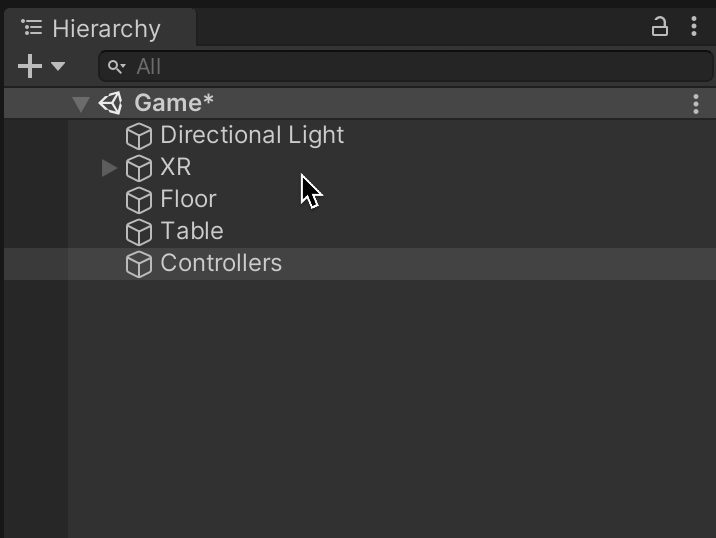

<figure class="fullwidth">

</figure>
<figcaption class="fullwidth">
Image credit: <a href="https://oculus.com">Oculus Quest</a>
</figcaption>

What's better than Virtual Reality? Virtual Reality with friends. Even the most basic games become more fun when played together. Previously, we focused on [getting started with Unity and Virtual Reality](./getting-started-with-unity-and-vr). This post builds on top of that foundation: adding multiplayer support, multi-platform support, multiple controllers, and virtual reality avatars.

## Choosing a multiplayer package

There are a number of different approaches for building multiplayer games in Unity, some of the most common are:

* Mirror (Unity multiplayer networking) https://github.com/vis2k/Mirror
* Normcore (Unity multiplayer service) https://normcore.io
* Photon (Unity multiplayer servuce) https://www.photonengine.com/

Mirror is open source and fantastic for peer to peer multiplayer. It requires that you (or a player) host the server which requires more work at scale. If you are looking to use Mirror I highly recommend the excellent YouTube series [How To Make A Multiplayer Game In Unity - Client-Server - Mirror Networking](https://www.youtube.com/watch?v=5LhA4Tk_uvI&list=PLS6sInD7ThM1aUDj8lZrF4b4lpvejB2uB) by DapperDino.

Photon and Normcore are hosted services but both have free plans. Photon tends to charge based on the number of concurrently connected users and Normcore based on the hours spent in shared "rooms". I tend to use Normcore because the kinds of games I want to make work better with their plans and I find it the simplest solution. Depending on your use case you might choose another option.

Check out the pricing:

* https://normcore.io/pricing
* https://www.photonengine.com/en-US/PUN/Pricing

## Planning out the scene

Before we start building our scene it is important to outline our goals:

* Users should be able to view and control their player with a VR headset, Keyboard and AR
* Each player will be represented by an avatar within the game
* VR controllers can represent hands and teleport
* Avatars are rigged with inverse kinematics
* Networked objects should be sharable between players

### User controls

Within our basic example we were able to control the player's view (what is displayed on the each lens) by moving the camera when the headset moved. In this way, the locomotion of our headset is our main "controller." But what about our friends that don't have an Oculus Quest? It would be great if they could also join our multiplayer game. To support this we will create three sets of controls:

* Virtual reality - the headset and the two VR controllers
* Augmented reality - using a phone as an AR controller
* Computer - using a keyboard and mouse to control the player

This adds some complexity but it means our game will be more accessible. Additionally, it makes it much easier to test out the multiplayer functionality (without needing multiple headsets). We can run the game in the Unity editor and our device to test various aspects of our game.

#### Avatars

Game designers often categorize their games as first-person or third-person. In a first-person game you view the game from the player's perspective. Games like Quake or Counter-strike (or Superhot for VR) are "first-person shooters."  In a third-person game you control the player but not from the player's perspective. Games like Super Mario 3D World (or Moss for VR) let you control Mario without seeing through Mario's eyes. We'll probably end up using multiple perspectives, but we'll start with first-person as that will be more immersive in VR.

Regardless of the perspective, we'll need to be able to show the player in the scene. Often in first-person VR games you don't see yourself (you might see only your hands). Because our game is multiplayer we'll need to be able to see the other players in the scene. These are called player avatars[^avatar]; and they are what we'll be controlling.

[^avatar]: Why are they called "avatars"? According to [wikipedia](https://en.wikipedia.org/wiki/Avatar_(computing)), "The word avatar originates in Hinduism, where it stands for the 'descent' of a deity in a terrestrial form." It goes on to say, "The use of the term avatar for the on-screen representation of the user was coined in 1985 by Richard Garriott for the computer game Ultima IV: Quest of the Avatar. In this game, Garriott desired the player's character to be his earth self manifested into the virtual world."

When a player joins the multiplayer version of our game we'll create a local player avatar for them. As they control their character and move it around the scene, we'll update our local copy of the avatar. To do this we'll separate out how the player is controlled from how the player object is updated and displayed - even for our own local player object.

#### VR controllers can represent hands and teleport

In the previous post we were able to look around our scene - but we didn't have a body or even hands. The Oculus Quest offers two ways to control the hands of your character: hand tracking and touch controllers. We'll implement the touch controllers and use those as our "hands" within our scene. This will allow us to leverage haptic feedback and different button inputs for interacting.

Tracking the headset's position means that walking around in reality will translate to player movement in virtual reality. That's great, but a given player's play-space size might be very small. Because we'll be using the controllers, we could easily utilize the thumb-sticks to control player locomotion. Generally there are three kinds of controller based locomotion:

* Teleporting
* Snap-turns
* Thumbstick movement

We'll implement all three of these controls. Unfortunately, though, thumbstick based movement can induce discomfort as the player's visual position changes without a corresponding physical change. For this reason, many games do not enable thumbstick based movement, so we'll make it optional.

#### Rigged characters and inverse kinematics

Our VR avatars will be controlled using three 3D points: the headset and the two controllers. Using these three points we can easily represent a head and two hands in our scene. We can go further: rigging these to an entire body with arms will let us control all parts of the body like a puppeteer. This is done by solving how the joints would need to bend based on the three control points using a technique called inverse kinematics.

#### Networked objects should be sharable between players

Lastly, we'll want to be able to see (and share) objects in our multiplayer scene. For example, we'll want to be able to pickup, drop and throw things. For most objects within a multiplayer environment there is one "owner" that determines the position and rotation of each object. Changes to the position and rotation are broadcast to all of the participants. In most cases physics simulations are handled on the local machine of the "owner".

One thing we're not covering in this post is anti-cheating. Because we are relying on the clients to broadcast changes to the position of objects (including their own player) we are trusting them to follow the rules. A cheater could, in theory, modify the game so they could run or move more quickly, go through walls, etc. For now we won't worry about validating movements but in a public application you would need to implement a robust anti-cheating system.

# Create a new project

We'll need to create a new Unity project for our multiplayer scene. We'll assume you are starting with the project from the previous post. If you followed that post you can continue to use the same project you've already started. Otherwise you can use the template to start a new project.

First use the template on GitHub to create a new repository. Go to https://github.com/jeffrafter/unity-basic-xr-template and click the `Use this template` button. Fill out the repository information and click `Create repository from template`:


Clone the repository locally:

```sh
git clone https://github.com/jeffrafter/hide-and-seek-multiplayer Hide\ and\ Seek\ Multiplayer
```

Then within Unity Hub click `Add` and find the newly created folder, then click `Open`. Once the project is added to Unity Hub open it. Unity will open to a blank scene. Under Assets, in the Scenes folder, open the `Game` scene.


We're ready to get started.

# Building the project


How To MAKE A VR GAME: Beginner's guide to Virtual Reality & Unity XR Plugin
https://www.youtube.com/watch?v=1VC3ZOxn2Lo


## Setting up the controllers

Because we'll have multiple controllers available in our game, we'll need to move some pieces around. In the scene hierarchy, create a new empty game object and call it `Controllers`. Then drag the `XR` node into it as a child.



Expand all of the nodes of the `XR` game object. Under `Camera Offset` create a new empty game object and call it `Left Controller`:


Active Input Handling https://rpl.cat/uploads/XWHRxxQ13t1jR5BkfwUDSLWpPANd-F3Mkbi6njUEers/public.png


References:

* [How to Setup XR Toolkit's Action-Based Input in Unity](https://www.youtube.com/watch?v=d2gEEQeu1b4)
