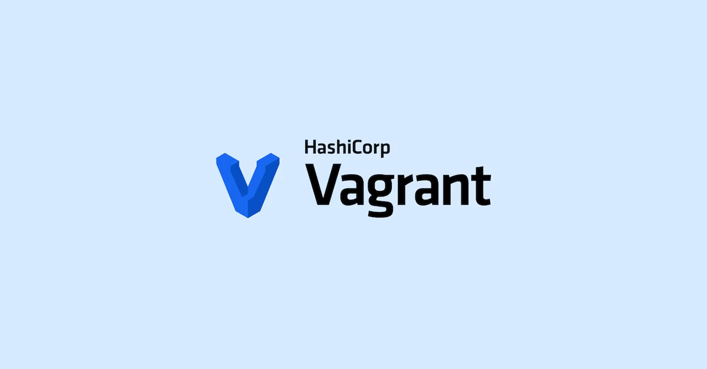

<figure class="fullwidth">

</figure>
<figcaption class="fullwidth">
Image credit: <a href="https://vagrantup.com">HashiCorp Vagrant</a>
</figcaption>

I've been on a quest to setup a virtual AirPrint printer on my Mac that allows me to print to a PDF from my iPad. I've tried a few different things including [RWTS-PDFWriter](/printers-fake-printers-and-airprint) and [CUPS-PDF](/docker-and-cups-pdf/) and I kept falling short. The final piece of the puzzle was to use Vagrant to run a Linux VM with CUPS-PDF installed. Here's how I did it.

# Vagrant

Vagrant is a tool from HashiCorp that lets you create and manage virtual machines. It's a great way to run a Linux environment (or Windows) on your Mac. I've been using it almost as long as I've been using [terraform](/terraform-and-aws/#some-history).

Unlike Docker, Vagrant runs a full virtual machine. This means that you can run any operating system that you want, not just Linux. It also means that you can run software that requires a full networking stack (not Hypervisor). Because of this, we'll be able to run CUPS-PDF, advertise the service with Avahi and have it work with AirPrint.

Before you get started, you'll need to install a "provider" for Vagrant. This is the software that actually runs the virtual machine. The most popular provider is VirtualBox, but there are others like VMware and Hyper-V. I'm going to use VirtualBox for this example. Go to https://www.virtualbox.org/wiki/Downloads and download the installer for your operating system. Note: if you are installing VirtualBox for Mac M1/M2 you'll need to use the ARM64 beta build. You can find the latest in "Older Builds." At the time of this writing, the latest is 7.0.8: https://download.virtualbox.org/virtualbox/7.0.8/VirtualBox-7.0.8_BETA4-156879-macOSArm64.dmg Once installed, you can install Vagrant.

Install Vagrant by downloading the installer from the [Vagrant downloads page](https://www.vagrantup.com/downloads) or through Homebrew:

```bash
brew tap hashicorp/tap
brew install hashicorp/tap/hashicorp-vagrant
```

Once installed, you can create a new directory and run `vagrant init` to create a new `Vagrantfile`.

```bash
mkdir Printers
cd Printers
vagrant init
```

This will create a new file called `Vagrantfile` in the directory. You can edit this file to specify the operating system and the software that you want to install.


# CUPS-PDF

CUPS-PDF is a printer driver for CUPS that allows you to print to a PDF file. It's a great tool for creating PDFs from any application that supports printing. You can install it on a Linux machine by running the following commands:

```bash
sudo apt-get update
sudo apt-get install cups cups-pdf
sudo usermod -aG lpadmin vagrant
```

This will install CUPS and CUPS-PDF and add the `vagrant` user to the `lpadmin` group, which allows the user to manage printers.

# Vagrantfile

To run CUPS-PDF in a Vagrant VM, you can add the following to your `Vagrantfile`:

```ruby
Vagrant.configure("2") do |config|
  config.vm.box = "ubuntu/bionic64"
  config.vm.network "forwarded_port", guest: 631, host: 631
  config.vm.provision "shell", inline: <<-SHELL
    sudo apt-get update
    sudo apt-get install -y cups cups-pdf
    sudo usermod -aG lpadmin vagrant
  SHELL
end
```

This will create a new VM running Ubuntu 18.04 and install CUPS and CUPS-PDF. It will also forward port 631 from the VM to port 631 on the host machine, which is the default port for the CUPS web interface.

# Start the VM

Once you have added the configuration to the `Vagrantfile`, you can start the VM by running `vagrant up`. This will download the


Vagrant
https://github.com/SteveMarshall/home-monitoring/commit/e243139fb02e531205a713228dd3ec73d794f43e
