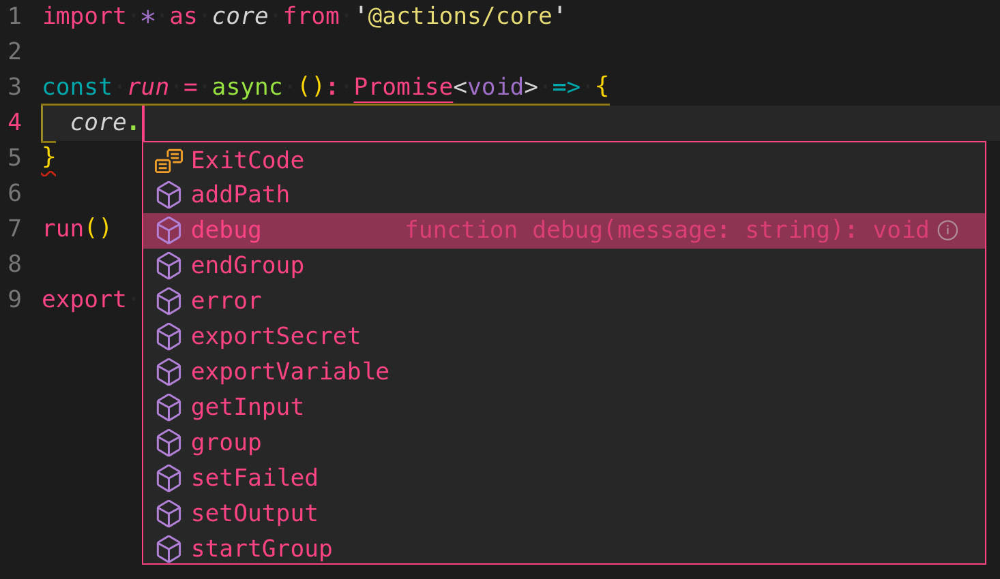
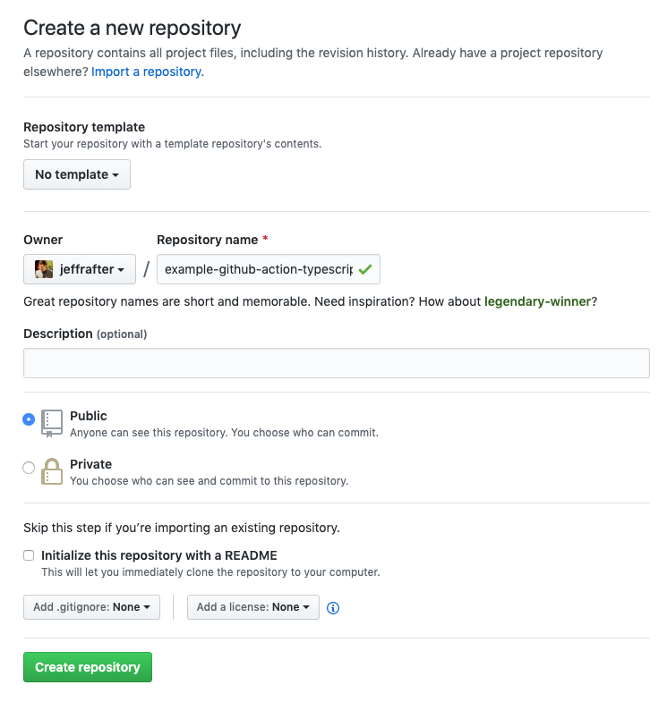
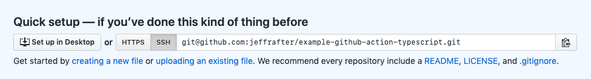
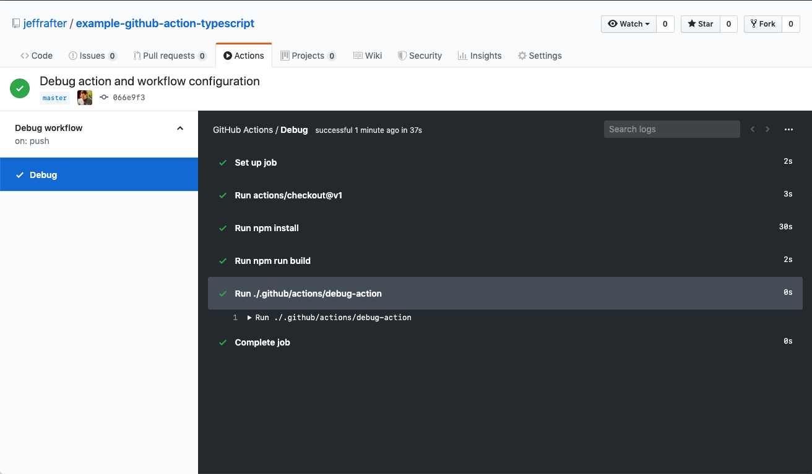
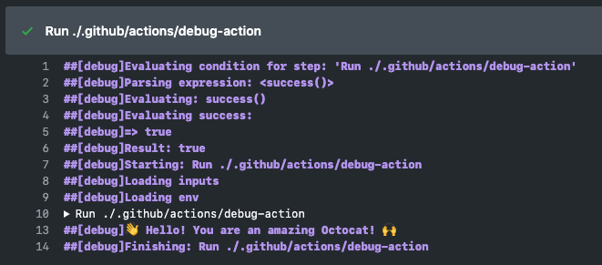
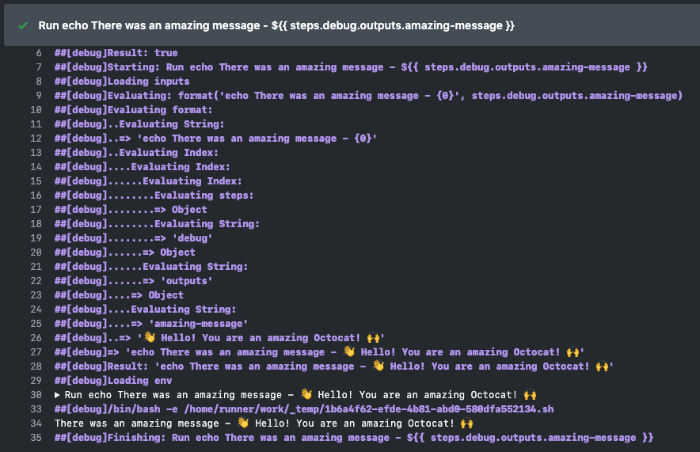
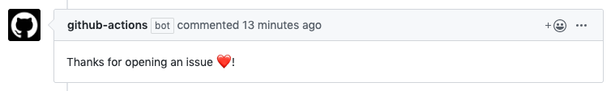
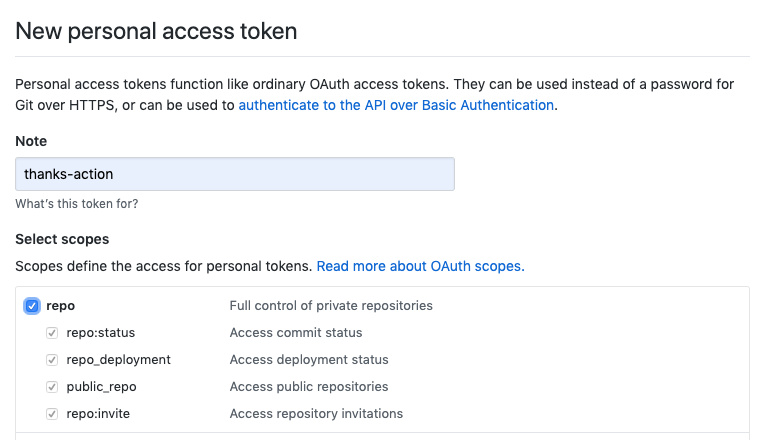
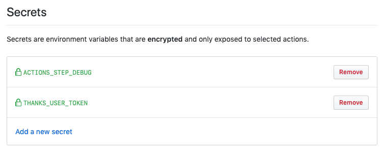
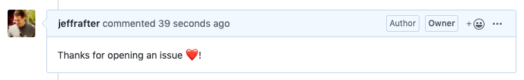

<figure>

</figure>
<figcaption>
Image credit: GitHub's Hubot <a href="https://octodex.github.com/hubot/">from the Octodex</a>
</figcaption>

GitHub Actions are still in beta and are changing quickly. But if you are looking to get started the possibilities are endless. This guide is mostly about pointing to documentation and exploring some fun ways to use GitHub Actions.

In this post we'll create a repository which contains a GitHub Action - built in TypeScript - and an associated workflow. In the action we'll respond to push events and output some logging information. Technically, you don't need a custom script to accomplish this; you could instead build a very simple workflow which runs `echo` commands. Using a full script will allow us to explore more capabilities of GitHub Actions. We'll also create an action that automatically responds to, and reacts to, issue comments.

Before you read this it is important to note: starting with a [template](https://github.com/actions/javascript-template) will save you a lot of time and setup. In this post, however, I am going to work through and explain all of the steps. Included in this post are some of the reasons I've chosen one particular setup and skipped another. When getting started with GitHub Actions it is difficult to understand how all of the pieces fit together, or why you might want to create and action for a particular task. Hopefully this post provides some helpful examples. That said, there are probably steps here that you've seen before, don't care about, or just want to skip and that's okay.

In order to follow this, you'll need a GitHub account. Additionally, you'll need to [sign up for the GitHub Actions beta](https://github.com/features/actions). The examples will be in TypeScript.

> All of the code (and commits) are availble on GitHub: https://github.com/jeffrafter/example-github-action-typescript

# Documentation

The documentation for GitHub Actions is really good (far more complete than this post) and is good to have on hand. You can learn how to build Actions, Workflows and core concepts; as well as dive deeply on using the toolkit, octokit and handling payloads.

- [Automating your Workflow with GitHub Actions](https://help.github.com/en/categories/automating-your-workflow-with-github-actions)
- [GitHub Package Toolkit](https://github.com/actions/toolkit/blob/master/docs/github-package.md)
- [Event Types & Payloads](https://developer.github.com/v3/activity/events/types/)
- [Rest API V3](https://developer.github.com/v3/)
- [octokit/rest.js](https://octokit.github.io/rest.js/)

# Getting started

First you want to create a folder for your project:

```bash
mkdir example-github-action-typescript
cd example-github-action-typescript
```

We'll be using TypeScript to build our action, which requires Node. Out of the box GitHub supports a few environments for your actions to run [^environments]. There is built-in support for running actions built in JavaScript (using Node). So why did I choose to use TypeScript? It makes development a lot easier by providing compile-time checks and hints in my editor about methods and parameters (especially if you are using an editor like VSCode that has support for it). As part of our action we'll export the TypeScript to JavaScript.

[^environments]: There are several different [virtual operating systems](https://help.github.com/en/articles/virtual-environments-for-github-actions#supported-virtual-environments-and-hardware-resources) you can use for your actions which come preloaded with [useful software](https://help.github.com/en/articles/software-in-virtual-environments-for-github-actions). Additionally, you can utilize Docker containers running in one of these virtual environments to pre-configure your hosts.

Let's setup our example to use Node. If you have multiple local projects you might run into a conflict about which Node version should be used. Node Version Manager solves this problem. To control which version of Node should be used in your project, add an `.nvmrc`[^dotfiles] file:

```json
12.7.0
```

The file is pretty simple; just the version. I chose 12.7.0 because it matches the version that is used to run our action (`node12`). Node 10.16.3 is installed in the default [GitHub Action software environment](https://help.github.com/en/articles/software-in-virtual-environments-for-github-actions) and can be used as well but the will not match the running action environment. At the time you read this there may be a newer version of Node or you may chose to use an older version because your code requirements. You can check https://nodejs.org.

[^dotfiles]: Notice that the `.nvmrc` file starts with a "`.`" (period). By default on most systems this creates a hidden file. Oftentimes general project config is hidden away. On MacOS you can show hidden files in Finder by running `defaults write com.apple.finder AppleShowAllFiles -bool true` and restarting Finder. If you want to list hidden files in your console use the `-a` parameter: `ls -a`.

## Ignore some things

We plan to use `git` to keep track of our changes. As we work on our project locally, there will be a lot of files we won't want to keep track of; we'll want to ignore them. To do this we'll create a new file called `.gitignore` [^gitignore]. These files can be very short and specific, or they can be very long and general. We'll use a more generic one that will work on different kinds of computers. If you are looking for an example `.gitignore` you can check out https://github.com/github/gitignore. For now, just copy the following (this `.gitignore` includes only what is important for this post. For a more complete version see [here](https://github.com/jeffrafter/example-github-action-typescript/blob/master/.gitignore)):

```.gitignore

# Ignore any generated TypeScript -> JavaScript files
.github/actions/**/*.js

# Logs
logs
*.log
npm-debug.log*

# Dependency directories
node_modules/

# Typescript v1 declaration files
typings/

# Optional npm cache directory
.npm

# Optional eslint cache
.eslintcache
```

With this setup we'll ignore `node_modules` and JavaScript files in our action folders (if there was any generated locally). This is a non-standard choice but makes developing our action a little easier. By default, GitHub recommends you include the `node_modules` folder as installing them per-action execution is slow (25-35 seconds). Including all of the `node_modules` in your repository can lead to a lot of files and large commits which can be confusing. Additionally, if your `node_modules` include platform specific dependencies which must be compiled (such as `hunspell`) you will need to recompile them for the target action container anyway.

Ignoring generated JavaScript in our action folders means that we have to build our TypeScript as part of our workflow. Again, this is slower and can lead to compile time errors on the server, but it saves us a few steps when developing actions.

[^gitignore]: `.gitignore` also starts with a "`.`" and you can start to see a pattern emerge.

## Save your progress using version control

At this point we really haven't made anything (except a lot of configuration). Even though our website isn't even a website yet – it still makes sense to save our work. If we make a mistake having our code saved will help us. To do this we'll use `git` - a version control software that lets us create commits or _versions_ as we go. To initialize a `git` repository run:

```bash
git init
```

By default this creates an empty git repository (none of our files have been added to it). Generally, I use [GitHub Desktop](https://desktop.github.com/); however, I'll use the command line here. You can check the status of your changes and repository:

```bash
git status
```

You should see:

```bash
On branch master

No commits yet

Untracked files:
  (use "git add <file>..." to include in what will be committed)

	.gitignore
	.nvmrc

nothing added to commit but untracked files present (use "git add" to track)
```

Let's get ready to create a commit by adding all of the files:

```bash
git add .
```

Here the `.` means: "everything in the current folder". But what are we adding it to? We are adding it to the commit _stage_. Let's check the status again:

```bash
git status
```

You should see:

```bash
On branch master

No commits yet

Changes to be committed:
  (use "git rm --cached <file>..." to unstage)

	new file:   .gitignore
	new file:   .nvmrc
```

We're getting ready to add two new files to our repository. Let's commit:

```bash
git commit -m "Initial commit with configuration"
```

This creates a commit with the message we specified. The commit acts like a save point. If we add or delete files or change something and make a mistake, we can always revert back to this point. We'll continue to commit as we make changes.

## Packages & Dependencies

For almost any Node project you'll find that you use a lot of packages – you'll have far more code in packages in your `node_modules` folder (where package code is stored) than your main project.

Initialize your packages:

```bash
npm init -y
```

Now you have a `package.json`:

```json
{
  "name": "example-github-action-typescript",
  "version": "1.0.0",
  "description": "",
  "main": "index.js",
  "scripts": {
    "test": "echo \"Error: no test specified\" && exit 1"
  },
  "keywords": [],
  "author": "",
  "license": "ISC"
}
```

Let's simplify it a bit (you can fill out or keep fields you like here, but this is the minimum):

```json
{
  "private": true,
  "scripts": {
    "build": "tsc",
    "test": "tsc --noEmit && jest"
  },
  "license": "ISC"
}
```

The only scripts we need at the moment are `build` which will convert our TypeScript to JavaScript and `test` which will run our tests. While we're working on our action we'll need access to all of our project's dependencies; the difference between `dependencies` and `devDependencies` won't matter very much. For that reason we'll install everything as a `dev` dependency:

```bash
npm install --save-dev \
  @actions/core \
  @actions/github
```

The `@actions/core` and `@actions/github` are the baseline for interacting with GitHub and the incoming events. When you publish an action which is meant to be used by multiple repositories and workflows, you'll release the action with dependencies included (so they run more quickly). In that case you would use `--save` instead of `--save-dev`. In most other cases the code for your actions should only be used as part of your testing or development environment (not part of your production environment).

We'll want to add testing support to test our action:

```bash
npm install --save-dev \
  jest \
  js-yaml
```

And TypeScript support:

```bash
npm install --save-dev \
  typescript \
  ts-jest
```

Finally, because we're using TypeScript, we'll want to add type support for development:

```bash
npm install --save-dev \
  @types/jest \
  @types/node
```

This is a good opportunity to create another commit; check the status:

```bash
git status
```

You should see:

```bash
On branch master
Untracked files:
  (use "git add <file>..." to include in what will be committed)

	package-lock.json
	package.json

nothing added to commit but untracked files present (use "git add" to track)
```

We've added a lot of files to our folder but many of them are ignored. For example, the `node_modules` folder contains tons of files (as mentioned before). We want everyone working on our project to install the same dependencies. When installing, they were automatically added to the `package.json` file. The `package-lock.json` ensures that the dependencies of our packages are locked to specific versions. Because of this, we'll add both of these files to `git`:

```bash
git add .
```

And then commit:

```bash
git commit -m "Setting up our packages"
```

## TypeScript

We'll also need to configure TypeScript before we can build our action. Create `tsconfig.json`:

```json
{
  "compilerOptions": {
    "module": "commonjs",
    "target": "esnext",
    "lib": ["es2015", "es2017"],
    "strict": true,
    "esModuleInterop": true,
    "skipLibCheck": true,
    "noUnusedLocals": true,
    "noUnusedParameters": true,
    "noImplicitAny": true,
    "removeComments": false,
    "preserveConstEnums": true
  },
  "include": [".github/actions/**/*.ts", "**/*.ts"],
  "exclude": ["node_modules"]
}
```

By default this allows us to build all of the actions contained in our repository, adds some strict compile-time checks, and skips type checking for our dependencies.

Let's commit this file:

```bash
git status
```

You should see:

```bash
On branch master
Untracked files:
  (use "git add <file>..." to include in what will be committed)

	tsconfig.json

nothing added to commit but untracked files present (use "git add" to track)
```

Add it:

```bash
git add .
```

And commit:

```bash
git commit -m "TypeScript configuration"
```

# Keep it clean (optional)

> Note: this section is not required to complete this tutorial; if you want to skip it feel free.

Everyone has different preferences when they edit code. Some prefer tabs over spaces. Some want two spaces instead of four. Some prefer semicolons and some don't. It shouldn't matter right? But it does. If editors are autoformatting code based on user preferences it is important to make sure everyone has chosen the same set of defaults for that autoformatting. This makes it easy to tell what changed between versions – even when different developers (with different preferences) have made changes.

For this reason we'll setup a linter and code formatter for our code. Install [eslint](https://eslint.org/) and [prettier](https://prettier.io/):

```bash
npm install --save-dev \
  eslint \
  @typescript-eslint/eslint-plugin \
  @typescript-eslint/parser \
  eslint-config-prettier \
  eslint-plugin-prettier \
  prettier
```

Now that we have the packages we'll need to configure them in `.eslintrc.json`:

```json
{
  "parser": "@typescript-eslint/parser",
  "plugins": ["@typescript-eslint", "prettier"],
  "extends": [
    "eslint:recommended",
    "plugin:@typescript-eslint/recommended",
    "prettier/@typescript-eslint",
    "plugin:prettier/recommended"
  ],
  "rules": {
    "prettier/prettier": [
      "error",
      {
        "singleQuote": true,
        "trailingComma": "all",
        "bracketSpacing": false,
        "printWidth": 120,
        "tabWidth": 2,
        "semi": false
      }
    ],
    // octokit/rest requires parameters that are not in camelcase
    "camelcase": "off",
    "@typescript-eslint/camelcase": ["error", {"properties": "never"}]
  },
  "env": {
    "node": true,
    "jest": true,
    "es6": true
  },
  "parserOptions": {
    "ecmaVersion": 2018,
    "sourceType": "module"
  }
}
```

I won't go into too much detail here; there are [better explanations](https://www.robertcooper.me/using-eslint-and-prettier-in-a-typescript-project) to be found. This configuration does a few things:

- Relies on the typescript eslint parser with the prettier plugin - I've found this works very well in @Code. If you were previously using `ts-lint` with prettier this setup should replace your old configuration.
- This eslint config doesn't work perfectly for projects that contain both JavaScript and TypeScript - because of that we won't attempt to lint JavaScript files in our project
- I've turned off the camelcase rules for properties - when writing GitHub Actions you will likely use properties from `@actions/github` and from the API and these will not be camelcase.[^camelcase]
- The expected environment should include `node` and `jest` - this will help `eslint` ignore missing declarations for things like `describe`, `process`, `module`, etc.

[^camelcase]: There are lots of ways to name variables including `camelCase`, `snake_case`, `ProperCase`, and `CONSTANT_CASE`. JavaScript and TypeScript tend to use `camelCase` for variable names, but Ruby (which is what much of GitHub and the GitHub API is written in) generally uses `snake_case`. This is one of those places where the idioms of different languages collide and you have to make the best of it.

If you need to ignore specific files when linting you can add them to `.eslintignore`. Because our setup doesn't work well for JavaScript we'll ignore all JavaScript files in `.eslintignore`:

```
*.js
!/.github
```

Notice that we are explicitly unignoring the `.github` folder. This is where our source code will be kept (see next section). We have to unignore this folder explicitly because it starts with a `.` and is normally ignored by eslint.

Add a `lint` action to the `scripts` node in `package.json`:

```
  "scripts": {
    "build": "tsc",
    "test": "tsc --noEmit && jest",
    "lint": "eslint . --ext .ts"
  },
```

With this in place we can run:

```bash
npm run lint
```

Wait, there's an error:

```
Oops! Something went wrong! :(

ESLint: 6.4.0.

No files matching the pattern "." were found.
Please check for typing mistakes in the pattern.
```

We haven't written any TypeScript to lint yet. Time to stop configuring and start writing code.

Checking our `git status` should show our changes:

```bash
On branch master
Changes not staged for commit:
  (use "git add <file>..." to update what will be committed)
  (use "git checkout -- <file>..." to discard changes in working directory)

	modified:   package-lock.json
	modified:   package.json

Untracked files:
  (use "git add <file>..." to include in what will be committed)

	.eslintignore
	.eslintrc.json

no changes added to commit (use "git add" and/or "git commit -a")
```

This makes sense; we've added two files and installed some new `devDependencies` into our packages. Let's add everything and to the commit stage:

```bash
git add .
```

If we check `git status` again:

```bash
On branch master
Changes to be committed:
  (use "git reset HEAD <file>..." to unstage)

	new file:   .eslintignore
	new file:   .eslintrc.json
	modified:   package-lock.json
	modified:   package.json
```

Let's commit:

```bash
git commit -m "Linting configuration"
```

## Project Layout

The code for GitHub Actions are generally kept in the `actions` folder in the `.github` folder. By default, the `.github` folder contains metadata for the repository that can be used for automated tasks. The steps for running an action are defined in a Workflow which is usually stored in the `workflows` folder in the `.github` folder:

```
.github/
  actions/
    debug-action/
      __tests__/
        debug.test.ts
      action.yml
      debug.js
      debug.ts
  workflows/
    debug-workflow.yml
```

Repositories can contain multiple actions (or none at all); we'll define our debug action inside a folder called `debug-action`. This will contain our TypeScript, generated JavaScript, tests, and the `action.yml` where all of the settings for the action are kept.

A repository may also have multiple workflows (or none at all); we'll setup a workflow that runs our debug action inside `debug-workflow.yml`.

```bash
mkdir -p .github/actions
mkdir -p .github/actions/debug-action
mkdir -p .github/actions/debug-action/__tests__
mkdir -p .github/workflows
```

## Building the debug action

Enough setup; let's get building. Create a new file called `.github/actions/debug-action/debug.ts`:

```ts
import * as core from '@actions/core'

const run = async (): Promise<void> => {
  // Action code here
}

run()

export default run
```

The code inside your action should be auto-executing. In this case we define a `run`[^run] method and then immediately call it right after it has been defined. In fact, you don't even need to define a method, you could include the code for your action directly. In some cases that might be okay, but as the complexity of the action increases it would become confusing. We've also made our function the default export. This isn't required but will make things easier as we move forward and test our code.

[^run]: We've named our function `run` but you could name the function anything you wanted. `run` is a convention used in the base [`javascript-template`](https://github.com/actions/javascript-template/blob/master/src/main.ts)

There are lots of helpers built into the `core` package we imported. This is the simplest. Because we're using TypeScript you may see autocomplete information in your editor:[^yonce]



[^yonce]: I'm using VSCode here with the [Yoncé theme](https://yoncetheme.com/). It is super rad.

At this point the action does nothing. Lets add some debugging:

```ts
const run = async (): Promise<void> => {
  core.debug('👋 Hello! You are an amazing person! 🙌')
}
```

Even though this action isn't accomplishing much, let's write a test for it.

### Testing the debug action

Create a new file called `.github/actions/debug-action/__tests__/debug.test.ts`:

```ts
import * as core from '@actions/core'
import run from '../debug'

describe('debug action debug messages', () => {
  it('outputs a debug message', async () => {
    const debugMock = jest.spyOn(core, 'debug')
    await run()
    expect(debugMock).toHaveBeenCalledWith('👋 Hello! You are an amazing person! 🙌')
  })
})
```

We import the actions core library and the run method we just created in our debug action. In our test we create a Jest spy which allows us to verify that the `core.debug` method is getting called with the correct parameters. Normally, I wouldn't test the debug output (if it fails I don't care too much) but this is a good foundation.

In order to run this we'll need to configure Jest. Create a new file called `jest.config.js` in the root of your project:

```js
module.exports = {
  clearMocks: true,
  moduleFileExtensions: ['js', 'ts'],
  testEnvironment: 'node',
  testMatch: ['**/*.test.ts'],
  transform: {
    '^.+\\.ts$': 'ts-jest',
  },
  transformIgnorePatterns: ['^.+\\.js$'],
  verbose: true,
}
```

At this point you can run the tests. From your terminal run:

```bash
npm run test
```

You should see:

```
> @ test /Users/njero/Code/Examples/example-github-action-typescript
> tsc --noEmit && jest

 PASS  .github/actions/debug-action/__tests__/debug.test.ts
  debug action debug messages
    ✓ outputs a debug message (5ms)

::debug::👋 Hello! You are an amazing person! 🙌
::debug::👋 Hello! You are an amazing person! 🙌
Test Suites: 1 passed, 1 total
Tests:       1 passed, 1 total
Snapshots:   0 total
Time:        1.423s
Ran all test suites.
```

It should pass.[^verbose] But let's remove the debug information from the test output. Change `jest.config.js` so that it doesn't output the debug lines:

```js
const processStdoutWrite = process.stdout.write.bind(process.stdout)
process.stdout.write = (str, encoding, cb) => {
  if (!str.match(/^::debug::/)) {
    return processStdoutWrite(str, encoding, cb)
  }
  return false
}

module.exports = {
  clearMocks: true,
  moduleFileExtensions: ['js', 'ts'],
  testEnvironment: 'node',
  testMatch: ['**/*.test.ts'],
  transform: {
    '^.+\\.ts$': 'ts-jest',
  },
  verbose: true,
}
```

[^verbose]: The debug output here is a little verbose. There's an [open issue](https://github.com/actions/toolkit/issues/118) to be able to silence this while running tests.

With that change the debug output should no longer appear when we run the tests. We can run our `lint` task to verify that our code is clean:

```bash
npm run lint
```

It should succeed this time with no errors and no warnings. Let's commit what we have. Run `git status`:

```bash
On branch master
Untracked files:
  (use "git add <file>..." to include in what will be committed)

	.github/
	jest.config.js

nothing added to commit but untracked files present (use "git add" to track)
```

Let's add those files:

```bash
git add .
```

Note, one of the items listed was the `.github` folder. When we added it all of the newly added files inside of that folder were also added. Let's check the status again:

```bash
git status
```

Notice that we are about to commit three files:

```bash
On branch master
Changes to be committed:
  (use "git reset HEAD <file>..." to unstage)

	new file:   .github/actions/debug-action/__tests__/debug.test.ts
	new file:   .github/actions/debug-action/debug.ts
	new file:   jest.config.js
```

Commit:

```bash
git commit -m "Debug action"
```

### Create the action.yml for the debug action

We've written the code for our action and a test that tells us it is working. Unfortunately we haven't defined how our action should be used. To do that we have to configure the action in a `yml` file. Create `.github/actions/debug-action/action.yml`:

```yaml
name: 'debug-action'
description: 'Outputs debug information'
author: 'jeffrafter'
runs:
  using: 'node12'
  main: './debug.js'
```

There are [more configuration options available](https://help.github.com/en/articles/metadata-syntax-for-github-actions) for actions but this represents the minimum amount needed to run. Specifically, it gives the action a name (which does not need to match the name of the folder) and points to the the code `./debug.js`. Unfortunately, we don't have a file called `debug.js`, we have a file called `debug.ts`.

GitHub Actions have built-in support for JavaScript and cannot run TypeScript directly. Because of this we will need to _transpile_ our TypeScript to JavaScript before it can be run. This is done with `tsc` (the TypeScript compiler). We've already included a task:

```bash
npm run build
```

This will generate JavaScript files `debug.js` (and `debug.test.js`):

```js
'use strict'
var __importStar =
  (this && this.__importStar) ||
  function(mod) {
    if (mod && mod.__esModule) return mod
    var result = {}
    if (mod != null) for (var k in mod) if (Object.hasOwnProperty.call(mod, k)) result[k] = mod[k]
    result['default'] = mod
    return result
  }
Object.defineProperty(exports, '__esModule', {value: true})
const core = __importStar(require('@actions/core'))
const run = async () => {
  core.debug('👋 Hello! You are an amazing person! 🙌')
}
run()
exports.default = run
```

In our setup we've ignored these files - they will not be included when we push our code to GitHub. This isn't the recommended setup; GitHub suggests you include the built files for your actions to save time when running your action (and to reduce the dependencies needed by your action on the server). When developing actions it is easy to forget to build your code with each change. Because of this I've chosen to automatically build on execution (even though it is slower)[^slower]. When releasing the action it is best to include the built JavaScript.

[^slower]: Taking a few extra seconds to build your action on execution may not seem like a big deal; but GitHub Actions have a limited about of [free](https://github.com/features/actions) compute time. While developing an action this might not matter; but long-term those seconds can add up.

## Workflows

In order to execute the `debug-action` we've created we need to create a workflow. The `action.yml` in our action defines **the code** to execute and the workflow defines **when** to execute it. Workflows should be kept in the `.github/workflows` folder in your repository. Your repository may contain multiple workflows. Create `.github/workflows/debug-workflow.yml`:

```yaml
name: 'Debug workflow'
on: [push]

jobs:
  build:
    name: Debug
    runs-on: ubuntu-latest
    steps:
      - uses: actions/checkout@v1
        with:
          fetch-depth: 1
      - run: npm install
      - run: npm run build
      - uses: ./.github/actions/debug-action
```

We've created a workflow that should be executed on `[push]`. There are many different [events that trigger worklows](https://help.github.com/en/articles/events-that-trigger-workflows). By specifying `[push]` we're saying that every time new code is pushed to our GitHub repository our workflow should be executed. In this case we've chosen to execute our workflow using the `ubuntu-latest` environment. The steps for a workflow can point to an action that should be used or a command that should be run. Here we use both.

The first step checks out our code using the `actions/checkout@v1` action:

```yml
- uses: actions/checkout@v1
  with:
    fetch-depth: 1
```

The `actions/checkout` action[^checkout] checks out a copy of your code on the server where the workflow is running. We've set the fetch-depth to `1` indicating we only want a shallow-clone.[^shallow-clone] When your action code is included in your `.github` folder (as our `debug-action` is), you must use the `actions/checkout` action to checkout a copy of the code so that it can run.

[^checkout]: The code for `actions/checkout` lives [on github](https://github.com/actions/checkout). Where is the copy of your code located on the server? This path is exported to the `GITHUB_WORKSPACE` [default environment variable](https://help.github.com/en/articles/virtual-environments-for-github-actions#default-environment-variables).
[^shallow-clone]: A shallow clone of the code ignores all of the history. Since our action doesn't use any of the history this is a good speedup.

The next two steps install our action dependencies and build it:

```yml
- run: npm install
- run: npm run build
```

Again, this is generally discouraged because it is slower and takes more resources. While developing, however it is much more simple.

Finally we use our debug action:

```yml
- uses: ./.github/actions/debug-action
```

This should be enough to run our `debug-action`. Let's commit:

```bash
git status
```

You should see:

```bash
On branch master
Untracked files:
  (use "git add <file>..." to include in what will be committed)

  .github/actions/debug-action/action.yml
	.github/workflows/

nothing added to commit but untracked files present (use "git add" to track)
```

Let's add the workflow:

```bash
git add .
```

And commit:

```bash
git commit -m "Debug action and workflow configuration"
```

## Pushing to GitHub

Our action and workflow are ready. All that's left is to push to our repository on GitHub. Create a [new repository](https://github.com/new). I called mine `example-github-action-typescript` and made it public.



Once you've created the repository you'll need to click the `SSH` button make sure to setup the remote for your repository to use `ssh` instead of HTTPs:



Unfortunately you can't push workflow changes via HTTPs as it is considered an integration. If you try you'll see something like the following when you try to push:

```bash
Enumerating objects: 31, done.
Counting objects: 100% (31/31), done.
Delta compression using up to 12 threads
Compressing objects: 100% (25/25), done.
Writing objects: 100% (31/31), 55.08 KiB | 7.87 MiB/s, done.
Total 31 (delta 6), reused 0 (delta 0)
remote: Resolving deltas: 100% (6/6), done.
To https://github.com/jeffrafter/example-github-action-typescript.git
 ! [remote rejected] master -> master (refusing to allow an integration to create or update .github/workflows/debug-workflow.yml)
error: failed to push some refs to 'https://github.com/jeffrafter/example-github-action-typescript.git'
```

Setup your remote by copying the instructions on the page for `an existing repository from the command line`:

```bash
git remote add origin git@github.com:jeffrafter/example-github-action-typescript.git
```

Then push:

```bash
git push -u origin master
```

On GitHub, click on the `Actions` tab of your repository and click on the running build. When complete you should see something like:



The action ran and the build was marked as complete. But we can't see the debug information we added. By default, GitHub will [not output debug information in the action logs](https://github.com/actions/toolkit/blob/getting-started-docs/docs/action-debugging.md#step-debug-logs). To see debug output in the logs you need to add a new secret to your repository. Go to the `Settings` tab of your repository and click `Secrets` on the sidebar. Then click `Add a new secret`. Set the name to `ACTIONS_STEP_DEBUG` with the value `true` and click `Add`. Currently, there is no way to re-run an action. We'll see the debug information when we push a new commit.

## Using action input

By default GitHub injects [default environment variables](https://help.github.com/en/articles/virtual-environments-for-github-actions#default-environment-variables) that can be used by your action including:

- `HOME`
- `GITHUB_WORKFLOW`
- `GITHUB_ACTION`
- `GITHUB_REPOSITORY`
- `GITHUB_EVENT_NAME`
- `GITHUB_EVENT_PATH`
- `GITHUB_WORKSPACE`
- `GITHUB_SHA`
- `GITHUB_REF`
- `GITHUB_HEAD_REF` (only in forks)
- `GITHUB_BASE_REF` (only in forks)

These are commonly used, but there are many instances where you want to change how an action runs based on configuration in each workflow that uses that action. Let's add an input to our debug action that changes what the debug message says.

First, define the input and default in `.github/debug-action/action.yml`:

```yml
name: 'debug-action'
description: 'Outputs debug information'
author: 'jeffrafter'
inputs:
  amazing-creature:
    description: What kind of amazing creature are you?
    default: person
runs:
  using: 'node12'
  main: './debug.js'
```

We've defined a new input called `amazing-creature`. When the action is executed the name will be will be converted to`INPUT_AMAZING-CREATURE` and the value will be passed in via the process environment. Environment variable names normally wouldn't have `-` in them as we see in `INPUT_AMAZING-CREATURE`. Because of the `-` we need to access the values as strings. The key names in [YAML syntax](https://yaml.org/spec/1.2/spec.html#id2764044) can vary wildly but only spaces are replaced with underscores. You could access the values directly `process.env['INPUT_AMAZING-CREATURE']` but using `getInput` as we have done is more future-proof. Let's use it. Change `.github/actions/debug-action/debug.ts`:

```ts
import * as core from '@actions/core'

const run = async (): Promise<void> => {
  const creature = core.getInput('amazing-creature')
  core.debug(`👋 Hello! You are an amazing ${creature}! 🙌`)
}

run()

export default run
```

If we save that file and re-run our tests we'll see a new failure:

```bash
 FAIL  .github/actions/debug-action/__tests__/debug.test.ts
  debug action debug messages
    ✕ outputs a debug message (12ms)

  ● debug action debug messages › outputs a debug message

    expect(jest.fn()).toHaveBeenCalledWith(...expected)

    Expected: "👋 Hello! You are an amazing person! 🙌"
    Received: "👋 Hello! You are an amazing undefined! 🙌"

    Number of calls: 1

       6 |     const debugMock = jest.spyOn(core, 'debug')
       7 |     await run()
    >  8 |     expect(debugMock).toHaveBeenCalledWith('👋 Hello! You are an amazing person! 🙌')
         |                       ^
       9 |   })
      10 | })
      11 |

      at Object.it (.github/actions/debug-action/__tests__/debug.test.ts:8:23)

Test Suites: 1 failed, 1 total
Tests:       1 failed, 1 total
Snapshots:   0 total
Time:        1.413s
Ran all test suites.
```

Being an amazing `undefined` is not very gratifying. The problem is that our test doesn't know about the environment variable `INPUT_AMAZING-CREATURE`. Let's set it in the test in `.github/actions/debug-action/__tests__/debug.test.ts`:

```ts
import * as core from '@actions/core'
import run from '../debug'

describe('debug action debug messages', () => {
  it('outputs a debug message', async () => {
    process.env['INPUT_AMAZING-CREATURE'] = 'person'
    const debugMock = jest.spyOn(core, 'debug')
    await run()
    expect(debugMock).toHaveBeenCalledWith('👋 Hello! You are an amazing person! 🙌')
    delete process.env['INPUT_AMAZING-CREATURE']
  })
})
```

Setting the environment variable directly will make our test pass. After our test is complete we remove the variable to reset our state. We could do this [setup and teardown] with `beforeEach` and `afterEach` callbacks:

```ts
import * as core from '@actions/core'
import run from '../debug'

beforeEach(() => {
  jest.resetModules()
  process.env['INPUT_AMAZING-CREATURE'] = 'person'
})

afterEach(() => {
  delete process.env['INPUT_AMAZING-CREATURE']
})

describe('debug action debug messages', () => {
  it('outputs a debug message', async () => {
    const debugMock = jest.spyOn(core, 'debug')
    await run()
    expect(debugMock).toHaveBeenCalledWith('👋 Hello! You are an amazing person! 🙌')
  })
})
```

We've also called `jest.resetModules()` which will prevent other imported modules from using a cached value. The test should still pass.

What if you have a lot of inputs? It would be nice to automatically import all of the defaults. To do this we'll need to read the `action.yml` and assign all of the defaults to the environment. Install the type definitions for `js-yaml`:

```bash
npm install --save-dev @types/js-yaml
```

And then lets expand our `beforeEach` and `afterEach` callbacks:

```ts
import * as core from '@actions/core'
import run from '../debug'
import fs from 'fs'
import yaml from 'js-yaml'

beforeEach(() => {
  jest.resetModules()
  const doc = yaml.safeLoad(fs.readFileSync(__dirname + '/../action.yml', 'utf8'))
  Object.keys(doc.inputs).forEach(name => {
    const envVar = `INPUT_${name.replace(/ /g, '_').toUpperCase()}`
    process.env[envVar] = doc.inputs[name]['default']
  })
})

afterEach(() => {
  const doc = yaml.safeLoad(fs.readFileSync(__dirname + '/../action.yml', 'utf8'))
  Object.keys(doc.inputs).forEach(name => {
    const envVar = `INPUT_${name.replace(/ /g, '_').toUpperCase()}`
    delete process.env[envVar]
  })
})

describe('debug action debug messages', () => {
  it('outputs a debug message', async () => {
    const debugMock = jest.spyOn(core, 'debug')
    await run()
    expect(debugMock).toHaveBeenCalledWith('👋 Hello! You are an amazing person! 🙌')
  })
})
```

While this is cool, it probably adds complexity rather than reducing it. Still, it is helpful to get an idea of how the action is being executed.

Our workflow can take advantage of the newly created property:

```yml
name: 'Debug workflow'
on: [push]

jobs:
  build:
    name: Debug
    runs-on: ubuntu-latest
    steps:
      - uses: actions/checkout@v1
        with:
          fetch-depth: 1
      - run: npm install
      - run: npm run build
      - uses: ./.github/actions/debug-action
        with:
          amazing-creature: Octocat
```

We've added a `with` node to our action definition and specified the value `Octocat` as our `amazing-creature`. Let's commit and push these changes to GitHub. We should see the output this time because we turned debug output on. Check `git status`:

```bash
On branch master
Your branch is up to date with 'origin/master'.

Changes not staged for commit:
  (use "git add <file>..." to update what will be committed)
  (use "git checkout -- <file>..." to discard changes in working directory)

	modified:   .github/actions/debug-action/__tests__/debug.test.ts
	modified:   .github/actions/debug-action/action.yml
	modified:   .github/actions/debug-action/debug.ts
	modified:   .github/workflows/debug-workflow.yml
	modified:   package-lock.json
	modified:   package.json

no changes added to commit (use "git add" and/or "git commit -a")
```

That's a lot of files. Add all of them:

```bash
git add .
```

And commit:

```bash
git commit -m "Add amazing-creature input"
```

Finally let's push to GitHub:

```bash
git push origin master
```



## Action outputs

Debugging output is useful but actions are much more powerful when chained together. Each action can define a set of [outputs](https://help.github.com/en/articles/metadata-syntax-for-github-actions#outputs) that can be used by subsequent actions.[^output] Additionally an action can set it's [status](https://help.github.com/en/articles/creating-a-javascript-action#write-the-action-code). This is especially useful for pull request workflows as the statuses can be used for automated-approval (or rejection).

[^output]: The [README](https://github.com/actions/toolkit/blob/master/packages/core/README.md) for the GitHub Actions toolkit `core` package has some great examples of inputs, outputs, exporting variables and more.

Suppose we want to set an output containing our message so that other steps in our workflow can use it. We can define the output in our `action.yml`:

```yml
name: 'debug-action'
description: 'Outputs debug information'
author: 'jeffrafter'
inputs:
  amazing-creature:
    description: What kind of amazing creature are you?
    default: person
outputs:
  amazing-message:
    description: We said something nice, this was what we said.
runs:
  using: 'node12'
  main: './debug.js'
```

Here we've called it `amazing-message` and set the `description`. In `debug.ts` let's use it:

```ts
import * as core from '@actions/core'

const run = async (): Promise<void> => {
  const creature = core.getInput('amazing-creature')
  const message = `👋 Hello! You are an amazing ${creature}! 🙌`
  core.debug(message)
  core.setOutput('amazing-message', message)
}

run()

export default run
```

We can add a test for this:

```ts
describe('debug action output', () => {
  it('sets the action output', async () => {
    const setOutputMock = jest.spyOn(core, 'setOutput')
    await run()
    expect(setOutputMock).toHaveBeenCalledWith(
      'amazing-message',
      '👋 Hello! You are an amazing person! 🙌',
    )
  })
})
```

We can use the output in our workflow:

```yml
jobs:
  build:
    name: Debug
    runs-on: ubuntu-latest
    steps:
      - uses: actions/checkout@v1
        with:
          fetch-depth: 1
      - run: npm install
      - run: npm run build
      - uses: ./.github/actions/debug-action
        with:
          amazing-creature: Octocat
        id: debug
      - run: echo There was an amazing message - ${{ steps.debug.outputs.amazing-message }}
```

We've given our action an `id` node, then we refer to that `id` in our echo command. Let's commit this. Run `git status`:

```bash
On branch master
Your branch is up to date with 'origin/master'.

Changes not staged for commit:
  (use "git add <file>..." to update what will be committed)
  (use "git checkout -- <file>..." to discard changes in working directory)

	modified:   .github/actions/debug-action/__tests__/debug.test.ts
	modified:   .github/actions/debug-action/action.yml
	modified:   .github/actions/debug-action/debug.ts
	modified:   .github/workflows/debug-workflow.yml

no changes added to commit (use "git add" and/or "git commit -a")
```

Add the changes:

```bash
git add .
```

And commit:

```bash
git commit -m "Set the debug action output"
```

And push it to GitHub:

```bash
git push origin master
```

Once we've push this to GitHub we'll see:



Each action can have multiple outputs.

## Setting status of the action

By default, if our action crashes it will fail. We can make this explicit:

```ts
const run = async (): Promise<void> => {
  try {
    const creature = core.getInput('amazing-creature')
    const message = `👋 Hello! You are an amazing ${creature}! 🙌`
    core.debug(message)
    core.setOutput('amazing-message', message)
  } catch (error) {
    core.setFailed(`Debug-action failure: ${error}`)
  }
}
```

If the exception is handled and the program can continue we can make use of the logging functions instead:

- `core.error`
- `core.warning`
- `core.info`[^info]

[^info]: Actually, `core.info` is not exposed by default. Instead, you can just use `console.log` which outputs directly to the log as well. In many ways using `console.log` is easier; but there is less built in formatting.

Catching exceptions is great, but failures can happen for other reasons. For example, suppose someone chose `mosquito` as the `amazing-creature`. That's not okay:

```ts
import * as core from '@actions/core'

const run = async (): Promise<void> => {
  try {
    const creature = core.getInput('amazing-creature')
    if (creature === 'mosquito') {
      core.setFailed('Sorry, mosquitos are not amazing 🚫🦟')
      return
    }
    const message = `👋 Hello! You are an amazing ${creature}! 🙌`
    core.debug(message)
    core.setOutput('amazing-message', message)
  } catch (error) {
    core.setFailed(`Debug-action failure: ${error}`)
  }
}

run()

export default run
```

We can test this in `debug.test.ts`:

```ts
it('does not output debug messages for non-amazing creatures', async () => {
  process.env['INPUT_AMAZING-CREATURE'] = 'mosquito'
  const debugMock = jest.spyOn(core, 'debug')
  const setFailedMock = jest.spyOn(core, 'setFailed')
  await run()
  expect(debugMock).toHaveBeenCalledTimes(0)
  expect(setFailedMock).toHaveBeenCalledWith('Sorry, mosquitos are not amazing 🚫🦟')
})
```

Get the `git status`:

```bash
On branch master
Your branch is up to date with 'origin/master'.

Changes not staged for commit:
  (use "git add <file>..." to update what will be committed)
  (use "git checkout -- <file>..." to discard changes in working directory)

	modified:   .github/actions/debug-action/__tests__/debug.test.ts
	modified:   .github/actions/debug-action/debug.ts

no changes added to commit (use "git add" and/or "git commit -a")
```

Add and commit in one step:

```bash
git commit -am "Set failed status for debug action when necessary"
```

## Payloads

Actions are intended to respond to events: when code is pushed, when a pull request is opened or updated, when someone leaves a comment, scheduled events, etc. Every action is passed a payload.

- [Events that trigger workflows](https://help.github.com/en/articles/events-that-trigger-workflows)
- [Event Types & Payloads](https://developer.github.com/v3/activity/events/types/)

The easiest way to work with a payload is to try it out and log the payload to the console:

```ts
import * as core from '@actions/core'
import * as github from '@actions/github'

const run = async (): Promise<void> => {
  try {
    const creature = core.getInput('amazing-creature')
    if (creature === 'mosquito') {
      core.setFailed('Sorry, mosquitos are not amazing 🚫🦟')
      return
    }
    const message = `👋 Hello! You are an amazing ${creature}! 🙌`
    core.debug(message)
    core.setOutput('amazing-message', message)

    console.log({payload: github.context.payload})
  } catch (error) {
    core.setFailed(`Debug-action failure: ${error}`)
  }
}

run()

export default run
```

Notice we added an import for the `@actions/github` toolkit:

```ts
import * as github from '@actions/github'
```

Then we logged the `github.context.payload`. If you push this to GitHub to run you might see:

```json
{
  payload: {
    after: '152612b7cabe55f184249e24efbefb90035d4b3d',
    base_ref: null,
    before: 'e3f288e3adc5283e692f00fdec84c1da741d53e4',
    commits: [ [Object], [Object] ],
    compare: 'https://github.com/jeffrafter/example-github-action-typescript/compare/e3f288e3adc5...152612b7cabe',
    created: false,
    deleted: false,
    forced: false,
    head_commit: {
      added: [],
      author: [Object],
      committer: [Object],
      distinct: true,
      id: '152612b7cabe55f184249e24efbefb90035d4b3d',
      message: 'Use the action payload',
      modified: [Array],
      removed: [],
      timestamp: '2019-09-13T12:27:07-07:00',
      tree_id: '5fa0185e3911be4586a700e42cdb6e5e2c930e73',
      url: 'https://github.com/jeffrafter/example-github-action-typescript/commit/152612b7cabe55f184249e24efbefb90035d4b3d'
    },
    pusher: { email: 'jeffrafter@github.com', name: 'jeffrafter' },
    ref: 'refs/heads/master'
    // ... more output
  }
```

The [push event documentation](https://developer.github.com/v3/activity/events/types/#pushevent) can be really helpful. With this information we can make our message more personal. We'll include the name of the person pushing the code. Utilizing the information in the `pusher` node is useful but that's only available for `push` actions. If you want to know who triggered the workflow for other kinds of actions you can use the `GITHUB_ACTOR` [default environment variable](https://help.github.com/en/articles/virtual-environments-for-github-actions#default-environment-variables). In this case we'll use the value from the payload. Change `debug.ts`:

```ts
import * as core from '@actions/core'
import * as github from '@actions/github'

const run = async (): Promise<void> => {
  try {
    const creature = core.getInput('amazing-creature')
    if (creature === 'mosquito') {
      core.setFailed('Sorry, mosquitos are not amazing 🚫🦟')
      return
    }
    const pusherName = github.context.payload.pusher.name
    const message = `👋 Hello ${pusherName}! You are an amazing ${creature}! 🙌`
    core.debug(message)
    core.setOutput('amazing-message', message)
  } catch (error) {
    core.setFailed(`Debug-action failure: ${error}`)
  }
}

run()

export default run
```

We'll need to change our tests as well. We'll directly set the payload in the `beforeEach`:

```ts
beforeEach(() => {
  jest.resetModules()
  const doc = yaml.safeLoad(fs.readFileSync(__dirname + '/../action.yml', 'utf8'))
  Object.keys(doc.inputs).forEach(name => {
    const envVar = `INPUT_${name.replace(/ /g, '_').toUpperCase()}`
    process.env[envVar] = doc.inputs[name]['default']
  })
  github.context.payload = {
    pusher: {
      name: 'mona',
    },
  } as WebhookPayload
})
```

We could [store payloads as files and use those](https://github.com/actions/toolkit/blob/master/docs/github-package.md#mocking-the-github-context) as well, but this approach is more readable.

Run `git status`:

```bash
On branch master
Your branch is up to date with 'origin/master'.

Changes not staged for commit:
  (use "git add <file>..." to update what will be committed)
  (use "git checkout -- <file>..." to discard changes in working directory)

	modified:   .github/actions/debug-action/__tests__/debug.test.ts
	modified:   .github/actions/debug-action/debug.ts

no changes added to commit (use "git add" and/or "git commit -a")
```

And commit:

```bash
git commit -am "Use the action payload"
```

And push to GitHub:

```bash
git push origin master
```

It is so encouraging!

```
There was an amazing message - 👋 Hello jeffrafter! You are an amazing Octocat! 🙌
```

# Give some love to anyone that opens an issue

Writing output to the logs is fine. Setting the completion and failed status of the action is also cool. Automating your workflow using the API is the best. Actions can automatically create issues, pull request reviews, commits and more. To demonstrate, let's create a new action. When a friendly contributor opens an issue in our repository our GitHub Action will thank them and add a reaction to their issue.

We'll add the following:

```
.github/
  actions/
    thanks-action/
      __tests__/
        thanks.test.ts
      action.yml
      thanks.js
      thanks.ts
  workflows/
    thanks-workflow.yml
```

## Using the API

Every action that runs has access to a `GITHUB_TOKEN` [environment variable](https://help.github.com/en/articles/virtual-environments-for-github-actions#default-environment-variables) that can be used to interact with the API. The token has read and write (but not admin) [repository app permissions](https://help.github.com/en/articles/virtual-environments-for-github-actions#token-permissions) by default.[^forks]

- [Virtual Environments documentation](https://help.github.com/en/articles/virtual-environments-for-github-actions#github_token-secret)

[^forks]: Note, forks do not normally have access to secrets in the actions environment. Forks do have access to a `GITHUB_TOKEN` but again, the permissions are limitted.

To use the `GITHUB_TOKEN` you must configure the environment of your action when it is referenced in the workflow. Remember actions can be used by many workflows in many repositories and granting access should be protected.
The workflow for our thanks action will be triggered when an issue is opened. Create `.github/workflows/thanks-workflow.yml`:

```yml
name: Thanks workflow
on: [issues]

jobs:
  build:
    name: Thanks
    runs-on: ubuntu-latest
    steps:
      - uses: actions/checkout@v1
        with:
          fetch-depth: 1
      - run: npm install
      - run: npm run build
      - uses: ./.github/actions/thanks-action
        env:
          GITHUB_TOKEN: ${{ secrets.GITHUB_TOKEN }}
        id: thanks
```

Each step that makes use of the `GITHUB_TOKEN` must include:

```yml
env:
  GITHUB_TOKEN: ${{ secrets.GITHUB_TOKEN }}
```

We'll also need a new `action.yml` for our thanks action. Create `.github/actions/thanks-action/action.yml`:

```yml
name: 'thanks-action'
description: 'Says thanks when a contributor opens an issue'
author: 'jeffrafter'
runs:
  using: 'node12'
  main: './thanks.js'
inputs:
  thanks-message:
    description: Say thanks
    default: Thanks for opening an issue ❤!
```

Notice that we've specified an input with a default message. If we wanted we could specify different messages in our workflows that use this action.

With the environment set we're ready to create `.github/actions/thanks-action/thanks.ts`:

```ts
import * as core from '@actions/core'
import * as github from '@actions/github'

const run = async (): Promise<void> => {
  try {
    // Limit only to when issues are opened (not edited, closed, etc.)
    if (github.context.payload.action !== 'opened') return

    // Check the payload
    const issue = github.context.payload.issue
    if (!issue) return

    const token = process.env['GITHUB_TOKEN']
    if (!token) return

    // Create the octokit client
    const octokit: github.GitHub = new github.GitHub(token)
    const nwo = process.env['GITHUB_REPOSITORY'] || '/'
    const [owner, repo] = nwo.split('/')

    // Reply with the thanks message
    // https://octokit.github.io/rest.js/#octokit-routes-issues-create-comment
    const thanksMessage = core.getInput('thanks-message')
    const issueCommentResponse = await octokit.issues.createComment({
      owner,
      repo,
      issue_number: issue.number,
      body: thanksMessage,
    })
    console.log(`Replied with thanks message: ${issueCommentResponse.data.url}`)

    // Add a reaction
    // https://octokit.github.io/rest.js/#octokit-routes-reactions-create-for-issue
    const issueReactionResponse = await octokit.reactions.createForIssue({
      owner,
      repo,
      issue_number: issue.number,
      content: 'heart',
    })
    console.log(`Reacted: ${issueReactionResponse.data.content}`)
  } catch (error) {
    console.error(error.message)
    core.setFailed(`Thanks-action failure: ${error}`)
  }
}

run()

export default run
```

Let's break this down.

Using `issues` events to trigger our workflow allows us to respond to newly opened issues. However, every change to an issue will trigger our workflow: when an issue is opened, closed, edited, assigned, etc. Because of this we want to make sure our action is only making changes when the issue is opened:

```ts
// Limit only to when issues are opened (not edited, closed, etc.)
if (github.context.payload.action !== 'opened') return
```

We'll need to access the `issue` in the payload:

```ts
// Check the payload
const issue = github.context.payload.issue
if (!issue) return
```

At this point we grab the token that was injected into the environement from our workflow:

```ts
const token = process.env['GITHUB_TOKEN']
if (!token) return
```

We use the token to create a new GitHub client:

```ts
// Create the octokit client
const octokit: github.GitHub = new github.GitHub(token)
```

The client that is created is actually an [octokit/rest.js](https://octokit.github.io/rest.js/) API client. The `octokit` client has full access to the [Rest API V3](https://developer.github.com/v3/).[^graphql] There is great documentation available:

- [octokit/rest.js](https://octokit.github.io/rest.js/)
- [@actions/github](https://github.com/actions/toolkit/tree/master/packages/github)
- [Rest API V3](https://developer.github.com/v3/)

[^graphql]: It is possible to create an [octokit/graphql.js](https://github.com/octokit/graphql.js) instance to access the V4 GraphQL API as well. See the documentation for working with custom requests.

Once you have a `octokit` client you'll usually want to work with the current repository. There are a set of automatically included environment variables to make this easier. For example, the `GITHUB_REPOSITORY` environment variable contains the repository name with owner (`nwo`) like `jeffrafter/example-github-action-typescript`:

```ts
const nwo = process.env['GITHUB_REPOSITORY'] || '/'
const [owner, repo] = nwo.split('/')
```

At this point we're ready to create a comment replying to the opened issue. We grab the `thanks-message` from the action input. Then we create the comment via the `octokit/rest.js` client:

```ts
// Reply with the thanks message
// https://octokit.github.io/rest.js/#octokit-routes-issues-create-comment
const thanksMessage = core.getInput('thanks-message')
const issueCommentResponse = await octokit.issues.createComment({
  owner,
  repo,
  issue_number: issue.number,
  body: thanksMessage,
})
console.log(`Replied with thanks message: ${issueCommentResponse.data.url}`)
```

Calling the API requires HTTP interactions which are not instant. Because working with the API involves asynchronous callbacks, most API calls will return a `Promise` containing a response object (with `data`, `status`, and `headers`). if If you don't care about the result, you can ignore the response and continue on. If you need to use the response, however, you'll need to use `await` to let the `async` request complete. Here we are logging out the comment URL from the response so we need to use `await` to make sure the response is complete.

We also want to add a reaction to the issue:

```ts
// Add a reaction
// https://octokit.github.io/rest.js/#octokit-routes-reactions-create-for-issue
const issueReactionResponse = await octokit.reactions.createForIssue({
  owner,
  repo,
  issue_number: issue.number,
  content: 'heart',
})
console.log(`Reacted: ${issueReactionResponse.data.content}`)
```

Again we use `await` to wait for the response from the API call.

### Testing API interactions

Whem working with the API it is important to configure your tests so they don't actually interact with GitHub's API. In general, you don't want your tests to call the API directly; they might start creating real issues in your repositories or use up your rate limits. Instead you should be mocking all of the external calls from your test suite. This will also make your tests run faster.

It is common to use `nock` to mock external requests and responses. Install it along with the supporting types:

```bash
npm install --save-dev nock @types/nock
```

> There are great examples available in the `@actions/toolkit` repository on [mocking the octokit client](https://github.com/actions/toolkit/blob/master/docs/github-package.md#mocking-the-octokit-client) and in the `nock` [README](https://github.com/nock/nock).

By default, we want to disable all external calls from our test suite. To do this add the following to the top of `jest.config.js`:

```ts
const nock = require('nock')
nock.disableNetConnect()
```

Now if one of our tests attempts use the API nock will prevent it and fail the test with an error like:

```bash
request to https://api.github.com/repos/sample/repository/issues/1/reactions failed, reason: Nock: No match for request
```

Let's create a new test. Create `.github/actions/thanks-action/__tests__/thanks.test.ts`:

```ts
import * as github from '@actions/github'
import {WebhookPayload} from '@actions/github/lib/interfaces'
import nock from 'nock'
import run from '../thanks'

beforeEach(() => {
  jest.resetModules()

  github.context.payload = {
    action: 'opened',
    issue: {
      number: 1,
    },
  } as WebhookPayload
})

describe('thanks action', () => {
  it('adds a thanks comment and heart reaction', async () => {
    process.env['INPUT_THANKS-MESSAGE'] = 'Thanks for opening an issue ❤!'
    process.env['GITHUB_REPOSITORY'] = 'example/repository'
    process.env['GITHUB_TOKEN'] = '12345'

    nock('https://api.github.com')
      .post(
        '/repos/example/repository/issues/1/comments',
        body => body.body === 'Thanks for opening an issue ❤!',
      )
      .reply(200, {url: 'https://github.com/example/repository/issues/1#comment'})

    nock('https://api.github.com')
      .post('/repos/example/repository/issues/1/reactions', body => body.content === 'heart')
      .reply(200, {content: 'heart'})

    await run()
  })
})
```

We start off by setting up a fake payload. The real payload (when GitHub runs our action) will be much bigger and contain more information[^payload]; however we've made our example payload in the test as small as possible to keep things focused.

[^payload]: When you are first working with a GitHub Action it is sometimes helpful to start with a `console.log` for the whole payload. You can copy the output from the logs and use it as your default payload while testing. Additionally, the [Event Types & Payloads](https://developer.github.com/v3/activity/events/types/) documentation contains sample payloads if you can't use the `console.log` trick.

The test that we've created does nothing more than attempt to run our action. We're not verifying any output or debug information (though we could). Instead we are validating that the API endpoints are hit with specific parameters. If these mocked API requests don't occur (as we have specified them), the test will fail:

```ts
it('adds a thanks comment and heart reaction', async () => {
  process.env['INPUT_THANKS-MESSAGE'] = 'Thanks for opening an issue ❤!'
  process.env['GITHUB_REPOSITORY'] = 'example/repository'
  process.env['GITHUB_TOKEN'] = '12345'

  nock('https://api.github.com')
    .post(
      '/repos/example/repository/issues/1/comments',
      body => body.body === 'Thanks for opening an issue ❤!',
    )
    .reply(200, {url: 'https://github.com/example/repository/issues/1#comment'})

  nock('https://api.github.com')
    .post('/repos/example/repository/issues/1/reactions', body => body.content === 'heart')
    .reply(200, {content: 'heart'})

  await run()
})
```

Notice that we are also specifying the response body. This allows our action code to utilize the response exactly as it would from a real API interaction. Again, when developing your action you might use `console.log` to see what the actual output looks like before setting up your tests.

Some might argue that this level of mocking for your tests is too much. We're faking the input, faking the API endpint and faking the responses. So what is this test even doing? The approach here is one of efficiency. I'm trusting that the GitHub API works and that the way I've set it up won't change. With those assumptions set in my tests, I'm free to change the code that leads up to those interactions in any way I see fit. I've mocked the edges, but my actions code still must do the right thing. It's a trade-off but once you've established how the edges of your code work it allows much faster iteration.

If we run the tests with `npm test` we see:

```bash
 PASS  .github/actions/debug-action/__tests__/debug.test.ts
  debug action debug messages
    ✓ outputs a debug message (11ms)
    ✓ does not output debug messages for non-amazing creatures (2ms)
  debug action output
    ✓ sets the action output (1ms)

 PASS  .github/actions/thanks-action/__tests__/thanks.test.ts
  thanks action
    ✓ adds a thanks comment and heart reaction (30ms)

Test Suites: 2 passed, 2 total
Tests:       4 passed, 4 total
Snapshots:   0 total
Time:        2.194s
Ran all test suites.
  console.log .github/actions/thanks-action/thanks.ts:30
    Replied with thanks message: https://github.com/example/repository/issues/1#comment

  console.log .github/actions/thanks-action/thanks.ts:40
    Reacted: heart
```

At this point the action works. Let's check `git status`:

```bash
On branch master
Your branch is up to date with 'origin/master'.

Changes not staged for commit:
  (use "git add <file>..." to update what will be committed)
  (use "git checkout -- <file>..." to discard changes in working directory)

	modified:   jest.config.js
	modified:   package-lock.json
	modified:   package.json

Untracked files:
  (use "git add <file>..." to include in what will be committed)

	.github/actions/thanks-action/
	.github/workflows/thanks-workflow.yml

no changes added to commit (use "git add" and/or "git commit -a")
```

Let's add all of those:

```bash
git add .
```

And commit:

```bash
git commit -m "Thanks action"
```

And push to GitHub:

```bash
git push origin master
```

When we pushed, our `debug-action` still executed, but not our new `thanks-action`. In order to trigger that we have to open a new issue. Open a new issue with any message and then watch the action execute. You should see something like:



It works! But... it doesn't feel very personal to have a bot replying to collaborators. It would feel much better if a human were replying. Unfortunately all of the interactions with the repository are on behalf of the GitHub Actions bot because we are using the `GITHUB_TOKEN`. In order to act on behalf of another user we'll need to use a different token. o do this, we'll generate a [personal access token](https://help.github.com/en/articles/creating-a-personal-access-token-for-the-command-line).[^pat]

[^pat]: Note: personal access tokens are powerful things and should be kept secret. They allow applications (and GitHub actions) to impersonate you and act on your behalf. You should never check a personal access token into version control or share it on the Internet. If you've accidently done that, go to your settings and delete the token to revoke access.

To create a token, go to your [token settings](https://github.com/settings/tokens) in GitHub (click on `Settings` in the user drop-down menu, then `Developer settings` in the sidebar, then click on `Personal access tokens`). Then click the `Generate new token` button.



Make sure you've checked the `repo` box to grant repository access permissions to the token. Copy the token (note, this is just an example and this token has been revoked so you can't use it):


Next, we'll need to add a new secret to our repository. Open the setings for your repository and click `Secrets` in the sidebar. Click `Add a new secret` and set the name to `THANKS_USER_TOKEN` and paste the copied personal access token into the `Value`. Click `Add secret`.[^secrets]



[^secrets]: Repository secrets are extremely powerful. We can use them to configure keys to external services, setup CI and control our environment. For more information see [Creating and using secrets](https://help.github.com/en/articles/virtual-environments-for-github-actions#creating-and-using-secrets-encrypted-variables).

Now that we've created a new secret containing our token we need to use it. To use it, we'll need to modify our workflow. Right now the `env` node in our workflow specifies the `GITHUB_TOKEN`.

```yml
env:
  GITHUB_TOKEN: ${{ secrets.GITHUB_TOKEN }}
```

Let's add an entry for the `THANKS_USER_TOKEN`:

```yml
env:
  GITHUB_TOKEN: ${{ secrets.GITHUB_TOKEN }}
  THANKS_USER_TOKEN: ${{ secrets.THANKS_USER_TOKEN }}
```

This will inject the secret into our environment. We'll need to modify `thanks.ts` to use it. Currently we have:

```ts
const token = process.env['GITHUB_TOKEN']
```

Let's change that to:

```ts
const token = process.env['THANKS_USER_TOKEN'] || process.env['GITHUB_TOKEN']
```

That's it. At this point `npm test` should still pass and `npm run lint` should have no warnings or errors. Let's check the `git status`:

```bash
On branch master
Your branch is up to date with 'origin/master'.

Changes not staged for commit:
  (use "git add <file>..." to update what will be committed)
  (use "git checkout -- <file>..." to discard changes in working directory)

	modified:   .github/actions/thanks-action/thanks.ts
	modified:   .github/workflows/thanks-workflow.yml

no changes added to commit (use "git add" and/or "git commit -a")
```

And commit:

```bash
git commit -am "Make it more personal"
```

Push it to GitHub:

```bash
git push origin master
```

Open a new example issue and you should see your user account reply:



# Thanks

Lots of folks @GitHub helped review and solve some of the issues I came across while writing this post. Special shout-outs go to [@jasonetco](https://github.com/jasonetco), [@mscoutermarsh](https://github.com/mscoutermarsh), and [@mikekavouras](https://github.com/mikekavouras). Also, special thanks to the docs team and the octokit/rest.js team who make great things.
